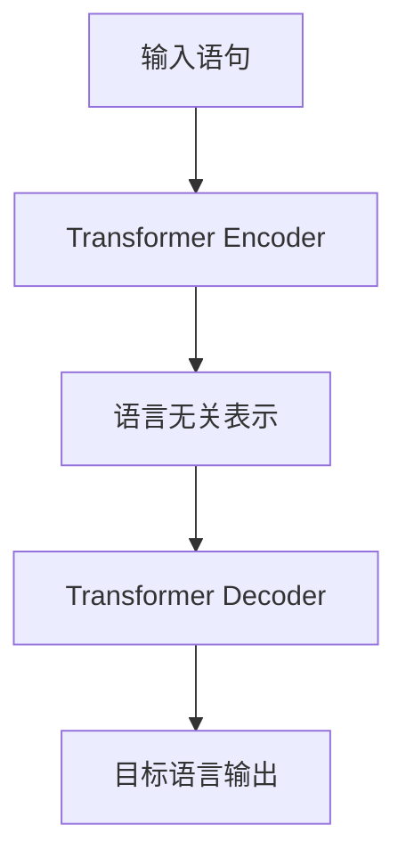

# Transformer大模型实战 跨语言模型

## 1. 背景介绍
### 1.1 大语言模型的发展历程
#### 1.1.1 早期的语言模型
#### 1.1.2 Transformer的出现
#### 1.1.3 预训练语言模型的兴起
### 1.2 跨语言模型的需求与挑战  
#### 1.2.1 全球化背景下的多语言需求
#### 1.2.2 跨语言建模面临的难题
#### 1.2.3 现有跨语言模型的局限性
### 1.3 Transformer在跨语言建模中的应用前景
#### 1.3.1 Transformer的优势
#### 1.3.2 跨语言Transformer模型的潜力
#### 1.3.3 实践中的应用案例

## 2. 核心概念与联系
### 2.1 Transformer架构
#### 2.1.1 Encoder-Decoder结构
#### 2.1.2 Self-Attention机制
#### 2.1.3 位置编码
### 2.2 预训练与微调
#### 2.2.1 无监督预训练
#### 2.2.2 有监督微调
#### 2.2.3 预训练目标函数
### 2.3 跨语言表示学习
#### 2.3.1 语言无关的表示
#### 2.3.2 语言对齐与映射
#### 2.3.3 多语言共享参数

## 3. 核心算法原理具体操作步骤
### 3.1 预训练阶段
#### 3.1.1 构建多语言语料库
#### 3.1.2 Masked Language Modeling (MLM)
#### 3.1.3 Translation Language Modeling (TLM)
### 3.2 微调阶段
#### 3.2.1 并行语料对齐
#### 3.2.2 翻译任务微调
#### 3.2.3 其他下游任务微调
### 3.3 推理与生成
#### 3.3.1 Beam Search解码
#### 3.3.2 Top-K和Top-P采样
#### 3.3.3 长度惩罚与重复惩罚

## 4. 数学模型和公式详细讲解举例说明
### 4.1 Self-Attention计算
#### 4.1.1 查询、键、值的计算
$Attention(Q,K,V) = softmax(\frac{QK^T}{\sqrt{d_k}})V$
#### 4.1.2 多头注意力机制
#### 4.1.3 残差连接与Layer Normalization
### 4.2 位置编码
#### 4.2.1 正弦余弦位置编码
$PE_{(pos,2i)} = sin(pos/10000^{2i/d_{model}})$
$PE_{(pos,2i+1)} = cos(pos/10000^{2i/d_{model}})$
#### 4.2.2 可学习的位置编码
### 4.3 语言模型损失函数
#### 4.3.1 MLM损失
#### 4.3.2 TLM损失
#### 4.3.3 多任务联合训练

## 5. 项目实践：代码实例和详细解释说明
### 5.1 数据准备
#### 5.1.1 多语言语料库构建
#### 5.1.2 数据清洗与预处理
#### 5.1.3 Tokenization与词表构建
### 5.2 模型构建
#### 5.2.1 Transformer Encoder-Decoder实现
#### 5.2.2 多语言Embedding层设计
#### 5.2.3 位置编码的实现
### 5.3 训练流程
#### 5.3.1 预训练数据加载与Batch构建
#### 5.3.2 MLM与TLM训练
#### 5.3.3 梯度累积与优化器选择
### 5.4 翻译任务微调
#### 5.4.1 并行语料加载
#### 5.4.2 微调训练Loop
#### 5.4.3 翻译质量评估

## 6. 实际应用场景
### 6.1 机器翻译
#### 6.1.1 多语言到多语言翻译
#### 6.1.2 零资源语言翻译
#### 6.1.3 领域自适应翻译
### 6.2 跨语言信息检索
#### 6.2.1 多语言文档嵌入
#### 6.2.2 跨语言语义匹配
#### 6.2.3 跨语言问答系统
### 6.3 多语言文本分类
#### 6.3.1 零样本学习
#### 6.3.2 少样本学习
#### 6.3.3 多语言情感分析

## 7. 工具和资源推荐
### 7.1 开源工具包
#### 7.1.1 Fairseq
#### 7.1.2 Transformers (Hugging Face)
#### 7.1.3 OpenNMT
### 7.2 预训练模型
#### 7.2.1 mBART
#### 7.2.2 XLM
#### 7.2.3 XLM-R
### 7.3 评测基准与数据集
#### 7.3.1 WMT翻译任务
#### 7.3.2 XNLI
#### 7.3.3 MLQA

## 8. 总结：未来发展趋势与挑战
### 8.1 更大规模的跨语言预训练模型
#### 8.1.1 参数量的增长
#### 8.1.2 训练数据的扩充
#### 8.1.3 计算资源的需求
### 8.2 更多语言与任务的支持
#### 8.2.1 低资源语言建模
#### 8.2.2 多模态跨语言学习
#### 8.2.3 语言生成任务的拓展
### 8.3 模型解释性与公平性
#### 8.3.1 跨语言模型的可解释性
#### 8.3.2 消除模型偏见
#### 8.3.3 保护隐私与安全

## 9. 附录：常见问题与解答
### 9.1 如何选择合适的预训练模型？
### 9.2 跨语言模型在实际部署中的注意事项？
### 9.3 如何平衡模型的通用性和特定任务性能？
### 9.4 跨语言模型的训练需要哪些硬件资源？
### 9.5 如何处理不同语言的词汇和语法差异？

作者：禅与计算机程序设计艺术 / Zen and the Art of Computer Programming