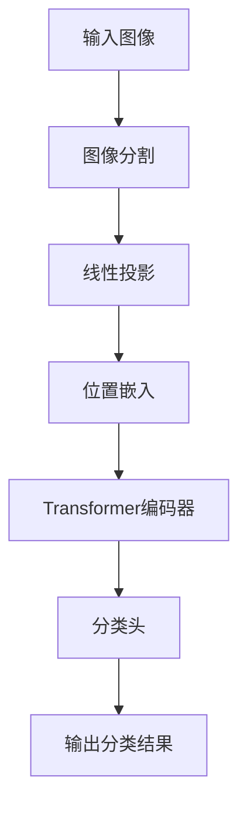

# Vision Transformer 原理与代码实例讲解

## 1. 背景介绍

在计算机视觉领域,卷积神经网络(CNN)长期占据主导地位,取得了巨大的成功。但是,CNN在处理复杂视觉任务时存在一些固有的局限性,例如缺乏长距离依赖性建模能力、对位置信息的编码效率低下等。为了解决这些问题,Transformer模型应运而生,它最初是在自然语言处理领域提出的,用于建模序列数据。

2021年,Google的一篇题为"Vision Transformer"的论文将Transformer架构成功迁移到了计算机视觉领域,取得了令人惊讶的好成绩。Vision Transformer(ViT)直接对图像进行分割,将图像分割成一系列patch(图像块),并将这些patch当作token(词元)输入到Transformer模型中进行处理。这种全新的视觉表示方法打破了CNN的局限性,展现出了强大的建模能力。

## 2. 核心概念与联系

### 2.1 Transformer模型

Transformer是一种基于注意力机制(Attention Mechanism)的序列到序列(Seq2Seq)模型,它主要由编码器(Encoder)和解码器(Decoder)两个模块组成。编码器负责将输入序列编码为一系列连续的表示,解码器则根据编码器的输出及自身的状态生成目标序列。

Transformer模型中的核心组件是多头自注意力机制(Multi-Head Attention),它允许模型在编码输入序列时捕捉远距离的依赖关系,从而更好地建模序列数据。与RNN和CNN相比,Transformer模型具有并行计算的优势,可以更高效地利用现代硬件(如GPU)的计算能力。

### 2.2 Vision Transformer

Vision Transformer(ViT)将Transformer模型应用于计算机视觉任务,它直接对图像进行分割,将图像分割成一系列patch,并将这些patch当作token输入到Transformer模型中。与CNN不同,ViT没有使用卷积操作,而是完全依赖于注意力机制来建模图像中的空间关系和语义信息。

在ViT中,每个patch都会被映射到一个向量表示(通过一个线性投影层),然后这些向量被馈送到Transformer编码器中。编码器输出的向量表示可以用于各种视觉任务,如图像分类、目标检测和语义分割等。

## 3. 核心算法原理具体操作步骤

Vision Transformer的核心算法原理可以概括为以下几个步骤:

1. **图像分割(Image Splitting)**:将输入图像分割成一系列固定大小的patch(图像块),每个patch的大小通常为16x16或32x32像素。

2. **线性投影(Linear Projection)**:将每个patch映射到一个固定维度的向量表示,这个向量表示被称为patch embedding。所有patch embedding组成一个序列,作为Transformer的输入。

3. **位置嵌入(Positional Embedding)**:由于Transformer本身没有编码patch在图像中的位置信息,因此需要为每个patch embedding添加一个位置嵌入向量,以提供位置信息。

4. **Transformer编码器(Transformer Encoder)**:将包含patch embedding和位置嵌入的序列输入到Transformer编码器中,编码器由多个编码器层组成,每个编码器层包含多头自注意力(Multi-Head Attention)和前馈神经网络(Feed-Forward Neural Network)两个子层。

5. **分类头(Classification Head)**:对于图像分类任务,将Transformer编码器的输出(通常是[CLS]token对应的向量表示)馈送到一个小的前馈神经网络中,输出为分类概率。

下面是Vision Transformer的算法流程图:



## 4. 数学模型和公式详细讲解举例说明

### 4.1 多头自注意力机制

多头自注意力机制是Transformer模型的核心组件,它允许模型捕捉输入序列中任意两个位置之间的依赖关系。对于一个长度为N的输入序列$X = (x_1, x_2, ..., x_N)$,其中$x_i \in \mathbb{R}^{d_x}$,多头自注意力机制的计算过程如下:

1. 将输入序列$X$分别通过三个线性变换,得到查询(Query)、键(Key)和值(Value)向量:

$$
Q = XW^Q, K = XW^K, V = XW^V
$$

其中$W^Q \in \mathbb{R}^{d_x \times d_k}$、$W^K \in \mathbb{R}^{d_x \times d_k}$、$W^V \in \mathbb{R}^{d_x \times d_v}$是可学习的权重矩阵。

2. 计算查询和键之间的点积,得到注意力分数矩阵:

$$
\text{Attention}(Q, K, V) = \text{softmax}\left(\frac{QK^T}{\sqrt{d_k}}\right)V
$$

其中$\sqrt{d_k}$是一个缩放因子,用于防止点积值过大导致softmax函数梯度过小。

3. 多头注意力机制将注意力计算过程重复执行$h$次(即有$h$个不同的注意力头),然后将不同头的结果拼接在一起:

$$
\text{MultiHead}(Q, K, V) = \text{Concat}(head_1, ..., head_h)W^O
$$

其中$head_i = \text{Attention}(QW_i^Q, KW_i^K, VW_i^V)$,而$W_i^Q \in \mathbb{R}^{d_x \times d_k}$、$W_i^K \in \mathbb{R}^{d_x \times d_k}$、$W_i^V \in \mathbb{R}^{d_x \times d_v}$和$W^O \in \mathbb{R}^{hd_v \times d_x}$都是可学习的权重矩阵。

通过多头自注意力机制,Transformer模型能够同时关注输入序列中不同位置的信息,从而更好地建模序列数据。

### 4.2 Vision Transformer中的位置嵌入

由于Transformer本身没有编码patch在图像中的位置信息,因此Vision Transformer需要为每个patch embedding添加一个位置嵌入向量,以提供位置信息。

假设输入图像被分割成$N$个patch,每个patch embedding的维度为$d$,那么位置嵌入矩阵$E_{pos} \in \mathbb{R}^{N \times d}$可以通过以下公式计算:

$$
E_{pos}(i, 2j) = \sin\left(\frac{i}{10000^{2j/d}}\right)
$$

$$
E_{pos}(i, 2j+1) = \cos\left(\frac{i}{10000^{2j/d}}\right)
$$

其中$i$表示patch的位置索引,而$j$表示位置嵌入向量的维度索引。这种位置嵌入方式能够为不同位置的patch embedding赋予不同的位置信息,从而帮助Vision Transformer更好地建模图像中的空间关系。

## 5. 项目实践:代码实例和详细解释说明

在这一部分,我们将使用PyTorch框架实现一个简单的Vision Transformer模型,并在CIFAR-10数据集上进行图像分类任务。

### 5.1 导入所需库

```python
import torch
import torch.nn as nn
import torch.optim as optim
from torchvision.datasets import CIFAR10
from torchvision.transforms import ToTensor
from torch.utils.data import DataLoader
```

### 5.2 定义Vision Transformer模型

```python
class ViT(nn.Module):
    def __init__(self, image_size, patch_size, num_classes, dim, depth, heads, mlp_dim, pool='cls', channels=3, dim_head=64, dropout=0., emb_dropout=0.):
        super(ViT, self).__init__()
        assert image_size % patch_size == 0, 'Image dimensions must be divisible by the patch size.'
        num_patches = (image_size // patch_size) ** 2
        patch_dim = channels * patch_size ** 2

        self.patch_size = patch_size

        self.pos_embedding = nn.Parameter(torch.randn(1, num_patches + 1, dim))
        self.patch_to_embedding = nn.Linear(patch_dim, dim)
        self.cls_token = nn.Parameter(torch.randn(1, 1, dim))
        self.dropout = nn.Dropout(emb_dropout)

        self.transformer = Transformer(dim, depth, heads, mlp_dim, dim_head, dropout)

        self.pool = pool
        self.to_cls_token = nn.Identity()

        self.mlp_head = nn.Sequential(
            nn.LayerNorm(dim),
            nn.Linear(dim, mlp_dim),
            nn.GELU(),
            nn.Dropout(dropout),
            nn.Linear(mlp_dim, num_classes)
        )

    def forward(self, img):
        p = self.patch_size

        x = img.reshape(img.shape[0], 3, img.shape[2] // p, p, img.shape[3] // p, p)
        x = torch.transpose(x, 1, 2)
        x = x.reshape(img.shape[0], img.shape[2] // p * img.shape[3] // p, 3 * p * p)
        x = self.patch_to_embedding(x)
        b, n, _ = x.shape

        cls_tokens = self.cls_token.expand(b, -1, -1)
        x = torch.cat((cls_tokens, x), dim=1)
        x += self.pos_embedding[:, :(n + 1)]
        x = self.dropout(x)

        x = self.transformer(x)

        x = self.to_cls_token(x[:, 0])
        return self.mlp_head(x)
```

这段代码定义了Vision Transformer模型的主要组件,包括:

- `patch_to_embedding`层:将图像分割成patch,并将每个patch映射到一个固定维度的向量表示(patch embedding)。
- `pos_embedding`:位置嵌入向量,用于为每个patch embedding添加位置信息。
- `cls_token`:一个可学习的向量,在输入序列的开头添加,用于表示整个图像的embedding。
- `transformer`模块:由多个Transformer编码器层组成,用于对包含patch embedding和位置嵌入的序列进行编码。
- `mlp_head`:一个小的前馈神经网络,用于将Transformer编码器的输出映射到分类概率。

### 5.3 定义Transformer编码器层

```python
class Transformer(nn.Module):
    def __init__(self, dim, depth, heads, mlp_dim, dim_head=64, dropout=0.):
        super(Transformer, self).__init__()
        self.layers = nn.ModuleList([])
        for _ in range(depth):
            self.layers.append(nn.ModuleList([
                PreNorm(dim, Attention(dim, heads=heads, dim_head=dim_head, dropout=dropout)),
                PreNorm(dim, FeedForward(dim, mlp_dim, dropout=dropout))
            ]))

    def forward(self, x):
        for attn, ff in self.layers:
            x = attn(x) + x
            x = ff(x) + x
        return x


class PreNorm(nn.Module):
    def __init__(self, dim, fn):
        super(PreNorm, self).__init__()
        self.norm = nn.LayerNorm(dim)
        self.fn = fn

    def forward(self, x, **kwargs):
        return self.fn(self.norm(x), **kwargs)


class FeedForward(nn.Module):
    def __init__(self, dim, hidden_dim, dropout=0.):
        super(FeedForward, self).__init__()
        self.net = nn.Sequential(
            nn.Linear(dim, hidden_dim),
            nn.GELU(),
            nn.Dropout(dropout),
            nn.Linear(hidden_dim, dim),
            nn.Dropout(dropout)
        )

    def forward(self, x):
        return self.net(x)


class Attention(nn.Module):
    def __init__(self, dim, heads=8, dim_head=64, dropout=0.):
        super(Attention, self).__init__()
        inner_dim = dim_head * heads
        project_out = not (heads == 1 and dim_head == dim)

        self.heads = heads
        self.scale = dim_head ** -0.5

        self.attend = nn.Softmax(dim=-1)
        self.to_qkv = nn.Linear(dim, inner_dim * 3, bias=False)

        self.to_out = nn.Sequential(
            nn.Linear(inner_dim, dim),
            nn.Dropout(dropout)
        ) if project_out else nn.Identity()

    def forward(self, x):
        b, n, _, h = *x.shape, self.heads
        qkv = self.to_qkv(x).chunk(3, dim=-1)
        q, k, v = map(lambda t: t.reshape(b, n, h, -1).transpose(1, 2), qkv)

        dots = torch.matmul(q, k.transpose(-2, -1)) * self.scale

        attn = self.attend(dots)

        out = torch.matmul(attn, v)
        out = out.transpose(1, 2).reshape(b, n, -1)
        return self.to_out(out)
```

这段代码定义了Transformer编码器层的主要组件,包括: