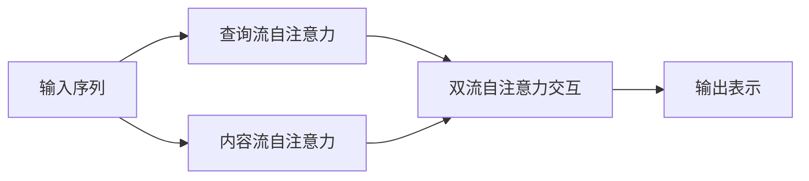

# XLNet原理与代码实例讲解

## 1. 背景介绍
### 1.1 自然语言处理的发展历程
#### 1.1.1 早期的统计语言模型
#### 1.1.2 神经网络语言模型的兴起
#### 1.1.3 Transformer的革命性突破

### 1.2 XLNet的诞生
#### 1.2.1 BERT的局限性
#### 1.2.2 XLNet的创新之处
#### 1.2.3 XLNet在学术界和工业界的影响力

## 2. 核心概念与联系
### 2.1 预训练语言模型
#### 2.1.1 无监督预训练
#### 2.1.2 有监督微调
#### 2.1.3 迁移学习

### 2.2 自回归语言模型与自编码语言模型  
#### 2.2.1 自回归语言模型
#### 2.2.2 自编码语言模型
#### 2.2.3 两种模型的优缺点对比

### 2.3 排列语言建模
#### 2.3.1 排列的定义与意义
#### 2.3.2 排列语言建模的优势
#### 2.3.3 排列语言建模与传统语言模型的区别

### 2.4 双流自注意力机制
#### 2.4.1 传统的自注意力机制
#### 2.4.2 双流自注意力的创新点
#### 2.4.3 查询流与内容流的交互



## 3. 核心算法原理具体操作步骤
### 3.1 排列语言建模
#### 3.1.1 生成排列的方法
#### 3.1.2 基于排列的目标函数设计
#### 3.1.3 排列语言建模的训练过程

### 3.2 双流自注意力机制
#### 3.2.1 查询流自注意力的计算
#### 3.2.2 内容流自注意力的计算  
#### 3.2.3 双流交互的实现方式

### 3.3 Transformer-XL的集成
#### 3.3.1 段落级循环机制
#### 3.3.2 相对位置编码
#### 3.3.3 Transformer-XL在XLNet中的应用

### 3.4 预训练和微调
#### 3.4.1 预训练的目标任务与损失函数
#### 3.4.2 微调的任务适配与超参数选择
#### 3.4.3 多任务学习的实现方式

## 4. 数学模型和公式详细讲解举例说明
### 4.1 排列语言建模的数学描述
#### 4.1.1 排列概率的定义
$P(x)=\sum_{\mathbf{z} \in \mathcal{Z}_T} p(\mathbf{z}) \prod_{t=1}^T p\left(x_{z_t} | \mathbf{x}_{z_{<t}}\right)$
#### 4.1.2 排列语言模型的似然函数
$\mathcal{L}(\theta)=\sum_{i=1}^N \log p_\theta\left(\mathbf{x}^{(i)}\right)$
#### 4.1.3 基于排列的目标函数推导

### 4.2 双流自注意力的数学描述
#### 4.2.1 查询流自注意力的计算公式
$$\mathbf{h}_{z_t}^{(m)} = \text{Attention}\left(\mathbf{Q}_{z_t}^{(m-1)}, \mathbf{K}_{\leq z_t}^{(m-1)}, \mathbf{V}_{\leq z_t}^{(m-1)}\right)$$
#### 4.2.2 内容流自注意力的计算公式
$$\mathbf{g}_{z_t}^{(m)} = \text{Attention}\left(\mathbf{Q}_{z_t}^{(m-1)}, \overline{\mathbf{K}}_{\leq z_t}^{(m-1)}, \overline{\mathbf{V}}_{\leq z_t}^{(m-1)}\right)$$
#### 4.2.3 双流交互的数学描述
$$\mathbf{a}_{z_t}^{(m)} = \mathbf{h}_{z_t}^{(m)} + \mathbf{g}_{z_t}^{(m)}$$

### 4.3 相对位置编码的数学描述
#### 4.3.1 相对位置的定义与计算
$$R_{i-j} = \mathbf{w}_r^T [r_{i-j,1}, \cdots, r_{i-j,d}]$$
#### 4.3.2 相对位置编码在自注意力中的应用
$$\mathbf{a}_{z_t}^{(m)} = \mathbf{h}_{z_t}^{(m)} + \mathbf{g}_{z_t}^{(m)} + \mathbf{r}_{z_t}^{(m)}$$
#### 4.3.3 相对位置编码对模型性能的影响分析

## 5. 项目实践：代码实例和详细解释说明
### 5.1 XLNet的PyTorch实现
#### 5.1.1 模型结构定义
```python
class XLNetModel(nn.Module):
    def __init__(self, config):
        super().__init__()
        self.word_embedding = nn.Embedding(config.vocab_size, config.d_model)
        self.layer = nn.ModuleList([XLNetLayer(config) for _ in range(config.n_layer)])
        self.dropout = nn.Dropout(config.dropout)
        
    def forward(self, input_ids, attention_mask, mems=None):
        # 实现XLNet的前向传播
        ...
```
#### 5.1.2 双流自注意力机制的实现
```python
class XLNetAttention(nn.Module):
    def __init__(self, config):
        super().__init__()
        self.q = nn.Linear(config.d_model, config.d_model)
        self.k = nn.Linear(config.d_model, config.d_model)
        self.v = nn.Linear(config.d_model, config.d_model)
        self.o = nn.Linear(config.d_model, config.d_model)
        self.r = nn.Linear(config.d_model, config.d_model)
        
    def forward(self, h, g, r, attention_mask):
        # 实现双流自注意力的计算
        ...
```
#### 5.1.3 预训练和微调的代码示例
```python
# 预训练
model = XLNetLMHeadModel.from_pretrained('xlnet-base-cased')
optimizer = AdamW(model.parameters(), lr=1e-5)
model.train()
for batch in dataloader:
    loss = model(input_ids=batch['input_ids'], attention_mask=batch['attention_mask'], labels=batch['labels'])
    loss.backward()
    optimizer.step()

# 微调
model = XLNetForSequenceClassification.from_pretrained('xlnet-base-cased')
optimizer = AdamW(model.parameters(), lr=2e-5)
model.train() 
for batch in dataloader:
    outputs = model(input_ids=batch['input_ids'], attention_mask=batch['attention_mask'], labels=batch['labels'])
    loss = outputs.loss
    loss.backward()
    optimizer.step()
```

### 5.2 XLNet在下游任务中的应用
#### 5.2.1 文本分类任务
```python
# 加载预训练模型
model = XLNetForSequenceClassification.from_pretrained('xlnet-base-cased', num_labels=2)

# 准备数据
texts = ["I love this movie!", "This film is terrible."]
labels = [1, 0]
encodings = tokenizer(texts, padding=True, truncation=True, return_tensors='pt')

# 微调模型
outputs = model(**encodings, labels=torch.tensor(labels))
loss = outputs.loss
loss.backward()
```
#### 5.2.2 命名实体识别任务
```python
# 加载预训练模型
model = XLNetForTokenClassification.from_pretrained('xlnet-base-cased', num_labels=num_labels)

# 准备数据
text = "John works at Google in New York"
labels = ['B-PER', 'O', 'O', 'B-ORG', 'O', 'B-LOC', 'I-LOC'] 
encodings = tokenizer(text.split(), is_split_into_words=True, return_tensors='pt')
labels = torch.tensor([tag2id[label] for label in labels])

# 微调模型
outputs = model(**encodings, labels=labels)
loss = outputs.loss
loss.backward()
```
#### 5.2.3 阅读理解任务
```python
# 加载预训练模型
model = XLNetForQuestionAnswering.from_pretrained('xlnet-base-cased')

# 准备数据
question = "What is the capital of France?"
context = "The capital of France is Paris. It is the largest city in France."
encodings = tokenizer(question, context, return_tensors='pt') 

# 微调模型
start_positions = torch.tensor([14])
end_positions = torch.tensor([14])
outputs = model(**encodings, start_positions=start_positions, end_positions=end_positions)
loss = outputs.loss
loss.backward()
```

## 6. 实际应用场景
### 6.1 智能客服
#### 6.1.1 用户意图识别
#### 6.1.2 问题自动应答
#### 6.1.3 情感分析

### 6.2 舆情监测
#### 6.2.1 热点话题发现
#### 6.2.2 观点提取与归纳
#### 6.2.3 情感倾向判断

### 6.3 智能搜索
#### 6.3.1 查询理解与扩展
#### 6.3.2 相关性排序
#### 6.3.3 问答系统

### 6.4 推荐系统
#### 6.4.1 用户画像构建
#### 6.4.2 物品描述生成
#### 6.4.3 个性化推荐

## 7. 工具和资源推荐
### 7.1 XLNet官方实现
#### 7.1.1 Google Research的TensorFlow实现
#### 7.1.2 使用示例与说明文档

### 7.2 XLNet的PyTorch实现
#### 7.2.1 Hugging Face的Transformers库
#### 7.2.2 使用示例与说明文档

### 7.3 预训练模型与下游任务
#### 7.3.1 官方提供的预训练模型
#### 7.3.2 基于XLNet的下游任务基准

### 7.4 相关论文与学习资源
#### 7.4.1 XLNet原始论文
#### 7.4.2 XLNet相关的改进工作
#### 7.4.3 XLNet的教程与博客

## 8. 总结：未来发展趋势与挑战
### 8.1 XLNet的优势与局限
#### 8.1.1 相比BERT等模型的优势
#### 8.1.2 现有的不足与改进空间

### 8.2 预训练语言模型的发展趋势 
#### 8.2.1 模型结构的改进与创新
#### 8.2.2 预训练任务的探索与优化
#### 8.2.3 模型压缩与加速技术

### 8.3 未来的研究方向与挑战
#### 8.3.1 知识增强的预训练语言模型
#### 8.3.2 跨模态预训练模型
#### 8.3.3 预训练语言模型的可解释性

## 9. 附录：常见问题与解答
### 9.1 XLNet与BERT的区别是什么？
### 9.2 XLNet能否处理更长的文本序列？
### 9.3 在下游任务中，XLNet与BERT哪个性能更好？
### 9.4 XLNet的训练需要什么样的计算资源？
### 9.5 如何实现XLNet的多任务微调？

作者：禅与计算机程序设计艺术 / Zen and the Art of Computer Programming