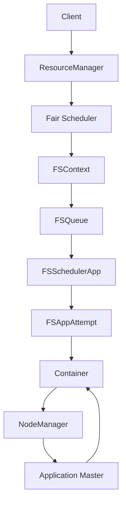

# YARN Fair Scheduler原理与代码实例讲解

## 1. 背景介绍
### 1.1 Hadoop YARN 简介
### 1.2 资源调度器在YARN中的作用
### 1.3 Fair Scheduler的诞生背景

## 2. Fair Scheduler核心概念
### 2.1 Pools 
#### 2.1.1 Pool的概念
#### 2.1.2 Pool的层次结构
#### 2.1.3 Pool的资源分配
### 2.2 Applications
#### 2.2.1 Application的生命周期
#### 2.2.2 Application的资源需求
### 2.3 Queues
#### 2.3.1 Queue的概念
#### 2.3.2 Queue的类型
#### 2.3.3 Queue的资源分配策略
### 2.4 Containers
#### 2.4.1 Container的概念 
#### 2.4.2 Container的资源规格
#### 2.4.3 Container的分配与回收

## 3. Fair Scheduler核心算法原理
### 3.1 资源需求计算
#### 3.1.1 Dominant Resource Fairness (DRF)
#### 3.1.2 资源需求向量
#### 3.1.3 资源权重
### 3.2 资源分配过程
#### 3.2.1 确定资源分配顺序
#### 3.2.2 资源分配约束条件
#### 3.2.3 资源分配步骤
### 3.3 抢占与资源回收
#### 3.3.1 抢占的触发条件
#### 3.3.2 抢占的资源选择
#### 3.3.3 资源回收机制

## 4. Fair Scheduler数学模型与公式
### 4.1 DRF的数学定义
#### 4.1.1 Max-Min Fairness
#### 4.1.2 DRF Allocation
#### 4.1.3 Sharing Incentive属性
### 4.2 资源分配的线性规划模型
#### 4.2.1 决策变量
#### 4.2.2 目标函数
#### 4.2.3 约束条件
### 4.3 抢占的数学模型
#### 4.3.1 抢占资源计算
#### 4.3.2 最小化抢占Container数量

## 5. Fair Scheduler代码实例
### 5.1 Fair Scheduler配置
#### 5.1.1 fair-scheduler.xml配置
#### 5.1.2 配置Queues与Pools
#### 5.1.3 设置资源分配策略
### 5.2 Fair Scheduler的实现
#### 5.2.1 FSContext与FSQueue
#### 5.2.2 FSSchedulerApp与FSAppAttempt  
#### 5.2.3 资源分配的实现
### 5.3 抢占的代码实现
#### 5.3.1 抢占调度器的主要类
#### 5.3.2 抢占的策略与算法
#### 5.3.3 抢占的资源处理

## 6. Fair Scheduler的应用场景
### 6.1 多租户的Hadoop集群
### 6.2 共享集群的SLA保障
### 6.3 数据分析任务的资源隔离

## 7. 相关工具与资源推荐
### 7.1 Hadoop YARN 
### 7.2 Fair Scheduler 官方文档
### 7.3 Fair Scheduler 源码分析

## 8. 总结与未来展望
### 8.1 Fair Scheduler的优势
### 8.2 Fair Scheduler面临的挑战
### 8.3 资源调度的发展趋势

## 9. 附录：常见问题解答
### 9.1 如何设置Queue与Pool的资源分配比例？
### 9.2 Fair Scheduler支持哪些资源类型？
### 9.3 如何实现Queue内部的资源隔离？



Fair Scheduler是Hadoop YARN中一种流行的资源调度器，它的核心思想是在多个应用之间实现公平的资源分配。Fair Scheduler引入了Pool和Queue的概念，可以将集群资源划分给不同的组织或用户，并在组织内部实现资源的层次化管理。

在资源分配时，Fair Scheduler采用了Dominant Resource Fairness (DRF)算法，综合考虑了内存、CPU等不同资源维度的需求。DRF算法定义了一种Max-Min Fairness，使得在满足Sharing Incentive属性的前提下，最大化满足各个应用的资源需求。

Fair Scheduler的资源分配可以抽象为一个线性规划问题，目标是在资源约束下最大化资源利用率和应用的运行效率。当资源出现争用时，Fair Scheduler还支持资源抢占，通过计算应用的资源使用情况和优先级，选择合适的Container进行抢占，以保障关键任务的SLA。

下面是一个Fair Scheduler在YARN中进行资源分配的简化示例：

```java
// 配置Fair Scheduler
String FAIR_SCHEDULER_XML = "fair-scheduler.xml";
Configuration conf = new Configuration();
conf.set(FairSchedulerConfiguration.ALLOCATION_FILE, FAIR_SCHEDULER_XML);

// 创建ResourceManager
ResourceManager rm = new ResourceManager();
rm.init(conf);
rm.start();

// 提交应用
ApplicationSubmissionContext appContext = app.getApplicationSubmissionContext();
ApplicationId appId = appContext.getApplicationId();
rm.submitApplication(appContext);

// Fair Scheduler分配资源
FSContext fsContext = new FSContext(rm);
FSQueue queue = fsContext.getQueue("default");
FSSchedulerApp fsApp = new FSSchedulerApp(appId, queue);
fsApp.demand_resource(memory, vcores);
fsContext.updateDemand();
fsContext.computeShares();
fsApp.assignContainers();
```

以上代码展示了Fair Scheduler的基本工作流程，包括配置加载、应用提交、资源需求计算、资源分配等步骤。Fair Scheduler为Hadoop YARN带来了资源利用率和任务运行效率的提升，特别适用于多租户共享的大规模集群环境。

Fair Scheduler经过多年发展，已经成为成熟和可靠的资源调度器。未来Fair Scheduler还将继续优化调度性能，增强多资源类型的支持，改进资源隔离与抢占机制，更好地满足共享集群环境下的SLA需求。同时，新的调度算法和架构也将不断涌现，进一步推动Hadoop YARN乃至整个大数据平台的发展。

作者：禅与计算机程序设计艺术 / Zen and the Art of Computer Programming