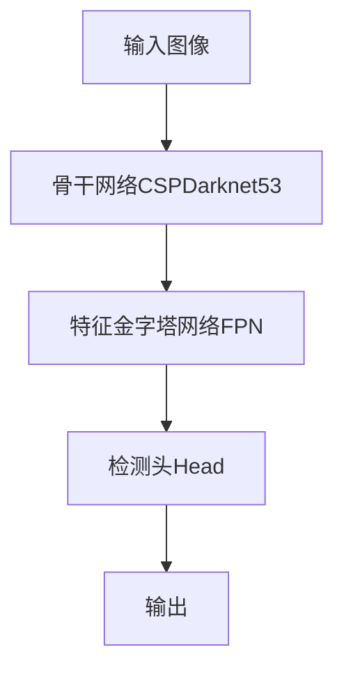

# YOLOv5原理与代码实例讲解

## 1.背景介绍

在计算机视觉领域,目标检测是一项非常重要和具有挑战性的任务。目标检测的目标是在给定的图像或视频中定位目标对象的位置,并对其进行分类。随着深度学习技术的不断发展,基于卷积神经网络(CNN)的目标检测算法取得了巨大的进步,其中YOLO(You Only Look Once)系列算法因其高效和准确而备受关注。

YOLOv5是YOLO系列算法的最新版本,由Glenn Jocher等人在2020年发布。它是一种基于单阶段的实时目标检测系统,可以高效地执行目标检测任务。与传统的基于区域提议的两阶段目标检测算法相比,YOLOv5采用了更加简单和高效的方法,将目标检测任务视为一个回归问题,直接从输入图像预测目标边界框和类别概率。

YOLOv5在保持高精度的同时,进一步提高了检测速度,并且具有更好的泛化能力。它已被广泛应用于各种领域,如安防监控、自动驾驶、机器人视觉等。本文将深入探讨YOLOv5的原理、算法细节、代码实现以及实际应用场景,为读者提供全面的理解和实践指导。

## 2.核心概念与联系

### 2.1 目标检测任务

目标检测是计算机视觉领域的一个核心任务,旨在从给定的图像或视频中定位感兴趣对象的位置,并对其进行分类。具体来说,目标检测算法需要解决以下两个主要问题:

1. **目标定位(Object Localization)**: 确定图像中存在目标对象,并用边界框(bounding box)准确地框住每个目标对象。

2. **目标分类(Object Classification)**: 对定位到的每个目标对象进行正确的类别分类,如人、车辆、动物等。

目标检测任务是图像分类和目标跟踪等任务的基础,在计算机视觉的众多应用领域中扮演着至关重要的角色。

### 2.2 YOLO系列算法

YOLO(You Only Look Once)是一种基于深度学习的目标检测算法,由Joseph Redmon等人于2016年提出。与传统的基于区域提议的两阶段目标检测算法(如R-CNN系列)不同,YOLO将目标检测任务视为一个回归问题,直接从整个图像中预测目标边界框和类别概率。

YOLO系列算法的核心思想是:将输入图像划分为S×S个网格,每个网格负责预测其所覆盖区域内的目标对象。对于每个网格,算法会预测B个边界框以及每个边界框所包含目标的置信度和类别概率。这种设计使得YOLO能够以端到端的方式进行目标检测,大大提高了检测速度。

自2016年推出以来,YOLO系列算法经历了多次迭代和优化,包括YOLOv2、YOLOv3、YOLOv4和YOLOv5等版本。每个新版本都在检测精度、速度和泛化能力等方面有所提升,使得YOLO系列算法在实时目标检测任务中表现出色。

### 2.3 YOLOv5概述

YOLOv5是YOLO系列算法的最新版本,由Glenn Jocher等人于2020年发布。它在保持YOLO系列算法核心思想的同时,进行了多方面的改进和优化,使得YOLOv5在检测精度、速度和泛化能力等方面都有了显著提升。

YOLOv5的主要特点包括:

- **网络结构优化**: 采用了更深更宽的网络结构,提高了特征提取能力。
- **数据增强策略**: 引入了新的数据增强策略,如Mosaic数据增强,提高了模型的泛化能力。
- **锚框自适应**: 通过k-means聚类算法自适应地生成锚框,提高了检测精度。
- **损失函数改进**: 对损失函数进行了改进,使得模型收敛更快、更稳定。
- **推理加速**: 支持多种推理加速方式,如TensorRT、ONNX等,提高了推理速度。

综上所述,YOLOv5在保持YOLO系列算法简单高效的优势的同时,进一步提高了检测精度和泛化能力,成为目前最先进的实时目标检测算法之一。

## 3.核心算法原理具体操作步骤

### 3.1 网络结构

YOLOv5的网络结构基于CSPDarknet53骨干网络,并在其基础上进行了优化和改进。CSPDarknet53是一种具有交叉阶段部分连接(Cross Stage Partial Connection)结构的深度残差网络,可以有效地提高网络的计算效率和梯度传播。

YOLOv5的网络结构如下图所示:

1. **骨干网络CSPDarknet53**: 用于从输入图像中提取特征,包括卷积层、残差连接和CSP模块等。

2. **特征金字塔网络FPN**: 融合来自不同层次的特征,构建特征金字塔,提高对不同尺度目标的检测能力。

3. **检测头Head**: 基于特征金字塔,预测目标边界框、置信度和类别概率。

### 3.2 目标检测过程

YOLOv5的目标检测过程可以概括为以下几个步骤:

1. **网格划分**: 将输入图像划分为S×S个网格,每个网格负责预测其所覆盖区域内的目标对象。

2. **锚框生成**: 为每个网格生成B个先验锚框(anchor box),用于初始化预测的边界框。锚框的尺寸和比例通过k-means聚类算法从训练集中自适应地生成。

3. **特征提取**: 使用骨干网络CSPDarknet53从输入图像中提取特征,并通过FPN构建特征金字塔。

4. **边界框预测**: 对于每个网格,检测头会预测B个边界框,以及每个边界框所包含目标的置信度和类别概率。

5. **非极大值抑制(NMS)**: 对预测的边界框进行非极大值抑制,去除重叠较多的冗余框,得到最终的检测结果。

在整个过程中,YOLOv5通过端到端的方式直接从输入图像预测目标边界框和类别,避免了传统两阶段目标检测算法中耗时的区域提议步骤,从而大大提高了检测速度。

### 3.3 损失函数

YOLOv5的损失函数是一个综合了多个任务的加权和,包括边界框回归损失、目标置信度损失和分类损失等。具体来说,损失函数可以表示为:

$$
\begin{aligned}
\mathcal{L} = &\lambda_{\text{box}} \sum_{i=0}^{S^2} \sum_{j=0}^{B} \mathbb{1}_{ij}^{\text{obj}} \left[ (1 - \hat{p}_i)^{\alpha} \beta_{\text{box}} \left( 2 - \hat{b}_i^{\text{wh}} \right) + \alpha \left( 1 - \hat{b}_i^{\text{wh}} \right)^{\beta_{\text{box}}} \right] \\
&+ \lambda_{\text{obj}} \sum_{i=0}^{S^2} \sum_{j=0}^{B} \mathbb{1}_{ij}^{\text{obj}} \left( \hat{c}_i - c_i \right)^2 \\
&+ \lambda_{\text{noobj}} \sum_{i=0}^{S^2} \sum_{j=0}^{B} \mathbb{1}_{ij}^{\text{noobj}} \left( \hat{c}_i - c_i \right)^2 \\
&+ \lambda_{\text{class}} \sum_{i=0}^{S^2} \mathbb{1}_{i}^{\text{obj}} \sum_{c \in \text{classes}} \left( \hat{p}_i^c - p_i^c \right)^2
\end{aligned}
$$

其中:

- $\lambda_{\text{box}}$、$\lambda_{\text{obj}}$、$\lambda_{\text{noobj}}$和$\lambda_{\text{class}}$分别是边界框回归损失、目标置信度损失、背景置信度损失和分类损失的权重系数。
- $\hat{b}_i^{\text{wh}}$是预测的边界框的宽高比,而$\hat{p}_i$是预测的目标置信度。
- $\alpha$和$\beta_{\text{box}}$是用于平衡不同尺度目标的超参数。
- $\hat{c}_i$是预测的置信度,而$c_i$是真实的置信度(对于存在目标的网格为1,否则为0)。
- $\hat{p}_i^c$是预测的类别概率,而$p_i^c$是真实的类别概率(对于存在目标的网格,为one-hot编码)。

通过优化这个综合损失函数,YOLOv5可以同时学习预测准确的边界框、目标置信度和类别概率,从而实现高精度的目标检测。

## 4.数学模型和公式详细讲解举例说明

在YOLOv5中,有几个关键的数学模型和公式值得深入探讨。

### 4.1 锚框生成

锚框(Anchor Box)是YOLOv5中一个非常重要的概念,它是预测边界框的初始值。YOLOv5采用k-means聚类算法从训练集中自适应地生成锚框,以更好地匹配不同尺度和比例的目标对象。

具体来说,对于每个真实边界框,我们计算其宽高比$r=w/h$,然后使用k-means聚类算法将所有的$r$值聚类为k个簇。每个簇的中心就代表一个锚框的宽高比。

假设我们有n个真实边界框$\{(w_i, h_i)\}_{i=1}^n$,目标是找到k个锚框$\{(w_j^a, h_j^a)\}_{j=1}^k$,使得以下目标函数最小化:

$$
\arg\min_{w_j^a, h_j^a} \sum_{i=1}^n \min_{j} \left( r_i - \frac{w_j^a}{h_j^a} \right)^2
$$

其中$r_i = w_i / h_i$是第i个真实边界框的宽高比。

这个目标函数可以通过k-means聚类算法来优化求解,从而得到最优的锚框尺寸和比例。在YOLOv5中,通常设置k=9,即生成9个不同的锚框。

### 4.2 边界框编码与解码

为了更好地学习边界框的位置和尺寸,YOLOv5采用了一种特殊的边界框编码和解码方式。

**编码**:

对于每个真实边界框$(x, y, w, h)$,我们将其编码为$(t_x, t_y, t_w, t_h)$,其中:

$$
\begin{aligned}
t_x &= \frac{x - x_a}{w_a} \\
t_y &= \frac{y - y_a}{h_a} \\
t_w &= \log\left(\frac{w}{w_a}\right) \\
t_h &= \log\left(\frac{h}{h_a}\right)
\end{aligned}
$$

其中$(x_a, y_a, w_a, h_a)$是与该真实边界框最匹配的锚框。这种编码方式可以使模型更容易学习边界框的偏移量和尺度变化。

**解码**:

对于预测的$(t_x, t_y, t_w, t_h)$,我们可以将其解码为$(x, y, w, h)$,其中:

$$
\begin{aligned}
x &= t_x \cdot w_a + x_a \\
y &= t_y \cdot h_a + y_a \\
w &= \exp(t_w) \cdot w_a \\
h &= \exp(t_h) \cdot h_a
\end{aligned}
$$

这样就可以从预测的偏移量和尺度变化中恢复出实际的边界框坐标和尺寸。

### 4.3 非极大值抑制(NMS)

非极大值抑制(Non-Maximum Suppression, NMS)是目标检测算法中一个非常重要的后处理步骤,用于去除重叠较多的冗余边界框,从而得到最终的检测结果。

NMS的基本思想是:对于每个类别,按照置信度从高到低排序,然后从置信度最