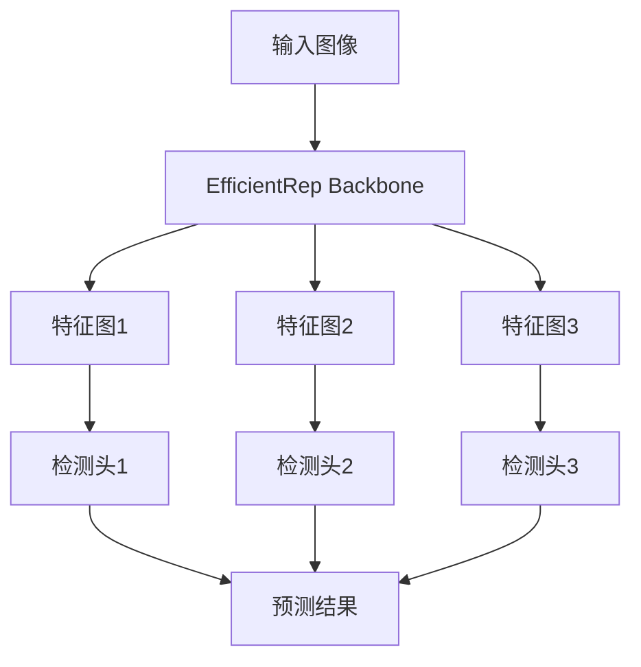

# YOLOv7原理与代码实例讲解

## 1.背景介绍

在计算机视觉领域,目标检测是一项非常重要和具有挑战性的任务。它旨在在给定的图像或视频中定位目标对象的位置,并识别它们的类别。目标检测广泛应用于安防监控、自动驾驶、人脸识别等多个领域。

传统的目标检测算法通常采用两阶段方法,首先生成候选区域,然后对每个候选区域进行分类。这种方法虽然可以获得较高的精度,但由于需要多次操作,导致速度较慢。

2015年,Joseph Redmon等人提出了YOLO(You Only Look Once)算法,开创了一阶段目标检测的新范式。YOLO将目标检测任务视为一个回归问题,直接从图像像素预测边界框坐标和类别概率,极大地提高了检测速度。自此,YOLO系列算法成为目标检测领域的主流方法之一。

YOLOv7是YOLO系列算法的最新版本,在保持快速推理速度的同时,进一步提升了检测精度。本文将详细介绍YOLOv7的核心原理、关键技术点以及代码实现细节,为读者提供全面的理解。

## 2.核心概念与联系

### 2.1 YOLO算法概述

YOLO算法将整个图像划分为S×S个网格,每个网格预测B个边界框及其置信度。边界框由(x,y,w,h)四个值表示,分别代表边界框的中心坐标(x,y)和宽高(w,h)。置信度则由两部分组成:包围盒与真实边界框的交并比(IoU)以及该边界框包含目标对象的置信度。

此外,每个边界框还需要预测C个类别概率,代表该边界框所包含目标属于每个类别的概率。YOLO算法的输出张量维度为S×S×(B×5+C)。

### 2.2 锚框机制

由于不同的目标对象具有不同的形状和大小,单一尺度的边界框难以很好地拟合所有目标。因此,YOLO采用锚框(Anchor Box)机制,为每个网格单元预先设置多个不同形状和大小的锚框,从而更好地覆盖不同类型的目标。

锚框的设计通常基于训练数据集中目标对象的形状分布,使用聚类算法(如K-Means)从数据中学习出一组先验锚框。在预测时,每个锚框会输出一组(x,y,w,h,置信度,类别概率)。

### 2.3 损失函数

YOLO算法的损失函数由三部分组成:边界框回归损失、置信度损失和分类损失。

边界框回归损失衡量预测边界框与真实边界框之间的差异,通常采用IoU损失或GIoU损失等变体。置信度损失则衡量预测置信度与真实置信度之间的差异,使用二值交叉熵损失。分类损失衡量预测类别概率与真实类别之间的差异,同样使用交叉熵损失。

这三部分损失加权求和,构成YOLO的最终损失函数。在训练过程中,通过反向传播算法优化网络参数,使得损失函数值最小化。

## 3.核心算法原理具体操作步骤

### 3.1 网络架构

YOLOv7采用了全卷积网络架构,主干网络为EfficientRep Backbone。该网络由重复的Focus模块、Conv-BN-SiLU模块和SPP模块构成,具有高效的特征提取能力。

网络的输出由三个不同尺度的特征图构成,分别由不同深度的层输出。这些特征图被送入对应的检测头(Head),生成最终的预测结果。



### 3.2 检测头设计

每个检测头由一系列卷积层和上采样层构成,用于从特征图中预测边界框、置信度和类别概率。

具体而言,每个检测头首先通过一个卷积层提取特征,然后对特征图进行上采样,与更浅层的特征图进行融合。这种特征金字塔结构有助于捕获多尺度的目标。

融合后的特征图经过一系列卷积层处理,最终输出预测张量。每个预测张量的维度为N×N×(B×(4+1+C)),其中N为特征图尺寸,B为锚框数量,4代表边界框坐标,1代表置信度,C为类别数。

### 3.3 训练过程

YOLOv7的训练过程可以概括为以下几个步骤:

1. **数据预处理**: 对输入图像进行调整大小、归一化等预处理操作。
2. **前向传播**: 将预处理后的图像输入网络,计算出预测结果。
3. **损失计算**: 根据预测结果和真实标注,计算边界框回归损失、置信度损失和分类损失,得到总损失值。
4. **反向传播**: 利用自动微分技术,计算总损失相对于网络参数的梯度。
5. **参数更新**: 使用优化算法(如SGD、Adam等)根据梯度更新网络参数。
6. **重复迭代**: 重复上述步骤,直到模型收敛或达到最大迭代次数。

在训练过程中,通常还会采用一些技巧来提高模型性能,如数据增强、正则化、学习率调度等。

### 3.4 预测过程

在推理阶段,YOLOv7的预测过程如下:

1. **预处理**: 对输入图像进行相同的预处理操作。
2. **前向传播**: 将预处理后的图像输入训练好的模型,得到预测张量。
3. **非极大值抑制(NMS)**: 对预测结果进行NMS操作,去除重叠的冗余边界框。
4. **阈值过滤**: 根据置信度阈值过滤掉低置信度的预测框。
5. **输出结果**: 输出保留下来的边界框及其类别。

## 4.数学模型和公式详细讲解举例说明

### 4.1 IoU损失

IoU(Intersection over Union)是目标检测任务中常用的评估指标,同时也被广泛用作损失函数。IoU损失衡量预测边界框与真实边界框之间的重叠程度,定义为两个边界框的交集区域与并集区域之比:

$$
\text{IoU} = \frac{\text{Area of Intersection}}{\text{Area of Union}}
$$

其中,交集区域(Intersection)表示两个边界框重叠的部分面积,并集区域(Union)表示两个边界框组成的总面积。

IoU损失函数通常定义为:

$$
\mathcal{L}_{\text{IoU}} = 1 - \text{IoU}
$$

在训练过程中,模型会最小化IoU损失,从而使预测边界框尽可能接近真实边界框。

### 4.2 GIoU损失

GIoU(Generalized IoU)损失是IoU损失的改进版本,它不仅考虑了交并比,还包含了两个边界框之间的距离信息。GIoU损失定义为:

$$
\mathcal{L}_{\text{GIoU}} = 1 - \text{IoU} + \frac{|C-\bigcup B|}{|C|}
$$

其中,C表示两个边界框的最小闭合凸包(smallest enclosing convex),|C|表示C的面积,|C-∪B|表示C与两个边界框并集的非重叠区域面积。

通过引入最小闭合凸包,GIoU损失能够更好地惩罚不重叠的情况,从而提高模型的定位精度。

### 4.3 分类损失

分类损失用于衡量预测类别概率与真实类别之间的差异,通常采用交叉熵损失:

$$
\mathcal{L}_{\text{cls}} = -\sum_{i=1}^{C} y_i \log(p_i)
$$

其中,C是类别数量,y是真实类别的一热编码向量,p是预测的类别概率向量。

在目标检测任务中,每个边界框都需要预测一个类别概率向量。因此,分类损失需要对所有边界框的损失求和:

$$
\mathcal{L}_{\text{total}}^{\text{cls}} = \sum_{i=1}^{B} \mathcal{L}_{\text{cls}}^{(i)}
$$

其中,B是边界框数量。

### 4.4 置信度损失

置信度损失衡量预测置信度与真实置信度之间的差异,同样采用二值交叉熵损失:

$$
\mathcal{L}_{\text{conf}} = -t_i \log(c_i) - (1 - t_i)\log(1 - c_i)
$$

其中,t是真实置信度(0或1),c是预测置信度。

与分类损失类似,置信度损失也需要对所有边界框求和:

$$
\mathcal{L}_{\text{total}}^{\text{conf}} = \sum_{i=1}^{B} \mathcal{L}_{\text{conf}}^{(i)}
$$

### 4.5 总损失函数

YOLOv7的总损失函数是边界框回归损失、分类损失和置信度损失的加权和:

$$
\mathcal{L} = \lambda_1 \mathcal{L}_{\text{box}} + \lambda_2 \mathcal{L}_{\text{total}}^{\text{cls}} + \lambda_3 \mathcal{L}_{\text{total}}^{\text{conf}}
$$

其中,λ1、λ2和λ3是对应的损失权重系数,用于平衡不同损失项的贡献。

在训练过程中,模型会最小化总损失函数,从而同时优化边界框回归、分类和置信度预测。

## 5.项目实践:代码实例和详细解释说明

接下来,我们将通过PyTorch代码示例,详细解释YOLOv7的实现细节。

### 5.1 模型定义

首先,我们定义YOLOv7模型的主体架构:

```python
import torch
import torch.nn as nn

class YOLOv7(nn.Module):
    def __init__(self, num_classes=80):
        super(YOLOv7, self).__init__()
        
        # 主干网络
        self.backbone = EfficientRepBackbone()
        
        # 检测头
        self.head1 = DetectionHead(in_channels=256, num_anchors=3)
        self.head2 = DetectionHead(in_channels=512, num_anchors=3)
        self.head3 = DetectionHead(in_channels=1024, num_anchors=3)
        
        # 其他层
        ...
        
    def forward(self, x):
        # 主干网络前向传播
        x1, x2, x3 = self.backbone(x)
        
        # 检测头前向传播
        out1 = self.head1(x1)
        out2 = self.head2(x2)
        out3 = self.head3(x3)
        
        # 合并输出
        outputs = torch.cat((out1, out2, out3), dim=1)
        
        return outputs
```

在这个示例中,我们定义了YOLOv7模型的主要组成部分:主干网络(EfficientRepBackbone)和三个检测头(DetectionHead)。在前向传播过程中,输入图像首先通过主干网络提取特征,然后由三个检测头分别在不同尺度上进行预测,最终将三个输出张量沿着批次维度进行拼接。

### 5.2 检测头实现

接下来,我们实现检测头的具体细节:

```python
class DetectionHead(nn.Module):
    def __init__(self, in_channels, num_anchors):
        super(DetectionHead, self).__init__()
        
        self.conv_layers = nn.Sequential(
            nn.Conv2d(in_channels, in_channels, kernel_size=3, padding=1, bias=False),
            nn.BatchNorm2d(in_channels),
            nn.SiLU(),
            nn.Conv2d(in_channels, in_channels, kernel_size=3, padding=1, bias=False),
            nn.BatchNorm2d(in_channels),
            nn.SiLU(),
            nn.Conv2d(in_channels, in_channels, kernel_size=3, padding=1, bias=False),
            nn.BatchNorm2d(in_channels),
            nn.SiLU(),
        )
        
        self.upsample = nn.Upsample(scale_factor=2, mode='nearest')
        
        self.output_conv = nn.Conv2d(in_channels, num_anchors * (5 + num_classes