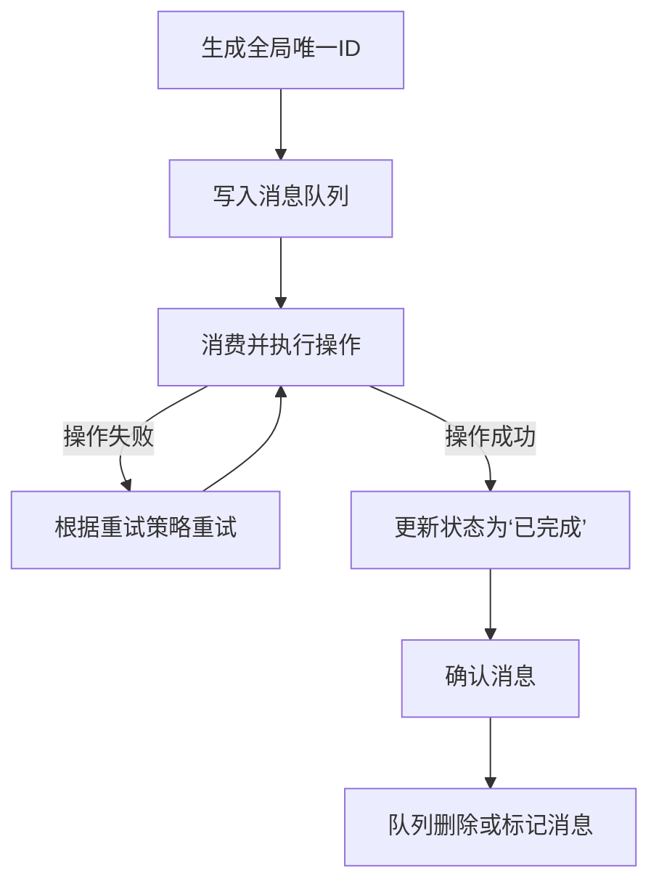

# exactly-once语义 原理与代码实例讲解

## 1.背景介绍

在分布式系统中,消息队列和事件流处理系统广泛应用于异步通信、解耦、削峰填谷等场景。然而,由于网络通信、进程崩溃等原因,可能导致消息重复传输或丢失,从而破坏了消息传递的正确性。为了确保消息只被消费一次,exactly-once语义应运而生,成为分布式系统中一个极其重要的特性。

## 2.核心概念与联系

exactly-once语义的核心概念包括:

1. **幂等性(Idempotent)**: 一个操作无论执行多少次,结果都与执行一次相同。幂等性是实现exactly-once语义的基础。

2. **事务(Transaction)**: 将多个操作作为一个不可分割的整体单元,要么全部执行,要么全部不执行。事务可确保多个操作的原子性。

3. **持久化(Persistence)**: 将关键的状态信息持久化存储,以防止数据丢失。

4. **重试机制(Retry Mechanism)**: 在出现异常时,能够自动重试操作,直至成功。

5. **消息去重(Message Deduplication)**: 通过唯一标识消息,过滤掉重复的消息。

这些概念相互关联,共同构建了exactly-once语义的理论基础。

## 3.核心算法原理具体操作步骤

实现exactly-once语义的核心算法通常包括以下几个步骤:

1. **生成全局唯一ID**: 为每条消息生成一个全局唯一的ID,用于消息去重。

2. **写入消息队列**: 将消息写入队列,并将消息ID和消息内容持久化存储。

3. **消费并执行操作**: 消费者从队列中获取消息,根据消息ID判断是否已经执行过该消息。如果未执行过,则执行操作并将结果持久化存储。

4. **更新状态**: 如果操作执行成功,则更新消息状态为"已完成"。如果失败,则根据重试策略决定是否重试。

5. **确认消息**: 操作执行成功后,向队列发送确认信号,队列将消息从队列中删除或标记为"已完成"。

以上步骤通过事务、持久化和消息去重等机制,确保了消息只被消费一次。下面是一个简化的流程图:



## 4.数学模型和公式详细讲解举例说明

在实现exactly-once语义时,我们需要考虑消息的传输和处理过程中可能出现的各种异常情况。通过建立数学模型,我们可以更好地分析和推理系统的正确性。

假设我们有一个消息队列系统,包含生产者(Producer)、消息队列(Queue)和消费者(Consumer)三个主要组件。我们用$P$表示生产者发送消息的操作,$Q$表示消息队列中消息的状态,$C$表示消费者消费消息的操作。

我们定义以下几个事件:

- $P_s$: 生产者成功发送消息
- $P_f$: 生产者发送消息失败
- $Q_r$: 消息进入队列
- $Q_d$: 消息从队列中删除或标记为"已完成"
- $C_s$: 消费者成功消费消息
- $C_f$: 消费者消费消息失败

根据这些事件,我们可以建立以下数学模型:

$$
\begin{align*}
P_s &\implies Q_r \\
Q_r &\implies (C_s \land Q_d) \lor (C_f \land \lnot Q_d) \\
C_s &\implies Q_d
\end{align*}
$$

这个模型描述了exactly-once语义的基本约束条件:

1. 如果生产者成功发送消息,那么消息必须进入队列。
2. 如果消息进入队列,那么要么消费者成功消费并删除/标记消息,要么消费失败且消息保留在队列中。
3. 如果消费者成功消费消息,那么消息必须从队列中删除或标记为"已完成"。

通过严格遵守这些约束条件,我们可以确保每条消息只被消费一次。

例如,假设生产者发送了一条消息$m$,那么根据模型,我们有:

$$
P_s(m) \implies Q_r(m)
$$

如果消费者成功消费了消息$m$,那么:

$$
Q_r(m) \implies C_s(m) \land Q_d(m)
$$

如果消费者消费失败,那么:

$$
Q_r(m) \implies C_f(m) \land \lnot Q_d(m)
$$

在后一种情况下,消息$m$将保留在队列中,等待下一次重试。

通过数学模型,我们可以清晰地看到exactly-once语义的核心逻辑,并为系统的正确性提供了理论保证。

## 5.项目实践:代码实例和详细解释说明

下面是一个使用RabbitMQ实现exactly-once语义的示例代码(使用Python):

```python
import pika
import uuid
import pickle

# 连接到RabbitMQ服务器
connection = pika.BlockingConnection(pika.ConnectionParameters('localhost'))
channel = connection.channel()

# 声明持久化队列
channel.queue_declare(queue='task_queue', durable=True)

# 发送消息
def send_message(message):
    # 生成全局唯一ID
    message_id = str(uuid.uuid4())
    
    # 持久化消息
    with open(f'messages/{message_id}.pkl', 'wb') as f:
        pickle.dump(message, f)
    
    # 发送消息到队列
    channel.basic_publish(
        exchange='',
        routing_key='task_queue',
        body=message_id,
        properties=pika.BasicProperties(
            delivery_mode=2,  # 持久化消息
        ))
    print(f"Sent message: {message}")

# 消费消息
def consume_messages():
    # 定义回调函数
    def callback(ch, method, properties, body):
        message_id = body.decode('utf-8')
        
        # 检查消息是否已执行
        if os.path.exists(f'results/{message_id}.pkl'):
            print(f"Message {message_id} already processed, skipping.")
            ch.basic_ack(delivery_tag=method.delivery_tag)
            return
        
        # 加载消息
        with open(f'messages/{message_id}.pkl', 'rb') as f:
            message = pickle.load(f)
        
        # 执行操作
        result = process_message(message)
        
        # 持久化结果
        with open(f'results/{message_id}.pkl', 'wb') as f:
            pickle.dump(result, f)
        
        # 确认消息
        ch.basic_ack(delivery_tag=method.delivery_tag)
        print(f"Processed message: {message}")
    
    # 启动消费者
    channel.basic_consume(
        queue='task_queue',
        on_message_callback=callback,
        auto_ack=False)
    
    print("Waiting for messages. To exit press CTRL+C")
    channel.start_consuming()

# 处理消息的函数
def process_message(message):
    # 执行一些操作
    result = ...
    return result

# 发送消息
send_message("Hello, World!")

# 消费消息
consume_messages()
```

这个示例代码展示了exactly-once语义的实现步骤:

1. 生产者在发送消息前,先为消息生成一个全局唯一ID,并将消息持久化存储。
2. 生产者将消息ID发送到持久化队列中。
3. 消费者从队列中获取消息ID,检查该消息是否已经执行过。如果未执行过,则加载消息内容并执行操作。
4. 消费者将操作结果持久化存储,并向队列发送确认信号。
5. 队列删除或标记已完成的消息。

通过持久化消息内容和结果,以及消息去重机制,我们确保了每条消息只被消费一次。即使在消费过程中出现异常,系统也可以根据持久化的状态信息进行重试,从而实现exactly-once语义。

## 6.实际应用场景

exactly-once语义在许多实际应用场景中都扮演着重要角色,例如:

1. **电子商务系统**: 在订单处理、支付、库存更新等环节,需要确保每个操作只执行一次,避免重复扣款或多次减库存等问题。

2. **物联网(IoT)数据处理**: 传感器设备可能会重复发送相同的数据,需要通过exactly-once语义去重并正确处理数据。

3. **数据流处理**: 在流式计算中,exactly-once语义可以确保每条数据记录只被处理一次,保证计算结果的准确性。

4. **消息驱动架构**: 在基于消息队列的分布式系统中,exactly-once语义是一个关键特性,确保消息可靠传递且不会重复处理。

5. **事件溯源(Event Sourcing)**: 这种架构模式依赖于对事件流的精确处理,exactly-once语义可以保证每个事件只被应用一次,从而维护系统的一致性。

6. **金融系统**: 银行转账、证券交易等金融场景对数据准确性和一致性要求极高,需要exactly-once语义来避免资金重复转移或丢失。

总的来说,任何对数据准确性和一致性有严格要求的分布式系统,都可以从exactly-once语义中受益。

## 7.工具和资源推荐

实现exactly-once语义需要结合多种技术和工具,下面是一些推荐的工具和资源:

1. **消息队列系统**:
   - RabbitMQ: 支持持久化队列、消息确认和事务等特性,适合实现exactly-once语义。
   - Apache Kafka: 通过Kafka Streams等组件,可以实现exactly-once语义的流处理。
   - Amazon SQS: AWS的消息队列服务,支持FIFO队列和去重能力。

2. **分布式事务框架**:
   - Seata: 阿里开源的分布式事务解决方案,支持多种模式,包括TCC、Saga等。
   - Bytebuf: 基于TCC模式实现的分布式事务框架。

3. **分布式锁**:
   - Redis: 可以利用Redis的SETNX命令实现分布式锁,用于并发控制。
   - Zookeeper: 提供分布式锁和同步服务,适用于exactly-once语义的实现。

4. **持久化存储**:
   - 关系型数据库: 如MySQL、PostgreSQL等,可用于持久化消息和状态信息。
   - NoSQL数据库: 如MongoDB、Cassandra等,提供高可用性和可扩展性。

5. **其他资源**:
   - 《Designing Data-Intensive Applications》: 一本涵盖分布式系统设计原理的经典书籍。
   - Apache Kafka官方文档: 包含了Kafka Streams实现exactly-once语义的详细说明。
   - Seata官方文档: 介绍了Seata分布式事务解决方案的原理和使用方法。

选择合适的工具和框架,结合exactly-once语义的核心原理,可以有效地构建可靠的分布式系统。

## 8.总结:未来发展趋势与挑战

exactly-once语义为分布式系统提供了可靠性保证,但在实现和应用过程中,仍然存在一些挑战和未来发展趋势:

1. **性能优化**: 实现exactly-once语义通常需要付出额外的开销,如持久化、锁竞争等。未来需要继续优化算法和架构,在保证正确性的同时提高系统性能。

2. **云原生支持**: 随着云原生架构的兴起,exactly-once语义需要与Kubernetes、Serverless等新兴技术进行深度整合,以适应云环境的动态性和弹性。

3. **流处理融合**: 将exactly-once语义与流处理框架(如Apache Flink、Spark Streaming等)深度融合,为实时数据处理提供更强的一致性保证。

4. **人工智能应用**: 在人工智能领域,exactly-once语义可以应用于机器学习模型的训练和推理过程,确保数据处理的准确性和可重复性。

5. **形式化验证**: 利用形式化方法对exactly-once语义的实现进行严格验证,从理论上证明其正确性,提高系统的可靠性。

6. **新硬件支持**: 随着新硬件(如持久内存、RDMA等)的出现,exactly-once语义的实现可能会有新的突破,提高性能和可靠性。

7. **隐私和安全**: exactly-once 语义的实现需要对数据进行持久化和复制, 这就带来了新的隐私和安全挑战。未来需要研究如何在保证 exactly-once 语义的同时, 保护数据的隐私和安全。

## 9. 附录：常见问题与解答

**Q1: exactly-once 语义与 at-least-once 语义的区别是什么?**

**A1:** at-least-once 语义保证消息至少被处理一次，但不保证只被处理一次，可能会出现重复处理的情况。而 exactly-once 语义则保证消息只会被处理一次，不会出现重复处理或遗漏处理的情况。

**Q2: 实现 exactly-once 语义有哪些常见的技术方案?**

**A2:** 常见的技术方案包括：

* **两阶段提交 (2PC)**
* **事务型消息队列**
* **基于状态机的exactly-once语义实现**

**Q3:  exactly-once 语义的应用场景有哪些?**

**A3:**  exactly-once 语义适用于对数据一致性要求较高的场景，例如：

* **金融交易系统**
* **电商订单系统**
* **分布式数据库**

**Q4: 实现 exactly-once 语义需要注意哪些问题?**

**A4:**  实现 exactly-once 语义需要注意以下问题：

* **性能开销**
* **系统复杂度**
* **错误处理**

## 作者：禅与计算机程序设计艺术 / Zen and the Art of Computer Programming 