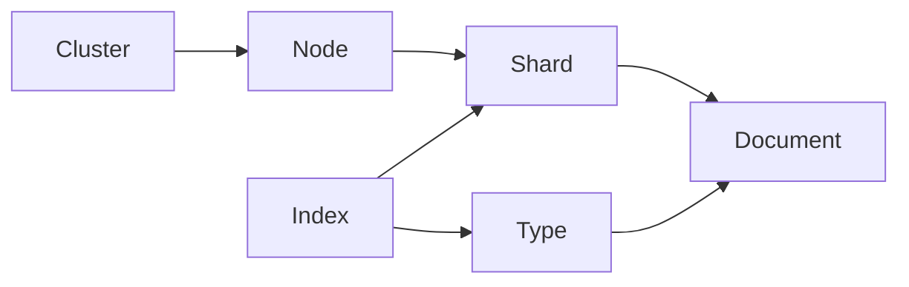

# 【AI大数据计算原理与代码实例讲解】ElasticSearch

## 1. 背景介绍
### 1.1 大数据时代的搜索需求
在当今大数据时代,海量数据的存储和检索成为了企业和组织面临的重大挑战。传统的关系型数据库在处理结构化数据方面表现优异,但在面对非结构化和半结构化数据时,却力不从心。搜索引擎技术应运而生,成为了大数据处理的利器。而ElasticSearch就是其中的佼佼者。

### 1.2 ElasticSearch的诞生
ElasticSearch是一个基于Lucene的搜索服务器。它提供了一个分布式多用户能力的全文搜索引擎,基于RESTful web接口。ElasticSearch是用Java语言开发的,并作为Apache许可条款下的开放源码发布,是一种流行的企业级搜索引擎。

### 1.3 ElasticSearch的特点
ElasticSearch的主要特点包括:

1. 分布式实时文件存储,并将每一个字段都编入索引,使其可以被搜索。
2. 实时分析的分布式搜索引擎。 
3. 可以扩展到上百台服务器,处理PB级别的结构化或非结构化数据。
4. 支持地理位置搜索、自动完成、多数据源搜索等丰富功能。

正是由于这些特点,ElasticSearch在大数据搜索领域占据了重要地位。

## 2. 核心概念与联系
### 2.1 Node与Cluster
ElasticSearch可以作为一个独立的单个搜索服务器。不过,为了处理大型数据集,实现容错和高可用性,ElasticSearch可以运行在许多互相合作的服务器上。这些服务器的集合称为集群(cluster),形成集群的每个服务器称为节点(node)。

### 2.2 Index
ElasticSearch会索引(index)所有字段,经过处理后写入一个反向索引(Inverted Index)。查找数据的时候,直接查找该索引。所以,ElasticSearch数据管理的顶层单位就叫做Index(索引)。它是单个数据库的同义词。每个Index包含一个Type(如下所述)的多个文档。

### 2.3 Document
Index里面单条的记录称为Document(文档)。许多条Document构成了一个Index。Document使用JSON格式表示,常见的结构如下:

```json
{
  "name":     "John Smith",
  "sex":      "Male",
  "age":      28,
  "birthDate": "1990/01/01",
  "about":    "I love traveling and photography."
}
```

### 2.4 Type
Document可以分组,比如`weather`这个Index里面,可以按城市分组(北京和上海),也可以按气候分组(晴天和雨天)。这种分组就叫做Type,它是虚拟的逻辑分组,用来过滤Document。

不同的Type应该有相似的结构(schema),举例来说,`id`字段不能在这个组是字符串,在另一个组是数值。这是与关系型数据库的表的一个区别。性质完全不同的数据(比如`products`和`logs`)应该存成两个Index,而不是一个Index里面的两个Type。

### 2.5 Shard
Index数据过大时,可以将Index里面的数据分成多个分片,每个分片放在不同的服务器里面,从而实现了ElasticSearch的分布式存储。Shard的数量可以在Index创建时指定,也可以后期更改。

Shard有两种类型:

- Primary Shard(主分片):Index创建时指定,后期不允许修改。默认为5个。
- Replica Shard(副本分片):用于备份和负载均衡,与Primary Shard的数据完全一致。

### 2.6 核心概念关系图
下面是ElasticSearch核心概念的关系图:



从图中可以看出:

- 多个Document组成一个Type
- 多个Type组成一个Index  
- Index按Shard分布在多个Node上
- 多个Node组成一个Cluster

理解了这些核心概念之间的关系,对于深入学习ElasticSearch非常有帮助。

## 3. 核心算法原理具体操作步骤
### 3.1 倒排索引(Inverted Index)
ElasticSearch使用一种称为"倒排索引"的结构,它适用于快速的全文搜索。一个倒排索引由文档中所有不重复词的列表构成,对于其中每个词,有一个包含它的文档列表。

例如,假设我们有两个文档,每个文档的内容如下:

- "The quick brown fox jumped over the lazy dog"
- "Quick brown foxes leap over lazy dogs in summer"

为了创建倒排索引,我们首先将每个文档的内容分成单独的词(我们称它为词条或tokens),创建一个包含所有不重复词条的排序列表,然后列出每个词条出现在哪个文档。结果如下:

```
Term      Doc_1  Doc_2
-------------------------
Quick   |       |  X
The     |   X   |
brown   |   X   |  X
dog     |   X   |
dogs    |       |  X
fox     |   X   |
foxes   |       |  X
in      |       |  X
jumped  |   X   |
lazy    |   X   |  X
leap    |       |  X
over    |   X   |  X
quick   |   X   |
summer  |       |  X
the     |   X   |
```

倒排索引的查询原理如下:

1. 将查询语句分词,得到需要查询的词条。
2. 对词条进行检索,得到包含该词条的文档列表。
3. 对文档列表进行交集、并集、差集等操作,得到最终结果。

### 3.2 分词(Analysis)
分词是指将文本转换为一系列单词(即词条)的过程,也称为文本分析,在ElasticSearch中称为Analysis。

分词是通过分词器(Analyzer)实现的。分词器由三部分组成:

1. 字符过滤器(Character Filters):将原始文本中的特殊字符(如HTML标签)去除。
2. 分词器(Tokenizer):将文本按照一定规则切分为词条。
3. 词条过滤(Token Filters):将切分的词条进行加工(如转小写、删除或新增等)。

常见的分词器包括:

- Standard Analyzer:默认分词器,按词切分,小写处理。
- Simple Analyzer:按照非字母切分,小写处理。
- Whitespace Analyzer:按照空格切分,不转小写。
- Stop Analyzer:去除Stop Words(如the、a等),小写处理。

### 3.3 文档打分(Scoring)
当我们查询ElasticSearch时,它会计算每个匹配文档的相关度得分(_score),并根据得分排序。这个得分的计算方式可以在查询时通过参数指定,默认的计算方式为BM25。

BM25的主要思想是:对于查询语句中的每个词,文档中出现频率越高,文档的相关度就越高;但是如果某个词在大部分文档中都出现,那么这个词的权重就会降低。

具体的计算公式如下:

$$
score(D,Q) = \sum_{i=1}^{n} IDF(q_i) \cdot \frac{f(q_i, D) \cdot (k_1 + 1)}{f(q_i, D) + k_1 \cdot (1 - b + b \cdot \frac{|D|}{avgdl})}
$$

其中:

- $f(q_i, D)$ 表示词条$q_i$在文档$D$中出现的频率。
- $|D|$ 表示文档的长度。
- $avgdl$ 表示文档集合中文档的平均长度。
- $k_1$和$b$为调节因子,一般取$k_1 = 1.2, b = 0.75$。
- $IDF(q_i)$为逆文档频率,用来衡量词条$q_i$的重要性,计算公式为:

$$
IDF(q_i) = \log \frac{N - n(q_i) + 0.5}{n(q_i) + 0.5}
$$

其中$N$为文档总数,$n(q_i)$为包含$q_i$的文档数。

## 4. 数学模型和公式详细讲解举例说明
在前面我们提到了ElasticSearch的文档打分模型BM25,下面我们通过一个具体的例子来详细讲解这个数学模型。

假设我们有以下三个文档:

```
doc1: "I like reading science fiction novels."
doc2: "Science is very important in modern society."
doc3: "I enjoy science fiction movies based on science."  
```

现在我们要查询"science fiction"这个短语,来看看这三个文档的相关度得分如何计算。

### 4.1 计算词频和文档频率
首先,我们需要统计每个词在每个文档中出现的频率(Term Frequency,简称TF),以及包含每个词的文档数(Document Frequency,简称DF)。

|      | doc1 | doc2 | doc3 | DF |
|------|------|------|------|----| 
|science| 1   | 1    | 2    | 3  |
|fiction| 1   | 0    | 1    | 2  |

### 4.2 计算逆文档频率
根据上表,我们可以计算每个词的逆文档频率(Inverse Document Frequency,简称IDF):

$$
IDF(science) = \log \frac{3 - 3 + 0.5}{3 + 0.5} = 0.125
$$

$$  
IDF(fiction) = \log \frac{3 - 2 + 0.5}{2 + 0.5} = 0.288
$$

可以看出,"science"在所有文档中都出现,所以权重较低;"fiction"只在其中两个文档出现,所以权重较高。

### 4.3 计算BM25得分 
最后,我们可以计算每个文档的BM25得分。假设$k_1 = 1.2, b = 0.75$,文档平均长度为10个词。那么对于doc1:

$$
score(doc1, "science\ fiction") \\
= 0.125 \cdot \frac{1 \cdot 2.2}{1 + 1.2 \cdot (1 - 0.75 + 0.75 \cdot \frac{8}{10})} + 0.288 \cdot \frac{1 \cdot 2.2}{1 + 1.2 \cdot (1 - 0.75 + 0.75 \cdot \frac{8}{10})} \\
= 0.125 \cdot 1.465 + 0.288 \cdot 1.465 \\
= 0.605
$$

同理可得doc2和doc3的得分分别为0.183和1.028。可以看出,doc3的得分最高,因为它包含了两个查询词,并且"science"出现了两次。doc2的得分最低,因为它只包含了权重较低的"science"。

这个例子展示了ElasticSearch的文档打分过程。实际应用中,ElasticSearch还会考虑更多因素,如词的位置、词间距离等,以提高搜索的准确性。

## 5. 项目实践:代码实例和详细解释说明
下面我们通过一个简单的Python项目来演示如何使用ElasticSearch进行文档的索引和搜索。

### 5.1 安装和启动ElasticSearch
首先,我们需要安装和启动ElasticSearch。可以从官网下载对应操作系统的安装包,解压后运行`bin/elasticsearch`即可启动。

接着,我们需要安装Python的ElasticSearch客户端:

```bash
pip install elasticsearch
```

### 5.2 创建索引和文档
```python
from elasticsearch import Elasticsearch

# 创建Elasticsearch客户端
es = Elasticsearch()

# 定义索引名称
index_name = "my_index"

# 定义文档
doc1 = {"title": "ElasticSearch Guide", "content": "This is a guide for ElasticSearch."}  
doc2 = {"title": "Python Tutorial", "content": "A tutorial for Python."}
doc3 = {"title": "ElasticSearch and Python", "content": "Using Python with ElasticSearch."}

# 索引文档
es.index(index=index_name, id=1, body=doc1)
es.index(index=index_name, id=2, body=doc2)  
es.index(index=index_name, id=3, body=doc3)

# 刷新索引
es.indices.refresh(index=index_name)
```

在这段代码中,我们首先创建了一个ElasticSearch客户端,然后定义了一个索引名称"my_index"。

接着,我们定义了三个文档,每个文档都有"title"和"content"两个字段。

最后,我们使用`es.index()`方法将这三个文档索引到"my_index"中,并指定了每个文档的ID。在索引完成后,我们调用`es.indices.refresh()`方法来刷新索引,使得新索引的文档可以被搜索到。

### 5.3 搜索文档
```python
# 搜索包含"