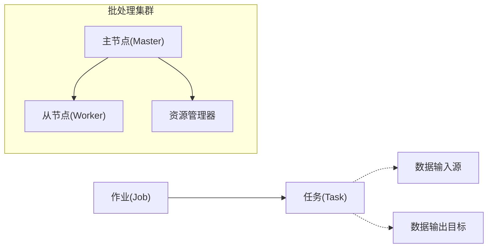
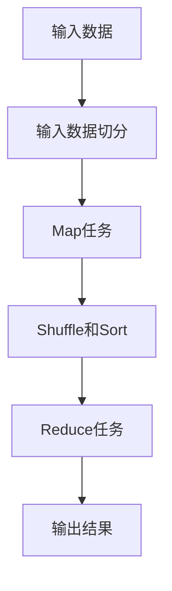

# 【AI大数据计算原理与代码实例讲解】批处理

## 1. 背景介绍
### 1.1 大数据时代的到来
随着互联网、物联网、移动互联网等技术的快速发展,数据呈现出爆炸式增长的趋势。据统计,全球数据量每两年就会增长一倍。面对如此海量的数据,传统的数据处理方式已经无法满足实时性、高效性的要求。大数据技术应运而生,其中批处理作为一种重要的数据处理范式,在大数据领域扮演着至关重要的角色。

### 1.2 批处理的定义与特点
批处理(Batch Processing)是一种数据处理范式,其主要思想是将大量的数据分成一个个小的数据集合,然后对每个数据集进行顺序处理,从而实现对海量数据的高效处理。与实时处理相比,批处理通常处理历史数据,时效性要求不高,但对数据处理的吞吐量和效率要求很高。批处理的特点主要有:

- 顺序处理:批处理通常按照数据到达的顺序依次处理,这种方式实现简单,但灵活性较差。 
- 高吞吐量:批处理专注于处理大量数据,通过提高每个任务处理数据的规模,来获得高吞吐量。
- 容错性:由于批处理时间跨度大,因此需要有较好的容错性,确保在出现故障时能够从断点继续处理。
- 延迟性:批处理不要求实时性,通常处理的是历史数据,因此处理时延会比较大。

### 1.3 批处理的应用场景
批处理在大数据领域有着广泛的应用,一些典型的应用场景包括:

- 数据仓库:将企业各个系统的数据进行 ETL,最终加载到数据仓库。
- 用户行为分析:分析用户的历史行为数据,为营销决策提供支持。
- 机器学习:很多机器学习算法都是基于批处理的,通过处理大量历史数据来训练模型。
- 图计算:图计算通常也采用批处理的方式,通过迭代计算的方式得到最终结果。

## 2. 核心概念与联系
### 2.1 作业(Job)和任务(Task) 
在批处理系统中,作业(Job)和任务(Task)是两个核心概念。一个作业通常由多个任务组成,每个任务负责处理一部分数据。以MapReduce为例,一个作业分为Map阶段和Reduce阶段,Map阶段的每个任务处理一部分输入数据,Reduce阶段的每个任务负责处理一部分中间结果数据。

### 2.2 数据的输入与输出
在批处理作业中,通常需要指定数据的输入源和输出目标。数据输入源可以是本地文件、HDFS、HBase等,数据输出目标也可以是本地文件、HDFS、HBase、关系型数据库等。系统从输入源读取数据,经过一系列的处理后将结果写入到输出目标。

### 2.3 容错与重试
由于批处理时间跨度比较大,因此难免会出现任务失败的情况。为了确保作业能够顺利完成,批处理框架通常都提供了容错和重试机制。常见的容错方式有:

- 重新执行失败的任务。
- 基于Checkpoint的容错,即周期性地保存作业的中间状态,失败时可以从最近的Checkpoint恢复。
- 基于WAL的重试,把任务的操作日志写到WAL中,失败时根据WAL恢复任务状态。

### 2.4 调度与资源管理
批处理作业通常运行在一个由多台机器组成的集群环境中,因此需要合理地调度任务和管理集群资源。一个典型的批处理集群包括如下角色:

- 主节点(Master):负责管理整个集群,调度作业和任务,协调从节点的工作。
- 从节点(Worker):负责实际执行任务,并向主节点汇报任务状态。
- 资源管理器:负责管理集群的计算资源和存储资源,为作业分配资源。

主节点将作业分解成一个个任务,然后从资源管理器申请资源启动任务,并监控任务的执行状态。从节点领取任务并执行,执行完毕后释放资源。通过主从协作完成整个作业的计算。

### 核心概念关系图


## 3. 核心算法原理具体操作步骤
以下以MapReduce为例,介绍批处理的核心算法原理和操作步骤。

### 3.1 MapReduce 基本原理
MapReduce由Map和Reduce两个操作组成,通过这两个操作可以实现很多复杂的计算功能。

#### 3.1.1 Map阶段
Map阶段的主要任务是对输入数据进行处理,将数据转化为Key-Value对。一个典型的Map函数如下:
```java
map(key, value):
  // key: 输入数据的key
  // value: 输入数据的value
  ...
  output(intermediate_key, intermediate_value)
```
Map函数的输入是一个Key-Value对,输出零个或多个Key-Value对。输出的Key-Value对我们称之为中间结果。

#### 3.1.2 Shuffle阶段
Map阶段输出的中间结果需要按照Key进行分组,这个过程叫做Shuffle。Shuffle阶段分为两部分:

- Partition:将中间结果按照Key的哈希值分配到不同的分区(Partition)中,每个分区对应一个Reduce任务。
- Sort:在每个分区内部对Key-Value对进行排序。

#### 3.1.3 Reduce阶段 
Reduce阶段负责对Shuffle后的数据进行最终的计算。一个典型的Reduce函数如下:
```java
reduce(intermediate_key, intermediate_values):
  // intermediate_key: Shuffle后的Key
  // intermediate_values: 具有相同Key的中间结果Value列表
  ...
  output(final_key, final_value)
```
Reduce函数的输入是Shuffle后的数据,先对具有相同Key的中间结果Value进行合并,然后执行计算逻辑,最终输出零个或多个最终结果。

### 3.2 MapReduce 编程模型
用户使用MapReduce编程模型只需要实现Map函数和Reduce函数,而无需关心底层的并行计算、容错、数据分发等细节。以WordCount为例:
```java
map(Long key, String value):
  // key: 每一行的行号
  // value: 每一行的文本内容
  for each word w in value:
    output(w, 1)

reduce(String key, Iterator values):
  // key: 单词
  // values: 各个Map任务输出的计数值
  int result = 0
  for each v in values:
    result += v
  output(key, result)
```
Map函数负责将每一行文本内容切分成单词,并输出(单词,1)。Reduce函数负责对每个单词的计数值进行累加,得到每个单词的总频次。

### 3.3 MapReduce 工作流程
MapReduce的工作流程如下图所示:



1. 输入数据被切分成等长的Split,每个Split对应一个Map任务。
2. 多个Map任务并行处理输入数据,输出中间结果。
3. 中间结果按照Key哈希到不同的分区,并在分区内排序。
4. 多个Reduce任务并行处理Shuffle后的数据,输出最终结果。
5. 将多个Reduce任务的输出合并,得到最终的输出结果。

## 4. 数学模型和公式详细讲解举例说明
MapReduce的很多应用场景都可以抽象为矩阵运算。以PageRank算法为例,我们详细讲解其数学模型和公式。

### 4.1 PageRank模型
PageRank是Google提出的一种用于评估网页重要性的算法。其基本思想是:如果一个网页被很多其他网页链接到,说明这个网页比较重要,也就是PageRank值比较高。一个网页的PageRank值由所有链接到它的网页的PageRank值决定。具体地,PageRank的计算公式为:

$$
PR(p_i) = \frac{1-d}{N} + d \sum_{p_j \in M(p_i)} \frac{PR(p_j)}{L(p_j)}
$$

其中:
- $PR(p_i)$:网页$p_i$的PageRank值。 
- $N$:所有网页的数量。
- $d$:阻尼系数,取值在0到1之间,表示用户随机访问网页的概率。
- $M(p_i)$:所有链接到网页$p_i$的网页集合。
- $L(p_j)$:网页$p_j$的出链数量。

### 4.2 PageRank的矩阵表示
我们可以将所有网页的PageRank值表示为一个列向量$\vec{R}$,将网页之间的链接关系表示为一个概率转移矩阵$M$。$M$的每一行对应一个网页,每一列对应一个网页,当第$i$个网页链接到第$j$个网页时,$M_{ij}=\frac{1}{L(p_i)}$,否则$M_{ij}=0$。

根据PageRank公式,我们可以得到如下的迭代公式:

$$
\vec{R}^{(t+1)} = (1-d) \frac{1}{N} \vec{1} + d M^T \vec{R}^{(t)}
$$

其中$\vec{R}^{(t)}$表示第$t$轮迭代后的PageRank列向量,$\vec{1}$为全1列向量。

### 4.3 PageRank的MapReduce实现
PageRank算法可以很自然地用MapReduce实现。每一轮迭代对应一个MapReduce作业,Map任务负责计算每个网页对其他网页的贡献值,Reduce任务负责汇总每个网页收到的贡献值,得到新一轮的PageRank值。

#### 4.3.1 Map阶段
```
map(Long key, Text value):
  // key: 网页ID
  // value: 网页对应的邻接表和PageRank值
  String[] fields = value.split("\t")
  String page = fields[0]
  double pageRank = Double.valueOf(fields[1])
  String[] adjacencyList = fields[2].split(",")
  int numOfOutlinks = adjacencyList.length
  for each outlink in adjacencyList:
    double contributionValue = pageRank / numOfOutlinks
    output(outlink, contributionValue)
  output(page, "!" + value)  
```
Map函数的输入是网页ID和对应的邻接表、PageRank值。对于每个出链网页,输出其ID和当前网页对其的贡献值。同时,为了在Reduce阶段能够获得当前网页的邻接表信息,还需要输出当前网页ID和邻接表、PageRank值(在邻接表前加"!"标记)。

#### 4.3.2 Reduce阶段
```
reduce(Text key, Iterable<DoubleWritable> values):
  // key: 网页ID
  // values: 所有Map任务输出的贡献值和邻接表
  double sumOfContributionValues = 0
  String adjacencyList = ""
  for each value in values:
    if (value.startsWith("!")):
      adjacencyList = value.substring(1)
    else:
      sumOfContributionValues += value
  double newPageRank = 0.15 / N + 0.85 * sumOfContributionValues
  output(key, newPageRank + "\t" + adjacencyList)
```
Reduce函数的输入是网页ID和所有Map任务输出的贡献值、邻接表。在计算新的PageRank值时,需要累加所有Map任务传过来的贡献值,得到$\sum_{p_j \in M(p_i)} \frac{PR(p_j)}{L(p_j)}$,再根据公式计算新的PageRank值。最后,输出网页ID和新的PageRank值、邻接表。

## 5. 项目实践：代码实例和详细解释说明
下面我们以Hadoop MapReduce为例,给出PageRank算法的具体代码实现。

### 5.1 数据准备
首先我们需要准备输入数据,即网页链接关系数据。我们可以使用如下格式:
```
网页ID<TAB>初始PageRank值<TAB>邻接网页ID列表
```
例如:
```
A    1.0    B,C,