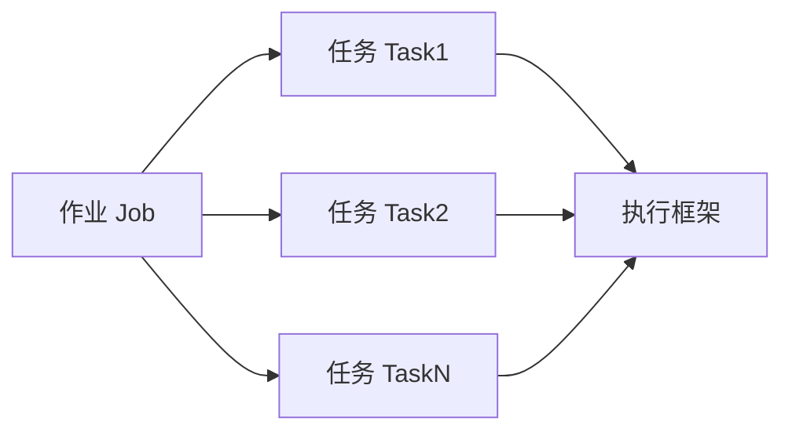
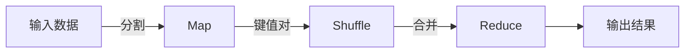

# 【AI大数据计算原理与代码实例讲解】批处理

## 1. 背景介绍
在大数据时代，数据量的爆炸式增长对数据处理提出了巨大挑战。批处理作为一种处理大规模数据集的技术，因其高效、稳定的特性而被广泛应用。它能够处理存储在文件系统或数据库中的大量数据，并在不需要实时响应的情况下，完成复杂的数据分析任务。本文将深入探讨批处理的原理、算法、数学模型，并通过代码实例进行讲解。

## 2. 核心概念与联系
批处理涉及多个核心概念，包括作业(Job)，任务(Task)，以及执行框架(Execution Framework)等。作业是指一次批处理操作，它可能包含多个任务，每个任务执行数据处理的一个步骤。执行框架则是支持批处理作业运行的环境，如Hadoop和Spark。



## 3. 核心算法原理具体操作步骤
批处理的核心算法原理基于MapReduce模型，它包括两个主要步骤：Map（映射）和Reduce（归约）。Map步骤将输入数据分割成独立的块，并对每个块进行处理，通常是键值对的形式。Reduce步骤则对Map步骤的输出进行合并，以得到最终结果。



## 4. 数学模型和公式详细讲解举例说明
批处理的数学模型可以用函数式编程的概念来描述。例如，Map函数可以表示为 $map(k1, v1) \rightarrow list(k2, v2)$，而Reduce函数可以表示为 $reduce(k2, list(v2)) \rightarrow list(v2)$。这里，$k1$ 和 $k2$ 分别代表输入和输出的键，$v1$ 和 $v2$ 分别代表输入和输出的值。

$$
map(k1, v1) \rightarrow [(k2, v2), (k2, v2), ...]
reduce(k2, [v2, v2, ...]) \rightarrow [v2]
$$

## 5. 项目实践：代码实例和详细解释说明
以Hadoop为例，一个简单的MapReduce代码实例可能如下：

```java
public class WordCount {

    public static class Map extends MapReduceBase implements Mapper<LongWritable, Text, Text, IntWritable> {
        private final static IntWritable one = new IntWritable(1);
        private Text word = new Text();

        public void map(LongWritable key, Text value, OutputCollector<Text, IntWritable> output, Reporter reporter) throws IOException {
            String line = value.toString();
            StringTokenizer tokenizer = new StringTokenizer(line);
            while (tokenizer.hasMoreTokens()) {
                word.set(tokenizer.nextToken());
                output.collect(word, one);
            }
        }
    }

    public static class Reduce extends MapReduceBase implements Reducer<Text, IntWritable, Text, IntWritable> {
        public void reduce(Text key, Iterator<IntWritable> values, OutputCollector<Text, IntWritable> output, Reporter reporter) throws IOException {
            int sum = 0;
            while (values.hasNext()) {
                sum += values.next().get();
            }
            output.collect(key, new IntWritable(sum));
        }
    }
}
```

在这个例子中，Map类的map方法将文本行分割成单词，并为每个单词输出一个计数值。Reduce类的reduce方法则将相同单词的计数值相加，得到最终的单词频率。

## 6. 实际应用场景
批处理在多个领域都有广泛应用，如金融数据分析、日志处理、科学计算等。在金融数据分析中，批处理可以用来计算复杂的风险模型。在日志处理中，它可以用来生成用户行为报告。而在科学计算中，批处理则可以处理大规模的模拟数据。

## 7. 工具和资源推荐
对于批处理，推荐以下工具和资源：
- Apache Hadoop：一个开源框架，用于分布式存储和处理大数据。
- Apache Spark：一个快速的大数据处理框架，支持批处理和流处理。
- Google Cloud Dataproc：一个快速、易于使用和管理的批处理和流处理服务。

## 8. 总结：未来发展趋势与挑战
批处理技术正朝着更高效、更智能的方向发展。未来的挑战包括处理更大规模的数据集、提高处理速度、以及集成机器学习等先进技术。同时，随着实时处理需求的增加，批处理需要与流处理技术更好地结合。

## 9. 附录：常见问题与解答
Q1: 批处理和流处理的区别是什么？
A1: 批处理是对一定量的数据集进行一次性处理，而流处理是对连续数据流进行实时处理。

Q2: MapReduce模型是否只适用于Hadoop？
A2: 不是，MapReduce是一种编程模型，它可以在多种框架上实现，如Hadoop、Spark等。

作者：禅与计算机程序设计艺术 / Zen and the Art of Computer Programming