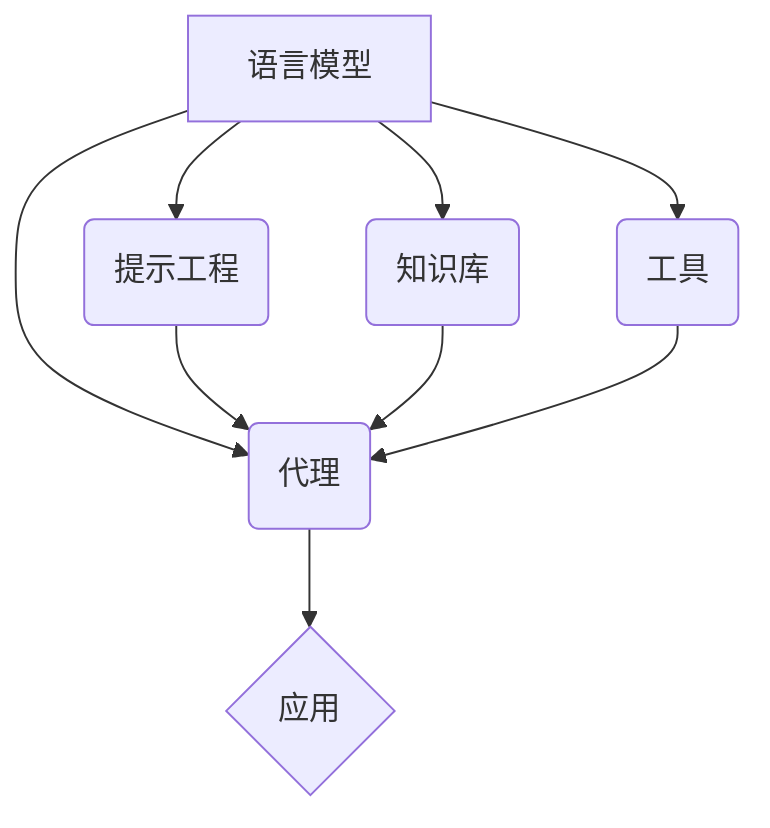

# 【LangChain编程：从入门到实践】扩展模型接口

## 1. 背景介绍
### 1.1 LangChain简介
LangChain是一个用于开发由语言模型驱动的应用程序的开源框架。它提供了一套工具和组件,可以轻松构建和集成语言模型到各种应用中,如聊天机器人、文档问答系统、文本摘要等。LangChain旨在简化语言模型应用的开发流程,使开发者能够专注于应用逻辑而无需过多关注底层模型细节。

### 1.2 语言模型发展现状
近年来,以Transformer为代表的深度学习语言模型取得了巨大突破,在多个自然语言处理任务上达到甚至超越人类的表现。从GPT、BERT到GPT-3、ChatGPT,语言模型的规模和能力不断提升。这些强大的语言模型为构建智能对话系统、知识问答、文本生成等应用提供了坚实基础。但直接使用这些模型仍面临诸多挑战,如上下文长度限制、缺乏领域适配能力等,需要进一步的封装和扩展。

### 1.3 LangChain的优势
LangChain框架应运而生,它在语言模型之上提供了一层抽象,封装了对话管理、提示优化、知识库检索等常用功能组件。开发者可以基于LangChain快速搭建原型系统,根据需求灵活组合和配置不同模块。同时,LangChain支持多种主流语言模型和知识库接口,具有良好的扩展性。使用LangChain,开发者可以显著降低开发成本,提高开发效率,专注于应用创新。

## 2. 核心概念与联系
### 2.1 语言模型(Language Model) 
语言模型是一种基于概率统计的模型,用于刻画自然语言中词语序列的分布规律。给定前面的词语,语言模型可以预测下一个最可能出现的词。当前主流的语言模型基于Transformer架构的深度神经网络,通过海量语料的预训练得到强大的语言理解和生成能力。LangChain支持多种语言模型如OpenAI GPT、Google PaLM等。

### 2.2 提示工程(Prompt Engineering)
提示工程是指如何设计优化输入给语言模型的提示(Prompt),以引导模型生成期望的输出。通过精心构造的提示,可以控制模型执行特定任务、遵循格式要求、体现领域知识等。LangChain提供了一系列提示模板和优化技巧,帮助开发者设计高质量的提示。良好的提示工程可以显著改善语言模型应用的效果。

### 2.3 代理(Agent)
代理是LangChain中的一个核心概念,它定义了一个使用语言模型执行任务的流程。一个代理由一个或多个语言模型组成,通过输入提示、知识库查询、工具调用等一系列步骤,完成特定任务并生成最终输出。LangChain提供了多种代理实现,如会话代理、反应式代理等,适用于不同场景。代理抽象了任务执行流程,简化了应用开发。

### 2.4 知识库(Knowledge Base) 
知识库是一种结构化或半结构化的数据存储,用于提供特定领域的背景知识。在语言模型应用中,知识库可以作为上下文信息补充输入,帮助模型理解问题并给出更准确、更丰富的答案。LangChain支持多种知识库,如文档库、图数据库等,可以根据需求灵活选择。通过知识库扩展,可以增强语言模型的领域适应能力。

### 2.5 工具(Tool)
工具是LangChain中的另一个重要概念,它表示语言模型可以调用的外部函数或API。通过定义工具,可以扩展语言模型的能力,使其能够访问和操作外部资源,如数据库、搜索引擎、第三方服务等。LangChain提供了一套工具接口规范和常用工具实现。合理设计和使用工具,可以大大拓宽语言模型应用的边界。

以下是这些核心概念之间的关系示意图:



## 3. 核心算法原理与具体操作步骤
### 3.1 语言模型微调(Fine-tuning)
语言模型微调是指在特定任务或领域数据上,对预训练的语言模型进行进一步训练,使其适应新的任务或领域。微调可以显著提升模型在目标任务上的表现。LangChain支持使用自定义数据对语言模型进行微调。

具体步骤如下:
1. 准备微调数据集,通常为特定任务或领域的文本数据,需要按照输入和输出对进行组织。
2. 加载预训练的语言模型,如GPT、BERT等。
3. 定义微调的超参数,如学习率、批大小、训练轮数等。
4. 使用微调数据集对语言模型进行训练,更新模型参数。 
5. 评估微调后的模型在目标任务上的表现,进行必要的调优。
6. 将微调后的模型保存,用于后续的应用开发。

### 3.2 知识库问答(Knowledge Base Question Answering)
知识库问答是指利用语言模型从结构化或非结构化的知识库中检索信息,回答用户的问题。LangChain提供了知识库问答的端到端实现。

具体步骤如下:
1. 构建知识库,将领域文档、数据库等信息源组织成结构化或可检索的形式。
2. 加载预训练的语言模型,如GPT、BERT等。
3. 定义提示模板,指定如何将用户问题和知识库信息拼接成模型输入。
4. 接收用户问题,使用提示模板将其与知识库信息结合。
5. 将构造的输入传递给语言模型,生成回答。
6. 对生成的回答进行后处理,如过滤、格式化等,返回给用户。
7. 根据用户反馈对系统进行优化和迭代。

### 3.3 代理实现(Agent Implementation)
代理实现是指根据任务需求,设计和开发语言模型驱动的任务执行流程。LangChain提供了代理开发的框架和工具。

具体步骤如下:
1. 明确任务目标和要求,确定代理的输入输出接口。
2. 选择合适的语言模型作为代理的核心组件。
3. 定义代理的执行流程,包括提示构建、工具调用、知识库查询等步骤。
4. 实现每个步骤对应的组件,如提示模板、工具接口、知识库适配器等。
5. 将各个组件组合成完整的代理,定义组件之间的数据流和控制流。
6. 对代理进行测试和调试,验证其执行结果是否符合预期。
7. 将代理封装成可复用的模块,提供清晰的API接口。
8. 在实际应用中集成代理,根据反馈迭代优化代理实现。

## 4. 数学模型和公式详细讲解举例说明
### 4.1 语言模型的概率公式
语言模型的核心是计算一个词语序列 $w_1, w_2, \dots, w_n$ 的概率。根据概率论的链式法则,可以将联合概率分解为一系列条件概率的乘积:

$$ P(w_1, w_2, \dots, w_n) = P(w_1) \cdot P(w_2|w_1) \cdot P(w_3|w_1, w_2) \cdot \ldots \cdot P(w_n|w_1, w_2, \dots, w_{n-1}) $$

其中,$P(w_i|w_1, w_2, \dots, w_{i-1})$ 表示在给定前 $i-1$ 个词的条件下,第 $i$ 个词为 $w_i$ 的条件概率。语言模型的任务就是学习估计这些条件概率。

以一个简单的例子说明:
假设有一个词语序列 "The cat sits on the mat",语言模型估计其概率的过程如下:

$$ \begin{aligned}
P(\text{The cat sits on the mat}) &= P(\text{The}) \cdot P(\text{cat}|\text{The}) \cdot P(\text{sits}|\text{The cat}) \\
&\quad \cdot P(\text{on}|\text{The cat sits}) \cdot P(\text{the}|\text{The cat sits on}) \\
&\quad \cdot P(\text{mat}|\text{The cat sits on the})
\end{aligned} $$

语言模型通过在大规模语料上的训练,学习估计每个条件概率,从而计算整个序列的概率。

### 4.2 提示模板的数学表示
提示模板可以用一个函数 $f_{prompt}$ 来表示,它将任务描述 $d$ 、输入 $x$ 、知识库 $k$ 等信息映射为语言模型的输入文本 $t$:

$$ t = f_{prompt}(d, x, k) $$

其中,$d$ 表示任务描述,如 "请用中文写一个问候语";$x$ 表示输入,如 "张三";$k$ 表示背景知识,如 "张三是一个老朋友,上周刚见过面"。

提示模板的设计需要考虑多个因素,如任务类型、输入格式、知识库结构等。以问候语生成为例,一个简单的提示模板可以设计为:

$$ f_{prompt}(d, x, k) = d + "\n" + "对象:" + x + "\n" + "背景:" + k $$

应用该提示模板,可以得到如下的输入文本:

```
请用中文写一个问候语
对象:张三
背景:张三是一个老朋友,上周刚见过面
```

将该文本输入语言模型,可以生成一个合适的问候语,如 "嗨,张三,好久不见,上周见到你真高兴。最近怎么样?"。提示模板的优劣直接影响生成结果的质量。

## 5. 项目实践:代码实例和详细解释说明
下面以一个简单的知识库问答应用为例,演示如何使用LangChain进行开发。该应用基于一个FAQ知识库,接收用户问题,调用语言模型生成回答。

```python
from langchain.prompts import PromptTemplate
from langchain.llms import OpenAI
from langchain.chains import LLMChain
from langchain.document_loaders import TextLoader
from langchain.indexes import VectorstoreIndexCreator
from langchain.chains.question_answering import load_qa_chain

# 加载FAQ知识库
loader = TextLoader('faq.txt')
index = VectorstoreIndexCreator().from_loaders([loader])

# 定义问答链
chain = load_qa_chain(OpenAI(temperature=0), chain_type="stuff")

# 接收用户问题
question = input("请输入您的问题:")

# 在知识库中检索相关文档
docs = index.vectorstore.similarity_search(question)

# 调用语言模型生成回答
answer = chain.run(input_documents=docs, question=question)

# 返回回答
print(answer)
```

代码解释:
1. 首先,我们加载FAQ知识库,使用`TextLoader`读取本地的txt文件,并使用`VectorstoreIndexCreator`将其转换为向量数据库索引。这样,我们就可以基于问题的语义相似度快速检索到相关的FAQ条目。

2. 接下来,我们定义一个问答链(QA Chain)。问答链封装了从文档中提取答案的逻辑。这里,我们使用`load_qa_chain`函数加载一个预定义的问答链,指定使用OpenAI语言模型,设置`chain_type="stuff"`表示使用"填空"的方式生成答案。

3. 然后,我们接收用户输入的问题,使用`similarity_search`方法在向量数据库中检索与问题最相关的文档片段。这一步利用了问题和FAQ条目在向量空间中的语义相似性。

4. 接着,我们将检索到的相关文档片段`docs`和用户问题`question`传递给问答链,调用`run`方法生成回答。问答链会根据预定义的提示模板,将问题和相关文档拼接成一个完整的输入,发送给语言模型进行推理,得到最终的回答。

5. 最后,我们将生成的回答打印输出,返回给用户。

通过以上步骤,我们实现了一个基本的知识库问答应用。LangChain提供的各种组件大大简化了开发流程,使我们可以快速搭建原型系统。在