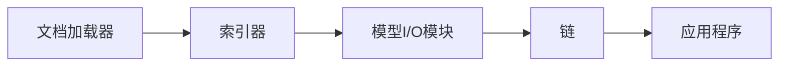

# 【LangChain编程：从入门到实践】模型I/O模块

## 1. 背景介绍
### 1.1 LangChain简介
LangChain是一个用于开发由语言模型驱动的应用程序的开源框架。它提供了一套工具和组件，可以轻松地将语言模型集成到应用程序中，实现各种自然语言处理任务，如问答、文本生成、文本摘要等。

### 1.2 模型I/O模块的作用
在LangChain中，模型I/O模块扮演着至关重要的角色。它负责处理语言模型的输入和输出，使得开发者能够方便地与语言模型进行交互。通过模型I/O模块，我们可以将文本数据传递给语言模型，并获取模型生成的输出结果。

### 1.3 本文的目的和结构
本文旨在深入探讨LangChain的模型I/O模块，帮助读者全面了解其核心概念、工作原理和实际应用。我们将从模型I/O模块的核心概念入手，介绍其与其他模块的关系，并详细讲解其算法原理和操作步骤。此外，我们还将通过数学模型和代码实例，加深读者对模型I/O模块的理解。最后，我们将探讨模型I/O模块在实际应用场景中的作用，并总结其未来发展趋势与挑战。

## 2. 核心概念与联系
### 2.1 Prompt模板
Prompt模板是模型I/O模块的核心概念之一。它定义了如何将输入数据格式化为语言模型可以理解和处理的形式。通过使用Prompt模板，我们可以将结构化的数据转换为自然语言文本，使得语言模型能够更好地理解和生成相关的输出。

### 2.2 LLM接口
LLM（Large Language Model）接口是模型I/O模块与语言模型进行交互的桥梁。它定义了与语言模型通信的标准方式，包括如何发送请求和接收响应。LangChain提供了多个LLM接口，如OpenAI、Hugging Face等，使得开发者可以轻松地与不同的语言模型进行集成。

### 2.3 输出解析器
输出解析器负责将语言模型生成的原始输出转换为结构化的数据格式。它定义了如何从文本中提取关键信息，并将其组织成易于处理和使用的形式。通过输出解析器，我们可以将语言模型的输出与下游任务无缝衔接，如数据存储、可视化等。

### 2.4 模型I/O模块与其他模块的关系
模型I/O模块与LangChain中的其他模块紧密相连，共同构建了一个完整的语言模型应用开发框架。它与文档加载器、索引器、链等模块协同工作，实现端到端的自然语言处理任务。下图展示了模型I/O模块在LangChain框架中的位置和与其他模块的关系：



## 3. 核心算法原理具体操作步骤
### 3.1 Prompt模板的构建
构建Prompt模板是使用模型I/O模块的第一步。我们需要定义一个模板，指定如何将输入数据格式化为语言模型可以处理的形式。以下是构建Prompt模板的具体步骤：

1. 确定输入数据的结构和格式。
2. 设计一个模板字符串，使用占位符表示输入数据的位置。
3. 将输入数据与模板字符串结合，生成最终的Prompt文本。

例如，假设我们有一个包含"name"和"age"字段的输入数据，我们可以定义以下Prompt模板：

```python
template = "你好，我叫{name}，今年{age}岁。"
```

然后，我们可以将具体的输入数据传递给模板，生成最终的Prompt文本：

```python
data = {"name": "张三", "age": 25}
prompt = template.format(**data)
# 输出：你好，我叫张三，今年25岁。
```

### 3.2 与语言模型的交互
一旦我们构建了Prompt模板，就可以使用LLM接口与语言模型进行交互。以下是与语言模型交互的具体步骤：

1. 选择合适的LLM接口，如OpenAI、Hugging Face等。
2. 配置LLM接口的认证信息，如API密钥。
3. 将Prompt文本传递给LLM接口，发送请求。
4. 接收语言模型返回的响应，获取生成的输出文本。

以下是使用OpenAI接口与GPT-3模型交互的示例代码：

```python
from langchain.llms import OpenAI

llm = OpenAI(openai_api_key="YOUR_API_KEY")
output = llm(prompt)
```

### 3.3 输出解析
在获取语言模型生成的输出文本后，我们需要使用输出解析器将其转换为结构化的数据格式。输出解析器的具体操作步骤如下：

1. 分析输出文本的结构和格式。
2. 定义一个解析函数，用于从输出文本中提取关键信息。
3. 将提取的信息组织成结构化的数据格式，如字典、列表等。

例如，假设语言模型生成的输出文本如下：

```
名字：李四
年龄：30岁
职业：教师
```

我们可以定义以下解析函数，将输出文本转换为结构化的数据：

```python
def parse_output(text):
    lines = text.strip().split("\n")
    data = {}
    for line in lines:
        key, value = line.split("：")
        data[key] = value
    return data

parsed_data = parse_output(output)
# 输出：{'名字': '李四', '年龄': '30岁', '职业': '教师'}
```

## 4. 数学模型和公式详细讲解举例说明
在模型I/O模块中，我们经常需要处理文本数据，并将其转换为数值表示。这里我们以TF-IDF（Term Frequency-Inverse Document Frequency）算法为例，详细讲解其数学模型和公式。

TF-IDF是一种用于评估词语在文档中重要性的统计方法。它考虑了词语在文档中的出现频率（TF）和在整个文档集合中的出现频率（IDF）。TF-IDF的计算公式如下：

$$
\text{TF-IDF}(t, d, D) = \text{TF}(t, d) \times \text{IDF}(t, D)
$$

其中，$t$ 表示词语，$d$ 表示单个文档，$D$ 表示整个文档集合。

TF（Term Frequency）表示词语 $t$ 在文档 $d$ 中的出现频率，计算公式为：

$$
\text{TF}(t, d) = \frac{\text{词语 $t$ 在文档 $d$ 中的出现次数}}{\text{文档 $d$ 中的总词数}}
$$

IDF（Inverse Document Frequency）表示词语 $t$ 在整个文档集合 $D$ 中的出现频率的倒数，计算公式为：

$$
\text{IDF}(t, D) = \log \frac{\text{文档集合 $D$ 中的总文档数}}{\text{包含词语 $t$ 的文档数} + 1}
$$

通过计算每个词语的TF-IDF值，我们可以评估其在文档中的重要性。TF-IDF值越高，表示词语在文档中的重要性越高，在整个文档集合中的区分度也越高。

举个例子，假设我们有以下两个文档：

- 文档1："The cat sat on the mat."
- 文档2："The dog lay on the rug."

我们要计算词语 "the" 在文档1中的TF-IDF值。

首先，计算TF值：
$$
\text{TF}(\text{"the"}, \text{文档1}) = \frac{2}{6} = 0.33
$$

然后，计算IDF值：
$$
\text{IDF}(\text{"the"}, D) = \log \frac{2}{2} = 0
$$

最后，计算TF-IDF值：
$$
\text{TF-IDF}(\text{"the"}, \text{文档1}, D) = 0.33 \times 0 = 0
$$

可以看出，尽管词语 "the" 在文档1中出现了两次，但由于它在整个文档集合中的出现频率很高，因此其TF-IDF值为0，表明它对文档1的重要性不高。

## 5. 项目实践：代码实例和详细解释说明
下面我们通过一个完整的代码实例，演示如何使用LangChain的模型I/O模块实现一个简单的问答应用。

```python
from langchain.prompts import PromptTemplate
from langchain.llms import OpenAI
from langchain.chains import LLMChain

# 定义Prompt模板
template = """
根据以下背景信息，请回答问题。

背景信息：
{context}

问题：{question}

回答：
"""

prompt = PromptTemplate(
    input_variables=["context", "question"],
    template=template,
)

# 配置OpenAI接口
llm = OpenAI(openai_api_key="YOUR_API_KEY")

# 创建LLMChain
chain = LLMChain(llm=llm, prompt=prompt)

# 定义背景信息和问题
context = "LangChain是一个用于开发由语言模型驱动的应用程序的开源框架。它提供了一套工具和组件，可以轻松地将语言模型集成到应用程序中，实现各种自然语言处理任务，如问答、文本生成、文本摘要等。"
question = "LangChain是什么？"

# 运行LLMChain，获取答案
answer = chain.run(context=context, question=question)

print(answer)
```

代码解释：

1. 我们首先定义了一个Prompt模板，用于将背景信息和问题格式化为语言模型可以处理的形式。模板中使用了`{context}`和`{question}`占位符，表示背景信息和问题的位置。

2. 然后，我们使用`PromptTemplate`类创建了一个Prompt对象，指定了输入变量和模板字符串。

3. 接下来，我们配置了OpenAI接口，传入了API密钥。这样我们就可以使用OpenAI提供的语言模型进行交互。

4. 我们创建了一个`LLMChain`对象，将之前定义的Prompt对象和OpenAI接口传递给它。`LLMChain`用于将Prompt模板与语言模型进行连接，实现端到端的问答功能。

5. 我们定义了背景信息和问题，并将它们传递给`LLMChain`的`run`方法。该方法会自动将背景信息和问题填充到Prompt模板中，然后将生成的Prompt文本发送给语言模型，获取生成的答案。

6. 最后，我们将获取到的答案打印出来。

通过这个简单的代码实例，我们演示了如何使用LangChain的模型I/O模块，结合Prompt模板和语言模型接口，实现一个基本的问答应用。

## 6. 实际应用场景
LangChain的模型I/O模块在实际应用中有广泛的应用场景。下面我们列举几个典型的应用案例：

### 6.1 智能客服
利用模型I/O模块，我们可以开发智能客服系统，自动回答用户的常见问题。通过定义合适的Prompt模板，将用户问题与知识库中的背景信息结合，生成准确且自然的回答，提高客服效率和用户满意度。

### 6.2 文本摘要
模型I/O模块可以用于自动生成文本摘要。给定一篇长文档，我们可以将其分割成多个部分，然后使用Prompt模板将每个部分的关键信息提取出来，最后将提取的信息组合成一个简洁的摘要。

### 6.3 数据增强
在机器学习任务中，数据增强是一种常用的技术，用于扩充训练数据集。通过模型I/O模块，我们可以根据现有的数据样本，生成更多的相似样本，从而提高模型的泛化能力和鲁棒性。

### 6.4 创意写作辅助
模型I/O模块还可以用于辅助创意写作。作家可以提供故事背景、人物设定等信息，然后利用语言模型生成相关的情节、对话等内容，激发创作灵感，加速写作进程。

## 7. 工具和资源推荐
以下是一些与LangChain模型I/O模块相关的实用工具和资源：

1. [LangChain官方文档](https://docs.langchain.com/)：提供了详尽的API文