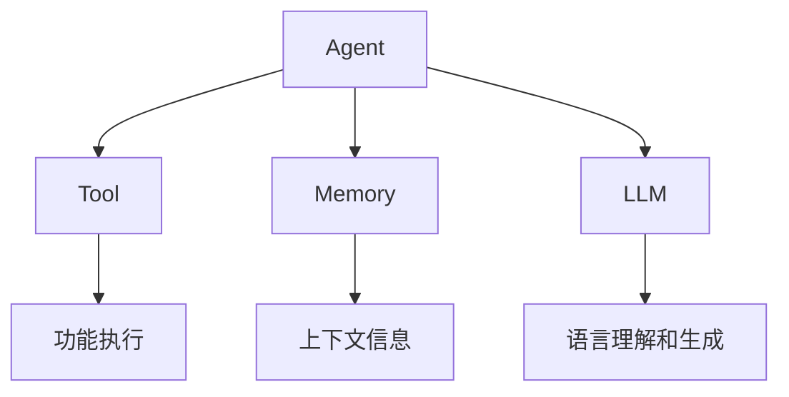

# 【LangChain编程：从入门到实践】管理工具安装

## 1.背景介绍

在当今数字时代,人工智能(AI)和自然语言处理(NLP)技术已经渗透到各个领域,为我们的生活和工作带来了前所未有的便利。作为一种新兴的编程范式,LangChain正在引领AI和NLP技术的发展潮流,为开发人员提供了一种全新的方式来构建智能应用程序。

LangChain是一个强大的Python库,旨在帮助开发人员轻松地构建基于AI的应用程序。它提供了一系列模块和工具,使开发人员能够快速集成各种语言模型、知识库和其他AI组件,从而创建出高度智能化和个性化的应用程序。无论是构建聊天机器人、智能助手还是自动化任务流程,LangChain都能为您提供强大的支持。

### 1.1 LangChain的优势

相比于传统的编程方式,LangChain具有以下几个显著优势:

1. **模块化设计**: LangChain采用了模块化的设计理念,将不同的功能组件进行了解耦,使得开发人员可以根据需求灵活地组合和扩展功能模块。

2. **高度可扩展性**: LangChain支持多种语言模型、知识库和AI服务,开发人员可以根据项目需求选择合适的组件,并且可以轻松地集成新的组件。

3. **简化开发流程**: LangChain提供了大量预构建的模块和工具,极大地简化了AI应用程序的开发流程,使开发人员能够更加专注于业务逻辑的实现。

4. **强大的生态系统**: LangChain拥有一个活跃的开源社区,不断有新的功能模块和工具被贡献和集成,为开发人员提供了丰富的资源和支持。

### 1.2 LangChain的应用场景

LangChain可以应用于多个领域,包括但不限于:

- **自然语言处理**: 构建智能聊天机器人、问答系统、文本摘要等应用程序。
- **知识管理**: 集成各种知识库,实现智能知识检索、知识图谱构建等功能。
- **任务自动化**: 利用LangChain构建智能工作流程,自动化重复性任务。
- **决策支持系统**: 通过集成各种AI模型和知识库,为决策过程提供智能支持。

## 2.核心概念与联系

在深入探讨LangChain的安装和使用之前,我们需要先了解一些核心概念和它们之间的联系。

### 2.1 Agent (智能代理)

Agent是LangChain中的一个核心概念,它代表一个具有特定功能的智能实体。Agent可以执行各种任务,如回答问题、生成文本、执行操作等。每个Agent都有一个关联的工具集(Tool),用于完成特定的任务。

### 2.2 Tool (工具)

Tool是LangChain中另一个重要的概念,它代表一个可执行的功能单元。每个Tool都有一个明确的用途,如搜索网页、调用API、执行数学计算等。Agent可以利用这些Tool来完成复杂的任务。

### 2.3 Memory (记忆)

Memory是LangChain中用于存储和管理上下文信息的组件。它允许Agent在执行任务时记住和利用之前的交互和结果,从而提高任务完成的连贯性和准确性。

### 2.4 LLM (大语言模型)

LLM(Large Language Model)是LangChain中的另一个核心概念,代表一个强大的语言模型,如GPT-3、BERT等。LangChain可以与各种LLM进行集成,利用它们的自然语言处理能力来驱动Agent的行为。

### 2.5 核心概念之间的关系

这些核心概念之间存在着密切的关系,它们共同构成了LangChain的核心架构。Agent利用LLM的语言理解和生成能力,结合Memory中的上下文信息,并通过调用各种Tool来完成复杂的任务。开发人员可以根据需求定制和组合这些组件,构建出高度智能化和个性化的应用程序。



## 3.核心算法原理具体操作步骤

LangChain的核心算法原理基于一种称为"代理人-工具"(Agent-Tool)的范式。该范式的基本思想是将复杂的任务分解为一系列较小的子任务,并将每个子任务分配给一个专门的工具(Tool)来执行。智能代理(Agent)负责协调和管理这些工具,以完成整个任务。

### 3.1 Agent-Tool范式的工作流程

1. **任务分解**: 当用户提出一个复杂的任务时,Agent会首先将其分解为一系列较小的子任务。

2. **工具选择**: 对于每个子任务,Agent会根据任务的性质选择合适的工具(Tool)来执行。

3. **工具执行**: 选定的工具会执行分配给它的子任务,并将结果返回给Agent。

4. **结果整合**: Agent会将来自各个工具的结果进行整合,形成对原始任务的解决方案。

5. **反馈与优化**: 在整个过程中,Agent会根据任务的进展情况和用户的反馈,动态调整工具的选择和使用策略,以优化任务执行的效率和质量。

这种"分而治之"的方法使得LangChain能够灵活地处理各种复杂的任务,同时也提高了系统的可扩展性和可维护性。开发人员可以根据需求添加或修改工具,而无需重新设计整个系统。

### 3.2 Agent-Tool范式的优势

采用Agent-Tool范式带来了以下几个主要优势:

1. **模块化设计**: 将功能划分为独立的工具(Tool),实现了代码的高度模块化,提高了可维护性和可扩展性。

2. **任务分解**: 通过将复杂任务分解为多个子任务,降低了单个组件的复杂性,提高了系统的稳定性和可靠性。

3. **灵活性**: 开发人员可以根据需求灵活地组合和替换工具,快速构建出满足特定需求的应用程序。

4. **可解释性**: 由于任务执行过程是透明的,用户可以清楚地了解系统是如何得出结果的,提高了系统的可解释性和可信度。

## 4.数学模型和公式详细讲解举例说明

虽然LangChain主要是一个基于规则和模板的系统,但在某些场景下,它也会利用数学模型和公式来优化任务执行的效率和质量。

### 4.1 语义相似度计算

在选择合适的工具(Tool)时,LangChain会根据任务的语义内容和工具的描述,计算它们之间的语义相似度。这个过程通常会借助于向量空间模型(Vector Space Model)和余弦相似度(Cosine Similarity)等数学模型和公式。

假设我们有一个任务描述向量$\vec{q}$和一个工具描述向量$\vec{t}$,它们的语义相似度可以用余弦相似度公式来计算:

$$\text{sim}(\vec{q}, \vec{t}) = \frac{\vec{q} \cdot \vec{t}}{||\vec{q}|| \times ||\vec{t}||}$$

其中$\vec{q} \cdot \vec{t}$表示两个向量的点积,而$||\vec{q}||$和$||\vec{t}||$分别表示向量$\vec{q}$和$\vec{t}$的范数(L2范数)。

相似度的取值范围是$[-1, 1]$,值越接近1,表示两个向量的方向越接近,语义相似度越高。Agent会选择与任务描述最相似的工具来执行该任务。

### 4.2 贝叶斯推理

在某些场景下,LangChain会利用贝叶斯推理(Bayesian Inference)来估计工具执行成功的概率,从而优化工具的选择策略。

假设我们有一个工具$T$,它的执行成功概率为$P(T=1)$,执行失败概率为$P(T=0)$。根据贝叶斯公式,我们可以计算在观察到某些证据$E$的情况下,工具执行成功的后验概率:

$$P(T=1|E) = \frac{P(E|T=1)P(T=1)}{P(E)}$$

其中$P(E|T=1)$是在工具执行成功的情况下观察到证据$E$的概率,称为似然函数(Likelihood)。$P(T=1)$是工具执行成功的先验概率,而$P(E)$是证据$E$的边缘概率,用于归一化。

通过不断更新工具的执行成功概率,Agent可以动态调整工具的选择策略,提高任务执行的整体效率和质量。

这些数学模型和公式为LangChain提供了强大的理论支持,使其能够更加智能和高效地完成各种复杂任务。

## 5.项目实践:代码实例和详细解释说明

在了解了LangChain的核心概念和原理之后,让我们通过一个实际的代码示例来深入探讨它的使用方法。

在这个示例中,我们将构建一个简单的问答系统,它可以从维基百科上搜索相关信息,并根据搜索结果回答用户的问题。

### 5.1 安装LangChain

首先,我们需要安装LangChain及其依赖项。您可以使用pip进行安装:

```bash
pip install langchain openai wikipedia
```

### 5.2 导入必要的模块

接下来,我们需要导入一些必要的模块:

```python
from langchain.agents import initialize_agent, Tool
from langchain.llms import OpenAI
from langchain.tools import WikipediaSearchRootTool
```

- `initialize_agent`用于初始化一个Agent
- `Tool`用于定义自定义工具
- `OpenAI`用于集成OpenAI的语言模型
- `WikipediaSearchRootTool`是一个预构建的工具,用于从维基百科搜索信息

### 5.3 定义工具

在这个示例中,我们将使用两个工具:维基百科搜索工具和一个自定义的分析工具。

```python
# 维基百科搜索工具
wiki_tool = WikipediaSearchRootTool()

# 自定义分析工具
class AnalyzeTool(Tool):
    name = "analyze"
    description = "分析给定的文本并提供相关见解"

    def _run(self, query):
        return "这是对给定文本的分析结果..."

    def _acrunch(self, response):
        return response
```

`AnalyzeTool`是一个自定义的工具,它接受一段文本作为输入,并返回对该文本的分析结果。在实际应用中,您可以在这里集成更复杂的分析算法和模型。

### 5.4 初始化Agent

接下来,我们需要初始化一个Agent,并为它提供工具集和语言模型。

```python
# 初始化语言模型
llm = OpenAI(temperature=0)

# 定义工具集
tools = [wiki_tool, AnalyzeTool()]

# 初始化Agent
agent = initialize_agent(tools, llm, agent="zero-shot-react-description", verbose=True)
```

在这个示例中,我们使用OpenAI的语言模型,并将维基百科搜索工具和自定义分析工具添加到工具集中。`initialize_agent`函数会根据提供的工具集和语言模型创建一个Agent实例。

### 5.5 与Agent交互

最后,我们可以与Agent进行交互,提出问题并获取回答。

```python
query = "什么是人工智能?"
result = agent.run(query)
print(result)
```

在执行`agent.run(query)`时,Agent会根据提供的问题选择合适的工具,并协调这些工具的执行以生成最终的回答。

在这个示例中,Agent可能会首先使用维基百科搜索工具查找与"人工智能"相关的信息,然后利用自定义分析工具对搜索结果进行分析和总结,最终生成对问题的回答。

通过这个简单的示例,我们可以看到LangChain如何简化了智能应用程序的开发过程。只需定义工具和提供语言模型,就可以快速构建出功能强大的问答系统。

## 6.实际应用场景

LangChain的应用场景非常广泛,它可以用于构建各种智能应用程序,包括但不限于:

### 6.1 智能助手和聊天机器人

利用LangChain