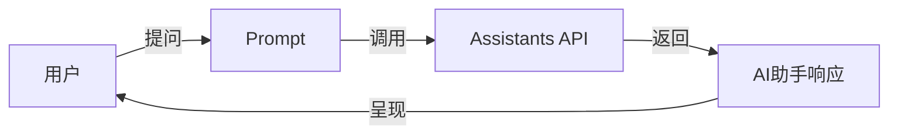

# 【大模型应用开发 动手做AI Agent】Assistants API的简单示例

## 1. 背景介绍

人工智能(AI)技术的快速发展正在深刻影响和改变着我们的生活和工作方式。大规模语言模型(Large Language Models, LLMs)的出现,使得构建智能对话AI助手(AI Agents)成为可能。本文将介绍如何利用OpenAI最新推出的Assistants API,快速开发一个简单的AI助手应用。通过本文,你将了解Assistants API的核心概念、使用方法,以及如何基于它构建实用的AI助手。

### 1.1 大语言模型(LLMs)概述
### 1.2 智能AI助手(AI Agents)的兴起  
### 1.3 OpenAI Assistants API简介

## 2. 核心概念与关联

要利用Assistants API开发AI助手,首先需要理解其中的一些核心概念:

### 2.1 Prompt工程
- 2.1.1 Prompt的作用与原理
- 2.1.2 设计优质Prompt的技巧

### 2.2 Assistants API接口
- 2.2.1 认证与安全
- 2.2.2 接口参数说明
- 2.2.3 接口返回格式

### 2.3 AI助手的交互模式
- 2.3.1 单轮对话模式
- 2.3.2 多轮对话模式
- 2.3.3 任务型交互模式

下面是Assistants API的工作原理示意图:



## 3. 核心算法原理与操作步骤

### 3.1 Assistants API的内部工作原理
- 3.1.1 基于Transformer架构的语言模型
- 3.1.2 自回归生成式文本生成
- 3.1.3 Few-shot Learning少样本学习

### 3.2 使用Assistants API的具体步骤
- 3.2.1 注册OpenAI账号,获取API Key  
- 3.2.2 安装openai Python库
- 3.2.3 构造Prompt并调用API生成回复
- 3.2.4 解析API返回结果,呈现给用户

## 4. 数学模型与公式详解

### 4.1 Transformer架构
Transformer是一种基于自注意力机制(Self-Attention)的序列到序列(Seq2Seq)模型。其中最核心的部件是多头注意力层(Multi-Head Attention):

$$
\text{MultiHead}(Q,K,V)=\text{Concat}(\text{head}_1,\ldots,\text{head}_h)W^O \\
\text{head}_i=\text{Attention}(QW_i^Q,KW_i^K,VW_i^V)
$$

其中$Q$,$K$,$V$分别表示查询(Query)、键(Key)、值(Value),$W^Q_i$,$W^K_i$,$W^V_i$,$W^O$为学习的权重矩阵。

### 4.2 自回归文本生成
Assistants API采用自回归(Auto-Regressive)方式进行文本生成。给定输入序列$X=(x_1,\ldots,x_T)$,语言模型的目标是最大化如下条件概率:

$$
p(X)=\prod_{t=1}^T p(x_t|x_1,\ldots,x_{t-1})
$$

其中$p(x_t|x_1,\ldots,x_{t-1})$表示在给定前$t-1$个token的条件下,第$t$个token为$x_t$的概率。生成时通过贪心搜索(Greedy Search)或采样(Sampling)的方式选择概率最大的token作为下一个生成结果。

## 5. 项目实践:代码示例与解释

下面通过一个简单的Python代码示例,演示如何调用Assistants API实现一个AI助手:

```python
import openai

openai.api_key = "YOUR_API_KEY"  # 替换为你的OpenAI API Key

def ask_assistant(prompt):
    response = openai.Completion.create(
        engine="text-davinci-003",  # 选择使用的语言模型
        prompt=prompt,
        max_tokens=1024,  # 生成回复的最大长度
        n=1,  # 生成的回复数量
        stop=None,  # 停止标记
        temperature=0.5,  # 控制生成文本的多样性
    )
    reply = response.choices[0].text.strip()
    return reply

while True:
    user_input = input("User: ")
    if user_input.lower() in ["bye", "goodbye", "exit", "quit"]:
        print("Assistant: Goodbye!")
        break
    
    prompt = f"User: {user_input}\nAssistant: "
    reply = ask_assistant(prompt)
    print(f"Assistant: {reply}")
```

这个示例代码主要流程如下:
1. 导入openai库,配置API Key
2. 定义ask_assistant函数,用于调用Assistants API生成回复
3. 进入一个交互循环,不断读取用户输入
4. 将用户输入构造为Prompt,调用ask_assistant函数获得AI助手的回复
5. 打印AI助手的回复,继续等待用户输入

通过这个简单的示例,我们就实现了一个基于Assistants API的AI助手应用。你可以根据实际需求,在此基础上进一步优化和扩展。

## 6. 实际应用场景

基于Assistants API构建的AI助手可以应用于多种场景,例如:

### 6.1 客服聊天机器人
- 6.1.1 自动回答常见问题
- 6.1.2 引导用户进行故障诊断与解决
- 6.1.3 提供个性化的服务建议

### 6.2 智能写作助手  
- 6.2.1 协助撰写文章、报告等
- 6.2.2 提供写作素材与思路
- 6.2.3 帮助改进文章结构与语言

### 6.3 代码智能生成
- 6.3.1 根据需求描述生成代码片段
- 6.3.2 提供编程问题解答与建议
- 6.3.3 协助进行代码重构与优化

## 7. 工具与资源推荐

### 7.1 OpenAI官方文档与资源
- OpenAI API文档: https://beta.openai.com/docs/
- OpenAI Playground: https://beta.openai.com/playground

### 7.2 相关开源项目
- LangChain: 一个基于LLMs的应用开发框架
- DALL·E Flow: 一个易用的DALL·E图像生成UI
- ChatGPT-wrapper: 一个基于ChatGPT的Python封装库

### 7.3 其他学习资源
- 吴恩达《ChatGPT Prompt Engineering》课程
- 《Prompt编写指南》中文版

## 8. 总结:未来发展趋势与挑战

### 8.1 AI助手的发展趋势
- 8.1.1 更加个性化与智能化
- 8.1.2 多模态交互能力增强
- 8.1.3 垂直领域的专业化助手

### 8.2 面临的挑战
- 8.2.1 数据隐私与安全问题
- 8.2.2 模型的可解释性与可控性
- 8.2.3 道德伦理风险防范

### 8.3 总结与展望
Assistants API为快速构建AI助手应用提供了便利。随着大语言模型和相关技术的不断进步,AI助手必将变得更加智能和强大。同时,我们也要审慎地看待其中的挑战与风险,在发展中寻求平衡。相信在不久的将来,AI助手将成为人们生活和工作中不可或缺的得力助手。

## 9. 附录:常见问题解答

### 9.1 Assistants API的调用次数和费用是如何计算的?
Assistants API按照输入的token数和生成的token数收费。你可以在OpenAI官网上查看最新的定价信息。

### 9.2 如何选择适合自己应用场景的语言模型?
OpenAI提供了多种语言模型供选择,如Davinci、Curie、Babbage等。一般来说,Davinci性能最好,但也最昂贵。你可以根据应用需求和预算,选择合适的模型。

### 9.3 在调用Assistants API时,如何控制生成文本的多样性?
可以通过调节temperature参数来控制生成文本的多样性。temperature值越高,生成的文本就越多样化;temperature值越低,生成的文本就越保守和确定性。

### 9.4 使用Assistants API需要注意哪些限制和约束?
使用Assistants API时,需要遵守OpenAI的使用条款和内容政策。禁止生成非法、有害、歧视性等内容。同时,也要注意不要过度依赖API,以免超出调用限额。

以上就是关于如何利用OpenAI Assistants API开发一个简单AI助手应用的全部内容。相信通过本文的学习和示例的指引,你已经掌握了Assistants API的基本用法。在实践中不断探索和创新,你就能打造出更加智能和实用的AI助手应用。让我们携手共进,一起推动人工智能技术造福人类社会。

作者：禅与计算机程序设计艺术 / Zen and the Art of Computer Programming