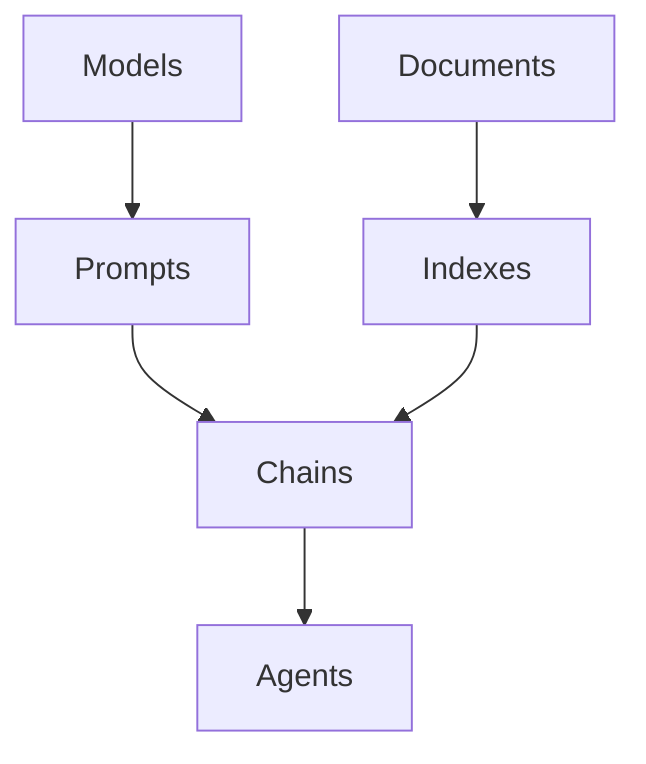

# 【大模型应用开发 动手做AI Agent】LangChain中的六大模块

## 1. 背景介绍

近年来，随着人工智能技术的飞速发展，大语言模型（Large Language Models, LLMs）如ChatGPT、GPT-4等的出现，为自然语言处理（NLP）领域带来了革命性的变化。这些大模型展现出了惊人的语言理解和生成能力，使得构建智能对话系统、知识问答系统等AI应用成为可能。

然而，仅仅依靠大模型本身还不足以构建完整的AI应用。我们还需要一系列工具和框架，来帮助我们更高效地开发、集成和部署基于大模型的应用。而LangChain正是这样一个为LLM应用开发而生的强大工具链。

### 1.1 什么是LangChain？

LangChain是一个基于Python的框架，旨在帮助开发者更容易地构建基于LLM的应用程序。它提供了一系列工具和组件，用于与LLM进行交互、集成外部数据源、管理对话状态等，使得开发者可以快速搭建智能对话机器人、问答系统、数据分析工具等AI应用。

### 1.2 LangChain的优势

- 提供了统一的接口来集成各种LLM模型，如OpenAI GPT系列、Anthropic Claude、Cohere等。
- 支持加载和查询外部数据源，如文档、网页、数据库等，增强LLM的知识和问答能力。
- 内置了对话管理和状态跟踪机制，方便构建多轮对话应用。
- 提供了Prompt模板和Chains等组件，帮助构建复杂的应用逻辑。
- 支持LLM应用的模块化开发，提高了代码的可读性和可维护性。

## 2. 核心概念与联系

要熟练运用LangChain进行开发，我们需要了解其中的几个核心概念：

### 2.1 Models（模型）

Models指的是LangChain所集成的各种语言模型，如OpenAI GPT系列、Anthropic Claude、Cohere等。LangChain通过统一的接口来封装不同的LLM服务，使得我们可以方便地调用它们的API进行文本生成、对话、问答等任务。

### 2.2 Prompts（提示）

Prompts是指我们在调用LLM时所输入的文本，它包含了任务指令、上下文信息、输入数据等内容。设计好的Prompt可以引导模型生成我们期望的输出。LangChain提供了一系列Prompt管理工具，帮助我们更系统地组织和优化Prompt。

### 2.3 Documents（文档）

Documents指的是我们希望LLM所学习和利用的外部数据源，如文本文件、网页、PDF等非结构化数据，或者数据库等结构化数据。LangChain提供了一系列工具来加载、分割、嵌入这些文档，使其可以被LLM高效地查询和利用。

### 2.4 Indexes（索引）

Indexes是由Documents构建的数据结构，可以帮助我们更高效地检索和查询相关文档。常见的索引结构有向量数据库、键值对存储等。LangChain集成了一些常用的索引工具，如Chroma、FAISS等。

### 2.5 Chains（链）

Chains是由一系列组件按特定逻辑串联而成的管道，用于描述LLM应用的执行逻辑。常见的Chain有LLMChain、SequentialChain等。通过组合不同的组件，我们可以构建出适合特定任务的Chain。

### 2.6 Agents（代理）

Agents是LangChain中的高阶抽象，它封装了由LLM驱动的、可以执行特定任务的智能体。Agent可以根据Prompt动态生成执行计划，并调用一系列工具来完成任务，如信息检索、计算、API调用等。

下面是这些概念之间的联系：



## 3. 核心算法原理具体操作步骤

### 3.1 LLM调用流程

1. 选择合适的LLM服务商和模型，如OpenAI的GPT-3.5-turbo。
2. 设置API密钥和端点。
3. 准备输入Prompt，可以使用LangChain的PromptTemplate来管理Prompt。
4. 调用LLM的API接口，传入Prompt，获取生成结果。
5. 对生成结果进行后处理，如截断、格式化等。

### 3.2 构建索引流程

1. 加载原始文档数据，可以使用LangChain的TextLoader等工具。
2. 对文档进行预处理，如分割成段落、去除停用词等。
3. 选择合适的嵌入模型，如OpenAI的text-embedding-ada-002，将文档转换为向量表示。
4. 选择合适的索引结构，如Chroma向量数据库，将向量存入索引。
5. 对索引进行相关性查询，获取与查询最相关的文档。

### 3.3 搭建Chain流程

1. 确定Chain的输入输出数据格式。
2. 选择合适的组件，如LLM、Prompt、索引等，将它们按执行逻辑串联起来。
3. 在组件之间传递中间变量，构建上下文信息。
4. 运行Chain，调试并优化组件参数。
5. 将Chain封装成可复用的模块。

### 3.4 开发Agent流程

1. 定义Agent的目标任务和可用工具。
2. 选择合适的LLM和Prompt，构建Agent的决策逻辑。
3. 实现Agent的工具函数，如信息检索、计算、API调用等。
4. 运行Agent，通过Prompt引导其生成执行计划。
5. 解析执行计划，调用相应的工具函数完成任务。
6. 将Agent的执行结果返回给用户。

## 4. 数学模型和公式详细讲解举例说明

### 4.1 文本嵌入模型

LangChain常用的文本嵌入模型是OpenAI的text-embedding-ada-002，它基于transformer架构，使用自注意力机制和前馈神经网络来学习文本的分布式表示。

给定一个文本序列$\mathbf{x}=(x_1,\dots,x_n)$，模型首先将其转换为词嵌入向量$\mathbf{e}=(e_1,\dots,e_n)$，然后通过多层自注意力机制和前馈网络来提取序列的上下文信息，得到最终的文本嵌入向量$\mathbf{z}$：

$$
\begin{aligned}
\mathbf{e} &= \text{Embedding}(\mathbf{x}) \\
\mathbf{h}_0 &= \mathbf{e} \\
\mathbf{h}_l &= \text{Transformer}(\mathbf{h}_{l-1}), l=1,\dots,L \\
\mathbf{z} &= \text{Pooling}(\mathbf{h}_L)
\end{aligned}
$$

其中$L$为transformer的层数，$\text{Pooling}$可以是平均池化或最大池化等操作。

### 4.2 向量相似度计算

在构建索引和进行相关性查询时，我们需要计算两个向量之间的相似度。常用的相似度度量有欧氏距离、余弦相似度等。

假设有两个$d$维向量$\mathbf{u}=(u_1,\dots,u_d)$和$\mathbf{v}=(v_1,\dots,v_d)$，它们的欧氏距离为：

$$
\text{dist}(\mathbf{u},\mathbf{v})=\sqrt{\sum_{i=1}^d(u_i-v_i)^2}
$$

它们的余弦相似度为：

$$
\text{sim}(\mathbf{u},\mathbf{v})=\frac{\mathbf{u}\cdot\mathbf{v}}{\|\mathbf{u}\|\|\mathbf{v}\|}=\frac{\sum_{i=1}^du_iv_i}{\sqrt{\sum_{i=1}^du_i^2}\sqrt{\sum_{i=1}^dv_i^2}}
$$

余弦相似度的取值范围为$[-1,1]$，值越大表示两个向量越相似。

## 5. 项目实践：代码实例和详细解释说明

下面我们通过一个简单的例子，来演示如何使用LangChain构建一个基于文档问答的应用。

### 5.1 环境准备

首先安装所需的Python库：

```bash
pip install langchain openai chromadb tiktoken
```

### 5.2 加载文档并构建索引

```python
from langchain.document_loaders import TextLoader
from langchain.text_splitter import CharacterTextSplitter
from langchain.embeddings import OpenAIEmbeddings
from langchain.vectorstores import Chroma

# 加载文本文件
loader = TextLoader('input.txt')
documents = loader.load()

# 将文档分割成段落
text_splitter = CharacterTextSplitter(chunk_size=1000, chunk_overlap=0)
docs = text_splitter.split_documents(documents)

# 将文档转换为向量
embeddings = OpenAIEmbeddings()

# 将向量存入Chroma数据库
db = Chroma.from_documents(docs, embeddings)
```

这段代码首先加载了一个文本文件，并将其分割成多个段落。然后使用OpenAI的嵌入模型将每个段落转换为向量，并存入Chroma向量数据库中。

### 5.3 构建问答Chain

```python
from langchain.chains import RetrievalQA
from langchain.llms import OpenAI

# 初始化问答Chain
qa = RetrievalQA.from_chain_type(
    llm=OpenAI(), 
    chain_type="stuff", 
    retriever=db.as_retriever()
)
```

这里我们使用`RetrievalQA`来构建一个问答Chain，它封装了查询索引、调用LLM生成答案等步骤。我们选择`stuff`这种Chain类型，它会将查询到的相关文档拼接成一个上下文，然后一次性传给LLM生成答案。

### 5.4 执行问答

```python
query = "请问本文讲了什么？"
result = qa.run(query)
print(result)
```

最后，我们输入一个问题，调用Chain的`run`方法，即可得到生成的答案。

## 6. 实际应用场景

LangChain可以用于构建各种基于LLM的应用，如：

- 智能客服机器人：通过接入产品手册、FAQ等数据，回答用户的各种咨询问题。
- 个人助理：通过访问日历、邮件、笔记等数据，帮助用户自动安排行程、回复邮件、总结会议等。  
- 智能搜索引擎：通过对网页、文档等数据建立索引，根据用户的自然语言查询给出最相关的搜索结果。
- 数据分析助手：通过对接各种数据源，使用LLM生成数据分析报告、洞察建议等。
- 代码辅助工具：通过学习编程语言的语法和API文档，辅助用户编写和调试代码。

## 7. 工具和资源推荐

- [LangChain官方文档](https://python.langchain.com/)：提供了详尽的教程、API文档和应用示例。
- [OpenAI官网](https://openai.com/)：申请API密钥，查阅各种模型的文档。
- [Anthropic官网](https://www.anthropic.com/)：申请API密钥，使用Claude模型。
- [Chroma向量数据库](https://www.trychroma.com/)：一个面向LLM应用的高性能向量数据库。
- [LlamaIndex](https://github.com/jerryjliu/llama_index)：另一个类似LangChain的LLM应用开发工具包。

## 8. 总结：未来发展趋势与挑战

LangChain正处于快速发展的早期阶段，它为LLM应用开发提供了一套灵活、易用的工具，大大降低了开发门槛。未来随着LLM的不断发展，LangChain有望成为构建智能应用的标准工具链。

但同时，我们也要看到一些挑战：
- 提示工程的艺术：如何设计出高质量的Prompt来引导LLM生成我们期望的结果，需要大量的实践和经验积累。
- 数据安全和隐私：在使用LLM处理敏感数据时，如何确保数据不会泄露，是一个需要重视的问题。
- LLM的性能和成本：目前LLM的推理速度和成本还不够理想，这限制了一些实时交互场景的应用。

相信随着技术的进步，这些挑战都会得到解决。LangChain作为连接LLM和应用的桥梁，必将在智能应用的开发中扮演越来越重