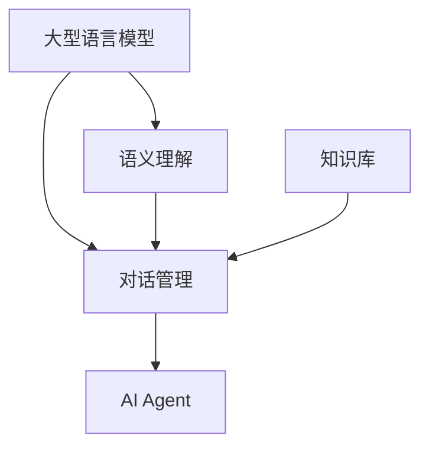

# 【大模型应用开发 动手做AI Agent】LangSmith的使用方法

## 1. 背景介绍

随着人工智能技术的不断发展,大型语言模型(Large Language Model,LLM)已经成为当前最受关注的AI技术之一。这些模型通过在海量文本数据上进行预训练,能够掌握丰富的自然语言知识,并具备出色的文本生成、问答、总结等能力。

LangSmith是一款基于大型语言模型的开发工具,旨在帮助开发者更高效地开发AI Agent。它提供了一个直观的可视化界面,集成了多种大型语言模型,并支持通过简单的配置和编程来定制Agent的行为。

### 1.1 大型语言模型的优势

大型语言模型的出现解决了传统自然语言处理(NLP)系统面临的一些关键挑战:

- **知识覆盖广泛**: 通过在海量文本数据上预训练,大型语言模型掌握了丰富的自然语言知识,涵盖了各个领域的内容。
- **上下文理解能力强**: 大型语言模型能够有效捕捉文本中的上下文信息,更好地理解语义。
- **生成性能力出色**: 大型语言模型能够生成流畅、连贯的自然语言文本,为构建对话系统等应用提供了有力支持。

### 1.2 AI Agent的应用场景

AI Agent是一种基于自然语言交互的智能系统,可以应用于多个领域,例如:

- **智能助手**: 提供个性化的问答、任务管理等服务。
- **客户服务**: 自动化处理客户咨询和投诉。
- **教育辅助**: 作为虚拟导师,提供个性化的学习指导。
- **医疗保健**: 辅助医生进行病情诊断和治疗方案制定。
- **游戏和娱乐**: 创建具有自然语言交互能力的虚拟角色。

## 2. 核心概念与联系

在使用LangSmith开发AI Agent之前,需要了解一些核心概念及其之间的联系。

### 2.1 大型语言模型

大型语言模型是LangSmith的核心组件,它是一种基于深度学习的自然语言处理模型。常见的大型语言模型包括:

- **GPT(Generative Pre-trained Transformer)**: 由OpenAI开发,是一种基于Transformer架构的生成式预训练模型。
- **BERT(Bidirectional Encoder Representations from Transformers)**: 由Google开发,是一种双向编码器表示,适用于各种自然语言处理任务。
- **XLNet**: 由Carnegie Mellon University和Google Brain开发,是一种改进的自回归语言模型。

这些模型通过在海量文本数据上进行预训练,获得了丰富的语言知识和强大的生成能力。

### 2.2 语义理解

语义理解是指理解自然语言输入的实际含义,而不仅仅是字面意思。这是构建AI Agent的关键能力之一。

LangSmith利用大型语言模型的上下文理解能力,结合一些特定的语义理解技术,如实体识别、关系抽取等,来提高对自然语言输入的理解水平。

### 2.3 对话管理

对话管理是指控制与用户的对话流程,包括理解用户输入、生成响应、跟踪对话状态等。

在LangSmith中,对话管理由一个可配置的对话流程引擎来实现。开发者可以定义对话流程的状态转移规则,以及在每个状态下Agent的响应行为。

### 2.4 知识库集成

为了增强AI Agent的知识水平,LangSmith支持将外部知识库与大型语言模型相结合。常见的知识库类型包括:

- **结构化知识库**: 如关系数据库、知识图谱等。
- **非结构化知识库**: 如维基百科、文档集等。

通过知识库集成,AI Agent可以获取更准确、更专业的知识,提高对话质量。

### 2.5 核心概念关系

上述核心概念之间的关系如下所示:



- 大型语言模型为语义理解和对话管理提供基础能力支持。
- 语义理解和知识库为对话管理提供信息输入。
- 对话管理整合上述各个部分,构建出最终的AI Agent。

## 3. 核心算法原理具体操作步骤

LangSmith的核心算法原理包括以下几个方面:

### 3.1 语义理解

语义理解主要依赖于大型语言模型的上下文理解能力,同时结合了一些特定的NLP技术,如命名实体识别、关系抽取等。

具体操作步骤如下:

1. **输入处理**: 对用户输入的自然语言文本进行标准化处理,如分词、词性标注等。
2. **实体识别**: 利用命名实体识别(NER)算法识别出文本中的实体,如人名、地名、组织机构名等。
3. **关系抽取**: 利用关系抽取算法识别出实体之间的语义关系,如"工作于"、"位于"等。
4. **上下文编码**: 将处理后的文本输入到大型语言模型,获取上下文语义表示。
5. **语义解析**: 将实体、关系信息与上下文语义表示相结合,构建出对输入文本的语义解析结果。

### 3.2 对话管理

对话管理的核心是一个基于状态机的对话流程引擎。每个对话状态都定义了一组规则,指定在该状态下Agent的响应行为。

具体操作步骤如下:

1. **初始化**: 创建对话会话,设置初始状态。
2. **输入处理**: 对用户输入进行语义理解,获取语义解析结果。
3. **状态转移**: 根据当前状态和语义解析结果,确定下一个对话状态。
4. **响应生成**: 在新状态下,根据配置的规则生成Agent的响应。
5. **状态更新**: 更新对话状态,并持久化会话信息。
6. **输出响应**: 将生成的响应返回给用户。

### 3.3 知识库集成

知识库集成的目标是将外部知识源与大型语言模型相结合,提高Agent的知识水平。

具体操作步骤如下:

1. **知识库连接**: 建立与结构化或非结构化知识库的连接。
2. **知识检索**: 根据对话上下文,在知识库中检索相关知识。
3. **知识编码**: 将检索到的知识转换为大型语言模型可理解的表示形式。
4. **知识融合**: 将知识编码与原始语义表示相结合,获取增强后的上下文表示。
5. **响应生成**: 利用增强后的上下文表示,生成包含知识信息的响应。

## 4. 数学模型和公式详细讲解举例说明

大型语言模型的核心是基于Transformer架构的自注意力机制。自注意力机制能够有效捕捉输入序列中任意两个位置之间的依赖关系,从而更好地建模长距离依赖。

### 4.1 自注意力机制

自注意力机制的计算过程可以用下面的公式表示:

$$
\begin{aligned}
\text{Attention}(Q, K, V) &= \text{softmax}\left(\frac{QK^T}{\sqrt{d_k}}\right)V \\
\text{MultiHead}(Q, K, V) &= \text{Concat}(head_1, \ldots, head_h)W^O\\
\text{where } head_i &= \text{Attention}(QW_i^Q, KW_i^K, VW_i^V)
\end{aligned}
$$

其中:

- $Q$、$K$、$V$分别表示查询(Query)、键(Key)和值(Value)。
- $d_k$是缩放因子,用于防止点积过大导致梯度消失。
- $W_i^Q$、$W_i^K$、$W_i^V$和$W^O$是可学习的权重矩阵。

多头自注意力机制(Multi-Head Attention)将注意力分成多个子空间,每个子空间单独计算注意力,然后将结果拼接起来,从而捕捉不同的依赖关系。

### 4.2 Transformer架构

Transformer是一种全新的序列到序列(Seq2Seq)模型架构,它完全基于自注意力机制,不需要循环神经网络(RNN)或卷积神经网络(CNN)。

Transformer的编码器(Encoder)和解码器(Decoder)结构如下所示:


- Embedding层将输入序列转换为向量表示。
- Multi-Head Attention层捕捉序列中元素之间的依赖关系。
- Feed Forward层对每个位置的表示进行非线性变换。
- Add & Norm层进行残差连接和层归一化,stabilize训练过程。

通过堆叠多个这样的编码器/解码器块,Transformer能够学习到强大的序列表示能力。

### 4.3 BERT模型

BERT(Bidirectional Encoder Representations from Transformers)是一种基于Transformer的双向编码器模型,在自然语言处理任务上取得了卓越的成绩。

BERT的核心创新是引入了"掩码语言模型"(Masked Language Model)的预训练任务,它的目标是基于上下文预测被掩码的单词。这种双向预训练方式使得BERT能够更好地捕捉上下文信息。

BERT的预训练过程包括两个任务:

1. **掩码语言模型(Masked LM)**: 随机掩码输入序列中的一些单词,模型需要基于上下文预测被掩码的单词。
2. **下一句预测(Next Sentence Prediction)**: 判断两个句子是否相邻,以捕捉句子之间的关系。

通过在大规模语料库上进行预训练,BERT获得了强大的语言表示能力,可以广泛应用于各种自然语言处理任务。

## 5. 项目实践:代码实例和详细解释说明

接下来,我们将通过一个简单的示例项目,演示如何使用LangSmith开发一个基本的AI Agent。

### 5.1 安装LangSmith

首先,我们需要安装LangSmith库:

```bash
pip install langsmith
```

### 5.2 导入依赖

在Python代码中,导入所需的依赖:

```python
from langsmith import Agent, ConversationManager
from langsmith.skills import PatternSkill
```

- `Agent`是LangSmith中表示AI Agent的核心类。
- `ConversationManager`用于管理对话流程。
- `PatternSkill`是一种基于模式匹配的技能,可以定义Agent的响应行为。

### 5.3 定义对话技能

我们定义一个简单的问候技能,当用户输入"你好"时,Agent会回复"你好"。

```python
greeting_skill = PatternSkill(
    name="greeting",
    patterns=["你好"],
    response="你好!",
    description="A simple greeting skill"
)
```

### 5.4 创建Agent实例

接下来,我们创建一个Agent实例,并为它添加上面定义的问候技能。

```python
agent = Agent(
    name="MyAgent",
    skills=[greeting_skill],
    conversation_manager=ConversationManager()
)
```

### 5.5 与Agent对话

现在,我们可以与Agent进行对话了。Agent会根据用户输入匹配相应的技能,并生成响应。

```python
while True:
    user_input = input("You: ")
    response = agent.get_response(user_input)
    print(f"Agent: {response}")
```

运行上述代码,当输入"你好"时,Agent会回复"你好!"。

```
You: 你好
Agent: 你好!
You: 
```

这只是一个非常简单的示例,在实际开发中,我们可以定义更复杂的技能,集成大型语言模型和知识库,从而构建出功能更加强大的AI Agent。

## 6. 实际应用场景

LangSmith可以应用于多个领域,构建各种类型的AI Agent。下面是一些典型的应用场景:

### 6.1 智能助手

智能助手是AI Agent的一个主要应用场景。LangSmith可以帮助开发具有自然语言交互能力的个人助手,提供问答服务、任务管理、信息查询等功能。

例如,我们可以开发一个家庭助手,用于控制智