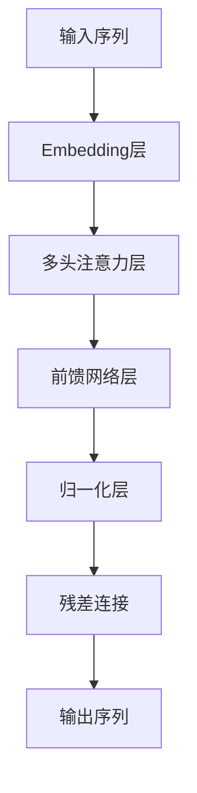

# 【大模型应用开发 动手做AI Agent】不调用Function，直接运行助手

## 1.背景介绍

### 1.1 人工智能发展历程

人工智能(Artificial Intelligence, AI)是当代科技发展的前沿领域,自20世纪50年代诞生以来,已经经历了几个重要的发展阶段。早期的人工智能系统主要基于规则和逻辑推理,如专家系统、决策树等。随着大数据和计算能力的提升,机器学习算法开始占据主导地位,如支持向量机、随机森林等。近年来,深度学习技术的兴起,尤其是transformer模型的出现,使得人工智能系统在自然语言处理、计算机视觉等领域取得了突破性进展。

### 1.2 大模型的兴起

大模型(Large Language Model, LLM)是指具有数十亿甚至上百亿参数的大型神经网络模型,通过对海量文本数据进行预训练而获得通用的语言理解和生成能力。代表性的大模型有GPT-3、PaLM、ChatGPT等。大模型不仅在自然语言处理任务上表现出色,而且展现出了一定的推理、归纳和迁移能力,可以解决一些看似超出训练数据范畴的问题。

### 1.3 大模型应用前景

大模型在多个领域展现出巨大的应用潜力,如智能问答、文本摘要、代码生成、内容创作等。通过对大模型进行指令精调(Instruction Tuning)或少量数据精调(Few-shot Learning),可以赋予大模型特定的功能。此外,大模型还可以作为知识库或语义引擎,为其他AI系统提供语义理解和生成服务。未来,大模型可能会成为通用人工智能(AGI)的重要基础组件。

## 2.核心概念与联系

### 2.1 Transformer模型

Transformer是一种全新的基于注意力机制(Attention Mechanism)的神经网络架构,不同于传统的循环神经网络(RNN)和卷积神经网络(CNN)。它通过自注意力(Self-Attention)机制来捕获输入序列中任意两个位置之间的关系,极大提高了并行计算能力。Transformer模型最早被应用于机器翻译任务,后来也广泛用于其他自然语言处理任务。

### 2.2 预训练与微调

预训练(Pre-training)是指在大规模无标注数据上训练神经网络模型,使其学习通用的语言表示。常用的预训练目标包括掩码语言模型(Masked Language Modeling)和下一句预测(Next Sentence Prediction)等。经过预训练后,模型可以获得初始的语义理解能力。

微调(Fine-tuning)是指在特定的有标注数据集上,对预训练模型进行进一步的训练和调整,使其适应特定的下游任务。微调过程中,模型的大部分参数保持不变,只对最后几层的参数进行调整。

### 2.3 指令精调

指令精调(Instruction Tuning)是一种新型的大模型调优方法,通过构造指令数据集(Instruction Dataset),对预训练模型进行少量数据微调,使模型能够理解和执行各种指令。指令数据集包含多个任务类型,每个任务类型由一个指令(Instruction)和多个输入-输出示例对(Input-Output Pairs)组成。经过指令精调后,大模型可以根据给定的指令生成相应的输出。

### 2.4 少量学习

少量学习(Few-shot Learning)是指仅使用少量标注数据就能完成特定任务的能力。大模型通过预训练获得了通用的语言理解能力,因此在微调时只需要少量的示例数据就可以快速适应新的任务。这种能力使得大模型可以快速迁移到新的领域,减少了数据标注的成本。

### 2.5 语义搜索

语义搜索(Semantic Search)是指根据查询的语义含义而非关键词去检索相关信息。传统的关键词搜索只能匹配文本中的字面词语,而语义搜索则能够深入理解查询的意图,从而提供更加准确和相关的搜索结果。大模型的强大语义理解能力使其成为语义搜索的理想选择。

## 3.核心算法原理具体操作步骤

### 3.1 Transformer模型架构

Transformer模型主要由编码器(Encoder)和解码器(Decoder)两部分组成。编码器将输入序列映射为语义表示,解码器则根据语义表示生成输出序列。

1. **Embedding层**:将输入序列的词元(Token)映射为低维稠密向量表示。

2. **多头注意力层**:通过自注意力机制,计算序列中每个位置与其他位置的关系得分,并根据关系得分对序列进行加权求和,生成新的序列表示。

3. **前馈网络层**:对每个位置的向量表示进行全连接的非线性变换,捕获更高层次的特征。

4. **归一化层**:对向量进行归一化,加速收敛。

5. **残差连接**:将输入向量与变换后的向量相加,防止信息损失。

编码器和解码器都由上述几个子层组成,不同之处在于解码器还引入了编码器-解码器注意力机制,使得解码器在生成序列时可以参考编码器的输出。

### 3.2 预训练方法

常见的预训练目标包括:

1. **掩码语言模型(Masked Language Modeling, MLM)**: 随机将输入序列中的部分词元用特殊的[MASK]标记替换,模型需要预测被掩码的词元。

2. **下一句预测(Next Sentence Prediction, NSP)**: 给定两个句子A和B,模型需要预测B是否为A的下一句。

3. **替换词语预测(Replaced Token Detection, RTD)**: 随机将输入序列中的部分词元替换为其他词元,模型需要预测被替换的词元。

4. **序列到序列预训练(Sequence-to-Sequence Pre-training)**: 在编码器输入一个序列,在解码器预测另一个相关的序列。

预训练通常采用自监督学习方式,在大规模无标注语料库上最大化模型对掩码词元或下一个序列的预测概率。

### 3.3 微调流程

微调的基本流程如下:

1. **准备微调数据集**: 针对特定的下游任务,构建包含输入-输出示例对的数据集。

2. **设置微调超参数**: 如学习率、批量大小、训练轮数等。

3. **初始化模型参数**: 使用预训练模型的参数作为初始值。

4. **计算损失函数**: 根据模型在微调数据集上的预测结果和标签,计算损失函数值。

5. **反向传播和参数更新**: 计算损失函数关于模型参数的梯度,并使用优化器(如Adam)更新模型参数。

6. **模型评估**: 在验证集上评估模型性能,选择最优模型保存。

7. **模型部署**: 将微调后的模型应用于实际任务。

通常只需要对预训练模型的最后几层参数进行微调,其余大部分参数保持不变。

### 3.4 指令精调步骤

指令精调的关键步骤包括:

1. **构建指令数据集**: 为每个任务类型编写一个指令,并收集一定数量的输入-输出示例对。

2. **标注指令数据集**: 人工标注每个示例对是否满足指令的要求。

3. **数据预处理**: 将指令和输入序列拼接,作为模型的输入;将输出作为模型的标签。

4. **微调模型**: 在指令数据集上微调预训练模型的部分参数。

5. **模型评估**: 在保留的测试集上评估模型性能。

6. **模型部署**: 将精调后的模型应用于实际场景,根据给定的指令生成所需的输出。

指令精调的优点是能够快速赋予大模型执行新任务的能力,而无需从头开始训练模型。

### 3.5 少量学习范式

少量学习通常采用的范式包括:

1. **One-shot Learning**: 仅给出一个示例输入-输出对,模型需要推广到新的输入。

2. **Few-shot Learning**: 给出少量(如5~20个)示例输入-输出对,模型需要学习并推广。

3. **Zero-shot Learning**: 不给出任何示例,模型需要直接根据指令或任务描述生成输出。

少量学习的基本流程为:

1. **构建支持集(Support Set)**: 包含少量示例输入-输出对的数据集。

2. **构建查询集(Query Set)**: 包含新的输入样本,需要模型生成相应的输出。

3. **模型推理**: 模型根据支持集中的示例,对查询集中的输入进行推理和生成。

4. **模型评估**: 将模型在查询集上的输出与标签进行比较,计算性能指标。

少量学习利用了大模型强大的迁移和泛化能力,使其能够快速适应新的任务。

## 4.数学模型和公式详细讲解举例说明

### 4.1 Transformer中的注意力机制

注意力机制是Transformer模型的核心,它能够捕获输入序列中任意两个位置之间的关系。给定一个查询向量$\boldsymbol{q}$和一组键值对$\{(\boldsymbol{k}_i, \boldsymbol{v}_i)\}_{i=1}^n$,注意力机制的计算过程如下:

$$\begin{aligned}
\text{Attention}(\boldsymbol{q}, \boldsymbol{K}, \boldsymbol{V}) &= \text{softmax}\left(\frac{\boldsymbol{q}\boldsymbol{K}^\top}{\sqrt{d_k}}\right)\boldsymbol{V} \\
&= \sum_{i=1}^n \alpha_i \boldsymbol{v}_i
\end{aligned}$$

其中,$\boldsymbol{K} = [\boldsymbol{k}_1, \boldsymbol{k}_2, \ldots, \boldsymbol{k}_n]$是键矩阵,$\boldsymbol{V} = [\boldsymbol{v}_1, \boldsymbol{v}_2, \ldots, \boldsymbol{v}_n]$是值矩阵,$d_k$是缩放因子,用于防止点积过大导致梯度饱和。$\alpha_i$是注意力权重,表示查询向量对第$i$个键值对的关注程度。

多头注意力机制(Multi-Head Attention)是将多个注意力机制的输出拼接而成,以增强模型的表示能力:

$$\text{MultiHead}(\boldsymbol{Q}, \boldsymbol{K}, \boldsymbol{V}) = \text{Concat}(\text{head}_1, \ldots, \text{head}_h)\boldsymbol{W}^O$$
$$\text{where } \text{head}_i = \text{Attention}(\boldsymbol{Q}\boldsymbol{W}_i^Q, \boldsymbol{K}\boldsymbol{W}_i^K, \boldsymbol{V}\boldsymbol{W}_i^V)$$

其中,$\boldsymbol{W}_i^Q \in \mathbb{R}^{d_\text{model} \times d_k}, \boldsymbol{W}_i^K \in \mathbb{R}^{d_\text{model} \times d_k}, \boldsymbol{W}_i^V \in \mathbb{R}^{d_\text{model} \times d_v}$是可训练的线性变换矩阵,$\boldsymbol{W}^O \in \mathbb{R}^{hd_v \times d_\text{model}}$是输出线性变换矩阵。

### 4.2 掩码语言模型的目标函数

掩码语言模型(MLM)的目标是最大化被掩码词元的条件概率:

$$\mathcal{L}_\text{MLM} = -\mathbb{E}_{x \sim X} \left[\sum_{i \in \text{masked}} \log P(x_i | x_{\backslash i})\right]$$

其中,$X$是语料库中的序列集合,$x$是其中一个序列,$x_{\backslash i}$表示将$x_i$掩码后的序列,$i \in \text{masked}$表示被掩码的位置集合。

该目标函数要求模型根据上下文预测被掩码的词元,从而学习序列中词元之间的依赖关系。

### 4.3 序列到序列模型的目标函数

序列到序列(Seq2Seq)模型的目标是最大化条