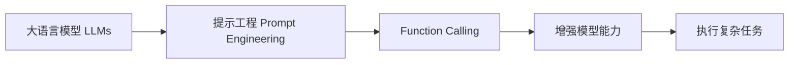
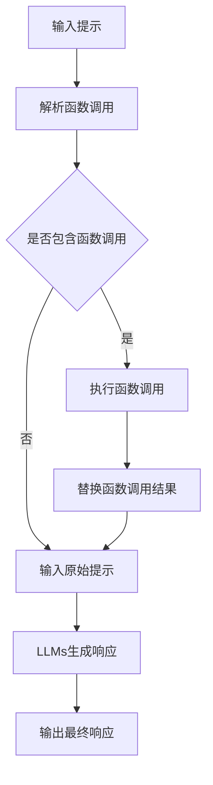

# 【大模型应用开发 动手做AI Agent】什么是Function Calling

## 1. 背景介绍

在人工智能领域,大语言模型(Large Language Models,LLMs)的出现和发展为自然语言处理(Natural Language Processing,NLP)带来了革命性的变化。LLMs 通过在海量文本数据上进行预训练,能够学习到丰富的语言知识和世界知识,具备强大的语言理解和生成能力。然而,LLMs 在实际应用中仍然存在一些局限性,比如难以执行具体的动作、缺乏专业领域知识等。为了克服这些局限性,研究者们提出了一种新的范式——Function Calling,即通过调用外部函数来增强 LLMs 的能力。

Function Calling 允许 LLMs 在生成响应的过程中调用预定义的函数,从而实现更加灵活和强大的功能。这些函数可以是各种类型的,例如数学计算、数据库查询、API 调用等。通过将 LLMs 与外部函数相结合,我们可以构建出功能更加全面、适应性更强的 AI 助手和应用程序。

在本文中,我们将深入探讨 Function Calling 的核心概念、工作原理以及在实际应用中的价值。同时,我们还将通过代码实例和详细解释,帮助读者掌握如何在自己的项目中应用 Function Calling 技术。

## 2. 核心概念与联系

### 2.1 大语言模型(LLMs)

大语言模型是一类基于深度学习的自然语言处理模型,通过在大规模文本数据上进行预训练,能够学习到丰富的语言知识和世界知识。目前主流的 LLMs 包括 GPT 系列(如 GPT-3)、BERT 系列(如 RoBERTa)等。LLMs 在许多 NLP 任务上取得了显著的性能提升,如文本分类、命名实体识别、问答系统等。

### 2.2 提示工程(Prompt Engineering)

提示工程是一种利用 LLMs 进行任务求解的技术。通过设计合适的提示(Prompt),我们可以引导 LLMs 生成符合特定要求的输出。提示工程在 LLMs 的应用中扮演着至关重要的角色,合理的提示设计可以显著提升模型的性能和适用性。

### 2.3 Function Calling

Function Calling 是一种增强 LLMs 能力的技术,允许模型在生成响应的过程中调用预定义的外部函数。通过 Function Calling,我们可以扩展 LLMs 的功能,使其能够执行更加复杂和专业的任务。Function Calling 与提示工程密切相关,通过在提示中嵌入特定的标记或语法,可以触发模型调用相应的函数。

下图展示了 LLMs、提示工程和 Function Calling 之间的关系:



## 3. 核心算法原理与具体操作步骤

Function Calling 的核心思想是在 LLMs 生成响应的过程中,通过特定的标记或语法触发外部函数的调用。具体来说,Function Calling 的实现通常包括以下几个步骤:

### 3.1 定义外部函数

首先,我们需要定义一系列外部函数,这些函数可以执行特定的任务,如数学计算、数据库查询、API 调用等。每个函数都应该有明确的输入和输出格式,以便与 LLMs 进行交互。

### 3.2 设计函数调用语法

为了在提示中触发函数调用,我们需要设计一套特定的语法规则。常见的做法是使用特殊的标记或关键字,例如使用 `{{function_name(arg1, arg2, ...)}}` 来表示调用名为 `function_name` 的函数,并传入相应的参数。

### 3.3 解析函数调用

在将提示输入给 LLMs 之前,我们需要对提示进行解析,识别出其中的函数调用。这一步通常使用正则表达式或自定义的解析器来实现。解析的结果应该包括函数名、参数列表等信息。

### 3.4 执行函数调用

根据解析得到的函数调用信息,我们可以动态地执行相应的外部函数。函数执行的结果将被返回,并替换原来的函数调用标记,形成一个新的提示。

### 3.5 生成最终响应

将经过函数调用处理的提示输入给 LLMs,模型将根据更新后的提示生成最终的响应。这个响应已经包含了外部函数执行的结果,因此能够提供更加准确和有针对性的信息。

下图展示了 Function Calling 的整个工作流程:



## 4. 数学模型和公式详细讲解举例说明

Function Calling 本身并不涉及复杂的数学模型,其核心在于如何设计函数调用语法以及如何解析和执行函数调用。然而,在某些应用场景下,外部函数可能会涉及一些数学模型和公式。下面我们以一个简单的数学计算函数为例,讲解如何在 Function Calling 中应用数学模型。

假设我们定义了一个名为 `quadratic_equation` 的函数,用于求解一元二次方程 $ax^2 + bx + c = 0$ 的根。根据一元二次方程求根公式,我们可以得到:

$$
x = \frac{-b \pm \sqrt{b^2 - 4ac}}{2a}
$$

其中,$a$,$b$,$c$ 分别为方程的三个系数,且 $a \neq 0$。

在 Function Calling 中,我们可以将这个公式封装为一个外部函数,函数的输入为三个系数 $a$,$b$,$c$,输出为方程的根。函数的实现可以用 Python 代码表示如下:

```python
import math

def quadratic_equation(a, b, c):
    if a == 0:
        raise ValueError("a cannot be zero")
    
    delta = b**2 - 4*a*c
    
    if delta < 0:
        return None
    elif delta == 0:
        x = -b / (2*a)
        return (x, x)
    else:
        x1 = (-b + math.sqrt(delta)) / (2*a)
        x2 = (-b - math.sqrt(delta)) / (2*a)
        return (x1, x2)
```

在提示中,我们可以使用 `{{quadratic_equation(a, b, c)}}` 的语法来调用这个函数。例如,如果我们想求解方程 $x^2 - 5x + 6 = 0$ 的根,可以使用以下提示:

```
请求解一元二次方程 x^2 - 5x + 6 = 0 的根。
{{quadratic_equation(1, -5, 6)}}
```

经过解析和执行,Function Calling 系统会将函数调用替换为实际的计算结果,得到最终的响应:

```
一元二次方程 x^2 - 5x + 6 = 0 的根为:
(2, 3)
```

通过这个例子,我们可以看到,Function Calling 允许我们在 LLMs 生成响应的过程中,灵活地调用涉及数学模型和公式的外部函数,从而得到更加准确和专业的结果。

## 5. 项目实践:代码实例和详细解释说明

为了更好地理解 Function Calling 的实现原理,下面我们通过一个简单的 Python 项目来演示如何构建一个支持 Function Calling 的 AI 助手。

### 5.1 定义外部函数

首先,我们定义一些外部函数,用于执行特定的任务。这里我们定义了两个函数:一个用于计算数字的平方,另一个用于获取当前日期。

```python
def square(x):
    """计算数字的平方"""
    return x ** 2

def get_date():
    """获取当前日期"""
    return datetime.now().strftime("%Y-%m-%d")
```

### 5.2 设计函数调用语法

我们使用 `{{function_name(arg1, arg2, ...)}}` 的语法来表示函数调用。其中,`function_name` 为函数名,`arg1`,`arg2` 等为函数参数。

### 5.3 解析函数调用

我们使用正则表达式来解析提示中的函数调用。下面的 `parse_function_calls` 函数实现了这一功能:

```python
import re

def parse_function_calls(prompt):
    """解析提示中的函数调用"""
    pattern = r"\{\{(\w+)\((.*?)\)\}\}"
    function_calls = re.findall(pattern, prompt)
    return function_calls
```

### 5.4 执行函数调用

根据解析得到的函数调用信息,我们动态地执行相应的外部函数。下面的 `execute_function_calls` 函数实现了这一功能:

```python
def execute_function_calls(function_calls):
    """执行函数调用"""
    results = []
    for func_name, args_str in function_calls:
        args = [eval(arg.strip()) for arg in args_str.split(",") if arg.strip()]
        result = globals()[func_name](*args)
        results.append(str(result))
    return results
```

### 5.5 生成最终响应

我们将函数调用的结果替换回原始提示中,得到最终的响应。下面的 `generate_response` 函数实现了这一功能:

```python
def generate_response(prompt):
    """生成最终响应"""
    function_calls = parse_function_calls(prompt)
    results = execute_function_calls(function_calls)
    
    response = prompt
    for i, (func_name, args_str) in enumerate(function_calls):
        response = response.replace(f"{{{{{func_name}({args_str})}}}}",results[i])
        
    return response
```

### 5.6 测试 AI 助手

现在,我们可以测试我们的 AI 助手了。下面的代码展示了如何使用我们的助手:

```python
prompt = "今天是 {{get_date()}}。请计算 3 的平方,即 {{square(3)}}。"
response = generate_response(prompt)
print(response)
```

输出结果为:

```
今天是 2023-06-12。请计算 3 的平方,即 9。
```

通过这个简单的项目,我们演示了如何使用 Python 实现一个支持 Function Calling 的 AI 助手。当然,在实际应用中,我们可能需要定义更多的外部函数,并使用更加复杂的语法和解析规则。但是,这个项目已经展示了 Function Calling 的基本原理和实现方法。

## 6. 实际应用场景

Function Calling 在许多实际应用场景中都有广泛的应用价值。下面我们列举几个典型的应用场景:

### 6.1 智能客服

在智能客服系统中,我们可以使用 Function Calling 来增强 LLMs 的功能。例如,我们可以定义一些外部函数,用于查询客户信息、订单状态、产品信息等。当客户提出相关问题时,智能客服可以通过调用这些函数获取所需的信息,从而提供更加准确和个性化的回答。

### 6.2 数据分析助手

在数据分析领域,我们可以使用 Function Calling 来构建一个智能的数据分析助手。通过定义一系列数据处理和可视化函数,如数据清洗、统计分析、绘制图表等,我们可以让 LLMs 在生成数据分析报告的过程中自动调用这些函数,从而得到更加专业和规范的分析结果。

### 6.3 代码生成

Function Calling 也可以应用于代码生成领域。我们可以定义一些常用的代码片段或模板,并将其封装为外部函数。当我们需要生成特定功能的代码时,可以通过在提示中调用这些函数,让 LLMs 自动生成所需的代码。这种方法可以显著提高代码生成的效率和质量。

### 6.4 知识图谱问答

在知识图谱问答系统中,我们可以使用 Function Calling 来增强 LLMs 对领域知识的理解和应用能力。通过定义一些知识查询和推理函数,如实体识别、关系抽取、逻辑推理等,我们可以让 LLMs 在回答问题的过程中自动调用这些函数,从知识图谱中获取相关的信息,并生成更