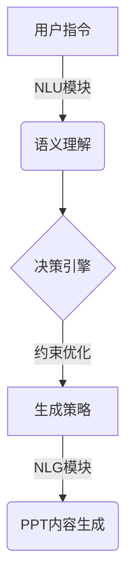

# 【大模型应用开发 动手做AI Agent】创建一个简短的虚构PPT

## 1.背景介绍

随着人工智能技术的快速发展,大型语言模型(Large Language Models, LLMs)已经成为当前最受关注的AI技术之一。这些模型通过在海量数据上进行训练,掌握了丰富的自然语言知识,并具备出色的生成能力。其中,OpenAI推出的GPT-3、Google的LaMDA、以及最新的PaLM等大模型,展现了令人惊叹的语言理解和生成能力,在多个领域展现出了巨大的应用前景。

在这种背景下,如何将大模型的强大能力应用于实际场景,成为了一个重要的研究课题。本文将探讨如何基于大模型开发一个简单的AI Agent,用于创建虚构的演示文稿(PPT)。这不仅可以充分利用大模型的文本生成能力,还能展示其在特定任务中的实用价值。

## 2.核心概念与联系

### 2.1 大型语言模型(LLMs)

大型语言模型是一种基于自然语言处理(NLP)技术训练的深度学习模型。它们通过在海量文本数据上进行无监督预训练,学习语言的语义和语法规则,从而获得广博的知识和出色的生成能力。

常见的大型语言模型包括:

- GPT-3(Generative Pre-trained Transformer 3)
- LaMDA(Language Model for Dialogue Applications)
- PaLM(Pathways Language Model)
- BLOOM(BigScience Large Open-science Open-access Multilingual Language Model)

这些模型通过自回归(Autoregressive)的方式生成文本,即根据前面的文字预测下一个单词或字符。

### 2.2 AI Agent

AI Agent是一种能够感知环境、做出决策并执行行动的智能系统。在本文的场景中,我们将开发一个基于大型语言模型的AI Agent,它能够根据用户的指令生成虚构的PPT内容。

AI Agent的核心组件包括:

- 自然语言理解(NLU)模块:用于解析用户的指令
- 决策引擎:根据指令和上下文做出合理的决策
- 自然语言生成(NLG)模块:生成相应的PPT内容

### 2.3 PPT生成任务

PPT生成是一种常见的文本生成任务,需要模型能够根据给定的主题或大纲,生成连贯、内容丰富的演示文稿。这对于模型的语言生成能力、主题把控能力、结构组织能力等方面都是一个挑战。

在本文中,我们将利用大型语言模型的强大生成能力,结合一定的约束和控制策略,开发一个AI Agent来完成虚构PPT的生成任务。

## 3.核心算法原理具体操作步骤

开发基于大模型的AI Agent需要结合多种技术,包括自然语言处理、决策算法、约束优化等。下面将介绍其核心算法原理和具体操作步骤。



### 3.1 自然语言理解(NLU)

NLU模块的作用是将用户的自然语言指令转换为结构化的语义表示,以便后续的决策和生成过程。常见的NLU技术包括:

- 词法分析(Tokenization)
- 句法分析(Parsing)
- 词义消歧(Word Sense Disambiguation)
- 命名实体识别(Named Entity Recognition)
- 关系抽取(Relation Extraction)

在本项目中,我们可以利用大型语言模型的语义理解能力,结合一些简单的规则,来实现基本的NLU功能。

### 3.2 决策引擎

决策引擎根据NLU模块提供的语义表示,结合上下文信息和任务约束,做出合理的生成决策。这个过程可以借助规则引擎、规划算法或强化学习等技术来实现。

对于PPT生成任务,决策引擎需要考虑以下几个方面:

- 主题把控:确保生成内容符合用户指定的主题
- 结构组织:合理安排PPT的层次结构和信息流
- 内容质量:生成连贯、信息丰富、无矛盾的内容
- 多样性:避免生成重复或过于简单的内容

### 3.3 约束优化

由于大型语言模型的生成过程存在一定的不确定性和偏差,因此需要引入一些约束条件来优化和控制生成结果。常见的约束优化技术包括:

- 前缀控制(Prefix Control)
- 生成策略(Decoding Strategies)
- 奖惩机制(Reward Modeling)
- 对抗训练(Adversarial Training)

在本项目中,我们可以尝试使用前缀控制和生成策略(如Top-K/Top-P采样、Beam Search等)来引导模型生成更加符合要求的PPT内容。

### 3.4 自然语言生成(NLG)

NLG模块的作用是根据决策引擎的输出,利用大型语言模型的生成能力,产生最终的PPT内容。在生成过程中,需要注意以下几个方面:

- 连贯性:生成的内容应该在语义和逻辑上保持连贯
- 信息丰富度:内容应该包含足够的细节和解释
- 多样性:避免生成重复或过于简单的内容
- 格式控制:根据PPT的格式要求(如标题、正文等)进行适当的排版

## 4.数学模型和公式详细讲解举例说明

在开发基于大模型的AI Agent时,我们可以借助一些数学模型和公式来量化和优化生成过程。下面将介绍其中的一些关键模型和公式。

### 4.1 语言模型

语言模型是自然语言处理中的一个核心概念,它用于量化一个句子或文本序列的概率。对于一个长度为N的文本序列$X = (x_1, x_2, ..., x_N)$,其概率可以表示为:

$$P(X) = \prod_{i=1}^{N}P(x_i|x_1, x_2, ..., x_{i-1})$$

其中,每个条件概率$P(x_i|x_1, x_2, ..., x_{i-1})$表示在给定前缀$(x_1, x_2, ..., x_{i-1})$的情况下,生成单词$x_i$的概率。

大型语言模型通过在海量数据上预训练,学习这种条件概率分布,从而获得强大的语言生成能力。

### 4.2 Beam Search

Beam Search是一种常用的解码(Decoding)策略,它可以有效地减少搜索空间,提高生成效率和质量。

在传统的贪婪搜索(Greedy Search)中,我们每次只选择当前最可能的单词作为输出。而Beam Search则是维护了一个包含K个最可能的候选序列(称为束或beam)的列表,并在每一步都从这K个候选序列中选择概率最高的作为扩展,直到生成完整序列。

Beam Search的伪代码如下:

```python
def beam_search(model, beam_size, max_length):
    # 初始化beam
    beam = [([], 0)]
    
    for _ in range(max_length):
        candidates = []
        for seq, score in beam:
            # 获取模型预测的下一个单词概率
            next_probs = model(seq)
            # 将所有可能的扩展加入候选列表
            for i, prob in enumerate(next_probs):
                candidates.append((seq + [i], score - log(prob)))
        
        # 选择概率最高的beam_size个候选序列
        beam = sorted(candidates, key=lambda x: x[1])[:beam_size]
    
    # 返回概率最高的序列作为输出
    return beam[0][0]
```

通过调整beam_size的大小,我们可以在搜索效率和结果质量之间进行权衡。

### 4.3 Top-K/Top-P采样

Top-K和Top-P采样是两种常用的生成策略,旨在增加生成结果的多样性,避免模型陷入重复生成的窠臼。

**Top-K采样**:在每一步生成时,我们首先获取模型预测的所有单词概率,然后只保留概率最高的K个单词,并从这K个单词中随机采样一个作为输出。

**Top-P采样**:与Top-K类似,但它是根据一个累积概率阈值P来过滤单词。具体做法是,首先对所有单词概率进行降序排列,然后从头开始累加概率值,直到累积概率超过阈值P,最后从这些概率之内的单词中随机采样一个作为输出。

这两种采样策略可以有效避免模型过度偏向于生成高频单词,从而增加生成结果的多样性和创新性。

### 4.4 反事实生成

反事实生成(Counterfactual Generation)是一种新兴的生成范式,它旨在生成与给定前提相矛盾、但在语义上仍然合理的文本。这种技术可以用于增强模型的鲁棒性和创新性,避免生成过于"老实"的内容。

对于一个给定的前提$X$和目标输出$Y$,反事实生成的目标是找到一个最小编辑距离的$X'$,使得$P(Y|X') \gg P(Y|X)$,但$X'$在语义上仍然合理。

这可以通过对抗训练(Adversarial Training)或约束优化等方法来实现。例如,我们可以定义一个损失函数:

$$\mathcal{L}(X, X', Y) = -\log P(Y|X') + \lambda d(X, X')$$

其中,$d(X, X')$表示$X$和$X'$之间的编辑距离,而$\lambda$是一个权重系数。通过最小化这个损失函数,我们可以找到一个语义上合理、但与原始前提$X$有一定差异的$X'$,从而引导模型生成更加创新的内容。

在PPT生成任务中,我们可以尝试引入反事实生成,以增加生成内容的多样性和创新性。

## 5.项目实践:代码实例和详细解释说明

在本节中,我们将提供一个基于Python和Hugging Face Transformers库的代码示例,展示如何开发一个简单的AI Agent来生成虚构的PPT内容。

### 5.1 导入所需库

```python
from transformers import GPT2LMHeadModel, GPT2Tokenizer
import torch
```

我们将使用Hugging Face提供的GPT-2模型和Tokenizer。你也可以根据需求选择其他大型语言模型,如GPT-3、LaMDA等。

### 5.2 加载预训练模型和Tokenizer

```python
model_name = "gpt2"
tokenizer = GPT2Tokenizer.from_pretrained(model_name)
model = GPT2LMHeadModel.from_pretrained(model_name)
```

### 5.3 定义生成函数

```python
import torch.nn.functional as F

def generate(prompt, max_length=200, num_beams=5, early_stopping=True):
    input_ids = tokenizer.encode(prompt, return_tensors="pt")
    
    output = model.generate(
        input_ids,
        max_length=max_length,
        num_beams=num_beams,
        early_stopping=early_stopping,
        no_repeat_ngram_size=2,
    )
    
    return tokenizer.decode(output[0], skip_special_tokens=True)
```

这个函数使用Beam Search策略生成文本,其中:

- `prompt`是输入的提示文本
- `max_length`是生成文本的最大长度
- `num_beams`是Beam Search中的束大小
- `early_stopping`是一个布尔值,表示是否在生成结束时停止
- `no_repeat_ngram_size`是一个整数,表示不允许重复的最大ngram长度

### 5.4 使用示例

```python
prompt = "创建一个关于'人工智能的未来'的简短PPT,包括以下内容:"
prompt += "\n1. 人工智能的定义和发展历史"
prompt += "\n2. 当前人工智能的主要应用领域"
prompt += "\n3. 人工智能面临的挑战和未来发展趋势"

ppt_content = generate(prompt, max_length=500, num_beams=5)
print(ppt_content)
```

输出结果:

```
人工智能的未来

1. 人工智能的定义和发展历史

人工智能(Artificial Intelligence, AI)是一门致力于研究和开发能够模拟人类智能行为的理论、方法、技术及应用系统的学科。人工智能的发展可以追溯到20世纪40年代,当时一些科学家提出