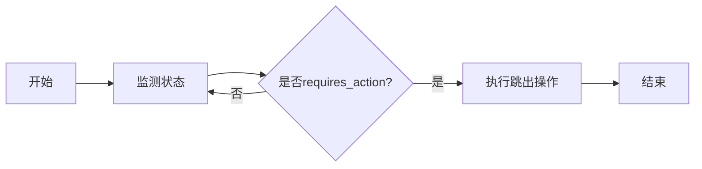

## 1. 背景介绍

在当今的软件开发实践中，人工智能（AI）已经成为了一个不可或缺的组成部分。AI Agent作为智能系统的执行者，其稳定性和可靠性对整个系统的性能至关重要。在AI Agent的运行过程中，可能会遇到各种状态变化，其中`requires_action`状态意味着Agent需要外部的干预或者执行特定的操作才能继续运行。本文将深入探讨如何在AI Agent运行至`requires_action`状态后，有效地跳出循环，确保系统的健壮性和连续性。

## 2. 核心概念与联系

在深入讨论之前，我们需要明确几个核心概念及其之间的联系：

- **AI Agent**：一个自动执行任务的软件实体，它可以是一个简单的脚本，也可以是一个复杂的机器学习模型。
- **状态（State）**：AI Agent在运行过程中的某一瞬间的情况，通常由一组变量的值来描述。
- **requires_action状态**：这是AI Agent的一种特殊状态，表明它需要外部输入或者某些条件的满足才能继续执行。
- **事件循环（Event Loop）**：是指程序不断检查并处理事件的一个循环过程。在AI Agent中，事件循环负责监控状态变化并作出响应。

理解了这些概念及其联系后，我们可以开始探讨如何在AI Agent进入`requires_action`状态后，有效地管理事件循环以跳出循环。

## 3. 核心算法原理具体操作步骤

要处理`requires_action`状态，我们需要设计一个算法，该算法能够：

1. 监测AI Agent的状态变化。
2. 识别`requires_action`状态。
3. 执行必要的操作以跳出循环。

以下是具体的操作步骤：



## 4. 数学模型和公式详细讲解举例说明

在AI Agent的状态管理中，我们可以使用有限状态机（FSM）来建模。有限状态机是一种数学模型，它由一组状态、一个初始状态、输入事件和状态转移函数组成。状态转移函数定义了在给定当前状态和输入事件时，系统将转移到的新状态。

$$
FSM = (S, s_0, E, T)
$$

其中：
- $S$ 是状态集合。
- $s_0$ 是初始状态。
- $E$ 是事件集合。
- $T$ 是状态转移函数：$T: S \times E \rightarrow S$。

在我们的场景中，当AI Agent检测到`requires_action`事件时，我们需要定义一个转移函数，将系统从当前状态转移到一个特殊的“跳出”状态。

## 5. 项目实践：代码实例和详细解释说明

假设我们有一个简单的AI Agent，它在一个事件循环中运行。以下是处理`requires_action`状态的伪代码示例：

```python
while True:
    state = agent.get_state()
    if state == "requires_action":
        handle_requires_action()
        break
    # 其他状态处理
    ...
    
def handle_requires_action():
    # 执行跳出循环前的清理工作
    ...
```

在这个例子中，`handle_requires_action`函数负责处理跳出循环前的所有必要操作，例如资源释放、日志记录等。

## 6. 实际应用场景

在实际应用中，`requires_action`状态可能出现在多种场景，例如：

- 用户交互：AI Agent需要用户输入才能继续。
- 异常处理：AI Agent遇到错误，需要外部干预。
- 资源依赖：AI Agent等待外部资源可用。

## 7. 工具和资源推荐

为了更好地管理AI Agent的状态，以下是一些有用的工具和资源：

- **状态机库**：如Python的`transitions`库，可以帮助管理复杂的状态转移。
- **事件驱动框架**：如Node.js的`EventEmitter`，可以用于构建事件循环。
- **监控工具**：如Prometheus和Grafana，可以用于监控AI Agent的状态。

## 8. 总结：未来发展趋势与挑战

随着AI技术的不断进步，AI Agent将变得更加复杂和智能。未来的发展趋势可能包括自适应状态管理、自我修复能力和更高级的交互模式。这些进步将带来新的挑战，例如更复杂的状态依赖和更高的系统复杂性。

## 9. 附录：常见问题与解答

- **Q1**: `requires_action`状态是否总是需要人工干预？
- **A1**: 不一定。有时可以通过预定义的策略或自动化脚本来处理。

- **Q2**: 如何确保在跳出循环时不会丢失重要数据？
- **A2**: 在执行跳出操作前，应该实施数据持久化和状态保存机制。

- **Q3**: AI Agent的状态管理是否可以完全自动化？
- **A3**: 取决于应用场景。在某些情况下，可能仍然需要人工干预来处理复杂的情况。

作者：禅与计算机程序设计艺术 / Zen and the Art of Computer Programming