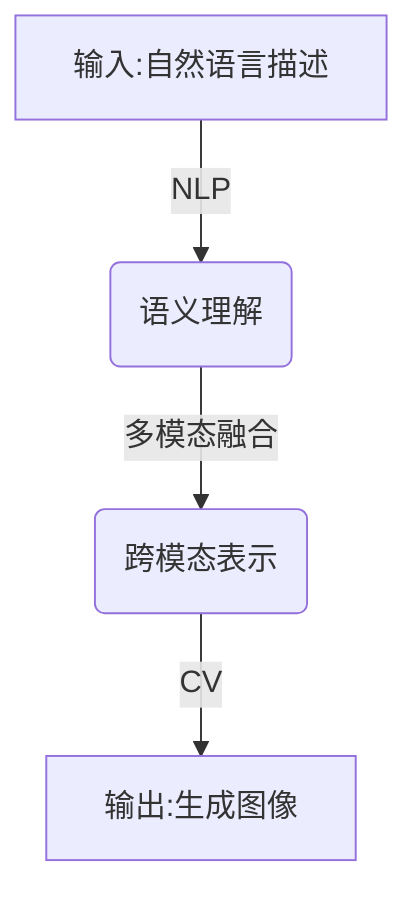
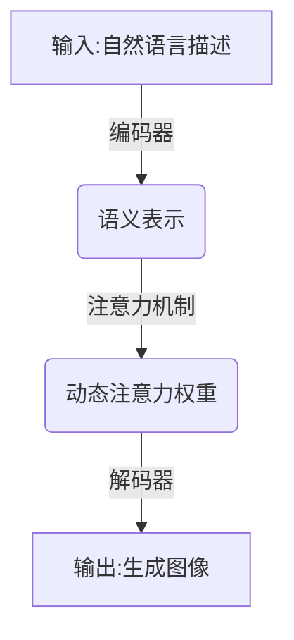
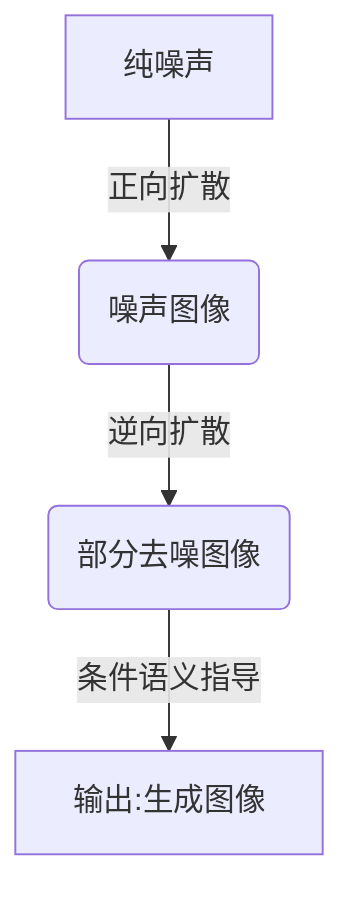

# 【大模型应用开发 动手做AI Agent】用DALL·E 3模型为PPT首页配图

## 1.背景介绍

### 1.1 PPT演示文稿的重要性

在当今商业环境中,高质量的演示文稿对于有效地传达信息和留下深刻印象至关重要。无论是在会议、培训还是销售场合,一份精心设计的演示文稿都能帮助演讲者更好地阐述观点,增强说服力。然而,制作出视觉吸引、内容丰富的演示文稿往往需要耗费大量时间和精力。

### 1.2 AI技术在PPT制作中的应用

随着人工智能(AI)技术的不断进步,越来越多的AI工具被应用于各个领域,以提高效率和质量。在PPT制作方面,AI技术也展现出了巨大的潜力。利用大型语言模型和计算机视觉技术,AI系统能够根据用户需求自动生成高质量的PPT内容和视觉元素,极大地减轻了PPT制作的工作量。

### 1.3 DALL·E 3模型简介

DALL·E 3是OpenAI推出的一款先进的多模态AI模型,能够根据自然语言描述生成逼真的图像。该模型融合了自然语言处理(NLP)和计算机视觉(CV)技术,具有出色的理解和生成能力。DALL·E 3可以捕捉语言描述中的细节和语义,并将其转化为高分辨率、艺术水准的图像输出。

## 2.核心概念与联系

### 2.1 多模态学习

多模态学习是指将不同模态(如文本、图像、视频等)的信息融合,以获得更全面、更丰富的数据表示和理解。DALL·E 3就是一个典型的多模态模型,它能够同时处理文本和图像两种模态,并在两者之间建立联系。



### 2.2 注意力机制

注意力机制是深度学习中一种重要的技术,它允许模型在处理序列数据时,动态地分配不同位置的注意力权重,从而更好地捕捉长距离依赖关系。DALL·E 3在生成图像时,会根据输入的文本描述,动态调整对不同语义概念的注意力分配,以生成更加贴合描述的图像。



### 2.3 diffusion模型

Diffusion模型是一种基于噪声扩散过程的生成模型,它通过逆向扩散过程从纯噪声中生成高质量图像。DALL·E 3采用了diffusion模型作为图像生成的核心技术,能够生成逼真、细节丰富的图像输出。



这三个核心概念相互关联、互为支撑,共同构建了DALL·E 3强大的多模态生成能力。多模态学习让模型能够融合文本和图像信息;注意力机制帮助模型更好地理解语义并生成相关图像;而diffusion模型则提供了高质量图像生成的技术基础。

## 3.核心算法原理具体操作步骤

DALL·E 3的核心算法原理可以概括为以下几个主要步骤:

### 3.1 文本编码

1) 将输入的自然语言描述通过Transformer编码器转换为语义表示向量。
2) 使用注意力机制捕捉语义之间的依赖关系,生成条件语义表示。

### 3.2 图像生成

1) 从纯噪声图像开始,使用正向扩散过程生成一系列噪声图像。
2) 使用逆向扩散过程,结合条件语义表示,逐步从噪声图像中恢复出真实图像。
3) 在每个扩散时间步,根据条件语义表示调整注意力权重,指导图像生成过程。

### 3.3 反复迭代

1) 对生成的初始图像进行评估,根据评估结果对模型进行微调。
2) 重复上述步骤,不断优化生成质量,直至满足要求为止。

## 4.数学模型和公式详细讲解举例说明

DALL·E 3的核心是一个条件diffusion概率模型,用于从给定的文本描述中生成图像。该模型的数学表达式如下:

$$
p(x_0|c) = \int p_\theta(x_0|x_T,c)p_{data}(x_T)dx_T
$$

其中:
- $x_0$表示最终生成的图像
- $c$表示条件文本描述
- $x_T$表示纯噪声图像
- $p_\theta(x_0|x_T,c)$是条件diffusion模型,用于从噪声图像$x_T$和条件$c$生成目标图像$x_0$
- $p_{data}(x_T)$是噪声先验分布,通常为高斯分布

由于直接优化上述积分是困难的,因此DALL·E 3采用了基于扩散过程的近似方法。具体来说,它定义了一个正向扩散过程$q(x_t|x_{t-1})$,用于将真实图像$x_0$逐步添加噪声,生成一系列噪声图像$x_1,x_2,...,x_T$。然后,它学习一个逆向扩散过程$p_\theta(x_{t-1}|x_t,c)$,以从噪声图像$x_T$和条件$c$重构出原始图像$x_0$。

在训练过程中,DALL·E 3最小化以下损失函数:

$$
L_\theta = \mathbb{E}_{x_0,c,\epsilon}\Big[\|\epsilon - \epsilon_\theta(x_t,c)\|^2\Big]
$$

其中$\epsilon_\theta(x_t,c)$是模型预测的噪声,用于从$x_t$和$c$重构$x_{t-1}$。通过最小化这个损失函数,模型可以学习到从噪声图像和条件描述生成目标图像的映射。

在推理阶段,DALL·E 3从纯噪声$x_T$开始,通过迭代应用学习到的逆向扩散过程$p_\theta(x_{t-1}|x_t,c)$,逐步去噪并生成最终图像$x_0$。

以下是一个具体的例子,说明DALL·E 3如何根据文本描述"一只可爱的小狗在草地上玩球"生成相应的图像:

1) 将文本描述"一只可爱的小狗在草地上玩球"编码为语义表示向量$c$。
2) 从高斯噪声先验$p_{data}(x_T)$采样一个纯噪声图像$x_T$。
3) 在第一个时间步,使用$p_\theta(x_{T-1}|x_T,c)$从噪声图像$x_T$和条件$c$预测出一个较少噪声的图像$x_{T-1}$。
4) 在后续时间步中,重复应用$p_\theta(x_{t-1}|x_t,c)$,逐步去噪并生成更清晰的图像$x_{T-2}$、$x_{T-3}$等。
5) 在最后一个时间步,得到最终生成的图像$x_0$,即一幅描绘"一只可爱的小狗在草地上玩球"的图像。

通过上述数学模型和迭代算法,DALL·E 3能够高度准确地将文本描述转化为逼真的图像输出。

## 5.项目实践:代码实例和详细解释说明

虽然DALL·E 3是一个封闭的商业系统,其完整代码并未公开,但我们可以通过一个简化的Python示例来模拟其核心工作原理。这个示例使用开源的Stable Diffusion模型,并结合OpenAI的CLIP模型来实现文本到图像的生成。

```python
import torch
from diffusers import StableDiffusionPipeline, LMSDiscreteScheduler
from transformers import CLIPTextModel, CLIPTokenizer

# 加载模型和tokenizer
pipe = StableDiffusionPipeline.from_pretrained("runwayml/stable-diffusion-v1-5", torch_dtype=torch.float16)
pipe.scheduler = LMSDiscreteScheduler.from_config(pipe.scheduler.config)
pipe.safety_checker = lambda images, clip_input: (images, False)

clip_model = CLIPTextModel.from_pretrained("openai/clip-vit-base-patch32")
clip_tokenizer = CLIPTokenizer.from_pretrained("openai/clip-vit-base-patch32")

# 设置生成参数
prompt = "A cute puppy playing with a ball on the grass"
num_inference_steps = 50
guidance_scale = 7.5

# 编码文本prompt
text_input = clip_tokenizer(prompt, padding="max_length", max_length=77, truncation=True, return_tensors="pt")
with torch.no_grad():
    text_embeddings = clip_model.get_text_features(**text_input)[0]

# 生成图像
images = pipe(text_embeddings=text_embeddings, num_inference_steps=num_inference_steps, guidance_scale=guidance_scale)["sample"]

# 保存图像
images[0].save("puppy_with_ball.png")
```

上述代码的工作流程如下:

1. 加载Stable Diffusion模型和CLIP文本编码器模型。
2. 设置生成参数,包括文本prompt、推理步数和guidance scale。
3. 使用CLIP编码器将文本prompt编码为文本嵌入向量。
4. 调用Stable Diffusion模型,将文本嵌入向量作为条件输入,生成相应的图像。
5. 保存生成的图像到本地文件。

这个示例代码虽然简化了DALL·E 3的复杂细节,但能够展示其核心思想:利用大型语言模型(如CLIP)对文本进行编码,然后将编码后的文本表示作为条件输入,指导diffusion模型从噪声中生成相关图像。

通过调整prompt、推理步数和guidance scale等参数,我们可以控制生成图像的内容、质量和风格。例如,将prompt改为"A majestic lion standing on a rock"将生成一幅狮子的图像;增加推理步数可以提高图像质量但也会增加计算开销;而guidance scale则控制了文本条件对图像生成的影响程度。

值得注意的是,虽然这个示例使用的是公开的Stable Diffusion模型,但DALL·E 3作为一个商业系统,其内部模型结构和训练数据可能会有所不同,因此生成质量可能会有差异。但是,这个示例能够很好地说明DALL·E 3的核心工作原理,为进一步探索和开发提供了有用的参考。

## 6.实际应用场景

DALL·E 3强大的文本到图像生成能力,为其在多个领域的实际应用铺平了道路。以下是一些典型的应用场景:

### 6.1 内容创作

- 插画和概念艺术:艺术家可以使用DALL·E 3快速创作出高质量的插画和概念艺术作品,为故事情节、角色设计等提供视觉支持。
- 产品设计:设计师可以根据文本描述生成产品原型图像,加快设计迭代过程。
- 广告和营销:营销人员可以使用DALL·E 3生成吸引眼球的广告图像,提高营销效果。

### 6.2 教育和培训

- 教学辅助材料:教师可以利用DALL·E 3生成与教学内容相关的图像,为学生提供更直观、更生动的学习体验。
- 培训资源:培训师可以快速生成大量示例图像,用于培训演示和练习。

### 6.3 辅助工具

- 视觉辅助:DALL·E 3可以为视觉障碍人士生成基于文本描述的图像,帮助他们更好地理解周围环境。
- 内容可视化:研究人员可以使用DALL·E 3将抽象概念或数据可视化,以更直观的方式呈现研究成果。

### 6.4 娱乐和创意

- 游戏和动画:游戏开发者和动画制作人员可以使用DALL·E 3快速生成游戏场景、角色和动画素材。
- 个性化内容:用户可以根据自己的