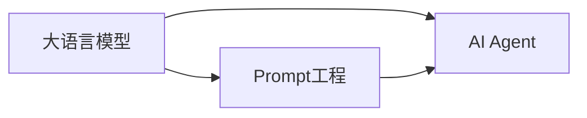

# 【大模型应用开发 动手做AI Agent】自动办公好助手

## 1. 背景介绍
### 1.1 人工智能的发展历程
#### 1.1.1 早期人工智能的探索
#### 1.1.2 机器学习的兴起 
#### 1.1.3 深度学习的突破

### 1.2 大语言模型的出现
#### 1.2.1 Transformer架构的提出
#### 1.2.2 GPT系列模型的发展
#### 1.2.3 InstructGPT的应用价值

### 1.3 AI助手在办公场景中的应用前景
#### 1.3.1 提高工作效率
#### 1.3.2 优化业务流程
#### 1.3.3 创新商业模式

## 2. 核心概念与联系
### 2.1 大语言模型
#### 2.1.1 定义与特点
#### 2.1.2 训练数据与方法
#### 2.1.3 应用场景

### 2.2 AI Agent
#### 2.2.1 Agent的概念
#### 2.2.2 基于大模型构建Agent
#### 2.2.3 Agent的行为决策机制

### 2.3 Prompt工程 
#### 2.3.1 Prompt的作用
#### 2.3.2 Few-shot Learning
#### 2.3.3 Prompt优化技巧

### 2.4 大模型与AI Agent、Prompt的关系



## 3. 核心算法原理具体操作步骤
### 3.1 基于InstructGPT实现AI Agent
#### 3.1.1 环境配置
#### 3.1.2 API调用
#### 3.1.3 交互式对话

### 3.2 Prompt工程实践
#### 3.2.1 任务分解
#### 3.2.2 Prompt模板设计
#### 3.2.3 思维链构建

### 3.3 基于强化学习优化Agent决策
#### 3.3.1 强化学习基本原理
#### 3.3.2 奖励函数设计
#### 3.3.3 策略迭代优化

## 4. 数学模型和公式详细讲解举例说明
### 4.1 Transformer模型
#### 4.1.1 Self-Attention机制
$$Attention(Q,K,V) = softmax(\frac{QK^T}{\sqrt{d_k}})V$$
#### 4.1.2 Multi-Head Attention
$$MultiHead(Q,K,V) = Concat(head_1,...,head_h)W^O$$
#### 4.1.3 位置编码
$$PE_{(pos,2i)} = sin(pos/10000^{2i/d_{model}})$$
$$PE_{(pos,2i+1)} = cos(pos/10000^{2i/d_{model}})$$

### 4.2 强化学习模型  
#### 4.2.1 马尔可夫决策过程
$$G_t = R_{t+1} + \gamma R_{t+2} + ... = \sum_{k=0}^{\infty} \gamma^k R_{t+k+1}$$
#### 4.2.2 Q-Learning
$$Q(S_t,A_t) \leftarrow Q(S_t,A_t) + \alpha [R_{t+1} + \gamma \max_a Q(S_{t+1},a) - Q(S_t,A_t)]$$
#### 4.2.3 策略梯度定理
$$\nabla_\theta J(\theta) = \mathbb{E}_{\tau \sim p_\theta(\tau)} [\sum_{t=0}^T \nabla_\theta \log \pi_\theta(a_t|s_t) Q^\pi(s_t,a_t)]$$

## 5. 项目实践：代码实例和详细解释说明
### 5.1 使用InstructGPT API构建AI Agent
```python
import openai

openai.api_key = "your_api_key"

def generate_response(prompt):
    response = openai.Completion.create(
        engine="text-davinci-002",
        prompt=prompt,
        max_tokens=1024,
        n=1,
        stop=None,
        temperature=0.7,
    )
    message = response.choices[0].text.strip()
    return message

while True:
    user_input = input("User: ")
    prompt = f"User: {user_input}\nAI Assistant: "
    response = generate_response(prompt)
    print(f"AI Assistant: {response}")
```

以上代码通过调用OpenAI的InstructGPT API，实现了一个基本的AI助手。用户输入问题，助手会根据Prompt生成相应的回答，实现交互式对话。

### 5.2 使用Prompt工程优化AI助手
```python
def generate_response(prompt, task_prompt):
    prompt = f"{task_prompt}\n{prompt}"
    response = openai.Completion.create(
        engine="text-davinci-002",
        prompt=prompt,
        max_tokens=1024,
        n=1,
        stop=None,
        temperature=0.7,
    )
    message = response.choices[0].text.strip()
    return message

# 任务分解与思维链构建
task_prompt = """
你是一个智能的办公助手，你的任务是：
1. 理解用户的需求
2. 将需求拆解成多个子任务
3. 对每个子任务给出解决方案
4. 综合所有子任务的解决方案，给出最终的完整解答
"""

while True:
    user_input = input("User: ")
    prompt = f"User: {user_input}\nAI Assistant: "
    response = generate_response(prompt, task_prompt)
    print(f"AI Assistant: {response}")
```

以上代码展示了如何使用Prompt工程来优化AI助手。通过设计一个总体的任务Prompt，将用户需求拆解成多个子任务，并对每个子任务进行解决，最后再综合给出完整答案。这种方法可以引导AI助手进行逻辑清晰的思考，生成条理更清晰、内容更全面的回复。

## 6. 实际应用场景
### 6.1 智能日程管理
#### 6.1.1 自动安排会议
#### 6.1.2 日程冲突检测
#### 6.1.3 行程规划优化

### 6.2 邮件自动化处理
#### 6.2.1 邮件分类与归档
#### 6.2.2 自动回复常见问题
#### 6.2.3 重要邮件提醒

### 6.3 智能文档助手
#### 6.3.1 文档写作辅助
#### 6.3.2 文档摘要生成
#### 6.3.3 文档翻译与校对

### 6.4 数据分析与报告生成
#### 6.4.1 数据可视化
#### 6.4.2 自动生成分析报告
#### 6.4.3 数据异常检测

## 7. 工具和资源推荐
### 7.1 OpenAI API
#### 7.1.1 使用指南
#### 7.1.2 定价与资源限制
#### 7.1.3 应用案例

### 7.2 Langchain
#### 7.2.1 框架介绍
#### 7.2.2 常用组件
#### 7.2.3 构建复杂应用

### 7.3 其他大语言模型API
#### 7.3.1 Google PaLM API
#### 7.3.2 Anthropic Claude API
#### 7.3.3 阿里通义千问

### 7.4 开源大语言模型
#### 7.4.1 BLOOM
#### 7.4.2 LLaMA
#### 7.4.3 ChatGLM

## 8. 总结：未来发展趋势与挑战
### 8.1 AI助手的发展趋势
#### 8.1.1 通用人工智能的目标
#### 8.1.2 多模态交互能力提升 
#### 8.1.3 个性化与定制化

### 8.2 技术挑战
#### 8.2.1 安全与伦理问题
#### 8.2.2 推理能力有待加强
#### 8.2.3 知识更新与持续学习

### 8.3 商业应用前景
#### 8.3.1 企业数字化转型
#### 8.3.2 提升用户体验
#### 8.3.3 创造新的商业模式

## 9. 附录：常见问题与解答
### 9.1 如何选择合适的大语言模型API？
### 9.2 Prompt工程有哪些优化技巧？
### 9.3 如何平衡AI助手的创新性和可控性？
### 9.4 大语言模型的训练成本与应用成本如何？
### 9.5 AI助手会取代人类的工作岗位吗？

作者：禅与计算机程序设计艺术 / Zen and the Art of Computer Programming