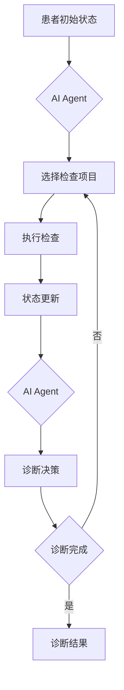

# 一切皆是映射：AI Q-learning在医疗诊断中的应用

## 1. 背景介绍
### 1.1 医疗诊断的重要性与挑战
医疗诊断是医疗过程中至关重要的一环,准确及时的诊断可以挽救患者的生命。然而,由于人体的复杂性和疾病表现的多样性,医疗诊断一直面临着诸多挑战。传统的诊断方法主要依赖医生的经验和知识,存在主观性强、效率低下等问题。随着医疗数据的爆炸式增长,如何利用这些海量数据辅助诊断决策,成为了医疗领域亟待解决的问题。

### 1.2 人工智能在医疗领域的应用现状
近年来,人工智能技术在医疗领域得到了广泛应用,尤其是在医学影像分析、辅助诊断、药物发现等方面取得了显著成果。机器学习算法可以从海量医疗数据中自动提取特征、学习疾病模式,从而辅助医生进行诊断。深度学习模型在医学影像分析中表现尤为突出,已经在某些任务上达到甚至超过了人类专家的水平。

### 1.3 强化学习与Q-learning简介
强化学习是机器学习的一个重要分支,它通过智能体(Agent)与环境的交互,学习最优策略以获得最大累积奖励。Q-learning是强化学习的一种经典算法,它通过值函数逼近的方法估计每个状态-动作对的Q值,并基于Q值选择最优动作。Q-learning具有简单易实现、对环境模型没有要求等优点,在许多领域得到了成功应用。将Q-learning引入医疗诊断领域,有望突破传统方法的局限,实现更加智能高效的辅助诊断。

## 2. 核心概念与联系
### 2.1 状态空间、动作空间与奖励函数
- 状态空间(State Space):描述智能体所处的环境状态集合,在医疗诊断中可以是患者的各项生理指标、症状体征等。
- 动作空间(Action Space):描述智能体可采取的行动集合,在医疗诊断中可以是进一步检查、开具处方、病情判断等。
- 奖励函数(Reward Function):描述智能体采取特定动作后获得的即时奖励值,引导智能体学习最优策略。在医疗诊断中需根据诊断的准确性、及时性等设计合理的奖励函数。

### 2.2 Q值函数与值函数逼近
- Q值函数(Q-value Function):描述在某状态下采取特定动作的预期累积奖励,是强化学习的核心。
- 值函数逼近(Value Function Approximation):由于状态动作空间巨大,Q值函数难以直接表示,需要用参数化的函数(如神经网络)去拟合估计。

### 2.3 探索与利用
- 探索(Exploration):智能体尝试未知动作以发现可能更优的策略。
- 利用(Exploitation):智能体基于已有经验采取当前最优动作以获取奖励。
- 探索利用平衡(Exploration-Exploitation Balance):权衡探索新知与利用已知,是强化学习的核心问题之一。

## 3. 核心算法原理与操作步骤
### 3.1 Q-learning算法原理
Q-learning算法的核心是通过不断更新估计的Q值函数,最终收敛到最优Q值函数,得到最优策略。Q值函数更新遵循如下公式:
$$Q(s_t,a_t) \leftarrow Q(s_t,a_t)+\alpha[r_{t+1}+\gamma \max_a Q(s_{t+1},a)-Q(s_t,a_t)]$$

其中,$s_t$为t时刻状态,$a_t$为t时刻动作,$r_{t+1}$为t+1时刻获得的奖励,$\alpha$为学习率,$\gamma$为折扣因子。

### 3.2 Q-learning算法操作步骤
1. 初始化Q值函数(一般用神经网络参数化)
2. 状态初始化为$s_0$
3. for t=0,1,2,...,T:
   - 根据$\epsilon-greedy$策略选取动作$a_t$
   - 执行动作$a_t$,观测奖励$r_{t+1}$和新状态$s_{t+1}$  
   - 更新Q值:$Q(s_t,a_t) \leftarrow Q(s_t,a_t)+\alpha[r_{t+1}+\gamma \max_a Q(s_{t+1},a)-Q(s_t,a_t)]$
   - $s_t \leftarrow s_{t+1}$
4. 不断重复步骤3直到满足终止条件(如达到最大训练步数)

### 3.3 基于Q-learning的诊断决策流程


## 4. 数学模型与公式详解
### 4.1 马尔可夫决策过程
强化学习问题一般被建模为马尔可夫决策过程(MDP),其由一个六元组$<S,A,P,R,\gamma,H>$描述:
- $S$:状态空间
- $A$:动作空间  
- $P$:状态转移概率矩阵,$P(s'|s,a)$表示在状态$s$下执行动作$a$后转移到状态$s'$的概率
- $R$:奖励函数,$R(s,a)$表示在状态$s$下执行动作$a$获得的即时奖励
- $\gamma$:折扣因子,$\gamma \in [0,1]$,表示未来奖励的衰减程度  
- $H$:时域范围,可以是有限的或无限的

在医疗诊断问题中,状态可以表示患者的各项指标,动作可以表示诊疗决策,奖励可以根据诊断准确性等设计。目标是找到一个最优策略$\pi: S \rightarrow A$,使得累积期望奖励最大化:

$$\pi^* = \arg \max_{\pi} E[\sum_{t=0}^H \gamma^t R(s_t,\pi(s_t))]$$

### 4.2 Q值函数与贝尔曼方程
Q值函数定义为在状态$s$下采取动作$a$后的期望累积奖励:

$$Q^\pi(s,a)=E[\sum_{k=0}^{\infty} \gamma^k r_{t+k+1}|s_t=s,a_t=a]$$

贝尔曼方程描述了Q值函数的递归形式:

$$Q^\pi(s,a)=R(s,a)+\gamma \sum_{s' \in S}P(s'|s,a)Q^\pi(s',\pi(s'))$$

最优Q值函数$Q^*$满足最优贝尔曼方程:

$$Q^*(s,a)=R(s,a)+\gamma \sum_{s' \in S}P(s'|s,a) \max_{a'}Q^*(s',a')$$

Q-learning算法的目标就是通过不断更新估计的Q值函数,逼近最优Q值函数$Q^*$。

### 4.3 函数逼近与神经网络
当状态动作空间很大时,Q值函数难以直接表示,需要用参数化的函数去逼近。一般采用神经网络作为Q值函数的逼近器:

$$Q(s,a;\theta) \approx Q^*(s,a)$$

其中$\theta$为神经网络参数。将Q值函数的更新问题转化为最小化均方误差损失:

$$L(\theta)=E[(r+\gamma \max_{a'}Q(s',a';\theta^-)-Q(s,a;\theta))^2]$$

$\theta^-$表示目标网络参数,用于计算TD目标值,解耦当前网络参数。

## 5. 项目实践:基于Q-learning的医疗诊断系统
### 5.1 数据准备
收集患者的症状、体征、检验检查结果等结构化数据,并进行清洗、标准化等预处理。将诊断结果作为标签。数据按照8:2的比例随机划分为训练集和测试集。

### 5.2 状态与动作空间设计
- 状态空间:患者的症状、体征、检查结果等信息。可以将连续变量离散化,或归一化到[0,1]区间。
- 动作空间:医生可能采取的检查项目、诊断决策等,如"血常规检查"、"胸部X光"、"诊断为肺炎"等。

### 5.3 奖励函数设计
奖励函数的设计需要结合实际诊断任务。一个简单的设计是:
- 若诊断正确,给予较大正奖励,如+10
- 若诊断错误,给予较大负奖励,如-10
- 每进行一次检查,给予较小负奖励,如-1,以鼓励尽快诊断
- 超过最大诊断步数,给予较大负奖励,如-5

### 5.4 模型搭建与训练
使用Pytorch构建Q网络,输入为状态,输出为各动作的Q值。网络结构可以根据实际任务设计,如使用MLP或LSTM。

```python
import torch
import torch.nn as nn

class QNetwork(nn.Module):
    def __init__(self, state_dim, action_dim, hidden_dim):
        super(QNetwork, self).__init__()
        self.fc1 = nn.Linear(state_dim, hidden_dim)
        self.fc2 = nn.Linear(hidden_dim, hidden_dim)  
        self.fc3 = nn.Linear(hidden_dim, action_dim)

    def forward(self, x):
        x = torch.relu(self.fc1(x))
        x = torch.relu(self.fc2(x))
        return self.fc3(x)
```

使用Experience Replay和Fixed Q-targets等技巧,有助于训练的稳定性。在每个episode中,智能体与环境交互,产生轨迹数据,并存入replay buffer。之后从replay buffer中随机采样一批数据,计算TD误差,并更新Q网络参数。

```python
import random
from collections import deque

class ReplayBuffer:
    def __init__(self, capacity):
        self.buffer = deque(maxlen=capacity)

    def push(self, state, action, reward, next_state, done):
        self.buffer.append((state, action, reward, next_state, done))

    def sample(self, batch_size):
        batch = random.sample(self.buffer, batch_size)
        states, actions, rewards, next_states, dones = zip(*batch)
        return states, actions, rewards, next_states, dones

    def __len__(self):
        return len(self.buffer)
```

### 5.5 模型评估与结果分析
在测试集上评估模型的诊断准确率、平均诊断步数等指标。与基线方法(如决策树、SVM等)进行对比,分析Q-learning模型的优劣势。对诊断错误的病例进行分析,找出算法的局限性和可改进之处。

## 6. 实际应用场景
### 6.1 智能导诊系统
基于Q-learning的智能导诊系统可以通过问询患者的症状,自动推荐可能的疾病和需要进一步检查的项目,辅助医生初步筛查,提高诊断效率。

### 6.2 辅助诊断决策
Q-learning模型可以根据患者的检查结果,提供诊断建议供医生参考,特别是对于一些疑难杂症,可以为医生的决策提供新的思路。

### 6.3 远程医疗与自助诊疗
将Q-learning模型集成到远程医疗平台或自助诊疗终端,可以让偏远地区或医疗资源匮乏的患者获得及时的诊断建议,实现优质医疗资源的下沉。

## 7. 工具与资源推荐
### 7.1 开源框架
- [Pytorch](https://pytorch.org/): 基于Python的深度学习框架,提供了动态计算图、自动求导等功能,是实现Q-learning的利器。
- [OpenAI Gym](https://gym.openai.com/): 强化学习环境模拟库,提供了丰富的环境接口,可以方便地将自定义环境集成进来。
- [Stable Baselines](https://stable-baselines.readthedocs.io/): 基于Pytorch的强化学习算法工具包,实现了DQN、A2C等多种算法,有完善的文档和示例。

### 7.2 数据集
- [MIMIC-III](https://mimic.physionet.org/): 包含超过4万名重症监护病人的去识别医疗数据,涵盖人口统计学、生命体征、实验室检查、用药等信息。
- [eICU](https://eicu-crd.mit.edu