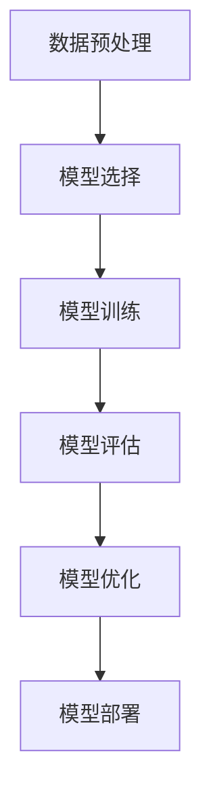

# 一切皆是映射：AI辅助的创新药物发现

## 1.背景介绍

### 1.1 药物发现的传统方法
药物发现是一个复杂且耗时的过程，传统方法通常包括以下几个步骤：靶点识别、先导化合物发现、优化、临床前研究和临床试验。每个步骤都需要大量的时间和资源，通常需要10-15年才能将一个新药推向市场。

### 1.2 人工智能在药物发现中的崛起
随着计算能力的提升和大数据的普及，人工智能（AI）在药物发现中的应用逐渐成为可能。AI可以通过分析大量的生物数据和化学数据，快速识别潜在的药物靶点和先导化合物，从而大大缩短药物发现的时间和成本。

### 1.3 文章目的
本文旨在探讨AI在创新药物发现中的应用，介绍核心概念、算法原理、数学模型、项目实践、实际应用场景、工具和资源，并展望未来的发展趋势与挑战。

## 2.核心概念与联系

### 2.1 映射的概念
在数学和计算机科学中，映射是指将一个集合中的元素关联到另一个集合中的元素的过程。在药物发现中，映射可以指将化学结构映射到生物活性，将基因表达数据映射到疾病状态等。

### 2.2 AI与映射的关系
AI技术，特别是机器学习和深度学习，擅长处理复杂的映射问题。通过训练模型，AI可以从大量数据中学习到映射关系，从而在药物发现中发挥重要作用。

### 2.3 药物发现中的映射问题
药物发现中的映射问题包括但不限于以下几个方面：
- 化学结构到生物活性的映射
- 基因表达数据到疾病状态的映射
- 药物靶点到先导化合物的映射

## 3.核心算法原理具体操作步骤

### 3.1 数据预处理
数据预处理是AI模型训练的第一步，包括数据清洗、特征提取和数据标准化等步骤。数据清洗是指去除噪声和错误数据，特征提取是指从原始数据中提取有用的信息，数据标准化是指将数据转换为统一的尺度。

### 3.2 模型选择
根据具体的映射问题选择合适的AI模型。常用的模型包括线性回归、决策树、随机森林、支持向量机、神经网络等。

### 3.3 模型训练
使用训练数据集对模型进行训练。训练的目的是让模型学习到数据中的映射关系，从而能够对新数据进行预测。

### 3.4 模型评估
使用验证数据集对模型进行评估。常用的评估指标包括准确率、精确率、召回率、F1值等。

### 3.5 模型优化
根据评估结果对模型进行优化。常用的优化方法包括调整超参数、增加训练数据、使用更复杂的模型等。

### 3.6 模型部署
将训练好的模型部署到实际应用中。部署的方式可以是本地部署、云部署或边缘部署。



## 4.数学模型和公式详细讲解举例说明

### 4.1 线性回归模型
线性回归是一种简单但常用的模型，用于预测连续变量。其数学公式为：
$$
y = \beta_0 + \beta_1 x_1 + \beta_2 x_2 + \cdots + \beta_n x_n + \epsilon
$$
其中，$y$ 是预测值，$x_1, x_2, \cdots, x_n$ 是特征变量，$\beta_0, \beta_1, \cdots, \beta_n$ 是模型参数，$\epsilon$ 是误差项。

### 4.2 神经网络模型
神经网络是一种复杂的模型，适用于处理非线性映射问题。其基本单元是神经元，神经元之间通过权重连接。神经网络的数学公式为：
$$
y = f(W \cdot x + b)
$$
其中，$y$ 是输出，$x$ 是输入，$W$ 是权重矩阵，$b$ 是偏置向量，$f$ 是激活函数。

### 4.3 示例：化学结构到生物活性的映射
假设我们有一组化学结构和对应的生物活性数据，我们可以使用线性回归模型来预测新的化学结构的生物活性。具体步骤如下：
1. 数据预处理：将化学结构转换为特征向量。
2. 模型选择：选择线性回归模型。
3. 模型训练：使用训练数据集对模型进行训练。
4. 模型评估：使用验证数据集对模型进行评估。
5. 模型优化：根据评估结果对模型进行优化。
6. 模型部署：将训练好的模型部署到实际应用中。

## 5.项目实践：代码实例和详细解释说明

### 5.1 数据预处理
```python
import pandas as pd
from sklearn.preprocessing import StandardScaler

# 读取数据
data = pd.read_csv('chemical_data.csv')

# 提取特征和标签
X = data.drop('activity', axis=1)
y = data['activity']

# 数据标准化
scaler = StandardScaler()
X_scaled = scaler.fit_transform(X)
```

### 5.2 模型选择和训练
```python
from sklearn.linear_model import LinearRegression

# 创建线性回归模型
model = LinearRegression()

# 训练模型
model.fit(X_scaled, y)
```

### 5.3 模型评估
```python
from sklearn.metrics import mean_squared_error

# 预测
y_pred = model.predict(X_scaled)

# 计算均方误差
mse = mean_squared_error(y, y_pred)
print(f'Mean Squared Error: {mse}')
```

### 5.4 模型优化
```python
from sklearn.model_selection import GridSearchCV

# 定义超参数网格
param_grid = {'fit_intercept': [True, False], 'normalize': [True, False]}

# 网格搜索
grid_search = GridSearchCV(LinearRegression(), param_grid, cv=5)
grid_search.fit(X_scaled, y)

# 最优参数
print(f'Best Parameters: {grid_search.best_params_}')
```

### 5.5 模型部署
```python
import joblib

# 保存模型
joblib.dump(grid_search.best_estimator_, 'best_model.pkl')

# 加载模型
model = joblib.load('best_model.pkl')

# 预测新数据
new_data = pd.read_csv('new_chemical_data.csv')
new_data_scaled = scaler.transform(new_data)
predictions = model.predict(new_data_scaled)
print(predictions)
```

## 6.实际应用场景

### 6.1 靶点识别
AI可以通过分析基因表达数据和蛋白质相互作用数据，快速识别潜在的药物靶点。例如，使用深度学习模型可以从基因表达数据中识别出与特定疾病相关的基因。

### 6.2 先导化合物发现
AI可以通过分析化学结构数据，快速发现潜在的先导化合物。例如，使用生成对抗网络（GAN）可以生成具有特定生物活性的化合物结构。

### 6.3 药物重定位
AI可以通过分析现有药物的生物活性数据，发现现有药物的新适应症。例如，使用机器学习模型可以预测现有药物对新疾病的疗效。

### 6.4 临床试验优化
AI可以通过分析临床试验数据，优化临床试验设计。例如，使用贝叶斯优化可以确定最佳的临床试验参数，从而提高试验成功率。

## 7.工具和资源推荐

### 7.1 数据库
- PubChem：一个包含大量化学结构和生物活性数据的数据库。
- ChEMBL：一个包含药物化学和生物活性数据的数据库。
- DrugBank：一个包含药物和药物靶点信息的数据库。

### 7.2 工具
- RDKit：一个用于化学信息学和药物发现的开源工具包。
- DeepChem：一个用于深度学习和药物发现的开源工具包。
- TensorFlow：一个用于机器学习和深度学习的开源框架。

### 7.3 资源
- 《Deep Learning for the Life Sciences》：一本介绍深度学习在生命科学中应用的书籍。
- 《Chemoinformatics and Computational Chemical Biology》：一本介绍化学信息学和计算化学生物学的书籍。
- Coursera上的《Machine Learning for Drug Discovery》课程：一个介绍机器学习在药物发现中应用的在线课程。

## 8.总结：未来发展趋势与挑战

### 8.1 未来发展趋势
- 多模态数据融合：未来的药物发现将越来越多地依赖于多模态数据的融合，包括基因组数据、蛋白质数据、化学结构数据等。
- 解释性AI：随着AI在药物发现中的应用越来越广泛，解释性AI将变得越来越重要，以便科学家能够理解和信任AI的预测结果。
- 自动化药物发现平台：未来的药物发现将越来越多地依赖于自动化平台，从数据收集、模型训练到结果分析，整个过程将实现高度自动化。

### 8.2 挑战
- 数据质量：药物发现中的数据质量问题仍然是一个重大挑战，低质量的数据可能导致模型的预测结果不准确。
- 模型泛化能力：AI模型在训练数据上的表现往往优于在新数据上的表现，提高模型的泛化能力是一个重要的研究方向。
- 伦理和法规：AI在药物发现中的应用涉及到伦理和法规问题，需要在技术发展和伦理法规之间找到平衡。

## 9.附录：常见问题与解答

### 9.1 AI在药物发现中的优势是什么？
AI可以通过分析大量的生物数据和化学数据，快速识别潜在的药物靶点和先导化合物，从而大大缩短药物发现的时间和成本。

### 9.2 如何选择合适的AI模型？
根据具体的映射问题选择合适的AI模型。常用的模型包括线性回归、决策树、随机森林、支持向量机、神经网络等。

### 9.3 如何评估AI模型的性能？
使用验证数据集对模型进行评估。常用的评估指标包括准确率、精确率、召回率、F1值等。

### 9.4 AI在药物发现中的应用有哪些实际案例？
AI在药物发现中的应用包括靶点识别、先导化合物发现、药物重定位和临床试验优化等。

### 9.5 AI在药物发现中的未来发展趋势是什么？
未来的药物发现将越来越多地依赖于多模态数据的融合、解释性AI和自动化药物发现平台。

作者：禅与计算机程序设计艺术 / Zen and the Art of Computer Programming