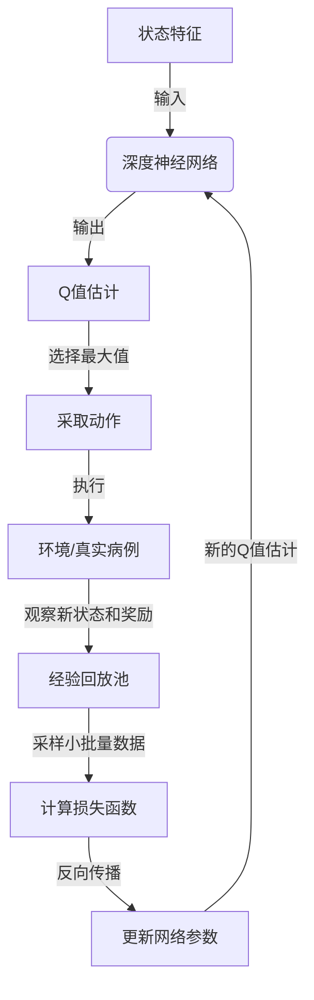

# 一切皆是映射：DQN在健康医疗领域的突破与实践

## 1.背景介绍

### 1.1 医疗健康领域的挑战

当今社会,医疗健康领域面临着诸多挑战。疾病的复杂性、医疗资源的分配不均、医疗成本的不断上涨等问题,都使得提供高质量、高效率和可及性的医疗服务变得更加困难。此外,医疗数据的海量和多样性也增加了对数据处理和分析的需求。

### 1.2 人工智能在医疗健康领域的应用

人工智能(AI)技术在医疗健康领域的应用为解决上述挑战提供了新的途径。通过机器学习算法对海量医疗数据进行处理和分析,AI系统可以辅助医生进行疾病诊断、治疗方案制定、药物开发等工作,提高医疗服务的质量和效率。

### 1.3 深度强化学习(DRL)的兴起

作为人工智能的一个重要分支,深度强化学习(Deep Reinforcement Learning, DRL)近年来受到了广泛关注。DRL将深度神经网络与强化学习相结合,能够在复杂的环境中学习并优化决策策略,从而解决高维、连续的决策问题。这使得DRL在医疗健康领域具有巨大的应用潜力。

## 2.核心概念与联系

### 2.1 深度Q网络(DQN)

深度Q网络(Deep Q-Network, DQN)是DRL领域的一个里程碑式算法,它将深度神经网络应用于强化学习的Q-Learning算法中。DQN能够通过神经网络近似Q函数,从而解决高维状态和动作空间的问题,实现了在复杂环境中的有效学习。

DQN的核心思想是使用一个深度神经网络来估计Q值函数,即在给定状态下采取某个动作的期望累积奖励。通过不断地与环境交互并更新网络参数,DQN可以逐步优化Q值函数的估计,从而找到最优策略。

### 2.2 DQN与医疗决策的映射关系

在医疗决策过程中,可以将患者的症状、体征、检查结果等作为状态,将医生的诊断、治疗、用药等决策行为作为动作,将患者的治疗效果、生存质量等作为奖励。通过这种状态-动作-奖励的映射关系,医疗决策问题可以转化为一个强化学习问题,从而应用DQN等DRL算法进行求解。

DQN在医疗决策中的优势在于,它可以通过学习大量的真实病例数据,逐步优化诊断和治疗策略,从而提高医疗决策的准确性和有效性。同时,DQN还能够处理高维、连续的状态和动作空间,适应复杂的医疗决策场景。

## 3.核心算法原理具体操作步骤

### 3.1 DQN算法流程

DQN算法的核心流程如下:

1. 初始化深度神经网络和经验回放池(Experience Replay)
2. 对于每一个时间步:
    a. 根据当前策略从神经网络输出选择动作
    b. 执行选择的动作,观察下一个状态和奖励
    c. 将(状态,动作,奖励,下一状态)的转换存入经验回放池
    d. 从经验回放池中随机采样一个小批量数据
    e. 计算目标Q值和当前Q值之间的均方误差
    f. 通过反向传播算法更新神经网络参数,最小化均方误差
3. 重复步骤2,直到策略收敛

其中,经验回放池的作用是打破数据样本之间的相关性,增加数据的利用效率。目标Q值的计算利用了贝尔曼方程,通过bootstrapping的方式估计期望累积奖励。

### 3.2 改进的DQN算法

为了提高DQN的性能和稳定性,研究人员提出了多种改进方法,例如:

1. **Double DQN**: 消除了原始DQN中的过估计问题。
2. **Dueling DQN**: 将Q值分解为状态值和优势函数,提高了学习效率。
3. **Prioritized Experience Replay**: 根据转换的重要性对经验进行优先级采样,提高了数据利用效率。
4. **多步Bootstrap目标**: 利用n步累积奖励作为目标,提高了目标值的准确性。
5. **分布式优先经验回放**: 在分布式环境下高效地共享和利用经验数据。

这些改进方法有助于提高DQN在医疗决策等复杂任务中的性能和鲁棒性。

## 4.数学模型和公式详细讲解举例说明

### 4.1 Q-Learning算法

Q-Learning是一种基于时间差分的强化学习算法,它试图直接估计最优Q函数:

$$Q^*(s,a) = \mathbb{E}\left[r_t + \gamma\max_{a'}Q^*(s_{t+1},a')|s_t=s,a_t=a\right]$$

其中,$s$和$a$分别表示状态和动作,$r_t$是立即奖励,$\gamma$是折现因子,用于权衡当前奖励和未来奖励的重要性。

Q-Learning通过不断更新Q值表格,逐步逼近最优Q函数。但是,在高维状态和动作空间中,表格方法就变得无法实施了。这就需要使用函数逼近的方法,例如深度神经网络。

### 4.2 DQN中的Q值估计

在DQN中,我们使用一个深度神经网络$Q(s,a;\theta)$来估计Q函数,其中$\theta$是网络参数。我们定义损失函数为:

$$L(\theta) = \mathbb{E}_{(s,a,r,s')\sim D}\left[(r + \gamma\max_{a'}Q(s',a';\theta^-) - Q(s,a;\theta))^2\right]$$

其中,$D$是经验回放池,$(s,a,r,s')$是从中采样的转换,$\theta^-$是目标网络的参数(固定的,用于估计目标Q值)。

通过最小化损失函数,我们可以更新网络参数$\theta$,使得$Q(s,a;\theta)$逐步逼近真实的Q函数。

### 4.3 示例:糖尿病治疗决策

假设我们要使用DQN来优化糖尿病患者的治疗决策。状态可以包括患者的年龄、体重指数、血糖水平等;动作可以是调整饮食、运动、药物剂量等;奖励可以是血糖控制的效果、生活质量的改善等。

我们可以构建一个深度神经网络,输入是状态特征,输出是每个可能动作的Q值估计。通过与环境(即真实病例数据)交互,并不断更新网络参数,DQN可以逐步学习到最优的治疗策略,从而提高糖尿病患者的治疗效果。



## 5.项目实践:代码实例和详细解释说明

以下是一个使用PyTorch实现的简单DQN代码示例,用于解决一个医疗诊断问题。

### 5.1 定义环境和奖励函数

```python
import numpy as np

# 定义状态空间和动作空间
STATE_DIM = 10  # 患者症状和体征的特征数
ACTION_DIM = 5  # 可能的诊断结果数

# 定义奖励函数
def reward_function(state, action, next_state):
    # 根据状态、动作和下一状态计算奖励
    # 这里只是一个示例,实际情况需要根据具体问题进行定义
    if next_state[-1] == 0:  # 患者康复
        return 10
    elif next_state[-1] == 1:  # 患者病情加重
        return -10
    else:
        return -1  # 其他情况的小惩罚

# 定义环境动态
def env_dynamic(state, action):
    # 根据状态和动作计算下一状态
    # 这里只是一个示例,实际情况需要根据具体问题进行定义
    next_state = np.random.randn(STATE_DIM)
    reward = reward_function(state, action, next_state)
    return next_state, reward
```

### 5.2 定义DQN网络

```python
import torch
import torch.nn as nn

class DQN(nn.Module):
    def __init__(self, state_dim, action_dim):
        super(DQN, self).__init__()
        self.fc1 = nn.Linear(state_dim, 64)
        self.fc2 = nn.Linear(64, 64)
        self.fc3 = nn.Linear(64, action_dim)

    def forward(self, x):
        x = torch.relu(self.fc1(x))
        x = torch.relu(self.fc2(x))
        q_values = self.fc3(x)
        return q_values
```

### 5.3 实现DQN算法

```python
import random
from collections import deque

REPLAY_BUFFER_SIZE = 10000  # 经验回放池大小
BATCH_SIZE = 32  # 小批量数据大小
GAMMA = 0.99  # 折现因子
LEARNING_RATE = 1e-3  # 学习率
TARGET_UPDATE_FREQ = 100  # 目标网络更新频率

# 初始化经验回放池
replay_buffer = deque(maxlen=REPLAY_BUFFER_SIZE)

# 初始化Q网络和目标网络
policy_net = DQN(STATE_DIM, ACTION_DIM)
target_net = DQN(STATE_DIM, ACTION_DIM)
target_net.load_state_dict(policy_net.state_dict())  # 初始化目标网络参数

optimizer = torch.optim.Adam(policy_net.parameters(), lr=LEARNING_RATE)
loss_fn = nn.MSELoss()

# 训练循环
for episode in range(NUM_EPISODES):
    state = env.reset()  # 重置环境
    done = False
    while not done:
        # 选择动作
        action = policy_net(torch.from_numpy(state).float()).max(0)[1].item()
        
        # 执行动作并观察下一状态和奖励
        next_state, reward = env_dynamic(state, action)
        done = ...  # 判断是否达到终止条件
        
        # 存储转换
        replay_buffer.append((state, action, reward, next_state, done))
        
        # 从经验回放池中采样小批量数据
        batch = random.sample(replay_buffer, BATCH_SIZE)
        states, actions, rewards, next_states, dones = zip(*batch)
        
        # 计算目标Q值
        q_values = policy_net(torch.from_numpy(np.array(states)).float())
        next_q_values = target_net(torch.from_numpy(np.array(next_states)).float()).max(1)[0].detach()
        targets = rewards + GAMMA * next_q_values * (1 - dones)
        
        # 计算损失并更新网络参数
        loss = loss_fn(q_values.gather(1, torch.from_numpy(np.array(actions)).long().unsqueeze(1)), targets.unsqueeze(1))
        optimizer.zero_grad()
        loss.backward()
        optimizer.step()
        
        # 更新目标网络
        if episode % TARGET_UPDATE_FREQ == 0:
            target_net.load_state_dict(policy_net.state_dict())
        
        state = next_state
```

在上述代码中,我们首先定义了环境动态和奖励函数。然后,我们定义了DQN网络结构,并实现了DQN算法的核心部分,包括经验回放池、Q值估计、目标Q值计算、网络参数更新等。

需要注意的是,这只是一个简单的示例,实际应用中需要根据具体问题进行调整和优化,例如添加改进的DQN算法、处理连续动作空间等。

## 6.实际应用场景

DQN在医疗健康领域有着广泛的应用前景,包括但不限于:

### 6.1 疾病诊断和治疗决策

DQN可以应用于各种疾病的诊断和治疗决策,例如糖尿病、癌症、心血管疾病等。通过学习大量真实病例数据,DQN能够优化诊断策略和治疗方案,提高诊断准确性和治疗效果。

### 6.2 智能辅助系统

将DQN集成到医疗辅助系统中,可以为医生提供诊断建议和治疗方案参考,提高医疗决策的质量和效率。这种人机协作模式有