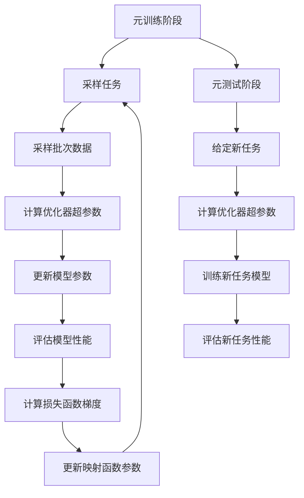

# 一切皆是映射：Meta-SGD：元学习的优化器调整

## 1. 背景介绍
### 1.1 元学习概述
元学习(Meta-Learning)，也被称为"学会学习"(Learning to Learn)，是机器学习领域的一个重要分支。它旨在设计能够适应和学习新任务的学习算法，而无需从头开始训练模型。元学习的目标是通过在一系列相关任务上训练模型，使其能够快速适应新的、未见过的任务，从而提高学习效率和泛化能力。

### 1.2 优化器调整的重要性
在深度学习中，优化器(Optimizer)是训练神经网络的关键组件之一。它决定了如何更新模型的参数，以最小化损失函数并提高模型性能。常见的优化器包括随机梯度下降(SGD)、Adam、RMSprop等。然而，对于不同的任务和数据集，最优的优化器设置可能会有所不同。因此，如何自动调整优化器的超参数，以适应不同的学习任务，成为了元学习领域的一个重要研究方向。

### 1.3 Meta-SGD的提出
Meta-SGD是由Chelsea Finn等人在2017年提出的一种元学习算法，它通过学习优化器的超参数来实现对新任务的快速适应。与传统的手动调整优化器不同，Meta-SGD可以自动学习适合特定任务的优化器设置，从而提高学习效率和性能。

## 2. 核心概念与联系
### 2.1 元学习与优化器调整
元学习的核心思想是通过在一系列相关任务上训练模型，使其能够快速适应新的任务。在优化器调整的背景下，元学习的目标是学习一个优化器，使其能够在新任务上快速收敛并取得良好的性能。通过元学习，我们可以自动调整优化器的超参数，如学习率、动量等，以适应不同的任务特点。

### 2.2 梯度下降与优化器
梯度下降是机器学习中最常用的优化算法之一。它通过计算损失函数对模型参数的梯度，并沿着梯度的反方向更新参数，以最小化损失函数。优化器则是梯度下降算法的一种扩展，它引入了额外的超参数和策略，如学习率衰减、动量等，以加速收敛并提高优化性能。

### 2.3 元学习与映射
元学习可以看作是一种映射关系的学习。在优化器调整的背景下，元学习旨在学习一个映射函数，将任务的特征映射到适合该任务的优化器超参数。通过学习这种映射关系，Meta-SGD可以根据任务的特点自动调整优化器，从而实现快速适应和高效学习。

## 3. 核心算法原理具体操作步骤
### 3.1 Meta-SGD的优化目标
Meta-SGD的优化目标是学习一个映射函数 $f_{\theta}$，将任务的特征 $\mathbf{x}$ 映射到适合该任务的优化器超参数 $\mathbf{u}$：

$$\mathbf{u} = f_{\theta}(\mathbf{x})$$

其中，$\theta$ 表示映射函数的参数。通过最小化一系列任务上的损失函数，Meta-SGD可以学习到一个通用的映射函数，使其能够在新任务上快速适应并取得良好的性能。

### 3.2 Meta-SGD的训练过程
Meta-SGD的训练过程分为两个阶段：元训练阶段和元测试阶段。

在元训练阶段，我们有一个任务集合 $\mathcal{T} = \{\mathcal{T}_1, \mathcal{T}_2, ..., \mathcal{T}_n\}$，每个任务 $\mathcal{T}_i$ 都有自己的训练集 $\mathcal{D}^{tr}_i$ 和测试集 $\mathcal{D}^{te}_i$。对于每个任务 $\mathcal{T}_i$，我们执行以下步骤：

1. 从训练集 $\mathcal{D}^{tr}_i$ 中采样一个批次的数据 $\mathbf{x}^{tr}_i$。
2. 使用当前的映射函数 $f_{\theta}$ 计算优化器超参数 $\mathbf{u}_i = f_{\theta}(\mathbf{x}^{tr}_i)$。
3. 使用计算得到的优化器超参数 $\mathbf{u}_i$ 对模型进行一步梯度下降，得到更新后的模型参数 $\mathbf{w}'_i$。
4. 在测试集 $\mathcal{D}^{te}_i$ 上评估更新后的模型，计算损失函数 $\mathcal{L}(\mathbf{w}'_i, \mathcal{D}^{te}_i)$。
5. 计算损失函数对映射函数参数 $\theta$ 的梯度，并使用元优化器（如Adam）更新 $\theta$。

重复以上步骤，直到映射函数 $f_{\theta}$ 收敛。

在元测试阶段，给定一个新的任务 $\mathcal{T}_{new}$，我们使用学习到的映射函数 $f_{\theta}$ 计算优化器超参数 $\mathbf{u}_{new} = f_{\theta}(\mathbf{x}_{new})$，然后使用这些超参数对新任务的模型进行训练，并评估其性能。

### 3.3 算法流程图
下面是 Meta-SGD 算法的流程图，使用 Mermaid 绘制：



## 4. 数学模型和公式详细讲解举例说明
### 4.1 映射函数的数学表示
Meta-SGD中的映射函数 $f_{\theta}$ 可以使用神经网络来实现。假设我们使用一个简单的前馈神经网络，它包含一个输入层、一个隐藏层和一个输出层。映射函数可以表示为：

$$f_{\theta}(\mathbf{x}) = \mathbf{W}_2 \cdot \sigma(\mathbf{W}_1 \cdot \mathbf{x} + \mathbf{b}_1) + \mathbf{b}_2$$

其中，$\mathbf{W}_1$ 和 $\mathbf{W}_2$ 分别是输入层到隐藏层和隐藏层到输出层的权重矩阵，$\mathbf{b}_1$ 和 $\mathbf{b}_2$ 是对应的偏置项，$\sigma$ 是激活函数（如ReLU）。

### 4.2 优化器超参数的计算
给定一个任务的特征 $\mathbf{x}$，我们可以使用映射函数 $f_{\theta}$ 计算适合该任务的优化器超参数 $\mathbf{u}$：

$$\mathbf{u} = f_{\theta}(\mathbf{x}) = [u_1, u_2, ..., u_m]$$

其中，$m$ 是优化器超参数的数量。例如，对于SGD优化器，$\mathbf{u}$ 可能包含学习率和动量两个超参数。

### 4.3 模型参数的更新
在每个任务上，我们使用计算得到的优化器超参数 $\mathbf{u}$ 对模型参数进行更新。对于SGD优化器，更新公式为：

$$\mathbf{w}' = \mathbf{w} - u_1 \cdot \nabla_{\mathbf{w}} \mathcal{L}(\mathbf{w}, \mathcal{D}^{tr})$$

其中，$\mathbf{w}$ 是模型参数，$u_1$ 是学习率，$\nabla_{\mathbf{w}} \mathcal{L}(\mathbf{w}, \mathcal{D}^{tr})$ 是损失函数对模型参数的梯度。

### 4.4 映射函数参数的更新
在元训练阶段，我们需要更新映射函数的参数 $\theta$。这可以通过最小化一系列任务上的损失函数来实现：

$$\min_{\theta} \sum_{\mathcal{T}_i \in \mathcal{T}} \mathcal{L}(\mathbf{w}'_i, \mathcal{D}^{te}_i)$$

其中，$\mathbf{w}'_i$ 是在任务 $\mathcal{T}_i$ 上使用优化器超参数 $\mathbf{u}_i$ 更新后的模型参数，$\mathcal{D}^{te}_i$ 是任务 $\mathcal{T}_i$ 的测试集。

我们可以使用梯度下降法来更新映射函数参数 $\theta$：

$$\theta' = \theta - \eta \cdot \nabla_{\theta} \sum_{\mathcal{T}_i \in \mathcal{T}} \mathcal{L}(\mathbf{w}'_i, \mathcal{D}^{te}_i)$$

其中，$\eta$ 是元学习率，$\nabla_{\theta} \sum_{\mathcal{T}_i \in \mathcal{T}} \mathcal{L}(\mathbf{w}'_i, \mathcal{D}^{te}_i)$ 是损失函数对映射函数参数的梯度。

## 5. 项目实践：代码实例和详细解释说明
下面是一个使用PyTorch实现Meta-SGD的简单示例代码：

```python
import torch
import torch.nn as nn
import torch.optim as optim

# 定义映射函数
class MetaOptimizer(nn.Module):
    def __init__(self, input_size, hidden_size, output_size):
        super(MetaOptimizer, self).__init__()
        self.fc1 = nn.Linear(input_size, hidden_size)
        self.fc2 = nn.Linear(hidden_size, output_size)
        
    def forward(self, x):
        x = torch.relu(self.fc1(x))
        x = self.fc2(x)
        return x

# 定义任务模型
class TaskModel(nn.Module):
    def __init__(self, input_size, hidden_size, output_size):
        super(TaskModel, self).__init__()
        self.fc1 = nn.Linear(input_size, hidden_size)
        self.fc2 = nn.Linear(hidden_size, output_size)
        
    def forward(self, x):
        x = torch.relu(self.fc1(x))
        x = self.fc2(x)
        return x

# 元训练函数
def meta_train(meta_optimizer, task_model, tasks, meta_lr, inner_lr, num_epochs):
    meta_optimizer_params = meta_optimizer.parameters()
    meta_optimizer_optimizer = optim.Adam(meta_optimizer_params, lr=meta_lr)
    
    for epoch in range(num_epochs):
        for task in tasks:
            # 采样批次数据
            train_data, test_data = task
            
            # 计算优化器超参数
            optimizer_params = meta_optimizer(train_data)
            inner_optimizer = optim.SGD(task_model.parameters(), lr=inner_lr, momentum=optimizer_params[0])
            
            # 更新模型参数
            inner_optimizer.zero_grad()
            train_loss = nn.MSELoss()(task_model(train_data[0]), train_data[1])
            train_loss.backward()
            inner_optimizer.step()
            
            # 评估模型性能
            test_loss = nn.MSELoss()(task_model(test_data[0]), test_data[1])
            
            # 计算损失函数梯度并更新映射函数参数
            meta_optimizer_optimizer.zero_grad()
            test_loss.backward()
            meta_optimizer_optimizer.step()

# 元测试函数
def meta_test(meta_optimizer, task_model, new_task, inner_lr):
    # 计算优化器超参数
    optimizer_params = meta_optimizer(new_task[0])
    inner_optimizer = optim.SGD(task_model.parameters(), lr=inner_lr, momentum=optimizer_params[0])
    
    # 训练新任务模型
    inner_optimizer.zero_grad()
    train_loss = nn.MSELoss()(task_model(new_task[0][0]), new_task[0][1])
    train_loss.backward()
    inner_optimizer.step()
    
    # 评估新任务性能
    test_loss = nn.MSELoss()(task_model(new_task[1][0]), new_task[1][1])
    return test_loss.item()

# 主函数
def main():
    # 设置超参数
    input_size = 10
    hidden_size = 20
    output_size = 5
    meta_lr = 0.001
    inner_lr = 0.01
    num_epochs = 100
    
    # 创建映射函数和任务模型
    meta_optimizer = MetaOptimizer(input_size, hidden_size, 1)
    task_model