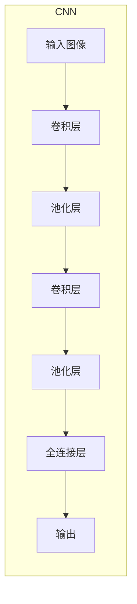

# 一切皆是映射：卷积神经网络(CNNs)在图像处理中的应用

## 1.背景介绍

### 1.1 图像处理的重要性

在当今数字时代,图像处理无处不在。从智能手机拍摄的照片到医学成像诊断,从自动驾驶汽车的环境感知到卫星遥感图像分析,图像处理技术都扮演着关键角色。图像是信息的载体,能够直观地呈现复杂的视觉数据,因此图像处理技术对于人工智能、计算机视觉等领域至关重要。

### 1.2 传统图像处理方法的局限性  

早期的图像处理方法主要依赖于手工设计的特征提取算法和分类器,如霍夫变换、SIFT、HOG等。这些方法需要大量的领域知识和人工参与,且通常只能解决特定的问题。随着图像数据的快速增长和问题复杂度的提高,传统方法遇到了瓶颈,难以满足实际需求。

### 1.3 深度学习的兴起

深度学习作为一种有效的机器学习方法,能够自动从数据中学习特征表示,并对复杂模式进行建模。2012年,AlexNet在ImageNet大赛中取得了突破性的成绩,标志着深度学习在计算机视觉领域的崛起。自此,各种基于深度学习的图像处理模型层出不穷,取得了卓越的性能表现。

## 2.核心概念与联系

### 2.1 卷积神经网络(CNNs)

卷积神经网络(Convolutional Neural Networks, CNNs)是一种专门用于处理网格结构数据(如图像)的深度神经网络。CNNs的核心思想是通过卷积操作来提取局部特征,并通过池化操作来降低特征维度,最终将这些特征映射到所需的输出空间。



### 2.2 卷积层

卷积层是CNNs的核心部分,它通过滑动卷积核(kernel)在输入数据上执行卷积操作,从而提取局部特征。卷积操作实现了稀疏连接和权重共享,大大减少了参数量,提高了计算效率。

### 2.3 池化层

池化层通常跟随在卷积层之后,其作用是对卷积层的输出进行下采样,减小特征图的空间维度。常用的池化操作有最大池化和平均池化。池化层不仅降低了计算量,还增强了模型的平移不变性。

### 2.4 全连接层

全连接层位于CNNs的最后几层,它将前面层的特征映射到最终的输出空间。全连接层的作用类似于传统的人工神经网络,用于对提取的特征进行组合和分类。

## 3.核心算法原理具体操作步骤

### 3.1 卷积操作

卷积操作是CNNs的核心算法,它模拟了生物视觉系统中的感受野机制。具体步骤如下:

1. 初始化卷积核(kernel)的权重参数。
2. 将卷积核在输入数据(如图像)上滑动,对每个局部区域执行元素级乘积和求和操作。
3. 将求和结果存储在输出特征图(feature map)的对应位置。
4. 对卷积核的权重参数进行反向传播训练,使输出特征图能够捕捉到有用的视觉模式。

数学表示:
$$
(I * K)(i,j) = \sum_{m}\sum_{n}I(i+m,j+n)K(m,n)
$$

其中,$I$是输入数据,$K$是卷积核,$i,j$是输出特征图的位置索引。

### 3.2 池化操作

池化操作通常在卷积操作之后进行,其目的是降低特征维度并提高模型的平移不变性。常见的池化操作有:

1. **最大池化(Max Pooling)**: 在池化窗口内取最大值作为输出。
2. **平均池化(Average Pooling)**: 在池化窗口内取平均值作为输出。

数学表示(以2x2最大池化为例):
$$
f(i,j) = \max\limits_{0\leq m,n<2}I(i+m,j+n)
$$

其中,$I$是输入特征图,$f$是输出特征图。

### 3.3 反向传播训练

CNNs的训练过程采用反向传播算法,通过最小化损失函数来优化网络参数。具体步骤如下:

1. 前向传播:输入数据通过卷积、池化等操作,计算出预测值。
2. 计算损失:将预测值与真实标签计算损失函数(如交叉熵损失)。
3. 反向传播:根据链式法则,计算每个参数相对于损失的梯度。
4. 参数更新:使用优化算法(如SGD、Adam等)更新网络参数。
5. 重复以上步骤,直至模型收敛。

## 4.数学模型和公式详细讲解举例说明

### 4.1 卷积层的数学模型

卷积层的核心操作是卷积,它可以用离散卷积的数学公式表示:

$$
(I * K)(i,j) = \sum_{m}\sum_{n}I(i+m,j+n)K(m,n)
$$

其中:
- $I$是输入数据(如图像)
- $K$是卷积核的权重参数
- $i,j$是输出特征图的位置索引
- $m,n$是卷积核的尺寸

卷积操作可视为在输入数据上滑动卷积核,对每个局部区域执行元素级乘积和求和。这种操作能够有效捕捉输入数据的局部模式,是CNN提取特征的关键步骤。

例如,对于一个3x3的灰度图像区域和一个2x2的卷积核,卷积操作的计算过程如下:

输入图像区域:
$$
\begin{bmatrix}
1 & 0 & 2\\
3 & 4 & 1\\
2 & 1 & 0
\end{bmatrix}
$$

卷积核权重:
$$
\begin{bmatrix}
1 & 2\\
3 & 1
\end{bmatrix}
$$

输出特征图(0,0)位置的计算:
$$
\begin{aligned}
(I * K)(0,0) &= 1\times1 + 0\times3 + 2\times2 + 3\times1 + 4\times0 + 1\times2 + 2\times0 + 1\times1 + 0\times1\\
&= 1 + 0 + 4 + 3 + 0 + 2 + 0 + 1 + 0\\
&= 11
\end{aligned}
$$

通过在输入数据上滑动卷积核并重复上述操作,就可以得到完整的输出特征图。

### 4.2 池化层的数学模型

池化层的作用是对输入特征图进行下采样,减小其空间维度。常见的池化操作有最大池化和平均池化。

**最大池化**的数学表达式为:
$$
f(i,j) = \max\limits_{0\leq m,n<k}I(i+m,j+n)
$$
其中:
- $I$是输入特征图
- $f$是输出特征图
- $k$是池化窗口的大小(如2x2)
- $i,j$是输出特征图的位置索引
- $m,n$是池化窗口内的偏移量

例如,对于一个4x4的输入特征图和2x2的最大池化窗口,池化操作的计算过程如下:

输入特征图:
$$
\begin{bmatrix}
1 & 3 & 2 & 4\\
5 & 6 & 7 & 8\\
9 & 7 & 5 & 3\\
1 & 2 & 6 & 4
\end{bmatrix}
$$

输出特征图:
$$
\begin{bmatrix}
6 & 8\\
9 & 7
\end{bmatrix}
$$

**平均池化**的数学表达式为:
$$
f(i,j) = \frac{1}{k^2}\sum_{m=0}^{k-1}\sum_{n=0}^{k-1}I(i+m,j+n)
$$
其中符号含义与最大池化相同,只是将最大值操作换成了求和并取平均值。

池化操作不仅能够减小特征图的空间维度,还能增强模型对平移的鲁棒性,提高泛化能力。

### 4.3 全连接层的数学模型

全连接层是传统人工神经网络的核心部分,它将前面卷积层和池化层提取的特征映射到最终的输出空间。

设输入为$\boldsymbol{x}=(x_1,x_2,\dots,x_n)$,权重矩阵为$\boldsymbol{W}$,偏置向量为$\boldsymbol{b}$,则全连接层的输出$\boldsymbol{y}$可表示为:

$$
\boldsymbol{y} = \boldsymbol{Wx} + \boldsymbol{b}
$$

其中,$\boldsymbol{W}$是一个$m\times n$的矩阵,$\boldsymbol{b}$是一个$m$维向量,$\boldsymbol{y}$是一个$m$维输出向量。

在分类任务中,全连接层的输出通常会经过一个激活函数(如Softmax),将其映射到概率分布上:

$$
\hat{y}_i = \frac{e^{y_i}}{\sum_{j=1}^{m}e^{y_j}}
$$

其中,$\hat{y}_i$表示输入$\boldsymbol{x}$属于第$i$类的预测概率。

通过最小化预测概率与真实标签之间的交叉熵损失,可以对全连接层的权重矩阵$\boldsymbol{W}$和偏置向量$\boldsymbol{b}$进行训练,从而实现对输入特征的分类或回归。

## 5.项目实践：代码实例和详细解释说明

为了更好地理解卷积神经网络在图像处理中的应用,我们将使用Python和PyTorch框架,构建一个用于手写数字识别的CNN模型。

### 5.1 导入所需库

```python
import torch
import torch.nn as nn
import torch.optim as optim
from torchvision import datasets, transforms
```

### 5.2 定义CNN模型

```python
class CNN(nn.Module):
    def __init__(self):
        super(CNN, self).__init__()
        self.conv1 = nn.Conv2d(1, 16, kernel_size=3, stride=1, padding=1)
        self.bn1 = nn.BatchNorm2d(16)
        self.relu1 = nn.ReLU()
        self.pool1 = nn.MaxPool2d(kernel_size=2)
        
        self.conv2 = nn.Conv2d(16, 32, kernel_size=3, stride=1, padding=1)
        self.bn2 = nn.BatchNorm2d(32)
        self.relu2 = nn.ReLU()
        self.pool2 = nn.MaxPool2d(kernel_size=2)
        
        self.fc1 = nn.Linear(32 * 7 * 7, 128)
        self.relu3 = nn.ReLU()
        self.fc2 = nn.Linear(128, 10)

    def forward(self, x):
        out = self.conv1(x)
        out = self.bn1(out)
        out = self.relu1(out)
        out = self.pool1(out)
        
        out = self.conv2(out)
        out = self.bn2(out)
        out = self.relu2(out)
        out = self.pool2(out)
        
        out = out.view(-1, 32 * 7 * 7)
        out = self.fc1(out)
        out = self.relu3(out)
        out = self.fc2(out)
        return out
```

这个CNN模型包含以下主要组件:

1. 两个卷积层(`nn.Conv2d`)
2. 两个批归一化层(`nn.BatchNorm2d`)
3. 三个ReLU激活函数层(`nn.ReLU`)
4. 两个最大池化层(`nn.MaxPool2d`)
5. 两个全连接层(`nn.Linear`)

模型的输入是28x28的灰度图像,输出是10个类别的概率分布(对应0-9的手写数字)。

### 5.3 加载数据集

```python
train_loader = torch.utils.data.DataLoader(
    datasets.MNIST('data', train=True, download=True,
                   transform=transforms.Compose([
                       transforms.ToTensor(),
                       transforms.Normalize((0.1307,), (0.3081,))
                   ])),
    batch_size=64, shuffle=True)

test_loader = torch.utils.data.DataLoader(
    datasets.MNIST('data', train=False, transform=transforms.Compose([
                