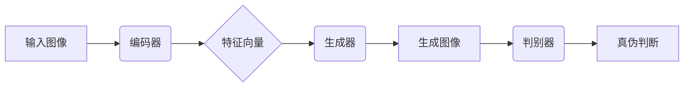
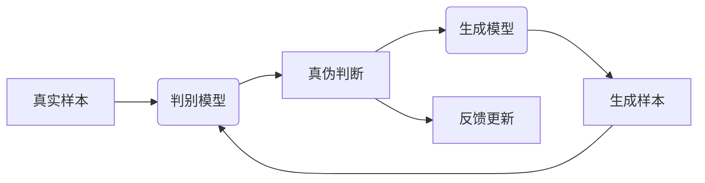
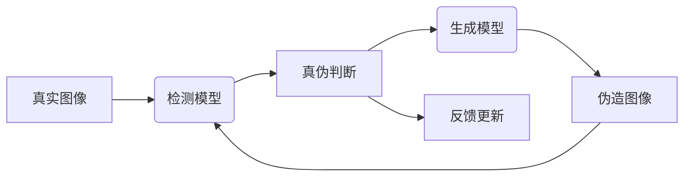
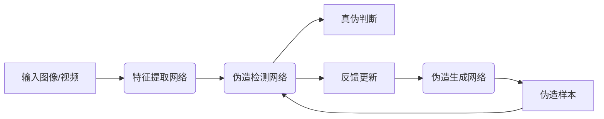
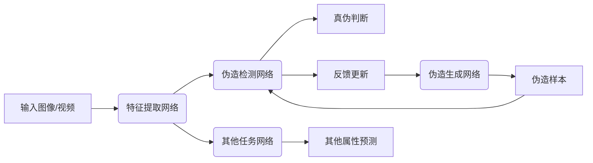
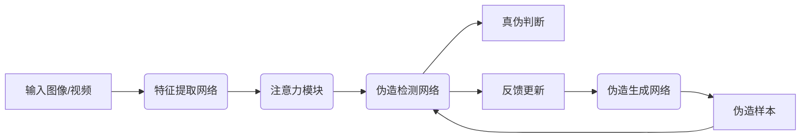
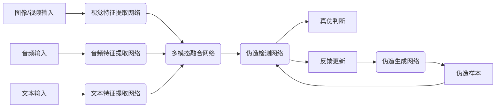

# 一切皆是映射：深度伪造检测与对抗性神经网络

## 1.背景介绍

### 1.1 深度伪造的兴起

随着人工智能和深度学习技术的不断发展,深度伪造(DeepFake)技术近年来迅速兴起。深度伪造是指利用人工智能算法,特别是生成对抗网络(Generative Adversarial Networks, GANs),合成或操纵视频、音频和图像等多媒体内容,使其看起来极其真实,难以辨别真伪。

深度伪造技术最初主要应用于娱乐领域,如将名人的面部合成到电影或视频中。然而,随着技术的不断进步,深度伪造也可被滥用于制造虚假信息、诽谤等违法行为,给社会带来严重的安全隐患。因此,及时有效地检测深度伪造内容,成为了一项紧迫而重要的任务。

### 1.2 深度伪造检测的挑战

检测深度伪造内容面临着诸多挑战:

1. **技术进步加速**:深度伪造技术的发展速度极快,检测算法难以跟上。
2. **样本缺乏**:获取大量高质量的深度伪造样本用于训练检测模型是一大挑战。
3. **对抗性**:深度伪造生成模型在不断进化,旨在躲避检测。
4. **泛化性差**:大多数检测模型只能识别特定类型的伪造,难以泛化到新的伪造手段。
5. **计算资源要求高**:检测深度伪造往往需要大量计算资源。

### 1.3 对抗性神经网络的应用

为了应对深度伪造带来的挑战,研究人员开始探索对抗性神经网络在深度伪造检测中的应用。对抗性神经网络由生成网络和判别网络组成,两者相互对抗,最终达到生成逼真样本和精确识别样本的目的。

在深度伪造检测中,判别网络可以被训练为检测模型,而生成网络则用于生成逼真的伪造样本,从而缓解真实样本缺乏的问题。通过不断对抗训练,检测模型可以持续提高对抗性,以应对不断升级的伪造手段。

本文将深入探讨深度伪造检测与对抗性神经网络的原理、算法和实践,为读者提供全面的技术洞见。

## 2.核心概念与联系

### 2.1 深度伪造技术

深度伪造技术主要基于生成对抗网络(GANs)和自动编码器(Autoencoders)等深度学习模型。以人脸操纵为例:

1. **编码器(Encoder)**将输入图像编码为低维特征向量。
2. **生成器(Generator)**根据编码特征和目标人脸特征,生成新的面部图像。
3. **判别器(Discriminator)**判断生成图像是真是假。

生成器和判别器相互对抗,生成器不断优化以欺骗判别器,判别器则努力区分真伪。经过大量迭代,生成器可以生成极其逼真的伪造图像。



### 2.2 对抗性神经网络

对抗性神经网络(Adversarial Neural Networks, ANNs)由生成模型和判别模型组成,两者相互对抗以达到各自目标。

1. **生成模型(Generator)**:旨在生成逼真的样本,以欺骗判别模型。
2. **判别模型(Discriminator)**:旨在精确区分真实样本和生成样本。

生成模型和判别模型相互博弈,生成模型不断优化以生成更逼真的样本,判别模型则不断提高判别能力。最终,两者均收敛于最优状态。



对抗性神经网络可以看作是一种无监督学习方法,因为训练过程中不需要人工标注真实数据,而是通过生成模型和判别模型的对抗来学习数据分布。

### 2.3 深度伪造检测与对抗性神经网络

在深度伪造检测任务中,可以将判别模型训练为检测模型,用于区分真实图像和伪造图像。而生成模型则用于生成逼真的伪造样本,缓解真实伪造样本缺乏的问题。

通过不断对抗训练,检测模型可以持续提高对抗性,以应对不断升级的伪造手段。同时,生成模型也在不断优化,产生更加逼真的伪造样本,从而促使检测模型进一步提高性能。



对抗性神经网络为深度伪造检测提供了一种有效的解决方案,可以应对技术快速发展和样本缺乏等挑战。下面将详细介绍相关算法原理和实现细节。

## 3.核心算法原理具体操作步骤  

### 3.1 生成对抗网络(GANs)

生成对抗网络是深度伪造检测中常用的生成模型,由生成器(Generator)和判别器(Discriminator)组成。

**生成器(Generator)** 是一个神经网络,其输入是一个随机噪声向量 $\mathbf{z}$,输出是一个样本 $G(\mathbf{z})$,目标是生成逼真的样本以欺骗判别器。

**判别器(Discriminator)** 也是一个神经网络,其输入是真实样本 $\mathbf{x}$ 或生成样本 $G(\mathbf{z})$,输出是一个标量 $D(\mathbf{x})$ 或 $D(G(\mathbf{z}))$,表示输入是真实样本的概率。

生成器和判别器相互对抗,形成一个 min-max 优化问题:

$$\min_G \max_D V(D, G) = \mathbb{E}_{\mathbf{x} \sim p_{\text{data}}(\mathbf{x})}[\log D(\mathbf{x})] + \mathbb{E}_{\mathbf{z} \sim p_{\mathbf{z}}(\mathbf{z})}[\log (1 - D(G(\mathbf{z})))]$$

其中, $p_{\text{data}}$ 是真实数据分布, $p_{\mathbf{z}}$ 是随机噪声的分布(通常为高斯分布)。

#### 3.1.1 训练步骤

1. 从真实数据 $\mathbf{x}$ 和噪声 $\mathbf{z}$ 中采样批量数据。
2. 更新判别器 $D$ 以最大化 $\log D(\mathbf{x}) + \log (1 - D(G(\mathbf{z})))$。
3. 更新生成器 $G$ 以最小化 $\log (1 - D(G(\mathbf{z})))$。
4. 重复步骤 1-3,直到收敛。

#### 3.1.2 算法流程图

```mermaid
graph TD
    A[初始化生成器G和判别器D] --> B{采样真实数据x和噪声z}
    B --> C[计算D(x)和D(G(z))]
    C --> D{更新判别器D}
    D --> E{更新生成器G}
    E --> F{是否收敛?}
    F -->|是| G[输出G和D]
    F -->|否| B
```

GANs 的训练过程是一个动态的对抗过程,生成器和判别器相互驱动,最终达到一个纳什均衡状态。然而,GANs 也存在训练不稳定、模式坍缩等问题,因此衍生出了许多改进变体,如 WGAN、LSGAN 等。

### 3.2 深度伪造检测模型

基于对抗性神经网络的深度伪造检测模型通常由以下几个主要组件组成:

1. **特征提取网络(Feature Extractor)**: 用于从输入图像或视频中提取相关特征,可以使用预训练模型如 VGGNet、ResNet 等。
2. **伪造检测网络(Forgery Detection Network)**: 判别网络,基于提取的特征判断输入是真实还是伪造。
3. **伪造生成网络(Forgery Generation Network)**: 生成网络,生成逼真的伪造样本用于训练判别网络。

在训练过程中,伪造检测网络和伪造生成网络相互对抗,前者努力区分真伪,后者则尽力生成逼真样本。通过不断对抗,两者性能均得到提升。



在推理阶段,只需使用特征提取网络和伪造检测网络,对输入进行特征提取和真伪判断。

该模型结构具有以下优点:

1. 端到端训练,无需人工标注真实伪造样本。
2. 生成网络持续产生新样本,增强判别网络的泛化能力。
3. 检测网络对抗性强,可以应对不断升级的伪造手段。

### 3.3 改进的对抗性神经网络

为了进一步提高深度伪造检测的性能,研究人员提出了多种改进的对抗性神经网络模型。

#### 3.3.1 多任务对抗性神经网络

传统的对抗性神经网络只关注于真伪二分类任务。多任务对抗性神经网络在此基础上,同时预测其他相关属性,如人脸姿态、年龄、情绪等,以提取更丰富的特征,提高检测精度。



#### 3.3.2 注意力对抗性神经网络

注意力机制可以帮助模型关注输入数据中的关键区域,对于深度伪造检测任务很有帮助。注意力对抗性神经网络在特征提取网络和判别网络中引入注意力模块,使模型能够自动聚焦于图像或视频中的伪造区域,提高检测精度。



#### 3.3.3 多模态对抗性神经网络

除了图像或视频,深度伪造检测还可以利用其他模态数据,如音频、文本等。多模态对抗性神经网络融合了多种模态输入,通过不同模态之间的互补和约束,提高了检测的鲁棒性和准确性。



上述改进模型在不同场景下具有优势,可以根据具体需求和数据特点进行选择和组合。下一部分将介绍相关的数学模型和公式细节。

## 4.数学模型和公式详细讲解举例说明

在深度伪造检测与对抗性神经网络中,涉及了多种数