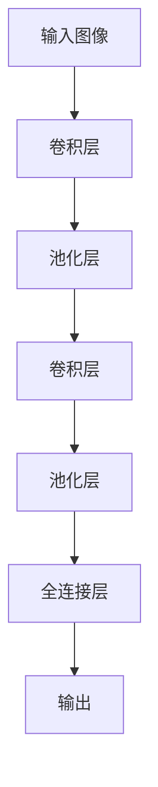
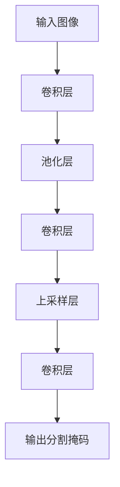
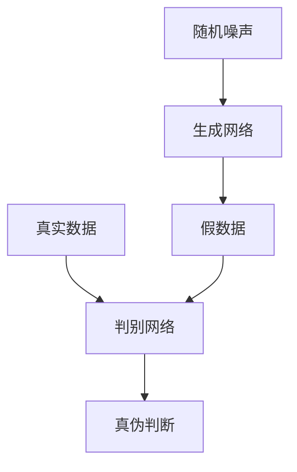
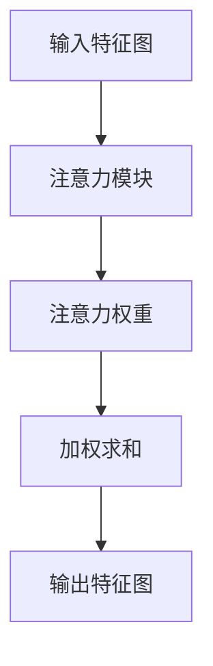

# 一切皆是映射：深度学习在医疗影像分析中的革命

## 1.背景介绍

### 1.1 医疗影像分析的重要性

医疗影像分析是现代医疗诊断和治疗中不可或缺的一环。通过对患者的X射线、CT、MRI、PET等影像数据进行分析,医生可以更准确地诊断疾病,制定治疗方案,并监测病情的发展。然而,人工解读医疗影像是一项非常耗时且容易出错的工作,需要医生具备丰富的专业知识和经验。

### 1.2 深度学习在医疗影像分析中的应用

近年来,深度学习技术在计算机视觉领域取得了巨大的突破,展现出强大的图像识别和分析能力。研究人员开始将深度学习应用于医疗影像分析,希望能够提高诊断的准确性和效率。深度学习模型可以从大量标注的医疗影像数据中自动学习特征,并对新的影像数据进行智能分析和诊断。

### 1.3 映射思想的核心地位

在深度学习模型中,映射思想扮演着核心角色。简单来说,深度学习模型就是一系列嵌套的非线性映射函数,将输入数据(如医疗影像)映射到输出结果(如疾病诊断)。通过训练,模型会自动学习这些映射函数的参数,使得输出结果尽可能准确。本文将探讨深度学习在医疗影像分析中是如何实现这种"一切皆是映射"的思想,并介绍相关的核心概念、算法原理和实践应用。

## 2.核心概念与联系

### 2.1 卷积神经网络

卷积神经网络(Convolutional Neural Network, CNN)是深度学习在计算机视觉领域的杰出代表。CNN由多个卷积层和池化层组成,能够自动从图像中提取出层次化的特征。



在医疗影像分析中,CNN可以从原始的影像数据(如CT扫描图像)中自动学习出疾病的特征模式,从而实现智能诊断。

### 2.2 全卷积网络

全卷积网络(Fully Convolutional Network, FCN)是CNN的一种变体,它将最后的全连接层替换为卷积层,从而可以对任意尺寸的输入进行端到端的预测。这使得FCN在医学图像分割任务中得到了广泛应用。



FCN可以对医疗影像中的器官或病变进行精确的像素级分割,为后续的三维重建和量化分析奠定基础。

### 2.3 生成对抗网络

生成对抗网络(Generative Adversarial Network, GAN)是一种由生成网络和判别网络组成的深度学习架构。生成网络的目标是生成逼真的假数据(如假医疗影像),而判别网络则需要区分真实数据和生成数据。两个网络相互对抗,最终达到一种动态平衡。



GAN在医疗影像分析中可以用于数据增强、去噪和图像翻译等任务,有助于提高模型的泛化能力和鲁棒性。

### 2.4 注意力机制

注意力机制(Attention Mechanism)是深度学习中一种重要的思想,它允许模型自主关注输入数据的不同部分,并根据上下文环境动态调整注意力的分配。在医疗影像分析中,注意力机制可以帮助模型聚焦于影像中的关键区域,提高诊断的准确性。



注意力机制常与CNN、RNN等网络结构相结合,赋予模型"专注"于重点区域的能力,从而更好地捕捉影像中的细节信息。

## 3.核心算法原理具体操作步骤

在本节中,我们将介绍几种核心的深度学习算法在医疗影像分析中的具体原理和操作步骤。

### 3.1 基于CNN的医疗影像分类

医疗影像分类是一项基础且重要的任务,旨在根据影像数据对患者的健康状况进行分类,如肺部CT分类(正常/肺炎/肺癌)。我们以此为例,介绍基于CNN的分类算法流程。

1. **数据预处理**:将原始的CT扫描数据(DICOM格式)转换为标准的图像格式(如PNG),并进行必要的标准化和增强处理。同时,需要对影像数据进行标注,给出每个样本的类别标签。

2. **构建CNN模型**:设计一个适当的CNN架构,通常包括多个卷积层、池化层和全连接层。常用的网络包括AlexNet、VGGNet、ResNet等。

3. **模型训练**:将预处理后的影像数据输入CNN模型,使用监督学习的方式进行训练。在训练过程中,模型会自动学习影像特征与类别标签之间的映射关系,并不断调整网络参数以最小化损失函数。

4. **模型评估**:在保留的测试集上评估模型的分类性能,计算指标如准确率、精确率、召回率、F1分数等。必要时进行模型微调,以提高泛化能力。

5. **模型部署**:将训练好的CNN模型集成到医疗影像分析系统中,为新的影像数据提供实时的分类诊断服务。

通过上述步骤,CNN可以自动从医疗影像中提取出有效的特征模式,并将其映射到相应的疾病类别,从而实现智能化的影像分类诊断。

### 3.2 基于FCN的医疗影像分割

影像分割是将影像中的感兴趣目标(如器官或病变)与背景进行分离的过程,对于后续的三维重建和定量分析至关重要。我们以基于FCN的分割算法为例进行介绍。

1. **数据准备**:收集包含感兴趣目标的医疗影像数据,并由专家人工标注出目标的像素级掩码(Ground Truth)。

2. **构建FCN模型**:设计一个端到端的FCN架构,通常包括编码器(下采样路径)和解码器(上采样路径)两个部分。编码器用于提取影像特征,解码器则将特征映射回原始分辨率,生成分割掩码。

3. **模型训练**:将影像数据和Ground Truth输入FCN模型,使用像素级的损失函数(如交叉熵)进行训练。在此过程中,网络会自动学习将影像映射到分割掩码的映射函数。

4. **模型评估**:在保留的测试集上评估模型的分割性能,计算指标如像素准确率、平均IoU(交并比)等。必要时进行模型微调。

5. **模型部署**:将训练好的FCN模型集成到医疗影像分析系统中,为新的影像数据提供实时的分割服务,辅助医生进行后续的三维可视化和定量分析。

通过FCN,我们可以将复杂的医疗影像映射到简单的像素级掩码,从而实现对感兴趣目标的精确分割,为后续的临床应用奠定基础。

### 3.3 基于GAN的医疗影像增强

在医疗影像分析中,数据量往往是一个瓶颈问题。GAN可以通过生成逼真的假影像来增强训练数据集,提高模型的泛化能力。我们以此为例,介绍基于GAN的影像增强算法流程。

1. **构建GAN模型**:设计一个包含生成网络和判别网络的GAN架构。生成网络的输入通常是一个随机噪声向量,输出是一个假的医疗影像。判别网络则需要区分真实影像和生成影像。

2. **GAN训练**:将真实的医疗影像数据输入判别网络,同时将随机噪声输入生成网络产生假影像,并输入判别网络。通过最小化判别网络的损失函数,生成网络会不断优化以生成更加逼真的假影像;而判别网络则会不断提高判别能力。两个网络相互对抗,最终达到一种动态平衡。

3. **生成增强数据**:当GAN模型收敛后,利用训练好的生成网络生成大量的假影像数据,并将其与原始的真实数据集合并,构建一个增强后的训练集。

4. **模型训练**:使用增强后的训练集,训练其他任务的深度学习模型,如分类模型或分割模型。由于数据量的增加,模型的泛化能力会得到提升。

5. **模型评估和部署**:在测试集上评估模型的性能,必要时进行微调。最终将模型集成到医疗影像分析系统中,为临床诊断提供支持。

通过GAN,我们可以将有限的真实医疗影像数据映射到更加丰富的增强数据集,从而提高后续任务模型的性能和鲁棒性,为临床决策提供更可靠的支持。

## 4.数学模型和公式详细讲解举例说明

在深度学习算法中,数学模型和公式扮演着核心的角色。在本节中,我们将详细讲解一些常见的数学模型和公式,并给出具体的例子说明。

### 4.1 卷积运算

卷积运算是CNN中最基础的操作,它通过滤波器(kernel)在输入特征图上滑动,提取局部特征并生成新的特征图。卷积运算的数学表达式如下:

$$
(I * K)(i, j) = \sum_{m} \sum_{n} I(i+m, j+n) K(m, n)
$$

其中,\(I\)表示输入特征图,\(K\)表示卷积核,\(i\)和\(j\)是输出特征图的坐标,\(m\)和\(n\)是卷积核的坐标。

例如,假设我们有一个3x3的输入特征图和一个2x2的卷积核,卷积运算的过程如下:

```
输入特征图:
1 2 3
4 5 6
7 8 9

卷积核:
1 2
3 4

输出特征图:
(1*1 + 2*3 + 3*2 + 4*4) (1*2 + 2*1 + 3*3 + 4*2) ...
(4*1 + 5*3 + 6*2 + 7*4) (4*2 + 5*1 + 6*3 + 7*2) ...
...
```

通过卷积运算,CNN可以自动从原始影像中提取出局部的特征模式,并在网络的深层次中形成更加抽象和复杂的特征表示。

### 4.2 池化运算

池化运算是CNN中另一个重要的操作,它通过下采样的方式,缩小特征图的空间维度,从而减少计算量和参数数量,同时提取出局部的不变性特征。最常见的池化方法是最大池化(Max Pooling),它取池化窗口内的最大值作为输出。最大池化的数学表达式如下:

$$
(I \circledast K)(i, j) = \max_{(m, n) \in R} I(i+m, j+n)
$$

其中,\(I\)表示输入特征图,\(K\)表示池化窗口,\(R\)是池化窗口的区域,\(i\)和\(j\)是输出特征图的坐标。

例如,假设我们有一个4x4的输入特征图,使用2x2的最大池化窗口和步长为2,池化运算的过程如下:

```
输入特征图:
1 3 2 4
5 6 7 8
9 1 2 3
4 5 6 7

最大池化:
6 8
9 6

输出特征图:
6 8
9 6
```

通过池化运算,CNN可以提取出局部