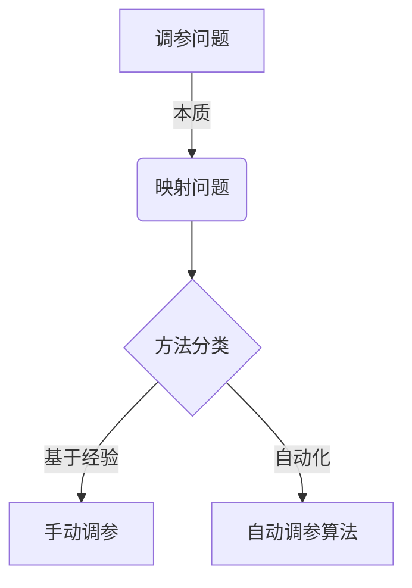
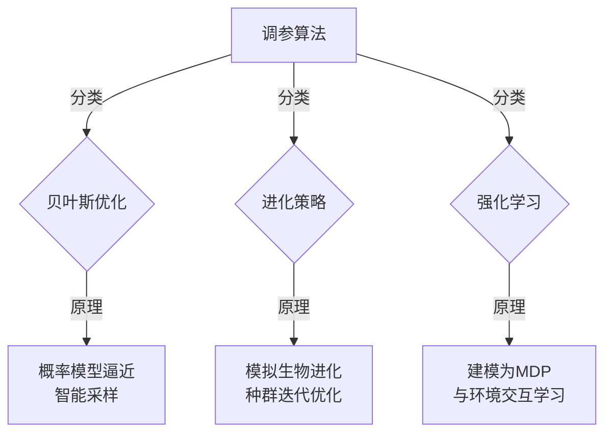

# 一切皆是映射：深度学习的调参艺术与实践窍门

## 1.背景介绍

### 1.1 深度学习的兴起

近年来,深度学习作为一种有效的机器学习方法,在计算机视觉、自然语言处理、语音识别等诸多领域取得了令人瞩目的成就。这种基于多层神经网络的算法,通过对大量数据的训练,能够自动学习数据的特征表示,并对目标任务进行预测或决策。

### 1.2 调参的重要性

然而,训练一个优秀的深度学习模型并非一蹴而就。模型的性能在很大程度上取决于网络结构和训练超参数的设置。合理的超参数选择能够最大限度地发挥模型的潜力,而糟糕的参数组合则会导致训练过程低效甚至失败。因此,调参成为深度学习实践中一个至关重要的环节。

### 1.3 调参的挑战

调参是一项富有挑战性的艺术。首先,超参数的搜索空间通常是高维且复杂的。不同参数之间存在着微妙的相互影响和制约关系。其次,评估一组参数组合的效果需要耗费大量的计算资源和时间。此外,由于深度学习模型的黑盒特性,很难从理论上预测参数变化对性能的影响。

## 2.核心概念与联系

### 2.1 深度学习中的超参数

在深度学习中,超参数指的是在模型训练之前就需要指定的参数,包括:

- 网络结构参数:隐藏层数量、每层神经元数量等
- 优化算法参数:学习率、正则化强度等
- 数据处理参数:批量大小、数据增强方式等

这些参数的选择直接影响着模型的表现,因此需要进行调优。

### 2.2 调参的本质:映射问题

本质上,调参可以看作是一个映射问题:将超参数的组合映射到模型的性能指标上。我们的目标是找到一组能够最大化或最小化目标指标(如准确率、损失函数等)的最优参数组合。

$$ \text{参数组合} \xrightarrow[]{\text{映射}} \text{模型性能} $$

这种映射关系通常是复杂、非线性且多峰值的,使得寻找最优解成为一个具有挑战性的优化问题。

### 2.3 调参方法分类

根据是否利用过去的评估结果,调参方法可分为两大类:

1. **基于经验的手动调参**:依赖专家的经验和直觉,通过反复试错来逐步改进参数。这种方法效率低下且难以获得最优解。

2. **自动化调参算法**:利用优化算法和评估结果,自动搜索参数空间以找到最优组合。这种方法更加高效和可靠,是现代调参的主流方式。

本文将重点介绍自动化调参算法的原理和实践技巧。

## 3.核心算法原理具体操作步骤

### 3.1 贝叶斯优化

贝叶斯优化是一种常用的黑盒函数优化算法,适用于高维、非线性、多峰值等复杂优化问题。它通过构建一个概率模型来逼近目标函数,并基于这个模型对参数空间进行智能采样,从而有效地搜索最优解。

1. **初始化**:选择一个先验概率分布,并从中采样一些初始参数组合,对应的函数值作为初始观测数据。

2. **构建概率模型**:基于观测数据,使用高斯过程或其他替代模型构建目标函数的概率逼近。

3. **采集新观测**:利用一定的采集策略(如期望改善、上确信区域等)在概率模型上找到新的有希望改进目标函数的参数组合。

4. **评估新观测**:在真实目标函数上评估新参数组合的性能,将结果加入观测数据集。

5. **更新概率模型**:利用新的观测数据重新构建目标函数的概率逼近。

6. **重复3-5步**:不断迭代直至满足终止条件(如最大迭代次数、性能要求等)。

贝叶斯优化能够有效平衡探索(全局搜索)和利用(局部优化)两个方面,从而加速寻优过程。

### 3.2 进化策略

进化策略是另一种常用的黑盒优化算法,其思想源于生物进化过程。它维护一组候选解的种群,并通过模拟自然选择、变异等过程,逐代产生更优的解。

1. **初始化**:随机生成一个初始种群,每个个体对应一组参数组合。

2. **评估适应度**:在目标函数上评估每个个体的适应度(性能指标)。

3. **选择操作**:根据适应度,从当前种群中选择一些优秀个体作为父代。

4. **交叉变异**:通过交叉和变异操作,从父代产生新的子代个体。

5. **种群更新**:将子代个体加入种群,替换掉一些适应度差的个体。

6. **重复2-5步**:不断进化直至满足终止条件。

进化策略能够在保持种群多样性的同时逐步聚集到最优解附近,从而避免陷入局部极小值。此外,它还支持并行化评估,可以充分利用现代计算资源。

### 3.3 强化学习方法

除了上述经典算法,近年来借助强化学习的思想也衍生出一些创新的调参方法。其核心思想是将调参过程建模为一个马尔可夫决策过程:

- 状态:当前的参数组合及其对应的模型性能
- 动作:对参数进行微调(如修改学习率等)
- 奖励:性能指标的改善程度

通过与环境(即目标函数)交互,智能体(调参算法)不断获取奖励,并根据经验更新策略,从而逐步找到最优参数组合。这种方法能够充分利用过去的经验,并具有一定的可解释性和迁移能力。

## 4.数学模型和公式详细讲解举例说明

### 4.1 高斯过程回归

在贝叶斯优化中,高斯过程回归是一种常用的概率模型,用于对目标黑盒函数进行非参数逼近。它的基本思想是:将目标函数看作一个高斯随机过程的样本路径,通过观测数据来估计该过程的均值和协方差函数。

对于任意有限集合的输入 $X = \{x_1, x_2, \ldots, x_n\}$,高斯过程定义了相应输出 $f(X)$ 的联合高斯分布:

$$
f(X) \sim \mathcal{GP}(m(X), k(X, X'))
$$

其中:

- $m(X)$ 是均值函数,通常设为0
- $k(X, X')$ 是协方差函数(核函数),描述了不同输入之间的相关性

常用的核函数有:

- 高斯核(RBF): $k(x, x') = \sigma^2\exp\left(-\frac{||x-x'||^2}{2l^2}\right)$
- 马恩核: $k(x, x') = \sigma^2\left(1 + \frac{\sqrt{3}||x-x'||}{l}\right)\exp\left(-\frac{\sqrt{3}||x-x'||}{l}\right)$

通过最大似然估计或者贝叶斯方法,可以从观测数据中学习核函数的超参数 $\theta = \{\sigma^2, l\}$。得到最优核参数后,就可以预测任意新输入 $x_*$ 处的函数值及其不确定性:

$$
\begin{aligned}
\mu(x_*) &= k(x_*, X)[K(X, X) + \sigma_n^2I]^{-1}y \\
\sigma^2(x_*) &= k(x_*, x_*) - k(x_*, X)[K(X, X) + \sigma_n^2I]^{-1}k(X, x_*)
\end{aligned}
$$

这种高斯过程模型能够根据观测数据自动捕获目标函数的非线性特征,并为后续的智能采样提供有力支持。

### 4.2 期望改善采集准则

在贝叶斯优化的每一次迭代中,需要根据当前的概率模型,选择一个新的有希望改进目标函数的参数组合进行评估。期望改善(Expected Improvement, EI)是一种常用的采集准则,它定义为:

$$
\begin{aligned}
\text{EI}(x) &= \mathbb{E}\left[\max(f(x) - f(x^+), 0)\right] \\
           &= \begin{cases}
                (f(x^+) - \mu(x))\Phi\left(\frac{f(x^+) - \mu(x)}{\sigma(x)}\right) + \sigma(x)\phi\left(\frac{f(x^+) - \mu(x)}{\sigma(x)}\right) & \text{if } \sigma(x) > 0 \\
                0 & \text{if } \sigma(x) = 0
           \end{cases}
\end{aligned}
$$

其中 $x^+$ 是当前已观测到的最优解,而 $\Phi(\cdot)$ 和 $\phi(\cdot)$ 分别是标准正态分布的累积分布函数和概率密度函数。

期望改善准则平衡了两个方面的考虑:

1. 如果 $\mu(x)$ 很小,即该点的预测值很优秀,那么第一项会变大,增加了被采样的可能性。
2. 如果 $\sigma(x)$ 很大,即该点的不确定性很高,那么第二项会变大,也会增加被采样的可能性。

通过最大化 EI 准则,贝叶斯优化能够自动在exploitation(利用已知的优良解)和exploration(探索未知的有前景区域)之间作出权衡。

### 4.3 进化策略的自然梯度

在进化策略中,如何高效地更新种群分布是一个关键问题。自然梯度是一种常用的更新方式,它基于信息几何的思想,能够避免分布的奇异性和协方差矩阵病态等问题。

假设种群服从多元高斯分布 $\pi(\boldsymbol{\theta}|\boldsymbol{\mu}, \boldsymbol{\Sigma}) = \mathcal{N}(\boldsymbol{\mu}, \boldsymbol{\Sigma})$,我们希望沿着能够最大程度提高期望适应度的方向更新分布参数 $\boldsymbol{\mu}$ 和 $\boldsymbol{\Sigma}$。

根据自然梯度的定义,我们有:

$$
\begin{aligned}
\nabla_{\tilde{\mu}} \mathbb{E}_{\pi}[f(\boldsymbol{\theta})] &= \boldsymbol{\Sigma}^{-1}\mathbb{E}_{\pi}[(\boldsymbol{\theta} - \boldsymbol{\mu})f(\boldsymbol{\theta})] \\
\nabla_{\tilde{\Sigma}} \mathbb{E}_{\pi}[f(\boldsymbol{\theta})] &= \frac{1}{2}\boldsymbol{\Sigma}^{-1}\left(\mathbb{E}_{\pi}[(\boldsymbol{\theta} - \boldsymbol{\mu})(\boldsymbol{\theta} - \boldsymbol{\mu})^{\top}f(\boldsymbol{\theta})] - \boldsymbol{\Sigma}\right)\boldsymbol{\Sigma}^{-1}
\end{aligned}
$$

其中 $\tilde{\mu}$ 和 $\tilde{\Sigma}$ 表示对应的自然参数。通过对上式进行采样估计,我们可以得到分布参数的更新规则:

$$
\begin{aligned}
\boldsymbol{\mu}_{t+1} &= \boldsymbol{\mu}_t + \eta_{\mu}\boldsymbol{\Sigma}_t\frac{1}{N_{\mu}}\sum_{i=1}^{N_{\mu}}(\boldsymbol{\theta}^{(i)} - \boldsymbol{\mu}_t)f(\boldsymbol{\theta}^{(i)}) \\
\boldsymbol