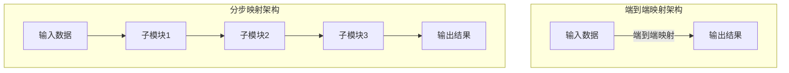

# 一切皆是映射：自动驾驶技术中的AI算法

## 1.背景介绍

### 1.1 自动驾驶的崛起

随着人工智能技术的不断发展,自动驾驶汽车已经从科幻电影中的场景逐渐走进现实生活。自动驾驶技术被认为是未来交通系统的重要组成部分,有望极大提高交通效率、减少事故发生率、降低能源消耗和环境污染。因此,自动驾驶汽车成为了科技巨头和传统车企竞相角逐的热门领域。

### 1.2 自动驾驶的挑战

然而,要实现真正的自动驾驶并非一蹴而就。自动驾驶汽车需要感知复杂的环境、理解路况信息、制定合理的行驶策略并精准控制车辆运动,这对人工智能算法的性能要求极为苛刻。尤其是在城市道路等复杂场景下,自动驾驶系统必须能够实时分析多个运动目标、预测它们的运动轨迹并做出适当反应,确保行车安全。

### 1.3 AI算法在自动驾驶中的作用

要攻克自动驾驶的重重难关,必须依赖先进的人工智能算法。事实上,自动驾驶系统中的每一个环节都离不开AI算法的支持,包括感知、决策、控制等。其中,感知模块利用计算机视觉、雷达等传感器数据构建车辆周围的环境模型;决策模块基于感知信息规划出安全、高效的行驶路径;控制模块则负责精准控制车辆的转向、加速等动作。AI算法贯穿自动驾驶系统的始终,是实现自动驾驶的核心力量。

## 2.核心概念与联系 

### 2.1 映射的概念

在自动驾驶技术中,映射(Mapping)是一个核心概念。简单地说,映射就是将一个领域中的元素与另一个领域中的元素建立对应关系的过程。比如,将图像上的像素值映射到物体的语义标签,或者将激光点云数据映射到三维空间中的物理实体。映射的目标是找到输入与输出之间的规律,并用某种数学模型来描述和近似这种规律。

### 2.2 监督学习与非监督学习

根据是否利用了标注数据,映射过程可分为监督学习和非监督学习两种范式。

- **监督学习**指的是利用标注好的数据集(输入-输出对)来训练模型,使之学习输入到输出的映射规律。例如,在目标检测任务中,我们需要标注训练集中物体的位置和类别,作为模型学习的监督信号。
- **非监督学习**则不需要标注数据,而是直接从输入数据中挖掘内在的统计规律。例如,在聚类算法中,我们希望将相似的数据点聚集到同一个簇,而不需要事先标注它们的类别。

无论是监督还是非监督,映射的本质都是找到输入与输出之间的关联,并用某种模型来表达和近似这种关联关系。

### 2.3 端到端映射与分步映射

在自动驾驶系统中,映射过程可以是端到端的,也可以是分步骤的。

- **端到端映射**是指直接将输入(如相机图像)映射到期望的输出(如车辆控制指令),中间不经过人为设计的特征提取或决策规划等步骤。这种方式的优点是结构简单,但缺点是很难将人类的先验知识融入模型,且解释性较差。
- **分步映射**则是将整个系统分解为若干子模块,每个子模块负责完成一个特定的映射任务,如物体检测、路径规划等。子模块的输出将作为下一模块的输入,最终得到系统的整体输出。这种方式的优点是结构清晰、可解释性强,但缺点是设计复杂、模块之间的误差会累积。

在实际应用中,常常需要权衡两种映射方式的利弊,并结合具体任务的特点选择合适的架构。

### 2.4 端到端映射与分步映射架构对比

上图对比了端到端映射与分步映射的基本架构。端到端映射架构结构简单,但可解释性较差;分步映射架构则由多个子模块组成,每个模块完成特定的映射任务,可解释性更强,但设计复杂,误差易累积。

## 3.核心算法原理具体操作步骤

自动驾驶系统中的AI算法种类繁多,本节将重点介绍其中几种核心算法的工作原理和具体操作步骤。

### 3.1 卷积神经网络

卷积神经网络(Convolutional Neural Network, CNN)是一种常用于计算机视觉任务的深度学习模型,在自动驾驶的感知模块中发挥着重要作用。CNN的基本思想是通过卷积操作自动提取输入数据(如图像)的特征,并在此基础上进行进一步的处理和映射。

CNN典型的操作步骤如下:

1. **输入数据**:原始输入数据,如RGB图像等。
2. **卷积层**:使用多个卷积核(小矩阵)在输入数据上滑动,提取局部特征。
3. **激活层**:通过非线性激活函数(如ReLU)增强特征的表达能力。
4. **池化层**:对特征图进行下采样,减少数据量并获得一定的平移不变性。
5. **全连接层**:将提取到的特征映射到最终的输出,如分类或回归等。
6. **输出层**:产生最终的输出结果,如目标检测框、语义分割图等。

通过上述层次操作,CNN能够自动学习输入数据的多尺度特征表示,并将其映射到所需的输出,在图像识别、目标检测等视觉任务中表现出色。

### 3.2 循环神经网络

除了处理静态数据,自动驾驶系统还需要处理时序数据,如车载传感器的连续读数。循环神经网络(Recurrent Neural Network, RNN)是一种擅长处理序列数据的神经网络模型,可用于时间序列预测、语音识别等任务。

RNN的工作原理可概括为以下步骤:

1. **输入序列**:将时序数据按时间步展开成序列输入,如 $\vec{x}_t = (x_1, x_2, \ldots, x_t)$。
2. **循环计算**:在每个时间步 $t$,RNN单元会根据当前输入 $x_t$ 和上一时刻的隐状态 $h_{t-1}$ 计算出新的隐状态 $h_t$,表达式为:

$$h_t = \phi(W_{xh}x_t + W_{hh}h_{t-1} + b_h)$$

其中 $\phi$ 是激活函数,如tanh或ReLU; $W$ 是权重矩阵; $b$ 是偏置向量。

3. **输出计算**:根据当前隐状态 $h_t$,计算时刻 $t$ 的输出 $y_t$:

$$y_t = \phi(W_{hy}h_t + b_y)$$

4. **反向传播**:通过反向传播算法更新网络权重,使输出序列 $\vec{y} = (y_1, y_2, \ldots, y_T)$ 逼近期望输出 $\vec{d}$。

通过上述循环计算,RNN能够在神经网络中对序列信号建模,并将其映射到期望的输出序列,被广泛应用于自动驾驶中的轨迹预测、行为决策等任务。

### 3.3 生成对抗网络

生成对抗网络(Generative Adversarial Network, GAN)是一种用于生成式建模的深度学习架构,可用于数据增广、模拟测试等自动驾驶场景。GAN由生成网络(Generator)和判别网络(Discriminator)两部分组成,两者通过对抗训练的方式互相促进,最终达到生成高质量样本的目的。

GAN的训练过程可描述如下:

1. **初始化**:随机初始化生成网络 $G$ 和判别网络 $D$ 的参数。
2. **生成样本**:生成网络 $G$ 从随机噪声 $z$ 生成样本 $G(z)$。
3. **判别真伪**:判别网络 $D$ 对真实样本和生成样本进行二分类,输出为真样本的概率 $D(x)$ 和生成样本的概率 $D(G(z))$。
4. **计算损失**:计算判别器损失 $\mathcal{L}_D$ 和生成器损失 $\mathcal{L}_G$:

$$\begin{aligned}
\mathcal{L}_D &= -\mathbb{E}_{x \sim p_{\text{data}}}[\log D(x)] - \mathbb{E}_{z \sim p_z}[\log(1 - D(G(z)))] \\
\mathcal{L}_G &= -\mathbb{E}_{z \sim p_z}[\log D(G(z))]
\end{aligned}$$

5. **反向传播**:分别对判别器 $D$ 和生成器 $G$ 进行反向传播,更新网络参数。
6. **迭代训练**:重复上述过程,直至收敛或达到训练轮数上限。

经过足够的训练后,生成网络 $G$ 能够生成逼真的样本数据,这些数据可用于数据增广、虚拟测试等目的,从而提高自动驾驶系统的泛化能力和鲁棒性。

### 3.4 强化学习算法

在自动驾驶的决策规划模块中,常需要根据当前环境状态选择最优的行为序列,以最大化某个预期收益(如行驶效率、安全性等)。强化学习(Reinforcement Learning)算法就是针对这一需求而提出的,它模拟智能体与环境的交互过程,通过不断试错学习获取最优策略。

强化学习算法的基本步骤如下:

1. **初始化**:设定环境状态 $s_0$,智能体策略 $\pi_\theta(a|s)$。
2. **选择行为**:根据当前策略 $\pi_\theta$,选择行为 $a_t$。
3. **环境响应**:执行行为 $a_t$,环境转移到新状态 $s_{t+1}$,返回即时奖励 $r_t$。
4. **策略评估**:估计当前策略 $\pi_\theta$ 在状态 $s_t$ 下的价值函数 $V_\pi(s_t)$ 或行为价值函数 $Q_\pi(s_t, a_t)$。
5. **策略改进**:根据价值函数的估计,调整策略参数 $\theta$,使得新策略 $\pi_{\theta'}$ 比原策略 $\pi_\theta$ 更优。
6. **迭代训练**:重复上述过程,直至收敛或满足停止条件。

通过上述试错过程,强化学习算法能够自主探索最优的决策策略,在自动驾驶的路径规划、车辆控制等环节发挥重要作用。

## 4.数学模型和公式详细讲解举例说明

### 4.1 卷积神经网络中的卷积操作

卷积(Convolution)是卷积神经网络中的核心操作之一,用于从输入数据(如图像)中提取局部特征。设输入数据为 $X$,卷积核为 $K$,卷积操作可表示为:

$$S(i, j) = (X * K)(i, j) = \sum_{m}\sum_{n}X(i+m, j+n)K(m, n)$$

其中,$(i, j)$ 是输出特征图 $S$ 上的位置索引; $(m, n)$ 是卷积核 $K$ 上的位置索引。卷积操作实际上是在输入数据上滑动卷积核,并在每个位置上计算加权和,从而获得输出特征映射。

为了控制特征图的大小,我们通常会在卷积操作中引入步长(stride)和填充(padding)两个超参数。设卷积核大小为 $k \times k$,步长为 $s$,填充为 $p$,则输出特征图的大小为