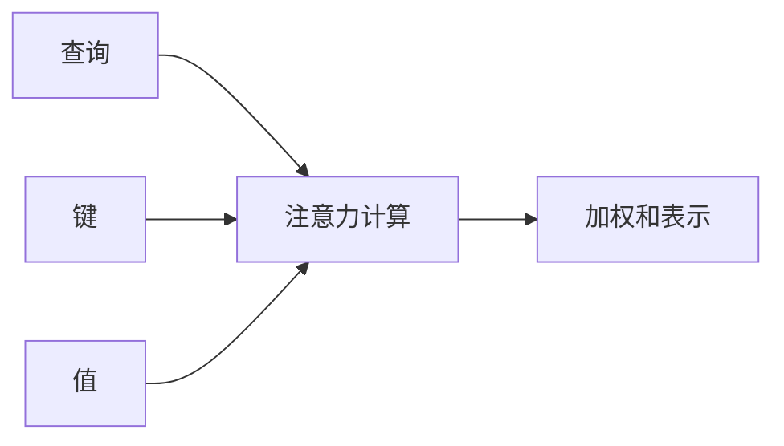
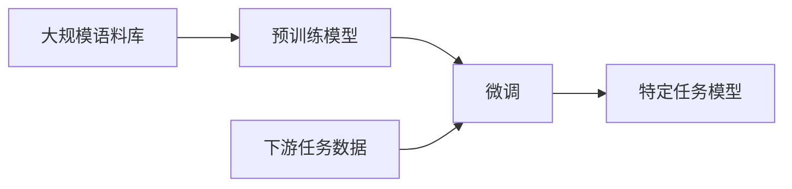
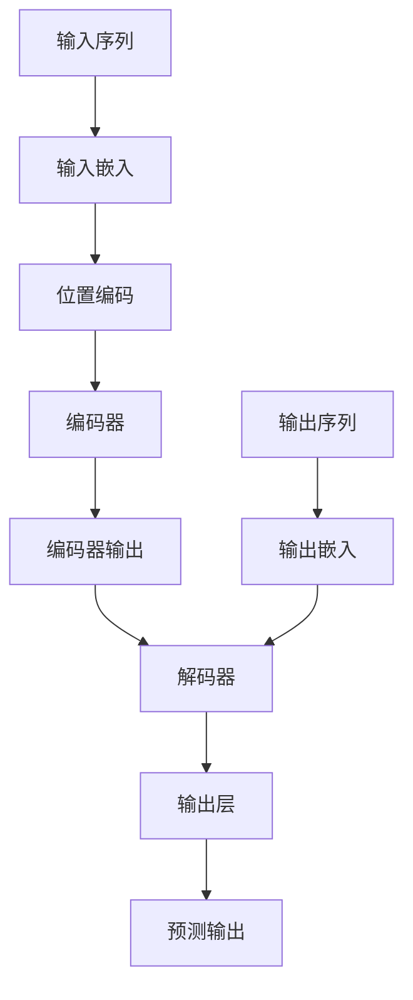
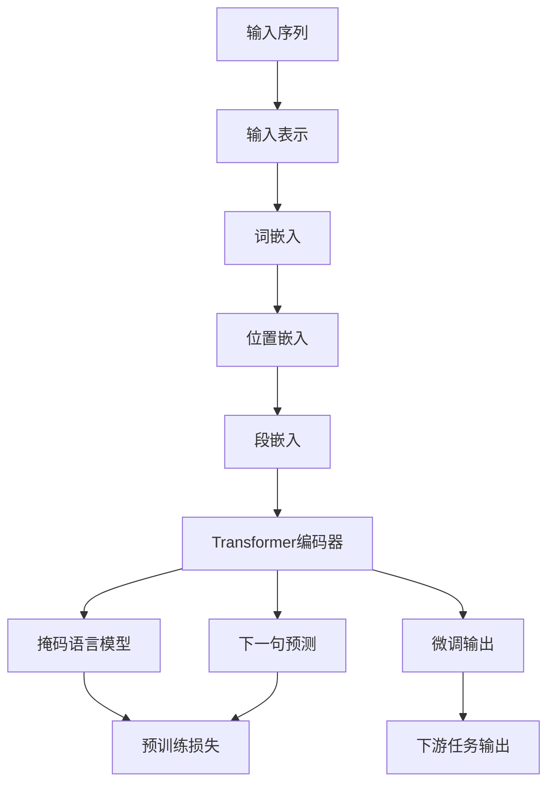
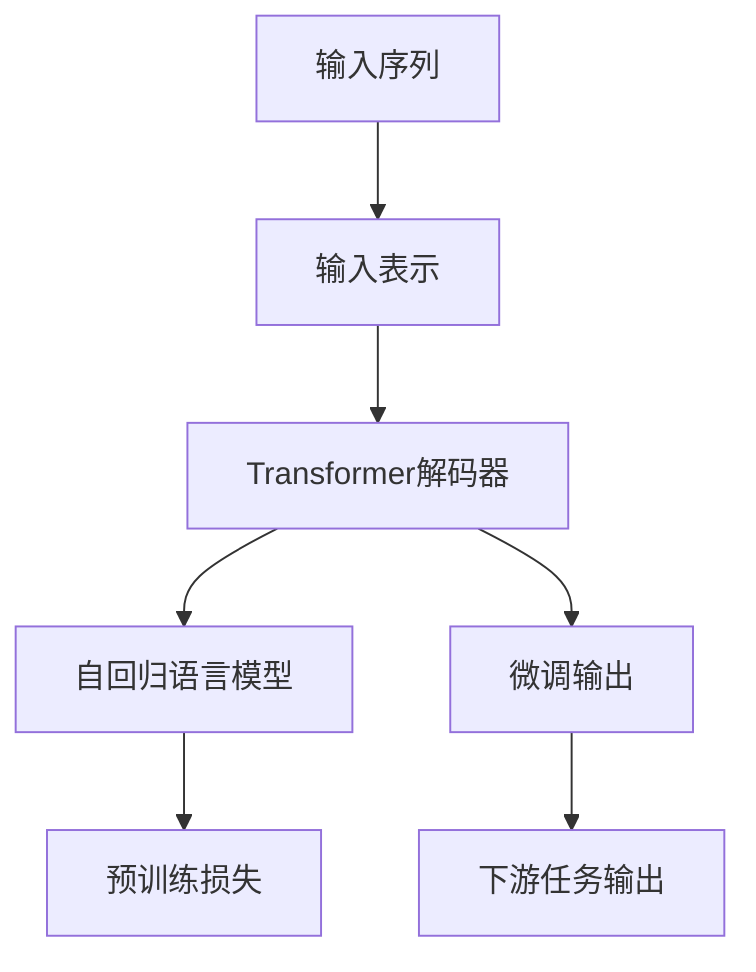

# 一切皆是映射：自然语言处理(NLP)中的神经网络

## 1.背景介绍

### 1.1 自然语言处理的重要性

在当今信息时代,自然语言处理(NLP)已经成为人工智能领域中最重要和最具挑战性的研究方向之一。它旨在使计算机能够理解、解释和生成人类自然语言,从而实现人机自然交互。NLP广泛应用于机器翻译、问答系统、文本分类、信息检索、自动摘要等领域,对提高人机交互体验和效率有着重要意义。

### 1.2 传统NLP方法的局限性

传统的NLP方法主要基于规则和统计模型,需要大量的人工特征工程和领域知识。这些方法通常受到规模、领域和语言的限制,难以泛化到更广阔的应用场景。此外,它们对语义理解能力有限,无法很好地捕捉语言的深层含义和上下文信息。

### 1.3 神经网络在NLP中的崛起

近年来,随着深度学习技术的迅速发展,神经网络在NLP领域取得了突破性进展。与传统方法相比,神经网络模型能够自动从大量数据中学习特征表示,并捕捉语言的复杂模式和语义信息。这种基于数据驱动的方法显著提高了NLP系统的性能和泛化能力。

## 2.核心概念与联系

### 2.1 词嵌入(Word Embeddings)

词嵌入是神经网络NLP的基础,它将词映射到一个连续的向量空间中,使得语义相似的词在该空间中彼此靠近。常用的词嵌入模型包括Word2Vec、GloVe等。通过词嵌入,我们可以捕捉词与词之间的语义关系,并将其用于下游的NLP任务。

### 2.2 序列建模(Sequence Modeling)

自然语言是一种序列数据,因此序列建模是NLP中的核心问题。循环神经网络(RNN)和长短期记忆网络(LSTM)是早期广泛使用的序列建模架构,它们能够捕捉序列中的长期依赖关系。近年来,transformer模型凭借自注意力机制在各种NLP任务中取得了卓越表现。

### 2.3 注意力机制(Attention Mechanism)

注意力机制是transformer等新型神经网络模型的核心,它允许模型在编码序列时动态关注不同位置的信息。通过计算查询(query)与键(key)的相关性得分,模型可以自适应地分配不同位置的注意力权重,从而更好地捕捉长距离依赖关系和上下文信息。

### 2.4 预训练与微调(Pre-training and Fine-tuning)

预训练是当前主流的NLP模型训练范式。在预训练阶段,模型在大规模无监督语料库上进行自监督训练,学习通用的语言表示。之后,在下游任务上通过微调的方式,将预训练模型进行特定任务的专门化训练。这种预训练与微调的范式大大提高了模型的性能和泛化能力。

## 3.核心算法原理具体操作步骤

### 3.1 Transformer模型

Transformer是一种全新的基于注意力机制的序列建模架构,它完全摒弃了RNN和CNN等传统架构,使用多头自注意力机制来捕捉序列中的长期依赖关系。Transformer的核心组件包括编码器(Encoder)和解码器(Decoder),它们都由多个相同的层组成,每层包含多头自注意力子层和前馈网络子层。

1. **输入嵌入(Input Embeddings)**: 将输入序列(如文本)映射为嵌入向量序列。

2. **位置编码(Positional Encoding)**: 由于Transformer没有递归或卷积结构,因此需要显式地编码序列中每个位置的位置信息。

3. **多头自注意力(Multi-Head Attention)**: 计算查询(Q)、键(K)和值(V)的加权和表示,捕捉序列中不同位置之间的依赖关系。

   - 将查询(Q)、键(K)和值(V)线性投影到不同的子空间
   - 计算查询(Q)和键(K)的点积,得到注意力分数
   - 对注意力分数进行softmax归一化,得到注意力权重
   - 将注意力权重与值(V)相乘,得到加权和表示

4. **残差连接(Residual Connection)** 和 **层归一化(Layer Normalization)**: 为了提高训练稳定性和convergence速度。

5. **前馈网络(Feed-Forward Network)**: 对每个位置的向量表示进行独立的非线性变换,进一步捕捉位置特征。

6. **编码器(Encoder)**: 由多个相同的编码器层组成,每层包含多头自注意力子层和前馈网络子层。编码器捕捉输入序列的表示。

7. **解码器(Decoder)**: 与编码器类似,但还包含一个额外的多头交叉注意力子层,用于关注编码器输出的表示。

8. **掩码多头注意力(Masked Multi-Head Attention)**: 在解码器的自注意力子层中,通过掩码机制防止每个位置关注其后面的位置,以保持自回归属性。

9. **输出层(Output Layer)**: 将解码器的输出映射到目标空间(如词汇表)。

### 3.2 BERT模型

BERT(Bidirectional Encoder Representations from Transformers)是一种基于Transformer的预训练语言模型,它通过掩码语言模型(Masked Language Model)和下一句预测(Next Sentence Prediction)两个预训练任务,学习双向的上下文表示。BERT在各种下游NLP任务上取得了卓越表现,成为当前最广泛使用的预训练模型之一。

1. **输入表示(Input Representations)**: 将输入序列(如句子对)拼接为单个序列,并添加特殊标记[CLS]和[SEP]。

2. **词嵌入(Token Embeddings)**: 将每个词映射为对应的词嵌入向量。

3. **位置嵌入(Position Embeddings)** 和 **段嵌入(Segment Embeddings)**: 编码每个词的位置信息和句子信息。

4. **Transformer编码器(Transformer Encoder)**: 由多个相同的编码器层组成,对输入序列进行编码。

5. **掩码语言模型(Masked Language Model)**: 在预训练阶段,随机掩码输入序列中的15%的词,并使用Transformer编码器和掩码词的上下文预测掩码词。

6. **下一句预测(Next Sentence Prediction)**: 在预训练阶段,对输入的句子对进行二分类,判断第二个句子是否为第一个句子的下一句。

7. **微调(Fine-tuning)**: 在下游任务上,将BERT模型的输出[CLS]向量馈送到一个分类层或回归层,并对整个模型进行端到端的微调。

### 3.3 GPT模型

GPT(Generative Pre-trained Transformer)是另一种基于Transformer的预训练语言模型,它采用自回归(Auto-Regressive)的方式,通过预测下一个词的方式学习语言表示。GPT模型在文本生成、机器翻译等任务中表现出色。

1. **输入表示(Input Representations)**: 将输入序列(如文本)映射为词嵌入序列,并添加位置嵌入。

2. **Transformer解码器(Transformer Decoder)**: 由多个相同的解码器层组成,每层包含掩码多头自注意力、编码器-解码器注意力和前馈网络子层。

3. **自回归语言模型(Auto-Regressive Language Model)**: 在预训练阶段,给定前缀上下文,模型预测下一个词的概率分布。

4. **微调(Fine-tuning)**: 在下游任务上,根据任务类型对GPT模型进行微调,如文本生成、机器翻译等。

## 4.数学模型和公式详细讲解举例说明

### 4.1 词嵌入

词嵌入是将词映射到一个连续的向量空间中,使得语义相似的词在该空间中彼此靠近。常用的词嵌入模型包括Word2Vec和GloVe。

#### 4.1.1 Word2Vec

Word2Vec是一种基于神经网络的词嵌入模型,它包括两种架构:连续词袋模型(CBOW)和Skip-Gram模型。

**CBOW模型**:给定上下文词$c_i$,预测目标词$w_t$的概率为:

$$P(w_t|c) = \frac{e^{v_{w_t}^{\top}v_c}}{\sum_{w\in V}e^{v_w^{\top}v_c}}$$

其中$v_w$和$v_c$分别表示词$w$和上下文$c$的向量表示,$V$是词汇表。

**Skip-Gram模型**:给定目标词$w_t$,预测上下文词$c_i$的概率为:

$$P(c|w_t) = \frac{e^{v_c^{\top}v_{w_t}}}{\sum_{c'\in V}e^{v_{c'}^{\top}v_{w_t}}}$$

通过最大化语料库中所有词对的对数似然,可以学习到词嵌入向量。

#### 4.1.2 GloVe

GloVe(Global Vectors for Word Representation)是另一种基于共现矩阵的词嵌入模型。它直接利用词与词之间的共现统计信息,通过最小化以下加权最小二乘重构损失函数来学习词向量:

$$J = \sum_{i,j=1}^{V}f(X_{ij})(w_i^{\top}\tilde{w}_j + b_i + \tilde{b}_j - \log X_{ij})^2$$

其中$X_{ij}$表示词$i$和词$j$的共现次数,$f(x)$是权重函数,$w_i$和$\tilde{w}_j$分别表示词$i$和$j$的向量表示,$b_i$和$\tilde{b}_j$是偏置项。

### 4.2 注意力机制

注意力机制是Transformer等新型神经网络模型的核心,它允许模型在编码序列时动态关注不同位置的信息。

给定查询$Q$、键$K$和值$V$,注意力机制的计算过程如下:

1. 计算查询$Q$和所有键$K$的点积,得到注意力分数矩阵:

$$\text{Attention}(Q, K, V) = \text{softmax}(\frac{QK^{\top}}{\sqrt{d_k}})V$$

其中$d_k$是缩放因子,用于防止点积过大导致梯度消失。

2. 对注意力分数矩阵进行softmax归一化,得到注意力权重矩阵。

3. 将注意力权重矩阵与值$V$相乘,得到加权和表示。

多头注意力机制是将注意力机制扩展到多个子空间,