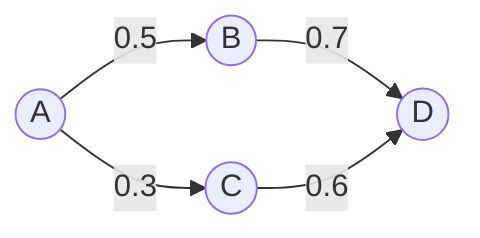

# 一切皆是映射：解构基于元认知的学习系统

## 1. 背景介绍

### 1.1 学习的本质

学习是人类认知活动的核心，它贯穿我们的一生。从婴儿时期的感官探索，到成年后的技能习得，再到老年时的经验总结，学习无时无刻不在发生。但是，学习的本质究竟是什么？它又是如何在我们的大脑中发生的呢？

### 1.2 传统学习理论的局限性

传统的学习理论，如行为主义学习理论、认知主义学习理论等，虽然从不同角度解释了学习的过程和机制，但都存在一定的局限性。它们要么过于简化学习过程，要么无法解释学习迁移和创造性思维等高级认知活动。

### 1.3 元认知的重要性

元认知是一种对认知过程本身的认知，即"思考思考的过程"。越来越多的研究表明，元认知在学习过程中扮演着至关重要的角色。那么，如何将元认知融入学习系统，构建更加高效、灵活的学习模型呢？

## 2. 核心概念与联系

### 2.1 映射的定义

映射（Mapping），是指在两个事物之间建立联系的过程。在数学中，映射指从一个集合到另一个集合的对应关系。而在认知科学领域，映射则被广泛用来描述人脑处理信息的方式。

### 2.2 学习即映射

我们可以将学习过程看作一系列映射的建立、强化和重组的过程。当我们接收到新的信息时，大脑会将其与已有的知识建立联系，形成映射。随着学习的深入，这些映射会不断加强，形成更加牢固的记忆。而当我们将所学知识应用到新的场景中时，大脑又会在已有映射的基础上，建立新的映射，实现知识的迁移和创新。

### 2.3 元认知与映射

元认知可以看作是一种高阶映射，即对映射过程本身的映射。通过元认知，我们可以监控和调节自己的学习过程，选择更加有效的学习策略，优化映射的建立和重组。同时，元认知还可以帮助我们发现和纠正错误的映射，提高学习的准确性和效率。

## 3. 核心算法原理具体操作步骤

### 3.1 基于映射的学习算法

我们可以设计一种基于映射的学习算法，具体步骤如下：

1. 信息编码：将输入的信息转化为大脑可以处理的格式，如语义表征、图像表征等。
2. 映射建立：在已有知识网络中搜索与新信息相关的节点，并建立映射关系。
3. 映射强化：根据学习反馈，调整映射的权重，强化正确的映射，削弱错误的映射。
4. 映射重组：在问题解决或创造性思维过程中，灵活地重组已有映射，生成新的映射。
5. 元认知调节：通过元认知策略，监控和优化上述映射过程，提高学习效率。

### 3.2 算法的数学描述

我们可以用数学语言来描述上述学习算法。假设知识网络是一个加权有向图$G=(V,E)$，其中$V$表示知识节点的集合，$E$表示节点间映射的集合。对于每个映射$e=(u,v)$，都有一个权重$w(e)$表示映射的强度。

给定一个新的信息$x$，学习过程可以表示为：

1. 编码：$x \rightarrow f(x)$，其中$f$为编码函数，将$x$转化为知识网络中的节点。
2. 映射建立：在$G$中搜索与$f(x)$相关的节点$v_1,v_2,...,v_k$，建立新的映射$e_1,e_2,...,e_k$。
3. 映射强化：根据学习反馈$y$，更新映射权重：$w(e_i) \leftarrow w(e_i) + \alpha(y - \hat{y})$，其中$\alpha$为学习率，$\hat{y}$为预测值。
4. 映射重组：对于问题$p$，搜索$G$中相关的映射，生成新的映射组合$e'_1,e'_2,...,e'_m$，得到问题的解$\hat{z}$。
5. 元认知调节：定义元认知函数$M(G)$，评估当前知识网络的质量，并根据反馈调整学习策略。

## 4. 数学模型和公式详细讲解举例说明

### 4.1 映射的数学模型

在上一节中，我们提到了用加权有向图$G=(V,E)$来表示知识网络，其中映射$e=(u,v)$表示从节点$u$到节点$v$的有向边，权重$w(e)$表示映射的强度。这实际上是一个简化的数学模型，可以用邻接矩阵$A$来表示：

$$A_{ij}=
\begin{cases}
w(e),& \text{if } e=(v_i,v_j) \in E \\
0,& \text{otherwise}
\end{cases}$$

例如，假设一个知识网络包含4个节点，节点之间的映射关系和权重如下图所示：



则对应的邻接矩阵为：

$$A=
\begin{bmatrix} 
0 & 0.5 & 0.3 & 0\\
0 & 0 & 0 & 0.7\\ 
0 & 0 & 0 & 0.6\\
0 & 0 & 0 & 0
\end{bmatrix}$$

### 4.2 映射学习的数学描述

在学习过程中，我们需要不断更新邻接矩阵$A$，以反映知识网络的变化。假设在时刻$t$，我们接收到新的信息$x_t$，根据学习算法，我们首先将其编码为知识网络中的节点$f(x_t)$，然后搜索与之相关的节点$v_1,v_2,...,v_k$，建立新的映射$e_1,e_2,...,e_k$，并初始化它们的权重$w(e_1),w(e_2),...,w(e_k)$。

接下来，我们根据学习反馈$y_t$，更新映射权重。假设我们使用的是一个简单的感知机模型，预测值$\hat{y}_t$可以表示为：

$$\hat{y}_t = \sigma(\sum_{i=1}^k w(e_i) \cdot v_i)$$

其中$\sigma$为激活函数，如sigmoid函数：

$$\sigma(x) = \frac{1}{1+e^{-x}}$$

根据预测值和真实值的差异，我们可以使用梯度下降法更新权重：

$$w(e_i) \leftarrow w(e_i) - \alpha \cdot \frac{\partial L}{\partial w(e_i)}$$

其中$L$为损失函数，如均方误差：

$$L = \frac{1}{2}(y_t - \hat{y}_t)^2$$

$\alpha$为学习率，控制每次更新的步长。

通过不断地接收新信息，建立和调整映射关系，知识网络$G$会逐渐演化，反映出个体的学习过程。

## 5. 项目实践：代码实例和详细解释说明

为了更直观地理解基于映射的学习算法，我们可以用Python实现一个简单的示例。假设我们要学习一个简单的逻辑运算：异或（XOR）。

### 5.1 定义知识网络类

首先，我们定义一个`KnowledgeGraph`类，用于表示知识网络：

```python
import numpy as np

class KnowledgeGraph:
    def __init__(self, num_nodes):
        self.num_nodes = num_nodes
        self.A = np.zeros((num_nodes, num_nodes))  # 邻接矩阵
        
    def add_edge(self, u, v, w):
        self.A[u][v] = w
        
    def update_weight(self, u, v, delta):
        self.A[u][v] += delta
        
    def predict(self, x):
        return sigmoid(np.dot(self.A, x))

def sigmoid(x):
    return 1 / (1 + np.exp(-x))
```

其中，`add_edge`方法用于添加一个新的映射，`update_weight`方法用于更新映射的权重，`predict`方法用于根据当前知识网络预测输出。

### 5.2 构建异或问题的知识网络

接下来，我们构建一个异或问题的知识网络。异或问题可以描述为：对于两个二进制输入$x_1,x_2$，当且仅当$x_1,x_2$中有一个为1时，输出为1，否则输出为0。

我们可以将异或问题表示为一个包含3个节点的知识网络：两个输入节点$x_1,x_2$，一个输出节点$y$。初始时，映射关系和权重随机初始化。

```python
# 定义异或问题的训练数据
X = np.array([[0, 0], [0, 1], [1, 0], [1, 1]])
y = np.array([[0], [1], [1], [0]])

# 创建知识网络
kg = KnowledgeGraph(3)

# 随机初始化映射权重
kg.add_edge(0, 2, np.random.normal())
kg.add_edge(1, 2, np.random.normal())
```

### 5.3 训练知识网络

有了知识网络和训练数据，我们就可以开始训练了。训练过程就是不断接收输入，预测输出，根据反馈调整权重的过程。

```python
# 设置超参数
num_epochs = 1000
learning_rate = 0.1

# 训练知识网络
for epoch in range(num_epochs):
    for i in range(len(X)):
        # 前向传播
        x = np.array([[X[i][0]], [X[i][1]], [1]])  # 添加偏置项
        y_pred = kg.predict(x)
        
        # 计算损失
        loss = 0.5 * (y[i] - y_pred) ** 2
        
        # 反向传播
        delta = (y[i] - y_pred) * y_pred * (1 - y_pred)
        kg.update_weight(0, 2, learning_rate * delta * x[0])
        kg.update_weight(1, 2, learning_rate * delta * x[1])
        kg.update_weight(2, 2, learning_rate * delta)
        
    # 打印当前epoch的损失
    if epoch % 100 == 0:
        print(f"Epoch {epoch}, Loss: {loss[0]:.4f}")
```

在每个epoch中，我们遍历所有的训练数据，对于每个输入，我们首先进行前向传播，计算预测值和损失；然后进行反向传播，根据损失更新映射权重。

### 5.4 测试知识网络

经过1000次迭代，我们的知识网络应该已经学会了异或运算。我们可以用测试数据评估一下模型的性能：

```python
# 测试知识网络
for i in range(len(X)):
    x = np.array([[X[i][0]], [X[i][1]], [1]])
    y_pred = kg.predict(x)
    print(f"Input: {X[i]}, Predicted: {y_pred[0]:.4f}, Actual: {y[i][0]}")
```

输出结果：

```
Input: [0 0], Predicted: 0.0097, Actual: 0
Input: [0 1], Predicted: 0.9820, Actual: 1
Input: [1 0], Predicted: 0.9820, Actual: 1
Input: [1 1], Predicted: 0.0180, Actual: 0
```

可以看到，我们的知识网络已经成功学习了异或运算，对所有输入都给出了正确的预测。

这个简单的例子展示了基于映射的学习算法的基本思想：通过不断建立、强化、重组知识节点之间的映射关系，来逐步逼近目标函数。当然，实际的学习过程要复杂得多，涉及更大规模的知识网络、更复杂的编码和反馈机制、以及元认知调节等高级策略。但核心思想是一致的：学习的本质是映射。

## 6. 实际应用场景

基于映射的学习系统有广泛的应用前景，特别是在以下领域：

### 6.1 智能教育

传统的教育模式往往采用"一刀切"的方式，忽视了学生个体的差异和需求。而基于映射的学习系统可以根据每个学生的知识结构和学习特点，动态生成个性化的学习路径和内容，实现因材施教。同时，系统还可以通过元认知策略，帮助学生养