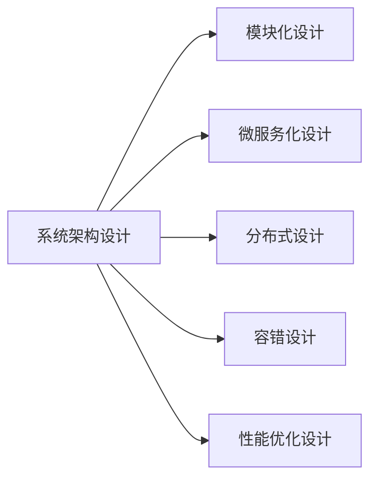

## 1.背景介绍

在当今的技术环境中，系统架构设计的重要性日益凸显。一个优秀的系统架构设计可以帮助我们更好地理解和管理复杂的系统，提高系统的稳定性和可维护性，同时也能够提升系统的性能和扩展性。然而，随着业务的发展和技术的进步，系统架构设计也需要不断地进行优化和演进。

## 2.核心概念与联系

系统架构设计包括了多个核心的概念和联系，包括但不限于系统的模块化设计、服务的微服务化设计、数据的分布式设计、系统的容错设计以及系统的性能优化设计等。



## 3.核心算法原理具体操作步骤

### 3.1 模块化设计

模块化设计的核心思想是将一个复杂的系统分解为多个可以独立开发、测试和部署的模块。这样可以降低系统的复杂性，提高系统的可维护性和可测试性。

### 3.2 微服务化设计

微服务化设计是将系统的各个模块进一步细化为多个可以独立运行和扩展的微服务。这样可以提高系统的扩展性和可用性，同时也可以降低系统的耦合度。

### 3.3 分布式设计

分布式设计是将系统的数据和服务分布在多个物理或者虚拟的节点上。这样可以提高系统的可用性和可靠性，同时也可以提高系统的性能。

### 3.4 容错设计

容错设计是设计系统的时候考虑到系统可能会出现的各种错误和异常，并且设计出相应的处理机制。这样可以提高系统的稳定性和可靠性。

### 3.5 性能优化设计

性能优化设计是通过各种手段和技术提高系统的性能。这包括但不限于算法优化、数据结构优化、系统调优以及硬件优化等。

## 4.数学模型和公式详细讲解举例说明

在系统架构设计中，我们经常需要通过数学模型和公式来描述和优化系统的性能。例如，我们可以通过排队论的模型来描述和优化系统的吞吐量和响应时间。

假设我们的系统是一个M/M/1的排队系统，即到达率和服务率都服从泊松分布，只有一个服务台。那么，系统的平均响应时间R可以通过以下的公式来计算：

$$
R = \frac{1}{\mu - \lambda}
$$

其中，$\lambda$是系统的到达率，$\mu$是系统的服务率。

通过这个公式，我们可以看出，如果我们想要减少系统的响应时间，我们可以通过增加系统的服务率或者减少系统的到达率来实现。

## 5.项目实践：代码实例和详细解释说明

在实际的项目实践中，我们可以通过各种技术和工具来实现上述的系统架构设计的原则和方法。例如，我们可以使用Docker和Kubernetes来实现系统的微服务化设计和分布式设计。

以下是一个简单的Dockerfile的例子，我们可以通过这个Dockerfile来创建一个简单的Web服务的Docker镜像：

```Dockerfile
FROM python:3.7
WORKDIR /app
COPY . /app
RUN pip install --no-cache-dir -r requirements.txt
EXPOSE 5000
CMD ["python", "app.py"]
```

在这个Dockerfile中，我们首先从Python 3.7的基础镜像开始，然后将我们的代码复制到/app目录下，接着我们安装了我们的Python依赖，最后我们启动了我们的Web服务。

## 6.实际应用场景

系统架构设计的原则和方法可以应用到各种实际的场景中，包括但不限于电商系统、社交系统、金融系统以及物联网系统等。

例如，在电商系统中，我们可以通过模块化设计和微服务化设计，将复杂的电商系统分解为商品模块、订单模块、用户模块、支付模块等多个可以独立开发、测试和部署的模块和微服务。同时，我们也可以通过分布式设计和容错设计，提高电商系统的可用性和可靠性。最后，我们还可以通过性能优化设计，提高电商系统的性能，提供更好的用户体验。

## 7.工具和资源推荐

在系统架构设计的过程中，我们可以使用各种工具和资源来帮助我们更好地设计和实现系统的架构。以下是一些推荐的工具和资源：

- Docker和Kubernetes：这是两个非常强大的容器化和集群管理工具，可以帮助我们实现系统的微服务化设计和分布式设计。
- Grafana和Prometheus：这是两个非常强大的监控和度量工具，可以帮助我们监控和优化系统的性能。
- Git和GitHub：这是两个非常强大的版本控制和协作工具，可以帮助我们更好地管理和协作我们的代码。
- Google Scholar和ACM Digital Library：这是两个非常强大的学术资源库，可以帮助我们获取最新的研究成果和技术动态。

## 8.总结：未来发展趋势与挑战

随着技术的发展和业务的变化，系统架构设计也会面临新的发展趋势和挑战。例如，随着云计算和边缘计算的发展，系统架构可能需要更加灵活和分布式。同时，随着数据量的增长和计算需求的提升，系统架构可能需要更加高效和强大。

然而，无论系统架构设计面临怎样的发展趋势和挑战，我们都需要坚持系统架构设计的基本原则和方法，包括模块化设计、微服务化设计、分布式设计、容错设计以及性能优化设计等。只有这样，我们才能设计出高效、稳定、可扩展和可维护的系统。

## 9.附录：常见问题与解答

1. **问：如何选择合适的微服务划分粒度？**

答：微服务的划分粒度需要根据具体的业务需求和技术条件来确定。一般来说，一个微服务应该是一个可以独立开发、测试和部署的业务功能单元。如果一个微服务太大，那么它可能会变得复杂和难以管理；如果一个微服务太小，那么它可能会增加系统的通信开销和复杂性。

2. **问：如何保证分布式系统的数据一致性？**

答：分布式系统的数据一致性是一个非常复杂的问题。一般来说，我们可以通过分布式事务、数据复制和数据分片等技术来保证分布式系统的数据一致性。然而，这些技术都有各自的优点和缺点，需要根据具体的业务需求和技术条件来选择。

作者：禅与计算机程序设计艺术 / Zen and the Art of Computer Programming