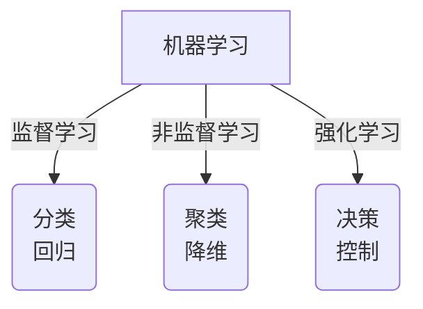
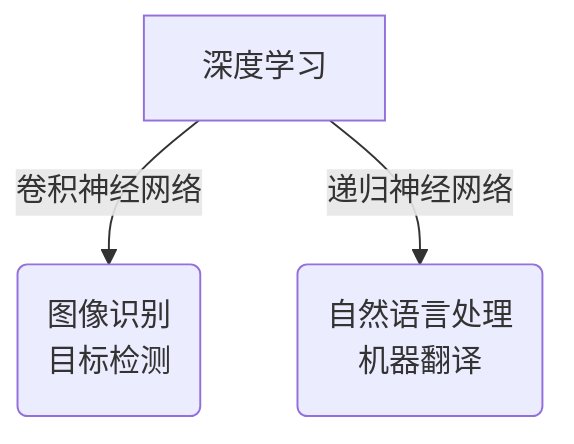
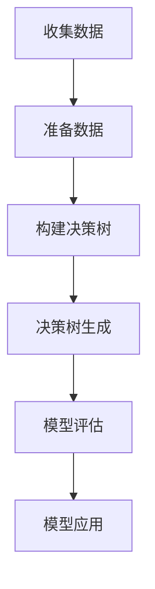
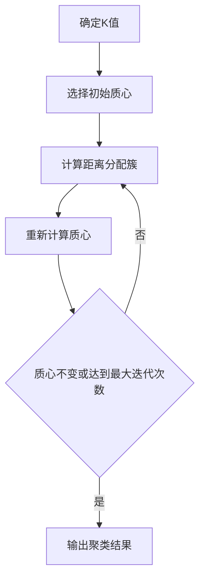
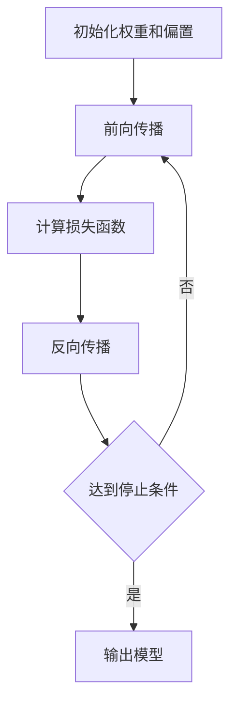

# 人工智能导论原理与代码实战案例讲解

## 1. 背景介绍

人工智能(Artificial Intelligence, AI)是当代科技领域最具革命性和颠覆性的技术之一。它旨在模拟人类的认知功能,如学习、推理、规划、问题解决和知识表示等。近年来,人工智能技术在各个领域的应用不断扩展,包括计算机视觉、自然语言处理、机器学习、智能系统等,为我们的生活带来了巨大的变革。

随着大数据时代的到来,海量的数据为人工智能算法提供了源源不断的燃料。同时,计算能力的飞速提升以及新兴技术的涌现,如深度学习、强化学习等,极大推动了人工智能的发展。如今,人工智能已广泛应用于金融、医疗、交通、制造等诸多领域,并取得了令人瞩目的成就。

本文将全面介绍人工智能的核心概念、算法原理、数学模型,并通过实战案例深入探讨其在实际应用中的实现方式。无论您是人工智能爱好者、开发者还是对该领域有浓厚兴趣的读者,相信本文都将为您提供有价值的见解和指引。

## 2. 核心概念与联系

人工智能是一个庞大的概念,涵盖了多个分支领域和技术。以下是一些核心概念及其相互联系:

### 2.1 机器学习

机器学习是人工智能的核心部分,它使计算机能够从数据中学习,而无需显式编程。常见的机器学习算法包括监督学习、非监督学习和强化学习等。



### 2.2 深度学习

深度学习是机器学习的一个子领域,它基于人工神经网络,通过多层非线性变换来学习数据的层次表示。深度学习在计算机视觉、自然语言处理等领域表现出色。



### 2.3 自然语言处理

自然语言处理(Natural Language Processing, NLP)是人工智能的一个重要分支,旨在使计算机能够理解和生成人类语言。它包括语音识别、机器翻译、文本挖掘等应用。

### 2.4 计算机视觉

计算机视觉(Computer Vision)是人工智能的另一个关键领域,它使计算机能够从数字图像或视频中获取有意义的信息。常见应用包括图像识别、目标检测、视频分析等。

### 2.5 知识表示与推理

知识表示与推理是人工智能的基础,它关注如何在计算机系统中表示和操作知识。常用的知识表示方法包括逻辑、规则、语义网络等。

上述概念相互关联、相辅相成,共同构建了人工智能的理论基础和应用框架。掌握这些核心概念有助于我们更好地理解和应用人工智能技术。

## 3. 核心算法原理具体操作步骤

在本节中,我们将介绍一些人工智能领域中的核心算法及其具体操作步骤。

### 3.1 决策树算法

决策树是一种常用的监督学习算法,它通过构建决策树模型来对数据进行分类或回归。以下是构建决策树的一般步骤:

1. 收集数据:准备用于训练的数据集。
2. 准备数据:对数据进行预处理,如处理缺失值、标准化等。
3. 构建决策树:
   - 选择最优特征,根据该特征将数据集划分为子集。
   - 计算各子集的纯度(如信息增益、基尼指数等)。
   - 对每个子集重复上述步骤,直到满足停止条件。
4. 决策树生成:构建完成后,得到一个决策树模型。
5. 模型评估:使用测试数据评估模型性能。
6. 模型应用:将训练好的模型应用于新的数据进行预测。



### 3.2 K-Means聚类算法

K-Means是一种常用的无监督学习算法,用于对数据进行聚类。其具体操作步骤如下:

1. 确定聚类数量K。
2. 随机选择K个初始质心。
3. 计算每个数据点到各质心的距离,将其分配到最近的质心所在的簇。
4. 重新计算每个簇的质心。
5. 重复步骤3和4,直到质心不再发生变化或达到最大迭代次数。



### 3.3 反向传播算法

反向传播算法是训练人工神经网络的核心算法之一,它通过调整网络权重来最小化损失函数。具体步骤如下:

1. 初始化网络权重和偏置。
2. 前向传播:输入数据,计算每层的输出。
3. 计算损失函数。
4. 反向传播:
   - 计算输出层的误差。
   - 计算隐藏层的误差。
   - 更新权重和偏置。
5. 重复步骤2-4,直到达到停止条件。



上述算法只是人工智能领域中的一小部分,但它们展示了算法的一般原理和操作步骤。在实际应用中,您可能需要根据具体问题和数据进行算法的选择和调整。

## 4. 数学模型和公式详细讲解举例说明

人工智能算法通常依赖于一些数学模型和公式。在本节中,我们将详细讲解一些常见的数学模型和公式,并给出具体的例子说明。

### 4.1 线性回归

线性回归是一种常用的监督学习算法,用于建立自变量和因变量之间的线性关系模型。其数学表达式如下:

$$y = \theta_0 + \theta_1x_1 + \theta_2x_2 + ... + \theta_nx_n$$

其中,y是因变量,x是自变量,$\theta_0$是常数项,$\theta_1, \theta_2, ..., \theta_n$是自变量的系数。

我们通常使用最小二乘法来估计这些系数,目标是最小化残差平方和:

$$J(\theta) = \sum_{i=1}^{m}(h_\theta(x^{(i)}) - y^{(i)})^2$$

其中,$h_\theta(x)$是线性回归模型的预测值,$x^{(i)}$和$y^{(i)}$分别表示第i个训练样本的自变量和因变量值。

例如,我们可以使用线性回归来预测房价。假设我们有一个包含房屋面积、卧室数量和房龄的数据集,线性回归模型可以表示为:

$$\text{房价} = \theta_0 + \theta_1 \times \text{面积} + \theta_2 \times \text{卧室数} + \theta_3 \times \text{房龄}$$

通过训练数据,我们可以估计出$\theta_0, \theta_1, \theta_2, \theta_3$的值,从而构建一个可用于预测新房屋价格的模型。

### 4.2 逻辑回归

逻辑回归是一种用于分类问题的监督学习算法。它使用逻辑函数(即Sigmoid函数)将线性回归的输出值映射到0到1之间的概率值:

$$h_\theta(x) = \frac{1}{1 + e^{-\theta^Tx}}$$

其中,$\theta$是模型参数向量,$x$是输入特征向量。

在二分类问题中,我们可以将概率值$h_\theta(x)$解释为样本$x$属于正类的概率。通常,我们将$h_\theta(x) \geq 0.5$的样本分类为正类,否则为负类。

例如,在垃圾邮件检测中,我们可以使用逻辑回归模型来预测一封电子邮件是否为垃圾邮件。假设我们有一个包含邮件主题、正文长度等特征的数据集,逻辑回归模型可以表示为:

$$P(\text{垃圾邮件} = 1 | x) = \frac{1}{1 + e^{-(\theta_0 + \theta_1 \times \text{主题长度} + \theta_2 \times \text{正文长度} + ...)}}$$

通过训练数据,我们可以估计出$\theta_0, \theta_1, \theta_2, ...$的值,从而构建一个可用于预测新邮件是否为垃圾邮件的模型。

### 4.3 支持向量机

支持向量机(Support Vector Machine, SVM)是一种常用的监督学习算法,主要用于分类和回归问题。SVM的基本思想是在高维空间中找到一个超平面,将不同类别的样本分开,并使得超平面与最近的样本点之间的距离最大化。

对于线性可分的二分类问题,SVM的目标是找到一个超平面$w^Tx + b = 0$,使得:

$$\begin{cases}
w^Tx_i + b \geq 1, & \text{对于 } y_i = 1 \\
w^Tx_i + b \leq -1, & \text{对于 } y_i = -1
\end{cases}$$

其中,$x_i$是训练样本,$y_i$是对应的类别标签(1或-1)。

我们可以通过求解以下优化问题来找到最优的$w$和$b$:

$$\begin{aligned}
\min_{w, b} & \frac{1}{2}||w||^2 \\
\text{s.t.} & y_i(w^Tx_i + b) \geq 1, \quad i = 1, 2, ..., m
\end{aligned}$$

对于非线性可分的情况,SVM通过核技巧将样本映射到高维空间,从而使其在高维空间中线性可分。

例如,在图像分类任务中,我们可以使用SVM来区分猫和狗的图像。首先,我们需要从图像中提取特征向量$x_i$,然后使用SVM算法训练一个分类器,最终得到一个可用于预测新图像是猫还是狗的模型。

上述只是人工智能中一些常见的数学模型和公式,在实际应用中,还有许多其他模型和公式需要掌握,如卷积神经网络、递归神经网络等。掌握这些数学基础对于深入理解和应用人工智能算法至关重要。

## 5. 项目实践:代码实例和详细解释说明

在本节中,我们将通过一个实际项目案例来演示如何使用Python和相关库实现人工智能算法。我们将构建一个手写数字识别系统,利用深度学习技术对手写数字图像进行分类。

### 5.1 项目概述

手写数字识别是计算机视觉和机器学习领域的一个经典问题。我们将使用MNIST数据集,它包含了60,000个训练图像和10,000个测试图像,每个图像都是一个28x28像素的手写数字图像,标记为0到9之间的数字。

我们将构建一个卷积神经网络(CNN)模型来对这些手写数字图像进行分类。CNN是一种深度学习模型,在图像识别和计算机视觉任务中表现出色。

### 5.2 导入所需库

首先,我们需要导入所需的Python库:

```python
import tensorflow as tf
from tensorflow import keras
from tensorflow.keras.datasets import mnist
import numpy as np
import matplotlib.pyplot as plt
```

我们将使用TensorFlow和Keras库来构建和训练CNN模型。NumPy用于数值计算,Matplotlib用于可视化。

### 5.3 