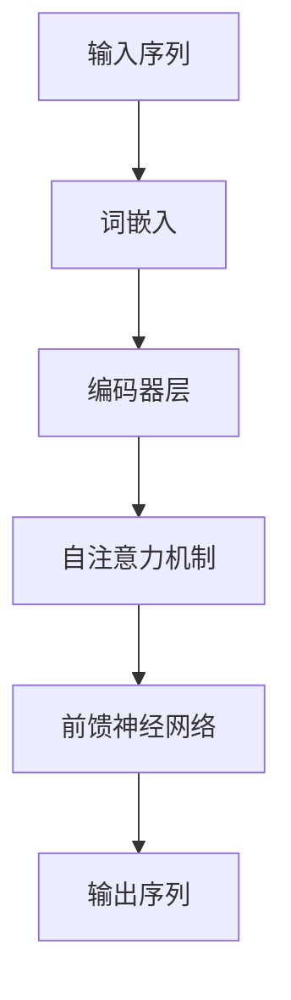
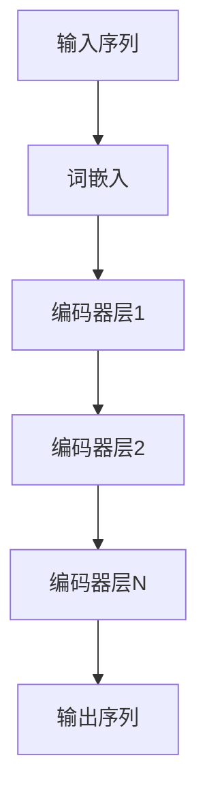

# 从零开始大模型开发与微调：BERT的基本架构与应用

## 1.背景介绍

在自然语言处理（NLP）领域，BERT（Bidirectional Encoder Representations from Transformers）模型的出现标志着一个重要的里程碑。BERT由Google AI Language团队在2018年提出，旨在通过双向训练的Transformer架构来捕捉句子中的上下文信息。BERT的出现不仅在多个NLP任务中取得了显著的性能提升，还引发了对预训练和微调方法的广泛关注。

### 1.1 自然语言处理的挑战

自然语言处理涉及理解和生成人类语言，这一任务充满了复杂性和挑战。传统的NLP方法通常依赖于手工特征工程和规则，难以处理语言的多样性和复杂性。深度学习的引入，特别是基于神经网络的方法，为NLP带来了新的希望。

### 1.2 预训练与微调的兴起

在BERT之前，预训练和微调的概念已经在计算机视觉领域取得了成功。预训练模型在大规模数据集上进行训练，然后在特定任务上进行微调，这种方法不仅提高了模型的性能，还减少了对标注数据的依赖。BERT将这一方法引入NLP，通过在大规模文本数据上进行预训练，然后在特定任务上进行微调，实现了显著的性能提升。

### 1.3 BERT的创新点

BERT的核心创新在于其双向Transformer架构，这使得模型能够同时考虑句子的前后文信息。此外，BERT采用了掩码语言模型（Masked Language Model, MLM）和下一句预测（Next Sentence Prediction, NSP）两种预训练任务，进一步增强了模型的理解能力。

## 2.核心概念与联系

在深入探讨BERT的实现细节之前，我们需要理解一些核心概念和它们之间的联系。

### 2.1 Transformer架构

Transformer是BERT的基础架构，由Vaswani等人在2017年提出。Transformer通过自注意力机制（Self-Attention Mechanism）来捕捉序列中的依赖关系，克服了传统RNN在处理长序列时的局限性。



### 2.2 自注意力机制

自注意力机制是Transformer的核心，通过计算序列中每个位置与其他位置的相关性来捕捉全局信息。自注意力机制的计算公式如下：

$$
\text{Attention}(Q, K, V) = \text{softmax}\left(\frac{QK^T}{\sqrt{d_k}}\right)V
$$

其中，$Q$、$K$、$V$分别表示查询（Query）、键（Key）和值（Value）矩阵，$d_k$是键的维度。

### 2.3 BERT的双向性

与传统的单向语言模型不同，BERT通过双向Transformer架构同时考虑句子的前后文信息。这使得BERT在理解句子结构和语义上具有更强的能力。

### 2.4 掩码语言模型（MLM）

在预训练阶段，BERT随机掩盖输入序列中的一些词，然后通过模型预测这些被掩盖的词。这一任务被称为掩码语言模型（MLM），其目标是让模型学习到词与上下文之间的关系。

### 2.5 下一句预测（NSP）

除了MLM，BERT还采用了下一句预测（NSP）任务。在NSP任务中，模型需要判断两个句子是否是连续的。这一任务帮助模型理解句子之间的关系。

## 3.核心算法原理具体操作步骤

在理解了BERT的核心概念后，我们可以进一步探讨其具体的操作步骤。

### 3.1 数据预处理

在进行预训练之前，需要对文本数据进行预处理。具体步骤包括：

1. **分词**：将文本分割成单词或子词。
2. **掩码**：随机掩盖一些词，生成MLM任务的训练数据。
3. **句子对**：生成句子对，构建NSP任务的训练数据。

### 3.2 模型架构

BERT的模型架构由多个Transformer编码器层组成。每个编码器层包括自注意力机制和前馈神经网络。



### 3.3 预训练

在预训练阶段，BERT通过MLM和NSP任务进行训练。具体步骤如下：

1. **MLM任务**：随机掩盖输入序列中的一些词，通过模型预测这些被掩盖的词。
2. **NSP任务**：构建句子对，通过模型判断两个句子是否是连续的。

### 3.4 微调

在预训练完成后，BERT可以在特定任务上进行微调。微调的步骤包括：

1. **任务数据准备**：准备特定任务的数据集。
2. **模型调整**：根据任务需求调整模型的输入和输出层。
3. **训练**：在特定任务的数据集上进行训练，微调模型参数。

## 4.数学模型和公式详细讲解举例说明

在这一部分，我们将详细讲解BERT的数学模型和公式，并通过具体例子说明其工作原理。

### 4.1 词嵌入

词嵌入是将离散的词映射到连续的向量空间。BERT使用WordPiece嵌入，将词分割成子词单元。假设输入序列为 $X = [x_1, x_2, ..., x_n]$，其对应的词嵌入为 $E = [e_1, e_2, ..., e_n]$。

### 4.2 自注意力机制

自注意力机制通过计算查询、键和值之间的相关性来捕捉全局信息。具体计算步骤如下：

1. **计算查询、键和值**：

$$
Q = XW_Q, \quad K = XW_K, \quad V = XW_V
$$

其中，$W_Q$、$W_K$、$W_V$分别是查询、键和值的权重矩阵。

2. **计算注意力得分**：

$$
\text{Attention}(Q, K, V) = \text{softmax}\left(\frac{QK^T}{\sqrt{d_k}}\right)V
$$

### 4.3 掩码语言模型（MLM）

在MLM任务中，输入序列的一部分词被随机掩盖，模型需要预测这些被掩盖的词。假设输入序列为 $X = [x_1, x_2, ..., x_n]$，其中一些词被掩盖，生成掩码序列 $X' = [x'_1, x'_2, ..., x'_n]$。模型的目标是最小化预测词与真实词之间的交叉熵损失：

$$
L_{MLM} = -\sum_{i=1}^n \log P(x_i | X')
$$

### 4.4 下一句预测（NSP）

在NSP任务中，模型需要判断两个句子是否是连续的。假设句子对为 $(S_1, S_2)$，模型的目标是最小化二分类交叉熵损失：

$$
L_{NSP} = -\left[y \log P(\text{连续} | S_1, S_2) + (1 - y) \log P(\text{不连续} | S_1, S_2)\right]
$$

### 4.5 总损失函数

BERT的总损失函数是MLM损失和NSP损失的加权和：

$$
L = L_{MLM} + L_{NSP}
$$

## 5.项目实践：代码实例和详细解释说明

在这一部分，我们将通过具体的代码实例来展示如何从零开始开发和微调BERT模型。

### 5.1 环境准备

首先，我们需要安装必要的库和工具。可以使用以下命令安装Hugging Face的Transformers库：

```bash
pip install transformers
```

### 5.2 数据预处理

假设我们有一个文本数据集，我们需要对其进行分词和掩码处理。以下是一个简单的示例：

```python
from transformers import BertTokenizer

tokenizer = BertTokenizer.from_pretrained('bert-base-uncased')

text = "Hello, how are you?"
tokens = tokenizer.tokenize(text)
input_ids = tokenizer.convert_tokens_to_ids(tokens)

print("Tokens:", tokens)
print("Input IDs:", input_ids)
```

### 5.3 模型加载与预训练

我们可以使用预训练的BERT模型，并在特定任务上进行微调。以下是一个简单的示例：

```python
from transformers import BertForMaskedLM, BertConfig

config = BertConfig.from_pretrained('bert-base-uncased')
model = BertForMaskedLM.from_pretrained('bert-base-uncased', config=config)

# 假设我们有一个输入序列
input_ids = tokenizer.encode("Hello, how are [MASK]?", return_tensors='pt')

# 进行预测
outputs = model(input_ids)
predictions = outputs.logits

# 获取预测的词
predicted_index = torch.argmax(predictions[0, -2]).item()
predicted_token = tokenizer.convert_ids_to_tokens([predicted_index])

print("Predicted token:", predicted_token)
```

### 5.4 微调

在特定任务上进行微调时，我们需要准备任务数据，并调整模型的输入和输出层。以下是一个简单的文本分类任务的示例：

```python
from transformers import BertForSequenceClassification, Trainer, TrainingArguments

# 加载预训练的BERT模型
model = BertForSequenceClassification.from_pretrained('bert-base-uncased', num_labels=2)

# 准备训练数据
train_texts = ["I love this!", "I hate this!"]
train_labels = [1, 0]
train_encodings = tokenizer(train_texts, truncation=True, padding=True)
train_dataset = Dataset(train_encodings, train_labels)

# 定义训练参数
training_args = TrainingArguments(
    output_dir='./results',
    num_train_epochs=3,
    per_device_train_batch_size=8,
    per_device_eval_batch_size=8,
    warmup_steps=500,
    weight_decay=0.01,
    logging_dir='./logs',
)

# 创建Trainer对象
trainer = Trainer(
    model=model,
    args=training_args,
    train_dataset=train_dataset,
)

# 开始训练
trainer.train()
```

## 6.实际应用场景

BERT在多个NLP任务中取得了显著的性能提升，以下是一些实际应用场景。

### 6.1 文本分类

BERT可以用于文本分类任务，如情感分析、垃圾邮件检测等。通过微调预训练的BERT模型，可以在这些任务上取得较高的准确率。

### 6.2 命名实体识别（NER）

命名实体识别是识别文本中具有特定意义的实体，如人名、地名、组织名等。BERT通过捕捉上下文信息，可以有效地识别这些实体。

### 6.3 问答系统

BERT在问答系统中表现出色。通过微调BERT模型，可以实现高效的问答系统，回答用户提出的问题。

### 6.4 机器翻译

虽然BERT不是专门为机器翻译设计的，但其双向Transformer架构可以用于捕捉句子的全局信息，从而提高翻译质量。

## 7.工具和资源推荐

在开发和微调BERT模型时，有一些工具和资源可以帮助我们提高效率。

### 7.1 Hugging Face Transformers

Hugging Face的Transformers库是一个强大的工具，提供了预训练的BERT模型和其他Transformer模型，方便我们进行微调和应用。

### 7.2 TensorFlow和PyTorch

TensorFlow和PyTorch是两个流行的深度学习框架，支持BERT模型的训练和微调。我们可以根据自己的需求选择合适的框架。

### 7.3 数据集

在进行预训练和微调时，选择合适的数据集非常重要。以下是一些常用的数据集：

- **GLUE**：通用语言理解评估基准，包含多个NLP任务的数据集。
- **SQuAD**：斯坦福问答数据集，用于问答系统的训练和评估。
- **CoNLL-2003**：命名实体识别数据集。

## 8.总结：未来发展趋势与挑战

BERT的出现标志着NLP领域的一个重要里程碑，但也带来了新的挑战和发展方向。

### 8.1 模型规模与计算资源

随着模型规模的增加，训练和推理所需的计算资源也显著增加。如何在保证性能的同时减少计算资源的消耗，是一个重要的研究方向。

### 8.2 多语言支持

虽然BERT在英语NLP任务中表现出色，但在多语言环境下的表现还有待提高。开发支持多语言的预训练模型是一个重要的研究方向。

### 8.3 模型解释性

深度学习模型的黑箱特性使得其解释性较差。如何提高模型的解释性，使其在实际应用中更加透明和可信，是一个重要的研究方向。

## 9.附录：常见问题与解答

### 9.1 BERT与传统NLP方法的区别是什么？

BERT通过双向Transformer架构同时考虑句子的前后文信息，而传统NLP方法通常依赖于手工特征工程和规则，难以处理语言的多样性和复杂性。

### 9.2 如何选择预训练模型？

选择预训练模型时，可以根据任务的需求和数据的特点选择合适的模型。例如，对于英语NLP任务，可以选择BERT-base或BERT-large模型。

### 9.3 如何进行模型微调？

模型微调的步骤包括准备任务数据、调整模型的输入和输出层、在特定任务的数据集上进行训练。可以使用Hugging Face的Transformers库进行微调。

### 9.4 BERT的应用场景有哪些？

BERT可以应用于多个NLP任务，如文本分类、命名实体识别、问答系统、机器翻译等。

### 9.5 如何提高模型的性能？

提高模型性能的方法包括增加训练数据、调整模型参数、使用更大的预训练模型等。

---

作者：禅与计算机程序设计艺术 / Zen and the Art of Computer Programming