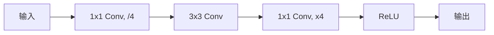
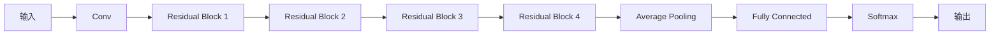

# 从零开始大模型开发与微调：ResNet诞生的背景

## 1.背景介绍

深度神经网络在计算机视觉、自然语言处理等领域取得了巨大的成功,但是训练深度网络也面临一些挑战。随着网络层数的增加,信息在网络中传播的路径也变得越来越长,导致了梯度消失或梯度爆炸的问题。这些问题会阻碍网络的收敛,限制了网络的深度。

为了解决这个问题,2015年,微软研究院的何恺明等人提出了残差网络(Residual Network,简称ResNet)。ResNet通过引入残差连接(Residual Connection),使得网络中的梯度可以直接传递到较浅层,从而缓解了梯度消失问题,使得训练更加深层的网络成为可能。ResNet在2015年的ImageNet大赛中一举夺冠,并引发了深度残差网络在计算机视觉领域的广泛应用。

### 1.1 传统神经网络的局限性

传统的神经网络通过堆叠多个卷积层和全连接层来提取特征并进行分类。然而,当网络层数增加到一定程度时,会出现"退化"(Degradation)问题,即准确率会随着网络深度的增加而下降,而不是持续上升。这种现象的主要原因是梯度消失或梯度爆炸问题。

梯度消失是指在反向传播过程中,梯度值会随着网络层数的增加而指数级衰减,导致较浅层的权重无法得到有效更新。而梯度爆炸则是梯度值在某些层会变得非常大,使得权重更新失控。这两个问题都会阻碍网络的收敛,限制了网络的深度。

### 1.2 残差网络的提出

为了解决深度网络的训练困难问题,何恺明等人提出了残差网络(ResNet)。ResNet的核心思想是在网络中引入"残差连接"(Residual Connection),使得网络可以更容易地学习残差映射(Residual Mapping),而不是直接学习原始的映射关系。

具体来说,ResNet将传统网络的映射 $H(x)$ 分解为 $F(x) + x$,其中 $F(x)$ 是残差映射,表示输入和输出之间的残差部分。网络只需要学习 $F(x)$,而不是整个映射 $H(x)$。由于残差映射相对于原始映射更容易拟合,因此可以缓解梯度消失问题,使得训练更加深层的网络成为可能。

## 2.核心概念与联系

### 2.1 残差连接

残差连接是ResNet的核心概念,它将输入 $x$ 直接添加到网络的某一层的输出 $F(x)$ 上,得到最终的输出 $H(x) = F(x) + x$。这种连接方式使得网络可以更容易地学习残差映射 $F(x)$,而不是直接学习原始的映射 $H(x)$。

在实现上,残差连接可以通过简单的元素级相加操作来实现。如果输入和输出的维度不同,可以通过线性投影(Linear Projection)将输入调整到合适的维度。

```mermaid
graph LR
    A[输入 x] --> B[卷积层]
    B --> C[ReLU]
    C --> D[卷积层]
    D --> E[ReLU]
    A -- 残差连接 --> F[+]
    D --> F
    F --> G[输出 H(x)]
```

### 2.2 bottleneck结构

为了进一步减少计算复杂度,ResNet采用了"bottleneck"结构。bottleneck结构由三个卷积层组成:首先使用 $1\times 1$ 的卷积核将输入的通道数减小,然后使用 $3\times 3$ 的卷积核进行特征提取,最后再使用 $1\times 1$ 的卷积核将通道数恢复到原始大小。这种设计可以大大减少计算量,同时也保留了足够的表达能力。



### 2.3 网络结构

ResNet的整体结构由多个残差块(Residual Block)组成,每个残差块包含多个bottleneck结构。不同的ResNet变体(如ResNet-18、ResNet-34、ResNet-50等)主要区别在于残差块的数量和bottleneck结构的堆叠方式。



## 3.核心算法原理具体操作步骤

ResNet的核心算法原理可以分为以下几个步骤:

1. **输入数据预处理**:将输入图像进行标准化处理,如减去均值、除以标准差等。

2. **卷积层**:使用卷积层提取输入图像的特征。

3. **残差块**:将特征输入到多个残差块中,每个残差块包含多个bottleneck结构。

   - **bottleneck结构**:
     a. 使用 $1\times 1$ 卷积核将输入通道数减小。
     b. 使用 $3\times 3$ 卷积核进行特征提取。
     c. 使用 $1\times 1$ 卷积核将通道数恢复到原始大小。
   - **残差连接**:将残差块的输入直接相加到输出上,得到最终的输出。

4. **平均池化层**:对残差块的输出进行平均池化,得到一个固定长度的特征向量。

5. **全连接层**:将平均池化层的输出输入到全连接层,得到分类分数。

6. **Softmax层**:对分类分数进行Softmax操作,得到最终的分类概率输出。

7. **损失函数**:计算预测输出与真实标签之间的损失,如交叉熵损失。

8. **反向传播**:通过反向传播算法计算梯度,并更新网络参数。

9. **模型评估**:在验证集或测试集上评估模型的性能,如准确率、召回率等指标。

10. **模型微调**:根据评估结果,对模型进行微调,如调整超参数、增加数据增强等。

## 4.数学模型和公式详细讲解举例说明

### 4.1 残差连接

ResNet的核心思想是引入残差连接,使网络可以更容易地学习残差映射 $F(x)$,而不是直接学习原始的映射 $H(x)$。具体来说,ResNet将传统网络的映射 $H(x)$ 分解为 $F(x) + x$,其中 $F(x)$ 是残差映射,表示输入和输出之间的残差部分。

$$H(x) = F(x) + x$$

在实现上,残差连接可以通过简单的元素级相加操作来实现。如果输入和输出的维度不同,可以通过线性投影(Linear Projection)将输入调整到合适的维度。

$$y = F(x, \{W_i\}) + W_sx$$

其中 $F(x, \{W_i\})$ 表示残差映射,由一系列卷积层和非线性激活函数组成,参数为 $\{W_i\}$。$W_s$ 是线性投影的权重矩阵,用于将输入 $x$ 映射到合适的维度。

### 4.2 bottleneck结构

为了进一步减少计算复杂度,ResNet采用了"bottleneck"结构。bottleneck结构由三个卷积层组成:

1. $1\times 1$ 卷积核,用于减小输入的通道数。
2. $3\times 3$ 卷积核,用于特征提取。
3. $1\times 1$ 卷积核,用于恢复通道数。

bottleneck结构的数学表达式如下:

$$
\begin{aligned}
y &= F(x, \{W_i\}) + x \\
F(x, \{W_i\}) &= W_3 \sigma(W_2 \sigma(W_1 x))
\end{aligned}
$$

其中 $W_1$、$W_2$、$W_3$ 分别表示三个卷积层的权重矩阵,而 $\sigma$ 表示非线性激活函数,如ReLU函数。

通过这种设计,bottleneck结构可以大大减少计算量,同时也保留了足够的表达能力。

### 4.3 网络结构

ResNet的整体结构由多个残差块(Residual Block)组成,每个残差块包含多个bottleneck结构。不同的ResNet变体(如ResNet-18、ResNet-34、ResNet-50等)主要区别在于残差块的数量和bottleneck结构的堆叠方式。

对于一个包含 $N$ 个残差块的ResNet,其前向传播过程可以表示为:

$$
\begin{aligned}
x_0 &= x \\
x_i &= F_i(x_{i-1}, \{W_i\}) + x_{i-1}, \quad i = 1, 2, \dots, N \\
y &= G(x_N, \{W_G\})
\end{aligned}
$$

其中 $x_0$ 表示输入图像,而 $F_i$ 表示第 $i$ 个残差块,包含多个bottleneck结构。$G$ 表示最后的平均池化层和全连接层,用于得到分类分数 $y$。

在反向传播过程中,残差连接可以使梯度直接传递到较浅层,从而缓解了梯度消失问题。

## 5.项目实践:代码实例和详细解释说明

以下是使用PyTorch实现ResNet-18的代码示例,包括残差块和bottleneck结构的实现:

```python
import torch
import torch.nn as nn

class ResidualBlock(nn.Module):
    def __init__(self, in_channels, out_channels, stride=1, downsample=None):
        super(ResidualBlock, self).__init__()
        self.conv1 = nn.Conv2d(in_channels, out_channels, kernel_size=3, stride=stride, padding=1, bias=False)
        self.bn1 = nn.BatchNorm2d(out_channels)
        self.conv2 = nn.Conv2d(out_channels, out_channels, kernel_size=3, stride=1, padding=1, bias=False)
        self.bn2 = nn.BatchNorm2d(out_channels)
        self.relu = nn.ReLU(inplace=True)
        self.downsample = downsample

    def forward(self, x):
        residual = x
        out = self.conv1(x)
        out = self.bn1(out)
        out = self.relu(out)
        out = self.conv2(out)
        out = self.bn2(out)
        if self.downsample is not None:
            residual = self.downsample(x)
        out += residual
        out = self.relu(out)
        return out

class ResNet(nn.Module):
    def __init__(self, block, layers, num_classes=1000):
        super(ResNet, self).__init__()
        self.in_channels = 64
        self.conv1 = nn.Conv2d(3, 64, kernel_size=7, stride=2, padding=3, bias=False)
        self.bn1 = nn.BatchNorm2d(64)
        self.relu = nn.ReLU(inplace=True)
        self.maxpool = nn.MaxPool2d(kernel_size=3, stride=2, padding=1)
        self.layer1 = self._make_layer(block, 64, layers[0])
        self.layer2 = self._make_layer(block, 128, layers[1], stride=2)
        self.layer3 = self._make_layer(block, 256, layers[2], stride=2)
        self.layer4 = self._make_layer(block, 512, layers[3], stride=2)
        self.avgpool = nn.AvgPool2d(7, stride=1)
        self.fc = nn.Linear(512 * block.expansion, num_classes)

    def _make_layer(self, block, out_channels, blocks, stride=1):
        downsample = None
        if stride != 1 or self.in_channels != out_channels * block.expansion:
            downsample = nn.Sequential(
                nn.Conv2d(self.in_channels, out_channels * block.expansion, kernel_size=1, stride=stride, bias=False),
                nn.BatchNorm2d(out_channels * block.expansion),
            )
        layers = []
        layers.append(block(self.in_channels, out_channels, stride, downsample))
        self.in_channels = out_channels * block.expansion
        for i in range(1, blocks):
            layers.append(block(self.in_channels, out_channels))
        return nn.Sequential(*layers)

    def forward(self, x):
        x = self.conv1(x)
        x = self.bn1(x)
        x = self.relu(x)
        x = self.maxpool(x)
        x = self.layer1(x)
        x = self.layer2(x)
        