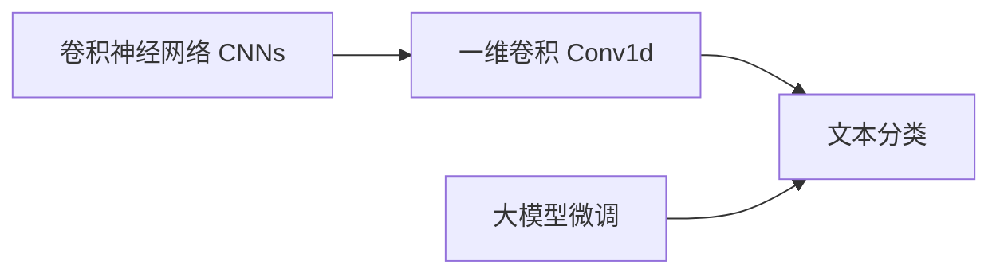
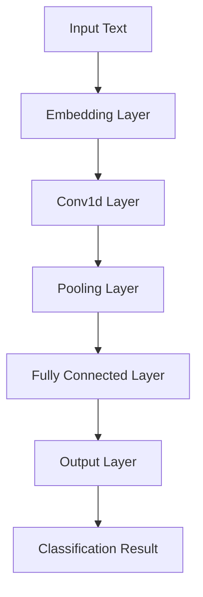

# 从零开始大模型开发与微调：卷积神经网络文本分类模型的实现—Conv1d（一维卷积）

## 1. 背景介绍
### 1.1 大模型与文本分类
近年来，随着深度学习技术的飞速发展，大规模预训练语言模型（Large Pre-trained Language Models，PLMs）在自然语言处理（NLP）领域取得了显著成果。这些大模型通过在海量无标注文本数据上进行预训练，学习到了丰富的语义表示和语言知识，并可以通过微调（Fine-tuning）的方式应用于下游的NLP任务，如文本分类、命名实体识别、问答系统等，大大提升了这些任务的性能表现。

文本分类是NLP中一项基础而关键的任务，旨在将给定的文本划分到预定义的一个或多个类别中。传统的文本分类方法主要基于词袋模型（Bag-of-Words）和TF-IDF等特征表示，结合支持向量机（SVM）、朴素贝叶斯等机器学习分类器进行建模。然而，这些方法忽略了文本的语序关系和深层语义信息，难以捕捉文本的复杂语义。

### 1.2 卷积神经网络用于文本分类
卷积神经网络（Convolutional Neural Networks, CNNs）最初被广泛应用于计算机视觉领域，并取得了巨大成功。受此启发，研究者们开始将CNNs引入到文本分类任务中。与循环神经网络（如LSTM、GRU）相比，CNNs能够并行计算，训练速度更快；此外，CNNs可以有效捕捉文本中的局部特征和语义信息。

一维卷积（Conv1d）是CNNs在文本分类中的常用变体。不同于二维卷积（Conv2d）对图像进行卷积操作，Conv1d沿着文本序列的时间维度进行卷积，提取局部特征。通过叠加多层Conv1d，可以获得不同尺度的语义表示，再结合池化层和全连接层，构建出完整的用于文本分类的卷积神经网络模型。

### 1.3 大模型微调范式
尽管从零开始训练的卷积神经网络已经能够在文本分类任务上取得不错的效果，但面对标注数据稀缺、计算资源有限等现实挑战，如何进一步提升模型性能成为了一个关键问题。大模型微调范式为此提供了一种有效的解决方案。

具体而言，我们可以先在大规模无标注文本语料上预训练一个强大的语言模型（如BERT、GPT等），学习通用的语言表示；然后，在特定的文本分类任务上，使用少量标注数据对预训练模型进行微调，使其适应当前任务。这种"预训练-微调"范式充分利用了预训练模型学习到的丰富语言知识，同时显著降低了对标注数据的需求，极大地提升了文本分类的性能。

本文将详细介绍如何从零开始实现一个基于Conv1d的卷积神经网络文本分类模型，并在此基础上探讨如何利用大模型微调范式进一步优化模型性能。通过理论讲解和代码实践相结合的方式，帮助读者深入理解卷积神经网络和大模型微调在文本分类任务中的应用。

## 2. 核心概念与联系
### 2.1 卷积神经网络（CNNs）
- 定义：一种基于卷积操作的深度神经网络架构，通过局部连接和权重共享，能够有效地提取数据中的局部特征。
- 组成：卷积层、池化层、全连接层。
- 应用：图像识别、目标检测、语义分割等计算机视觉任务；文本分类、情感分析、问答系统等自然语言处理任务。

### 2.2 一维卷积（Conv1d） 
- 定义：在一维序列数据上进行卷积操作，提取局部特征。
- 输入：形状为(batch_size, seq_len, input_dim)的三维张量，其中batch_size为批次大小，seq_len为序列长度，input_dim为输入特征维度。
- 输出：形状为(batch_size, new_seq_len, output_dim)的三维张量，其中new_seq_len为卷积后的序列长度，output_dim为输出特征维度。
- 计算过程：卷积核在输入序列上滑动，对局部区域进行加权求和，得到新的特征表示。

### 2.3 文本分类
- 定义：将给定的文本划分到预定义的一个或多个类别中的任务。
- 分类：二分类、多分类。
- 应用：垃圾邮件检测、情感分析、主题分类、意图识别等。
- 评估指标：准确率（Accuracy）、精确率（Precision）、召回率（Recall）、F1分数等。

### 2.4 大模型微调
- 定义：在大规模无标注语料上预训练一个通用的语言模型，然后在特定任务上使用少量标注数据对其进行微调，使其适应当前任务。
- 预训练模型：BERT、GPT、RoBERTa等。
- 优势：充分利用预训练模型学习到的丰富语言知识，降低对标注数据的需求，提升下游任务性能。
- 微调策略：特定任务输出层替换、附加任务特定层等。

### 2.5 核心概念之间的联系
下图展示了卷积神经网络、一维卷积、文本分类和大模型微调之间的关系：

卷积神经网络是一种强大的深度学习架构，其中一维卷积是针对序列数据的变体，可以用于文本分类任务。同时，大模型微调范式可以进一步提升文本分类模型的性能，二者结合构成了一个完整的文本分类解决方案。

## 3. 核心算法原理与具体操作步骤
### 3.1 一维卷积的计算过程
一维卷积在输入序列上滑动卷积核，对局部区域进行加权求和，得到新的特征表示。具体计算过程如下：

1. 输入序列：记输入序列为$\mathbf{x} = [x_1, x_2, ..., x_n]$，其中$n$为序列长度，$x_i \in \mathbb{R}^d$为第$i$个位置的$d$维特征向量。

2. 卷积核：记卷积核为$\mathbf{w} = [w_1, w_2, ..., w_k]$，其中$k$为卷积核大小，$w_i \in \mathbb{R}^d$为卷积核的权重参数。

3. 卷积操作：卷积核在输入序列上滑动，对局部区域进行加权求和。假设当前卷积核的中心位置为$i$，则卷积操作可表示为：

$$c_i = f(\mathbf{w} \cdot \mathbf{x}_{i:i+k-1} + b)$$

其中，$\mathbf{x}_{i:i+k-1}$表示输入序列中从位置$i$到$i+k-1$的子序列，$\cdot$表示点积操作，$b$为偏置项，$f$为激活函数（如ReLU）。

4. 输出特征：卷积核在输入序列上滑动，得到一系列卷积结果$[c_1, c_2, ..., c_{n-k+1}]$，构成了新的特征表示。

5. 多个卷积核：通常使用多个卷积核对输入序列进行卷积，得到多个输出特征，再将它们拼接起来形成最终的特征表示。

### 3.2 基于Conv1d的文本分类模型架构
基于Conv1d的文本分类模型通常包括以下几个关键组件：

1. 嵌入层（Embedding Layer）：将输入文本中的词语映射为稠密的词向量表示。可以使用预训练的词向量（如Word2Vec、GloVe等），也可以在训练过程中随机初始化并与模型一起学习。

2. 一维卷积层（Conv1d Layer）：在嵌入层的输出上应用一维卷积操作，提取局部特征。可以使用多个不同大小的卷积核，捕捉不同尺度的语义信息。

3. 池化层（Pooling Layer）：对卷积层的输出进行池化操作，降低特征维度并提取最重要的特征。常用的池化方式有最大池化（Max Pooling）和平均池化（Average Pooling）。

4. 全连接层（Fully Connected Layer）：将池化层的输出通过一个或多个全连接层进行非线性变换，生成最终的特征表示。

5. 输出层（Output Layer）：根据任务类型（二分类或多分类）设置相应的输出层和损失函数。对于二分类任务，可以使用sigmoid激活函数和二元交叉熵损失；对于多分类任务，可以使用softmax激活函数和交叉熵损失。

下图展示了一个基于Conv1d的文本分类模型的架构示意图：

### 3.3 模型训练与微调
给定一个标注的文本分类数据集，我们可以通过以下步骤训练和微调基于Conv1d的文本分类模型：

1. 数据预处理：对原始文本进行分词、词语映射、填充等预处理操作，将其转换为模型可接受的输入格式。

2. 模型初始化：根据任务需求和数据特点，设置合适的模型超参数，如嵌入维度、卷积核大小、卷积核数量、池化方式、全连接层数量等。随机初始化模型参数或加载预训练的词向量。

3. 损失函数和优化器：根据任务类型选择合适的损失函数（如二元交叉熵或交叉熵），并选择优化器（如Adam、SGD等）用于模型参数更新。

4. 训练迭代：将数据集划分为训练集和验证集，按照批次大小（batch size）将训练数据输入模型，计算损失函数并通过反向传播更新模型参数。定期在验证集上评估模型性能，监控训练过程。

5. 微调：如果使用预训练的语言模型（如BERT），可以在训练的基础上进行微调。将预训练模型的输出接入到特定任务的输出层，使用任务特定的标注数据对整个模型进行微调，使其适应当前任务。

6. 模型评估：在测试集上评估训练好的模型性能，计算准确率、精确率、召回率、F1分数等评估指标，分析模型的优缺点。

7. 模型调优：根据评估结果，调整模型架构和超参数，如增加卷积层数量、调整卷积核大小、改变池化方式、增加正则化项等，不断迭代优化模型性能。

通过以上步骤，我们可以训练和微调一个基于Conv1d的高性能文本分类模型，充分利用大模型预训练的语言知识，同时适应特定任务的需求。

## 4. 数学模型与公式详解
### 4.1 一维卷积的数学表示
一维卷积可以用数学公式来精确表示。假设输入序列为$\mathbf{x} = [x_1, x_2, ..., x_n]$，卷积核为$\mathbf{w} = [w_1, w_2, ..., w_k]$，卷积操作可以表示为：

$$c_i = f(\sum_{j=1}^k w_j \cdot x_{i+j-1} + b)$$

其中，$c_i$为卷积结果，$f$为激活函数，$b$为偏置项。上式可以展开为：

$$c_i = f(w_1 \cdot x_i + w_2 \cdot x_{i+1} + ... + w_k \cdot x_{i+k-1} + b)$$

通过滑动卷积核，我们可以得到一系列卷积结果$[c_1, c_2, ..., c_{n-k+1}]$，构成了新的特征表示。

### 4.2 多通道一维卷积
在实际应用中，我们通常使用多个卷积核对输入序列进行卷积，得到多个输出特征，再将它们拼接起来形成最终的特征表示。假设有$m$个卷积核，第$j$个卷积核为$