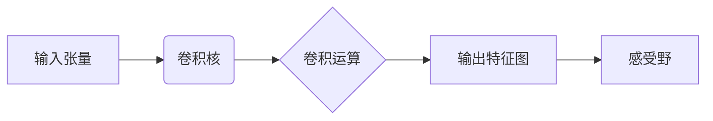

# 从零开始大模型开发与微调：卷积运算的基本概念

## 1. 背景介绍
### 1.1 大模型的兴起
近年来,随着深度学习技术的飞速发展,大规模预训练语言模型(Pre-trained Language Models,PLMs)取得了巨大的成功。从 GPT、BERT 到最新的 GPT-4,大模型展现出了惊人的性能,在自然语言处理、计算机视觉等领域取得了突破性进展。

### 1.2 大模型面临的挑战
尽管大模型取得了瞩目的成就,但在实际应用中仍然面临诸多挑战:
- 计算资源要求高:训练大模型需要大量的计算资源和时间成本
- 适用范围有限:预训练模型难以直接应用于特定领域任务
- 可解释性不足:大模型内部工作机制仍是一个"黑箱"

### 1.3 微调的重要性
为了克服上述挑战,微调(Fine-tuning)技术应运而生。通过在特定任务上微调预训练模型,可以显著提升模型在下游任务上的表现,同时大大降低计算资源要求。微调已成为大模型实际应用的关键一环。

### 1.4 卷积运算的核心地位
在大模型的微调过程中,卷积运算(Convolution)发挥着至关重要的作用。作为深度学习的核心操作之一,卷积能够高效地提取局部特征,具有平移不变性等优良性质。深入理解卷积运算的原理,是掌握大模型微调技术的基础。

## 2. 核心概念与联系
### 2.1 张量(Tensor)
- 定义:多维数组,描述复杂的数据结构
- 阶(Rank):张量的维度数
- 形状(Shape):各个维度的大小

### 2.2 特征图(Feature Map) 
- 定义:卷积层的输入输出,表征数据的特征
- 通道(Channel):特征图的深度维度

### 2.3 卷积核(Kernel/Filter)
- 定义:卷积运算的参数,滑动窗口提取特征
- 超参数:卷积核的尺寸、数量、步长、填充等

### 2.4 感受野(Receptive Field)
- 定义:输出特征图上一个像素对应输入的区域大小
- 局部性:卷积通过局部连接实现特征提取

### 2.5 概念之间的联系


## 3. 核心算法原理与操作步骤
### 3.1 卷积的数学定义
对于输入张量 $\mathbf{X}$ 和卷积核 $\mathbf{W}$,卷积运算定义为:

$$\mathbf{Y}[i,j] = \sum_m \sum_n \mathbf{X}[i+m, j+n] \cdot \mathbf{W}[m,n]$$

其中 $\mathbf{Y}$ 为输出特征图。

### 3.2 卷积的计算过程
1. 滑动窗口:卷积核在输入张量上按照指定步长滑动
2. 局部乘积:卷积核与当前窗口内的输入元素逐元素相乘
3. 求和:将局部乘积结果相加得到输出特征图的一个元素
4. 重复:对输入张量的所有位置重复上述过程

### 3.3 卷积的变体
- 步长(Stride):卷积核滑动的步长,控制特征图的尺寸
- 填充(Padding):在输入边缘填充零元素,保持特征图尺寸
- 空洞卷积(Dilated Conv.):扩大卷积核感受野而不增加参数量
- 转置卷积(Transposed Conv.):也称反卷积,用于上采样

## 4. 数学模型与公式详解
### 4.1 输入张量与卷积核
考虑一个 $H \times W \times C$ 的输入张量 $\mathbf{X}$,以及一个 $K \times K$ 的卷积核 $\mathbf{W}$。

### 4.2 卷积输出尺寸
记步长为 $S$,填充为 $P$,则卷积输出特征图的高度 $H'$ 和宽度 $W'$ 为:

$$
\begin{aligned}
H' &= \lfloor \frac{H + 2P - K}{S} \rfloor + 1 \\
W' &= \lfloor \frac{W + 2P - K}{S} \rfloor + 1
\end{aligned}
$$

其中 $\lfloor \cdot \rfloor$ 表示向下取整。

### 4.3 多通道卷积
对于多通道输入 $\mathbf{X} \in \mathbb{R}^{H \times W \times C}$,卷积核也需要有 $C$ 个通道,即 $\mathbf{W} \in \mathbb{R}^{K \times K \times C}$。多通道卷积的输出为各通道卷积结果的和:

$$\mathbf{Y}[i,j] = \sum_c \sum_m \sum_n \mathbf{X}[i+m, j+n, c] \cdot \mathbf{W}[m,n,c]$$

### 4.4 批量卷积
在实际应用中,我们通常对一个批次(Batch)的数据进行卷积。设批次大小为 $N$,则输入张量形状为 $N \times H \times W \times C$,卷积核形状为 $K \times K \times C \times M$(其中 $M$ 为输出通道数)。批量卷积可以高效地并行计算。

## 5. 项目实践:代码实例与详解
下面以 PyTorch 为例,演示如何实现一个简单的卷积层:

```python
import torch
import torch.nn as nn

# 定义卷积层
conv = nn.Conv2d(in_channels=3, out_channels=16, kernel_size=3, stride=1, padding=1)

# 生成随机输入
input = torch.randn(1, 3, 32, 32)

# 前向传播
output = conv(input)

# 查看输出尺寸
print(output.shape)  # 输出: torch.Size([1, 16, 32, 32])
```

在上面的代码中:
- `nn.Conv2d` 定义了一个二维卷积层,指定了输入通道数、输出通道数、卷积核尺寸、步长和填充
- 我们生成了一个 $1 \times 3 \times 32 \times 32$ 的随机输入张量,表示一个 RGB 图像
- 将输入传递给卷积层,得到输出特征图
- 最后打印输出尺寸,可以看到经过卷积后,特征图的高宽保持不变,通道数变为16

这个简单的例子展示了如何使用 PyTorch 构建卷积层并进行前向传播。在实际的大模型微调中,我们通常使用更深的卷积神经网络,并在特定任务的数据集上进行训练。

## 6. 实际应用场景
卷积运算在计算机视觉、自然语言处理等领域有广泛应用,下面列举几个典型场景:

### 6.1 图像分类
使用卷积神经网络(CNN)对图像进行特征提取和分类,如 ResNet、EfficientNet 等模型。

### 6.2 目标检测
使用卷积网络进行目标的定位和识别,代表模型有 Faster R-CNN、YOLO 等。

### 6.3 语义分割
通过卷积对图像进行像素级别的分类,实现背景前景分离,如 FCN、U-Net 等。

### 6.4 文本分类
将文本看作一维信号,使用一维卷积提取局部特征,如 TextCNN 模型。

### 6.5 机器翻译
在 Transformer 等模型中,也使用卷积作为词嵌入的一种方式。

## 7. 工具和资源推荐
- 深度学习框架:PyTorch、TensorFlow、Keras 等
- 可视化工具:TensorBoard、Visdom、Weights & Biases 等
- 模型库:torchvision、TensorFlow Model Zoo、Hugging Face 等
- 论文与教程:NIPS、ICML、ICLR 等顶会论文,CS231n 课程
- GitHub 仓库:PyTorch官方仓库,TensorFlow Models 等

## 8. 总结:未来发展趋势与挑战
卷积运算作为深度学习的基石,在大模型微调中扮演着至关重要的角色。未来卷积技术的发展趋势和挑战包括:
- 设计更高效的卷积结构,如深度可分离卷积、Involution 等
- 探索卷积与其他运算(注意力、门控单元等)的结合,提升模型性能
- 研究卷积网络的可解释性,理解模型的内部机制
- 面向特定硬件(如移动端、IoT设备)优化卷积计算
- 结合神经架构搜索(NAS)技术,自动设计卷积网络结构

卷积运算的研究还有很长的路要走。只有不断创新,探索新的理论和方法,才能推动大模型微调技术的进一步发展,造福人工智能的各个应用领域。

## 9. 附录:常见问题与解答
### Q1:卷积核的尺寸如何选择?
A1:卷积核尺寸通常选择奇数,如 3x3、5x5 等。小尺寸卷积核可以减少参数量,而大尺寸卷积核可以增大感受野。需要根据具体任务和网络深度进行权衡。

### Q2:步长和填充对输出尺寸有什么影响?
A2:步长越大,输出特征图尺寸越小;填充越多,输出特征图尺寸越接近输入尺寸。通过调整步长和填充,可以控制特征图的空间分辨率。

### Q3:如何理解空洞卷积?
A3:空洞卷积在卷积核内部插入空洞(零元素),相当于使用一个更大的卷积核,但参数量不变。这样可以在不增加计算量的情况下,获得更大的感受野。

### Q4:卷积网络容易过拟合吗?
A4:卷积网络通过参数共享和局部连接,一定程度上减少了过拟合风险。但在数据量不足或网络过深时,仍然可能出现过拟合。可以采用正则化、数据增强、提前停止等方法来缓解。

### Q5:如何平衡卷积网络的宽度和深度?
A5:增加网络宽度(通道数)可以提高模型的表示能力,增加深度可以提高特征的抽象级别。但过宽或过深都可能带来优化难度和计算量的提升。需要根据任务难度和计算资源,合理平衡宽度和深度。一般来说,浅而宽的网络更适合于小数据集,而深而窄的网络更适合于大数据集。

作者：禅与计算机程序设计艺术 / Zen and the Art of Computer Programming