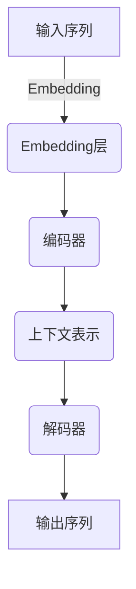

# 从零开始大模型开发与微调：基于PyTorch 2.0的强化学习实战

## 1.背景介绍

### 1.1 人工智能的崛起

人工智能(Artificial Intelligence, AI)作为一门跨学科的技术,正在以前所未有的方式改变着我们的生活、工作和学习方式。随着计算能力的不断提升和算法的持续创新,人工智能系统展现出了令人惊叹的能力,可以在语音识别、图像处理、自然语言处理等诸多领域达到或超越人类水平。

### 1.2 大模型的重要性

在人工智能的发展历程中,大模型(Large Models)扮演着至关重要的角色。所谓大模型,是指具有数十亿甚至上万亿参数的深度神经网络模型。这些庞大的模型能够从海量数据中学习丰富的知识表示,并在各种复杂任务上展现出卓越的性能。著名的大模型包括GPT-3、BERT、DALL-E等,它们已经在自然语言处理、计算机视觉等领域取得了突破性的进展。

### 1.3 强化学习的前景

强化学习(Reinforcement Learning, RL)作为机器学习的一个重要分支,旨在让智能体(Agent)通过与环境(Environment)的交互来学习最优策略,从而完成特定任务。与监督学习和无监督学习不同,强化学习没有提供明确的输入-输出样本对,而是通过试错和奖惩机制来获取经验,逐步优化决策过程。

近年来,强化学习在游戏AI、机器人控制、自动驾驶等领域取得了卓越的成就,展现出了巨大的应用潜力。将强化学习与大模型相结合,可以充分利用大模型的强大表示能力,并借助强化学习的决策优化机制,开发出更加智能、更加通用的人工智能系统。

## 2.核心概念与联系

### 2.1 大模型架构

大模型通常采用基于Transformer的编码器-解码器架构,其中编码器将输入序列(如文本或图像)映射为上下文表示,解码器则根据上下文表示生成目标输出序列。这种架构具有并行性强、长期依赖建模能力强等优点,非常适合处理序列数据。

### 2.2 参数高效利用

大模型中拥有大量参数,但并非所有参数都同等重要。通过诸如稀疏训练、模型剪枝等技术,可以减少冗余参数,提高参数利用效率。同时,注意力机制也有助于模型自适应地分配计算资源,关注输入的重要部分。

### 2.3 迁移学习与微调

由于大模型需要消耗大量计算资源进行预训练,因此通常采用迁移学习的策略。首先在大规模无标注数据上进行预训练,获得通用的知识表示;然后在特定任务的少量标注数据上进行微调(Fine-tuning),使模型适应新任务。微调过程通常只需调整部分参数,可以有效地利用预训练模型的知识,大幅提高训练效率。

### 2.4 强化学习基础

强化学习系统由智能体(Agent)、环境(Environment)和奖励函数(Reward Function)组成。智能体根据当前状态选择行动,环境则根据行动转移到新状态并给出对应奖励。智能体的目标是最大化预期的累积奖励,即找到一个最优策略。

值函数(Value Function)表示在给定状态下遵循某策略所能获得的预期累积奖励,是评估策略优劣的关键指标。通过各种算法(如Q-Learning、策略梯度等)来不断优化值函数或策略,最终获得最优决策序列。

## 3.核心算法原理具体操作步骤 

### 3.1 策略梯度算法

策略梯度(Policy Gradient)算法是强化学习中一种常用的算法范式,它直接对策略进行参数化,并根据累积奖励的梯度来更新策略参数,使策略朝着提高预期奖励的方向优化。

1. 初始化策略参数 $\theta$
2. 对于每一个episode:
    a) 根据当前策略 $\pi_\theta$ 与环境交互,获得轨迹数据 $\tau = (s_0, a_0, r_0, s_1, a_1, r_1, \dots)$
    b) 计算轨迹的累积奖励 $R(\tau)$
    c) 估计策略梯度 $\nabla_\theta J(\theta) \approx \frac{1}{N}\sum_\tau R(\tau)\nabla_\theta \log\pi_\theta(\tau)$
    d) 根据梯度更新策略参数 $\theta \leftarrow \theta + \alpha \nabla_\theta J(\theta)$

其中,策略梯度 $\nabla_\theta J(\theta)$ 可以通过累加所有轨迹的加权对数概率梯度来近似估计,权重即为该轨迹的累积奖励。这种方法被称为REINFORCE算法。

### 3.2 Actor-Critic算法

Actor-Critic算法将策略梯度算法与值函数估计相结合,通过引入一个值函数评估器(Critic)来减小策略梯度的方差,从而提高了算法的稳定性和收敛速度。

1. 初始化Actor(策略网络)参数 $\theta$,Critic(值函数网络)参数 $\phi$
2. 对于每一个episode:
    a) 根据当前Actor策略 $\pi_\theta$ 与环境交互,获得轨迹数据 $\tau$
    b) 根据轨迹数据,利用时序差分(TD)方法更新Critic的值函数估计 $V_\phi$
    c) 计算优势函数(Advantage) $A(s_t, a_t) = r_t + \gamma V_\phi(s_{t+1}) - V_\phi(s_t)$
    d) 估计Actor的策略梯度 $\nabla_\theta J(\theta) \approx \frac{1}{N}\sum_\tau \sum_t \nabla_\theta \log\pi_\theta(a_t|s_t)A(s_t, a_t)$
    e) 根据梯度分别更新Actor和Critic的参数 $\theta, \phi$

Actor-Critic算法将策略评估和策略改进两个步骤结合在一起,可以显著提高强化学习的性能和稳定性。

### 3.3 深度确定性策略梯度算法

深度确定性策略梯度(Deep Deterministic Policy Gradient, DDPG)算法是一种用于连续动作空间的Actor-Critic算法,它使用神经网络来近似确定性策略和值函数,并采用经验回放(Experience Replay)和目标网络(Target Network)等技术来提高训练稳定性。

1. 初始化Actor网络 $\mu(s|\theta^\mu)$、Critic网络 $Q(s, a|\theta^Q)$,以及它们对应的目标网络
2. 初始化经验回放池 $\mathcal{D}$
3. 对于每一个episode:
    a) 根据当前Actor策略 $\mu(s|\theta^\mu)$ 与环境交互,获得transition $(s_t, a_t, r_t, s_{t+1})$并存入 $\mathcal{D}$
    b) 从 $\mathcal{D}$ 中随机采样一个批次的transitions
    c) 计算目标值 $y_t = r_t + \gamma Q'(s_{t+1}, \mu'(s_{t+1}|\theta^{\mu'}))$
    d) 更新Critic网络参数 $\theta^Q$ 使得 $Q(s_t, a_t|\theta^Q) \approx y_t$
    e) 更新Actor网络参数 $\theta^\mu$ 沿着 $\nabla_\theta^\mu J \approx \mathbb{E}_{s\sim\mathcal{D}}[\nabla_\theta^\mu \mu(s|\theta^\mu)\nabla_a Q(s, a|\theta^Q)|_{a=\mu(s|\theta^\mu)}]$ 的方向
    f) 软更新目标网络参数

DDPG算法通过优化Actor网络来最大化Critic网络的值函数估计,从而获得最优的确定性策略。它在许多连续控制任务上取得了出色的表现。

## 4.数学模型和公式详细讲解举例说明

强化学习中有许多重要的数学模型和公式,下面将对其中几个核心概念进行详细讲解和举例说明。

### 4.1 马尔可夫决策过程

马尔可夫决策过程(Markov Decision Process, MDP)是强化学习问题的数学形式化描述,它定义了智能体与环境之间的交互过程。一个MDP可以用一个五元组 $\langle\mathcal{S}, \mathcal{A}, \mathcal{P}, \mathcal{R}, \gamma\rangle$ 来表示,其中:

- $\mathcal{S}$ 是状态集合
- $\mathcal{A}$ 是动作集合
- $\mathcal{P}$ 是状态转移概率函数,即 $\mathcal{P}_{ss'}^a = \mathbb{P}(s_{t+1}=s'|s_t=s, a_t=a)$
- $\mathcal{R}$ 是奖励函数,即 $\mathcal{R}_s^a = \mathbb{E}[r_{t+1}|s_t=s, a_t=a]$
- $\gamma \in [0, 1)$ 是折现因子,用于权衡即时奖励和长期奖励的重要性

在MDP中,智能体的目标是找到一个最优策略 $\pi^*$,使得在任何初始状态 $s_0$ 下,按照该策略行动所获得的预期累积折现奖励最大,即:

$$\pi^* = \arg\max_\pi \mathbb{E}_\pi\left[\sum_{t=0}^\infty \gamma^t r_t|s_0\right]$$

这个优化目标可以通过值函数或策略梯度等方法来近似求解。

### 4.2 贝尔曼方程

贝尔曼方程(Bellman Equation)描述了在MDP中,状态值函数(State-Value Function)和动作值函数(Action-Value Function)与即时奖励和后继状态值函数之间的递归关系。

对于任意策略 $\pi$,其状态值函数 $V^\pi(s)$ 和动作值函数 $Q^\pi(s, a)$ 满足:

$$
\begin{aligned}
V^\pi(s) &= \mathbb{E}_\pi\left[r_t + \gamma V^\pi(s_{t+1})|s_t=s\right] \\
         &= \sum_a \pi(a|s)\sum_{s'} \mathcal{P}_{ss'}^a\left[\mathcal{R}_s^a + \gamma V^\pi(s')\right]
\end{aligned}
$$

$$
\begin{aligned}
Q^\pi(s, a) &= \mathbb{E}_\pi\left[r_t + \gamma Q^\pi(s_{t+1}, a_{t+1})|s_t=s, a_t=a\right] \\
            &= \sum_{s'} \mathcal{P}_{ss'}^a\left[\mathcal{R}_s^a + \gamma \sum_{a'} \pi(a'|s')Q^\pi(s', a')\right]
\end{aligned}
$$

对于最优策略 $\pi^*$,其对应的最优值函数 $V^*(s)$ 和 $Q^*(s, a)$ 满足贝尔曼最优方程:

$$
\begin{aligned}
V^*(s) &= \max_a \sum_{s'} \mathcal{P}_{ss'}^a\left[\mathcal{R}_s^a + \gamma V^*(s')\right] \\
Q^*(s, a) &= \sum_{s'} \mathcal{P}_{ss'}^a\left[\mathcal{R}_s^a + \gamma \max_{a'} Q^*(s', a')\right]
\end{aligned}
$$

贝尔曼方程为许多强化学习算法(如Q-Learning、Sarsa等)提供了理论基础,通过不断迭代更新值函数直至收敛,即可获得最优策略。

### 4.3 策略梯度定理

策略梯度定理(Policy Gradient Theorem)为基于策略梯度的强化学习算法提供了理论支持。假设智能体的策略 $\pi_\theta$ 由参数 $\theta$ 参数化,则对于任意状态 $s_0$,我们有:

$$\nabla_\theta J(\theta) = \mathbb{E}_{\pi_\theta}\left[\sum_{t=0}^\infty \nabla_\theta \log\