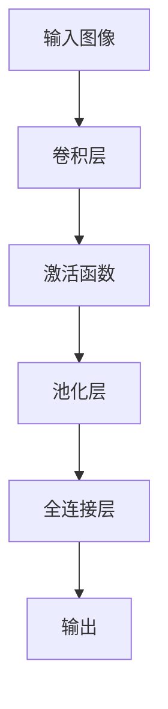

# 从零开始大模型开发与微调：实战：基于卷积的MNIST手写体分类

## 1.背景介绍

### 1.1 手写体数字识别的重要性

在当今数字化时代，手写体数字识别技术在许多领域发挥着重要作用。从自动化邮件分拣系统到银行支票处理,再到车牌识别等,手写体数字识别技术都扮演着关键角色。随着人工智能和深度学习技术的不断发展,基于卷积神经网络的手写体数字识别模型展现出了令人鼓舞的性能,为解决这一经典问题带来了新的契机。

### 1.2 MNIST数据集介绍

MNIST (Mixed National Institute of Standards and Technology)数据集是一个入门级的计算机视觉数据集,由来自美国人口普查局员工的手写数字图像组成。该数据集包含60,000个训练样本和10,000个测试样本,每个样本都是一个28x28像素的手写数字图像,标记为0到9之间的数字。MNIST数据集由于其相对简单的结构和标准化格式,被广泛用于机器学习和深度学习算法的基准测试和教学演示。

### 1.3 卷积神经网络在图像识别中的优势

卷积神经网络(Convolutional Neural Network, CNN)是一种专门用于处理图像和视频数据的深度神经网络架构。与传统的全连接神经网络不同,CNN利用卷积操作来提取图像的局部特征,并通过池化操作来降低特征维度,从而有效地捕获图像的空间和时间相关性。CNN在图像分类、目标检测、语义分割等计算机视觉任务中表现出色,成为解决手写体数字识别问题的有力工具。

## 2.核心概念与联系

### 2.1 卷积神经网络的基本结构

卷积神经网络通常由以下几个关键组件组成:

1. **卷积层(Convolutional Layer)**: 通过滑动卷积核在输入图像上执行卷积操作,提取局部特征。
2. **池化层(Pooling Layer)**: 对卷积层的输出进行下采样,减小特征维度,提高模型的鲁棒性。
3. **全连接层(Fully Connected Layer)**: 将前面层的特征映射到最终的分类输出。
4. **激活函数(Activation Function)**: 引入非线性,增强网络的表达能力。

这些组件按照一定的顺序堆叠,构成了完整的卷积神经网络架构。

### 2.2 卷积操作原理

卷积操作是CNN的核心,它通过在输入图像上滑动卷积核来提取局部特征。卷积核是一个小的权重矩阵,它与输入图像的局部区域进行元素级乘积,然后求和,生成一个特征映射。通过在整个图像上滑动卷积核,可以获得完整的特征映射。卷积操作能够有效地捕获图像的空间和结构信息,是CNN在图像识别任务中表现出色的关键所在。

### 2.3 池化操作原理

池化操作是CNN中另一个重要的步骤,它通过对卷积层的输出进行下采样,减小特征维度,从而降低计算复杂度并提高模型的鲁棒性。常见的池化操作包括最大池化(Max Pooling)和平均池化(Average Pooling)。最大池化选取局部区域中的最大值作为代表,而平均池化则取局部区域的平均值。池化操作不仅减小了特征维度,还具有一定的平移不变性,有助于提高模型的泛化能力。



## 3.核心算法原理具体操作步骤

### 3.1 数据预处理

在训练卷积神经网络之前,需要对MNIST数据集进行适当的预处理。通常包括以下几个步骤:

1. **数据归一化**: 将像素值缩放到0到1之间的范围,以防止数据过于分散或集中。
2. **数据增强**: 通过旋转、平移、缩放等方式对训练数据进行增强,提高模型的泛化能力。
3. **数据分割**: 将数据集划分为训练集、验证集和测试集,用于模型训练、调优和评估。

### 3.2 构建卷积神经网络模型

构建卷积神经网络模型通常包括以下几个步骤:

1. **定义输入层**: 根据输入图像的尺寸定义输入层的形状。
2. **添加卷积层**: 根据任务的复杂程度,添加一个或多个卷积层,每个卷积层后面通常会接一个激活函数和池化层。
3. **添加全连接层**: 在卷积层和池化层之后,添加一个或多个全连接层,用于将特征映射到最终的分类输出。
4. **定义损失函数和优化器**: 选择合适的损失函数(如交叉熵损失)和优化器(如随机梯度下降),用于模型训练。

### 3.3 模型训练

训练卷积神经网络模型的过程包括以下几个步骤:

1. **初始化模型参数**: 使用合适的初始化策略(如Xavier初始化或He初始化)为模型参数赋予初始值。
2. **前向传播**: 将训练数据输入到模型中,计算模型的输出。
3. **计算损失**: 根据模型输出和真实标签,计算损失函数的值。
4. **反向传播**: 使用反向传播算法计算模型参数的梯度。
5. **参数更新**: 根据计算得到的梯度,使用优化器更新模型参数。
6. **迭代训练**: 重复上述步骤,直到模型收敛或达到预设的迭代次数。

### 3.4 模型评估和调优

在训练过程中,需要定期评估模型在验证集上的性能,并根据评估结果对模型进行调优,包括:

1. **调整超参数**: 如学习率、批量大小、正则化强度等,以获得更好的性能。
2. **早停策略**: 监控验证集上的性能,当性能停止提升时,提前停止训练以防止过拟合。
3. **模型集成**: 结合多个模型的预测结果,提高模型的泛化能力。

### 3.5 模型部署和应用

经过训练和评估后,可以将最终的模型部署到实际的应用场景中,用于手写体数字识别任务。在部署过程中,需要考虑模型的inference效率、资源占用等因素,以确保模型能够在实际环境中高效运行。

## 4.数学模型和公式详细讲解举例说明

### 4.1 卷积操作数学表示

卷积操作是CNN中最关键的操作之一,它可以用数学公式表示为:

$$
(I * K)(i, j) = \sum_{m} \sum_{n} I(i + m, j + n)K(m, n)
$$

其中:
- $I$表示输入图像
- $K$表示卷积核
- $i$和$j$表示输出特征映射的坐标
- $m$和$n$表示卷积核的坐标

卷积操作通过在输入图像上滑动卷积核,并对局部区域进行加权求和,从而提取出局部特征。

### 4.2 池化操作数学表示

池化操作用于降低特征维度,提高模型的鲁棒性。最大池化和平均池化是两种常见的池化操作,它们可以用数学公式表示为:

**最大池化**:
$$
\text{max\_pool}(X)_{i, j} = \max_{(m, n) \in R} X_{i + m, j + n}
$$

**平均池化**:
$$
\text{avg\_pool}(X)_{i, j} = \frac{1}{|R|} \sum_{(m, n) \in R} X_{i + m, j + n}
$$

其中:
- $X$表示输入特征映射
- $R$表示池化区域
- $i$和$j$表示输出特征映射的坐标
- $m$和$n$表示池化区域内的坐标

最大池化取池化区域内的最大值作为输出,而平均池化则取池化区域内的平均值作为输出。

### 4.3 交叉熵损失函数

在分类任务中,交叉熵损失函数是一种常用的损失函数,它可以用数学公式表示为:

$$
L = -\frac{1}{N} \sum_{i=1}^{N} \sum_{j=1}^{M} y_{i, j} \log(\hat{y}_{i, j})
$$

其中:
- $N$表示样本数量
- $M$表示分类类别数
- $y_{i, j}$表示第$i$个样本属于第$j$类的真实标签(0或1)
- $\hat{y}_{i, j}$表示第$i$个样本属于第$j$类的预测概率

交叉熵损失函数度量了模型预测与真实标签之间的差异,值越小表示模型预测越准确。在训练过程中,我们通过最小化交叉熵损失函数来优化模型参数。

## 5.项目实践:代码实例和详细解释说明

在这一部分,我们将通过一个基于PyTorch的实例代码,演示如何构建、训练和评估一个用于MNIST手写体数字识别的卷积神经网络模型。

### 5.1 导入必要的库

```python
import torch
import torchvision
import torchvision.transforms as transforms
import torch.nn as nn
import torch.nn.functional as F
import torch.optim as optim
```

### 5.2 定义卷积神经网络模型

```python
class ConvNet(nn.Module):
    def __init__(self):
        super(ConvNet, self).__init__()
        self.conv1 = nn.Conv2d(1, 32, 3, 1)
        self.conv2 = nn.Conv2d(32, 64, 3, 1)
        self.dropout1 = nn.Dropout2d(0.25)
        self.dropout2 = nn.Dropout2d(0.5)
        self.fc1 = nn.Linear(9216, 128)
        self.fc2 = nn.Linear(128, 10)

    def forward(self, x):
        x = self.conv1(x)
        x = F.relu(x)
        x = self.conv2(x)
        x = F.max_pool2d(x, 2)
        x = self.dropout1(x)
        x = torch.flatten(x, 1)
        x = self.fc1(x)
        x = F.relu(x)
        x = self.dropout2(x)
        x = self.fc2(x)
        output = F.log_softmax(x, dim=1)
        return output
```

在这个示例中,我们定义了一个包含两个卷积层、两个全连接层和两个dropout层的卷积神经网络模型。卷积层用于提取图像的局部特征,全连接层用于将特征映射到最终的分类输出,而dropout层则用于防止过拟合。

### 5.3 数据预处理和加载

```python
transform = transforms.Compose([transforms.ToTensor(), transforms.Normalize((0.5,), (0.5,))])

trainset = torchvision.datasets.MNIST(root='./data', train=True, download=True, transform=transform)
trainloader = torch.utils.data.DataLoader(trainset, batch_size=64, shuffle=True)

testset = torchvision.datasets.MNIST(root='./data', train=False, download=True, transform=transform)
testloader = torch.utils.data.DataLoader(testset, batch_size=64, shuffle=False)
```

在这一步骤中,我们使用PyTorch内置的`torchvision.datasets.MNIST`模块加载MNIST数据集。我们首先定义了一个数据转换函数`transform`,用于将图像数据转换为PyTorch张量,并进行归一化处理。然后,我们将数据集划分为训练集和测试集,并使用`DataLoader`将它们加载到内存中,以便后续的训练和评估过程。

### 5.4 模型训练

```python
network = ConvNet()
criterion = nn.CrossEntropyLoss()
optimizer = optim.SGD(network.parameters(), lr=0.01, momentum=0.9)

for epoch in range(10):
    running_loss = 0.0
    for i, data in enumerate(trainloader, 0):
        inputs, labels = data
        optimizer.zero_grad()

        outputs = network(inputs)
        loss = criterion(outputs, labels)
        loss.backward()
        optimizer.step()

        running_loss += loss.item()
        if i % 100 == 99:
            print('[%d, %5d] loss: %.3f' % (epoch + 1, i + 1, running_loss / 100))
            running_loss = 0.0

print('Finished Training')
```

在这一步骤中,我们实例化了卷积神经网络模型、损