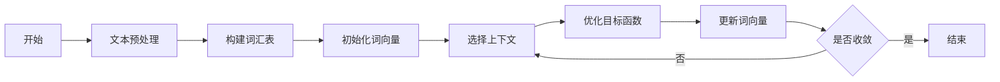

## 1. 背景介绍

在自然语言处理（NLP）的世界中，词嵌入技术已经成为了一种基础且强大的工具。它能够将词汇映射到高维空间中的向量，这些向量捕捉了词汇的语义和语法特征。自Word2Vec和GloVe等模型的成功以来，研究者们一直在探索更加高效和精确的词嵌入方法。FastText作为其中的佼佼者，以其对词形态的细致处理和对大规模文本数据的高效处理能力而受到关注。同时，预训练词向量的使用也大大简化了模型开发的复杂度，使得研究者和开发者能够更快地实现和微调大型模型。

## 2. 核心概念与联系

### 2.1 词嵌入的基本概念
词嵌入是一种将词语转换为实数向量的技术，这些向量能够在多维空间中表示词语的语义和语法属性。

### 2.2 FastText的特点
FastText区别于其他词嵌入方法的一个关键特点是它考虑了词内的结构信息，即通过子词（subword）信息来增强模型对未知词的处理能力。

### 2.3 预训练词向量的优势
预训练词向量是在大规模语料库上预先训练好的词向量，可以直接用于各种NLP任务，减少了从头开始训练模型的时间和资源消耗。

## 3. 核心算法原理具体操作步骤



### 3.1 文本预处理
包括分词、去除停用词、词干提取等步骤，为词嵌入模型的训练做准备。

### 3.2 构建词汇表
根据预处理后的文本，构建一个包含所有词语和子词的词汇表。

### 3.3 初始化词向量
为词汇表中的每个词语随机分配一个初始向量。

### 3.4 选择上下文
根据模型的设计，为每个词语选择合适的上下文词语。

### 3.5 优化目标函数
通过梯度下降等优化算法，调整词向量以最大化目标函数，通常是词语的上下文预测准确性。

### 3.6 更新词向量
根据优化算法的结果，更新词语的向量表示。

### 3.7 判断是否收敛
判断模型是否已经收敛，如果未收敛则继续迭代优化过程。

## 4. 数学模型和公式详细讲解举例说明

FastText的核心思想是将每个词表示为其构成字符的n-gram向量的和。例如，对于词"apple"，如果我们选择的n-gram长度为3，则它可以被分解为"<ap", "app", "ppl", "ple", "le>"等子词。

FastText的目标函数可以表示为：

$$
\sum_{w \in \text{corpus}} \sum_{c \in \text{contexts}(w)} \log p(c | w)
$$

其中，$p(c | w)$ 是给定词$w$时上下文词$c$出现的概率，通常使用softmax函数来计算：

$$
p(c | w) = \frac{\exp(\text{vec}(c) \cdot \text{vec}(w))}{\sum_{c' \in \text{vocab}} \exp(\text{vec}(c') \cdot \text{vec}(w))}
$$

在这里，$\text{vec}(w)$ 是词$w$的向量表示，$\text{vec}(c)$ 是上下文词$c$的向量表示。

## 5. 项目实践：代码实例和详细解释说明

```python
import fasttext

# 训练模型
model = fasttext.train_unsupervised('data.txt', model='skipgram')

# 获取词向量
word_vector = model.get_word_vector('apple')

# 保存模型
model.save_model('model.bin')
```

在上述代码中，我们使用fasttext库来训练一个无监督的词嵌入模型。首先，我们使用`train_unsupervised`函数对文本文件`data.txt`进行训练，选择`skipgram`模型。然后，我们可以使用`get_word_vector`函数获取特定词语的向量表示。最后，我们将训练好的模型保存到`model.bin`文件中。

## 6. 实际应用场景

FastText和预训练词向量在多种NLP任务中都有广泛的应用，包括但不限于文本分类、情感分析、机器翻译和问答系统。

## 7. 工具和资源推荐

- FastText官方库：提供了FastText的训练和使用工具。
- Gensim库：一个强大的NLP库，支持多种词嵌入方法，包括FastText。
- 预训练词向量资源：如Google的Word2Vec、Stanford的GloVe等。

## 8. 总结：未来发展趋势与挑战

词嵌入技术的未来发展趋势将更加注重上下文相关性和动态词向量的生成。同时，如何在保持模型效率的同时提高其对复杂语义的捕捉能力，也是一个重要的挑战。

## 9. 附录：常见问题与解答

- Q: FastText如何处理未知词？
- A: FastText通过使用子词信息，即使是未在训练集中出现的词也能够得到合理的向量表示。

- Q: 预训练词向量是否适用于所有语言？
- A: 大多数预训练词向量是基于特定语言的大型语料库训练的，但也有多语言的词向量可供使用。

作者：禅与计算机程序设计艺术 / Zen and the Art of Computer Programming