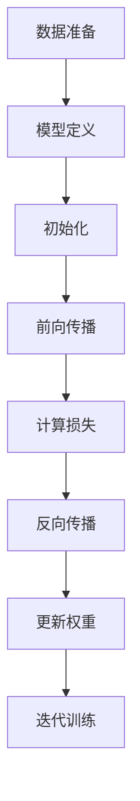

# 从零开始大模型开发与微调：深度学习基础

## 1. 背景介绍

### 1.1 人工智能的发展历程

人工智能(Artificial Intelligence, AI)是当代科技发展的重要领域,旨在使机器能够模拟人类的认知功能,如学习、推理、感知和行为能力。自20世纪50年代AI概念提出以来,经历了几个重要发展阶段:

- 1950s-1960s: 专家系统和符号主义
- 1980s: 知识库和规则推理
- 1990s-2000s: 机器学习和神经网络
- 2010s至今: 深度学习和大数据

### 1.2 深度学习的兴起

深度学习(Deep Learning)是机器学习的一个新的研究热点,模拟人脑神经网络结构和信息传递规则,能够自主对海量数据进行特征表示和模式识别。近年来,深度学习在计算机视觉、自然语言处理、推荐系统等领域取得了突破性进展,成为推动人工智能发展的核心动力。

### 1.3 大模型的重要意义  

随着算力和数据的不断增长,大规模神经网络模型(大模型)开始崭露头角。大模型通过增加网络深度和参数量,能够学习更加复杂的模式和表示,在自然语言处理、计算机视觉等领域展现出超越人类的能力。GPT、BERT、AlphaFold等大模型的出现,标志着人工智能进入了一个新的发展阶段。

## 2. 核心概念与联系

### 2.1 深度学习核心概念

#### 2.1.1 神经网络

神经网络是深度学习的核心模型,由多层神经元组成,每层神经元对上一层输入进行加权求和和非线性变换,最终输出结果。神经网络能够自动从数据中学习特征表示和模式,是实现机器学习的有力工具。


#### 2.1.2 前向传播与反向传播

前向传播(Forward Propagation)是神经网络对输入数据进行计算并得到输出的过程。反向传播(Backpropagation)则是根据输出与标签的差异,沿着神经网络层层反馈误差信号,并更新网络权重的过程,实现模型优化。


#### 2.1.3 优化算法

为了加快模型收敛并找到最优解,通常采用一些优化算法如随机梯度下降(SGD)、动量优化、AdaGrad、RMSProp、Adam等,对网络参数进行更新。

#### 2.1.4 正则化

为了防止过拟合,需要采用正则化技术,如L1/L2正则化、Dropout、BN(Batch Normalization)等,提高模型的泛化能力。

#### 2.1.5 激活函数

激活函数引入非线性,使神经网络能够拟合更加复杂的函数。常用的激活函数有Sigmoid、Tanh、ReLU、LeakyReLU等。

### 2.2 大模型概念

#### 2.2.1 参数量

大模型指具有超大规模参数量(通常超过10亿个参数)的神经网络模型。大量参数意味着模型具有更强的表示能力。

#### 2.2.2 模型规模

除了参数量,大模型往往采用更深的网络结构,引入注意力机制、Transformer等创新,以提高模型容量。

#### 2.2.3 预训练

大模型通常在大规模无标注数据集上进行自监督预训练,捕捉通用模式,再通过微调(Fine-tuning)等方式迁移到下游任务。

#### 2.2.4 并行训练

训练大模型需要巨大的计算资源,通常采用数据并行、模型并行、流水线并行等策略,在多GPU/TPU集群上进行分布式训练。

## 3. 核心算法原理具体操作步骤  

### 3.1 神经网络训练流程

神经网络的训练过程可以概括为以下几个步骤:

1. **数据准备**: 收集并预处理训练数据,将其转换为模型可以接受的格式。
2. **模型定义**: 根据任务需求设计神经网络结构,包括层数、神经元数量、激活函数等。
3. **初始化**: 根据一定策略(如Xavier/Kaiming初始化)对网络参数进行初始化。
4. **前向传播**: 输入数据,神经网络层层计算,得到最终输出。
5. **计算损失**: 将输出与真实标签进行比较,计算损失函数值。
6. **反向传播**: 根据链式法则,计算每个参数对损失函数的梯度。
7. **更新权重**: 采用优化算法(如SGD)根据梯度更新网络参数。
8. **迭代训练**: 重复4-7步骤,直至模型收敛或达到设定的迭代次数。



### 3.2 反向传播算法

反向传播是训练神经网络的关键算法,用于计算每个参数对损失函数的梯度。以单层神经网络为例,反向传播步骤如下:

1. 前向传播计算输出 $\hat{y} = f(w^Tx + b)$
2. 计算输出层损失函数 $L = \text{Loss}(y, \hat{y})$
3. 计算输出层梯度 $\frac{\partial L}{\partial \hat{y}}$
4. 计算权重梯度 $\frac{\partial L}{\partial w} = \frac{\partial L}{\partial \hat{y}} \cdot \frac{\partial \hat{y}}{\partial w} = \frac{\partial L}{\partial \hat{y}} \cdot x$
5. 计算偏置梯度 $\frac{\partial L}{\partial b} = \frac{\partial L}{\partial \hat{y}} \cdot \frac{\partial \hat{y}}{\partial b} = \frac{\partial L}{\partial \hat{y}}$

对于多层网络,采用链式法则逐层计算梯度,即反向传播算法。

### 3.3 优化算法

常用的优化算法包括:

1. **SGD**: 随机梯度下降,是最基本的优化算法。
2. **Momentum**: 在SGD基础上引入动量项,帮助加速并跳出局部最优。
3. **AdaGrad**: 自适应学习率,对于稀疏梯度更新快,从而加快收敛。
4. **RMSProp**: 对AdaGrad的改进,通过指数加权移动方差调整学习率。
5. **Adam**: 计算梯度的指数加权移动均值和移动方差,是当前最常用的优化算法之一。

不同优化算法在不同任务上表现存在差异,需要根据具体问题选择合适的算法。

## 4. 数学模型和公式详细讲解举例说明

### 4.1 损失函数

损失函数(Loss Function)用于衡量模型输出与真实标签之间的差异,是训练神经网络的关键。常用损失函数包括:

1. **均方误差(MSE)**: $L = \frac{1}{n}\sum_{i=1}^{n}(y_i - \hat{y}_i)^2$
2. **交叉熵(CE)**: $L = -\frac{1}{n}\sum_{i=1}^{n}[y_i\log\hat{y}_i + (1-y_i)\log(1-\hat{y}_i)]$

其中,n为样本数量,$y_i$和$\hat{y}_i$分别为第i个样本的真实标签和模型输出。

### 4.2 激活函数

激活函数引入非线性,赋予神经网络拟合复杂函数的能力。常见激活函数包括:

1. **Sigmoid**: $f(x) = \frac{1}{1+e^{-x}}$
2. **Tanh**: $f(x) = \frac{e^x - e^{-x}}{e^x + e^{-x}}$
3. **ReLU**: $f(x) = \max(0, x)$
4. **LeakyReLU**: $f(x) = \max(\alpha x, x)$, 其中$\alpha$为一个小的常数。

不同任务对激活函数的选择有一定偏好,如分类任务常用Sigmoid,回归任务常用无上下界的ReLU等。

### 4.3 正则化

为了防止过拟合,需要对模型进行正则化。常见正则化方法包括:

1. **L1正则化**: $\Omega(w) = \lambda\sum_{i=1}^{n}|w_i|$
2. **L2正则化**: $\Omega(w) = \lambda\sum_{i=1}^{n}w_i^2$
3. **Dropout**: 在训练时以一定概率将神经元输出临时设置为0,避免过拟合。

其中,$\lambda$为正则化强度系数,$w_i$为第i个参数。正则化通过限制模型复杂度,提高了模型的泛化能力。

### 4.4 优化器

优化器根据损失函数对模型参数进行更新,是训练过程的核心。常用优化器包括:

1. **SGD**: $w_{t+1} = w_t - \eta \nabla L(w_t)$
2. **Momentum**: $v_{t+1} = \gamma v_t + \eta\nabla L(w_t)$, $w_{t+1} = w_t - v_{t+1}$
3. **AdaGrad**: $G_{t+1} = G_t + (\nabla L(w_t))^2$, $w_{t+1} = w_t - \frac{\eta}{\sqrt{G_{t+1} + \epsilon}}\odot \nabla L(w_t)$
4. **RMSProp**: $E[g^2]_{t+1} = \gamma E[g^2]_t + (1-\gamma)(\nabla L(w_t))^2$, $w_{t+1} = w_t - \frac{\eta}{\sqrt{E[g^2]_{t+1} + \epsilon}}\odot \nabla L(w_t)$
5. **Adam**: $m_{t+1} = \beta_1 m_t + (1-\beta_1)\nabla L(w_t)$, $v_{t+1} = \beta_2 v_t + (1-\beta_2)(\nabla L(w_t))^2$,
   $\hat{m}_{t+1} = \frac{m_{t+1}}{1-\beta_1^{t+1}}$, $\hat{v}_{t+1} = \frac{v_{t+1}}{1-\beta_2^{t+1}}$,
   $w_{t+1} = w_t - \frac{\eta}{\sqrt{\hat{v}_{t+1}} + \epsilon}\hat{m}_{t+1}$

其中,$\eta$为学习率,$\gamma$、$\beta_1$、$\beta_2$为超参数,$\epsilon$为平滑项,防止分母为0。不同优化器在参数更新策略上有所区别,需要根据具体问题选择合适的优化器。

## 5. 项目实践: 代码实例和详细解释说明

以下是使用PyTorch框架构建并训练一个简单的全连接神经网络分类器的代码示例:

```python
import torch
import torch.nn as nn
import torch.optim as optim

# 定义网络结构
class Net(nn.Module):
    def __init__(self, input_size, hidden_size, num_classes):
        super(Net, self).__init__()
        self.fc1 = nn.Linear(input_size, hidden_size)
        self.relu = nn.ReLU()
        self.fc2 = nn.Linear(hidden_size, num_classes)

    def forward(self, x):
        out = self.fc1(x)
        out = self.relu(out)
        out = self.fc2(out)
        return out

# 超参数设置
input_size = 784  # 输入数据维度 (28x28)
hidden_size = 500 # 隐藏层神经元数量
num_classes = 10  # 输出类别数
num_epochs = 5    # 训练轮数
batch_size = 100  # 批大小
learning_rate = 0.001 # 学习率

# 加载MNIST数据集
train_dataset = ... # 训练集
test_dataset = ...  # 测试集

# 数据加载器
train_loader = torch.utils.data.DataLoader(dataset=train_dataset,
                                           batch_size=batch_size,
                                           shuffle=True)
test_loader = torch.utils.data.DataLoader(dataset=test_dataset,
                                          batch_size=batch_size,
                                          shuffle=False)

# 