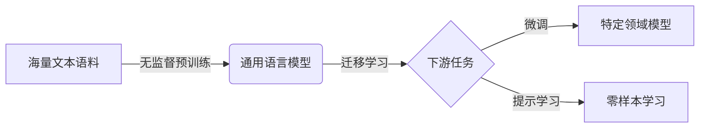

# 从零开始大模型开发与微调：近在咫尺的未来—大模型的应用前景

## 1.背景介绍

近年来,随着人工智能技术的飞速发展,大规模语言模型(Large Language Models,LLMs)在自然语言处理(NLP)领域取得了突破性进展。从GPT-3到ChatGPT,从PaLM到LLaMA,这些大模型展现出了令人惊叹的语言理解和生成能力,为人机交互、知识获取、创意生成等应用开辟了广阔前景。

然而,训练一个高质量的大模型需要海量的数据和算力,对于普通开发者和中小企业而言,门槛较高。同时,通用大模型在特定领域的应用中往往需要进行微调(Fine-tuning),以提升模型在该领域的表现。因此,如何从零开始开发和微调大模型,成为了业界关注的热点话题。

本文将深入探讨大模型开发与微调的关键技术,分享实践经验和应用案例,展望大模型技术的未来发展趋势与挑战,为读者提供全面而深入的认知。

### 1.1 大模型的崛起与影响
#### 1.1.1 大模型的发展历程
#### 1.1.2 大模型的技术突破
#### 1.1.3 大模型对人工智能领域的影响

### 1.2 大模型开发与微调的意义
#### 1.2.1 降低大模型应用门槛
#### 1.2.2 提升大模型在特定领域的性能
#### 1.2.3 促进大模型技术的普及与创新

## 2.核心概念与联系

在深入探讨大模型开发与微调之前,我们需要了解一些核心概念及其相互联系。

### 2.1 大规模语言模型(LLMs)
大规模语言模型是指在海量文本数据上训练的深度神经网络模型,通过自监督学习掌握了语言的统计规律和语义知识,具备强大的语言理解和生成能力。代表模型有GPT系列、BERT系列、T5等。

### 2.2 预训练(Pre-training)与微调(Fine-tuning) 
预训练是指在大规模无标注语料上训练通用语言模型的过程。微调则是在预训练模型的基础上,使用特定领域的标注数据对模型进行二次训练,使其适应该领域任务的过程。

### 2.3 迁移学习(Transfer Learning)
迁移学习是指将在源任务上学到的知识迁移到目标任务,以提升目标任务的性能。大模型的预训练可以看作是一种迁移学习,将语言理解能力迁移到下游任务。

### 2.4 提示学习(Prompt Learning)
提示学习是一种利用自然语言提示(Prompt)引导大模型执行特定任务的范式。通过设计合适的提示模板,可以在不修改模型参数的情况下实现零样本/少样本学习。

下图展示了这些概念之间的关系:



理解这些概念的内涵和联系,有助于我们更好地把握大模型开发与应用的脉络。

## 3.核心算法原理与具体操作步骤

### 3.1 大模型的预训练算法
#### 3.1.1 自回归语言模型(AutoRegressive LM)
自回归语言模型的目标是根据前文预测下一个词,代表模型有GPT系列。其优化目标是最大化条件概率:

$$
\mathcal{L}(\theta)=\sum_{i=1}^{n} \log P\left(x_{i} \mid x_{<i} ; \theta\right)
$$

其中$x_i$为第$i$个词,$x_{<i}$为$x_i$之前的所有词,$\theta$为模型参数。

训练步骤如下:
1. 准备大规模无标注文本语料
2. 对语料进行预处理,如分词、构建词表等  
3. 搭建transformer编码器结构的神经网络
4. 使用语料训练网络,优化上述目标函数
5. 不断迭代,直到模型收敛

#### 3.1.2 自编码语言模型(AutoEncoding LM)
自编码语言模型的目标是根据上下文预测被掩码的词,代表模型有BERT系列。其优化目标是最大化被掩码词的条件概率:

$$
\mathcal{L}(\theta)=\sum_{i=1}^{m} \log P\left(x_{t_{i}} \mid x_{\backslash t} ; \theta\right)
$$

其中$\{t_1,\cdots,t_m\}$为被掩码词的位置下标,$x_{\backslash t}$为去掉掩码词的输入序列。

训练步骤与自回归语言模型类似,区别在于:
1. 对输入序列随机掩码
2. 使用掩码后的序列作为输入,被掩码词作为预测目标
3. 搭建transformer编码器结构的神经网络
4. 训练网络,优化上述目标函数

### 3.2 大模型的微调算法
#### 3.2.1 常规微调(Standard Fine-tuning)
常规微调是指在预训练模型的基础上,使用下游任务的标注数据重新训练所有参数。以文本分类任务为例,微调步骤如下:
1. 在预训练模型的最后添加一个线性分类器
2. 使用标注数据训练整个网络,优化交叉熵损失
3. 不断迭代,直到模型收敛

常规微调的优化目标为:

$$
\mathcal{L}(\theta)=-\sum_{i=1}^{N} \sum_{c=1}^{C} y_{i c} \log \hat{y}_{i c}
$$

其中$N$为样本数,$C$为类别数,$y_{ic}$为样本$i$在类别$c$上的真实标签,$\hat{y}_{ic}$为模型预测的概率。

#### 3.2.2 提示微调(Prompt-tuning)
提示微调是一种轻量级的参数高效微调方法。其核心思想是固定预训练模型参数,只学习输入提示模板中的少量参数。以情感分类为例,步骤如下:
1. 设计提示模板,如"[X] It was [MASK].",其中[X]为输入文本,[MASK]为待预测的标签词
2. 初始化可学习的提示嵌入向量 
3. 将提示嵌入与输入文本拼接,输入预训练模型
4. 使用标注数据训练提示嵌入,优化交叉熵损失
5. 根据[MASK]位置的预测概率输出对应的标签

相比常规微调,提示微调只需学习提示参数,大大减少了参数量和计算开销。

## 4.数学模型和公式详细讲解举例说明

本节将详细讲解大模型中的关键数学模型和公式,并给出具体的例子帮助理解。

### 4.1 Transformer模型
Transformer是大模型的核心组件,由多层自注意力(Self-Attention)和前馈神经网络(Feed-Forward Network)交替堆叠而成。

#### 4.1.1 自注意力机制
自注意力用于捕捉输入序列中词之间的依赖关系,其计算公式为:

$$
\begin{aligned}
\mathbf{Q}, \mathbf{K}, \mathbf{V} &= \mathbf{X} \mathbf{W}_{q}, \mathbf{X} \mathbf{W}_{k}, \mathbf{X} \mathbf{W}_{v} \\
\operatorname{Attention}(\mathbf{Q}, \mathbf{K}, \mathbf{V}) &= \operatorname{softmax}\left(\frac{\mathbf{Q K}^{T}}{\sqrt{d_{k}}}\right) \mathbf{V}
\end{aligned}
$$

其中$\mathbf{X} \in \mathbb{R}^{n \times d}$为输入序列,$\mathbf{W}_q,\mathbf{W}_k,\mathbf{W}_v \in \mathbb{R}^{d \times d_k}$为可学习的权重矩阵,$\mathbf{Q},\mathbf{K},\mathbf{V}$分别为查询、键、值向量。

例如,对于输入序列"I love this movie"，自注意力可以学习到"love"与"movie"之间的依赖关系,从而更好地理解句子语义。

#### 4.1.2 多头自注意力
多头自注意力是将自注意力计算多次,然后拼接的结果,可以捕捉不同子空间的语义信息。公式为:

$$
\begin{aligned}
\operatorname{MultiHead}(\mathbf{Q}, \mathbf{K}, \mathbf{V}) &= \operatorname{Concat}\left(\operatorname{head}_{1}, \ldots, \operatorname{head}_{h}\right) \mathbf{W}^{O} \\
\text { where head }_{i} &= \operatorname{Attention}\left(\mathbf{Q W}_{i}^{Q}, \mathbf{K} \mathbf{W}_{i}^{K}, \mathbf{V} \mathbf{W}_{i}^{V}\right)
\end{aligned}
$$

其中$h$为注意力头数,$\mathbf{W}_i^Q,\mathbf{W}_i^K,\mathbf{W}_i^V \in \mathbb{R}^{d \times d_k},\mathbf{W}^O \in \mathbb{R}^{hd_k \times d}$为可学习的权重矩阵。

例如,使用8头注意力,可以让模型从不同角度理解输入序列,提升语义表示能力。

#### 4.1.3 前馈神经网络
前馈神经网络用于对自注意力的输出进行非线性变换,增强模型的表达能力。公式为:

$$
\operatorname{FFN}(\mathbf{x})=\max \left(0, \mathbf{x} \mathbf{W}_{1}+\mathbf{b}_{1}\right) \mathbf{W}_{2}+\mathbf{b}_{2}
$$

其中$\mathbf{W}_1 \in \mathbb{R}^{d \times d_ff},\mathbf{W}_2 \in \mathbb{R}^{d_ff \times d}$为权重矩阵,$\mathbf{b}_1 \in \mathbb{R}^{d_ff},\mathbf{b}_2 \in \mathbb{R}^d$为偏置项,$d_ff$为隐藏层维度。

例如,前馈网络可以学习到自注意力输出中蕴含的高级语义特征,提升模型的理解和生成能力。

### 4.2 嵌入层
嵌入层将离散的词转换为连续的向量表示,以便神经网络处理。常见的嵌入方式有:

#### 4.2.1 词嵌入(Word Embedding)
词嵌入将每个词映射为一个固定维度的稠密向量,语义相似的词对应的向量在空间中更接近。给定词表$\mathcal{V}$,词嵌入可以表示为矩阵$\mathbf{E} \in \mathbb{R}^{|\mathcal{V}| \times d}$,其中$|\mathcal{V}|$为词表大小,$d$为嵌入维度。

例如,"king"和"queen"这两个词语义相近,它们的词向量在空间中距离较近。

#### 4.2.2 位置嵌入(Position Embedding)
位置嵌入用于表示词在序列中的位置信息。常见的位置嵌入有:
- 固定位置嵌入(Sinusoidal Position Embedding):
$$
\begin{aligned}
P E_{(p o s, 2 i)} &=\sin \left(p o s / 10000^{2 i / d}\right) \\
P E_{(p o s, 2 i+1)} &=\cos \left(p o s / 10000^{2 i / d}\right)
\end{aligned}
$$
其中$pos$为位置下标,$i$为维度下标。

- 可学习位置嵌入(Learnable Position Embedding):
$$\mathbf{P} \in \mathbb{R}^{n \times d}$$
其中$n$为最大序列长度,$d$为嵌入维度,$\mathbf{P}$为可学习的参数矩阵。

例如,位置嵌入可以让模型区分"我爱你"和"你爱我"这两个语义不同的句子。

## 5.项目实践：代码实例和详细解释说明

本节将通过代码实例,演示如何使用PyTorch从零开始实现一个基于Transformer的语言模型,并在指定数据集上进行微调。

### 5.1 Transformer语言模型的实现

```python
import torch