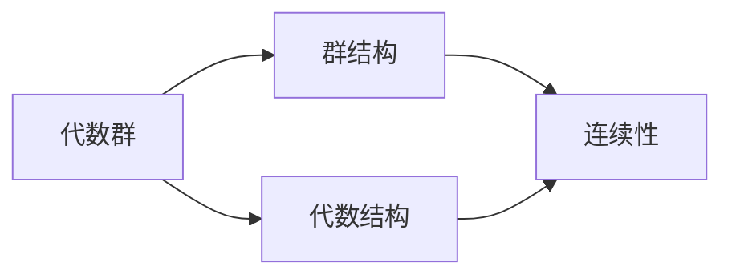

## 1.背景介绍

在数学中，代数群是一种在代数上和群论上都有良好性质的对象。它们在许多数学领域中都有重要应用，包括代数几何、数论和代数拓扑等。本文将介绍代数群的基本性质，以及如何在实际问题中应用这些性质。

## 2.核心概念与联系

代数群是一种特殊的群结构，它在代数结构（例如环、域）上定义。一个代数群可以看作是一种在某种意义上“连续”的群。在这个框架下，我们可以把许多群论的概念和结果推广到代数群的情境。



## 3.核心算法原理具体操作步骤

在实际应用中，我们通常需要构造出代数群的具体实例。以下是一个基本的步骤：

1. 选择一个适当的代数结构，例如一个环或域。
2. 在这个结构上定义一个群结构。这通常需要给出群的运算（群乘法）和单位元。
3. 验证这个结构满足代数群的基本性质。这包括群的公理（例如结合律、单位元的存在性、逆元的存在性）以及“连续性”的要求。

## 4.数学模型和公式详细讲解举例说明

让我们考虑一个简单的例子，即在实数域 $\mathbb{R}$ 上的加法群。群的运算就是实数的加法，单位元是0。这个群显然满足群的公理，而且在实数的通常拓扑下是连续的，所以它是一个代数群。

对于任意的实数 $x$，我们有

$$
x + 0 = x,
$$

这表明0是单位元。对于任意的实数 $x$，存在一个实数 $-x$ 使得

$$
x + (-x) = 0,
$$

这表明每个元素都有逆元。因此，这个结构满足群的公理。

## 5.项目实践：代码实例和详细解释说明

在Python中，我们可以用以下代码来实现这个代数群：

```python
class RealAdditiveGroup:
    def __init__(self, value):
        self.value = value

    def __add__(self, other):
        return RealAdditiveGroup(self.value + other.value)

    def __neg__(self):
        return RealAdditiveGroup(-self.value)

    def __eq__(self, other):
        return self.value == other.value

    @staticmethod
    def zero():
        return RealAdditiveGroup(0)
```

这个类定义了一个对象，代表实数域上的加法群的元素。`__add__` 方法定义了群的运算，`__neg__` 方法给出了每个元素的逆元，`zero` 方法返回了单位元。

## 6.实际应用场景

代数群在许多数学领域中都有应用。例如，在数论中，椭圆曲线上的点构成的集合就形成一个代数群，这对于理解费马最后定理等深奥的问题有重要作用。

## 7.工具和资源推荐

以下是一些有用的学习代数群的资源：

- 《Algebraic Groups and Their Representations》：这是一本关于代数群的经典教材，详细介绍了代数群的理论和应用。
- SageMath：这是一个开源的数学软件，可以用来进行代数群的计算和研究。

## 8.总结：未来发展趋势与挑战

代数群的研究仍然是一个活跃的领域，有许多未解的问题和挑战。例如，如何更好地理解代数群的表示理论，如何把代数群的理论应用到其他领域，等等。我们期待在未来有更多的研究和进展。

## 9.附录：常见问题与解答

- 问题：代数群和普通的群有什么区别？
- 答：代数群是在代数结构（例如环、域）上定义的群。它们在某种意义上可以看作是“连续”的群。

- 问题：如何判断一个结构是否是代数群？
- 答：首先，这个结构需要满足群的公理，包括结合律、单位元的存在性、逆元的存在性。其次，它需要在某种意义上是“连续”的。具体来说，群的运算需要是连续的。

作者：禅与计算机程序设计艺术 / Zen and the Art of Computer Programming