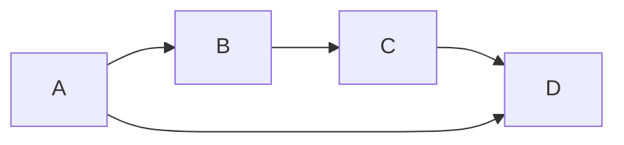

# 代数群引论：A.7 R Hom. 函子

## 1.背景介绍

在代数群论中,函子(Functor)是一个非常重要的概念,它为我们提供了一种在不同范畴(Category)之间建立联系的方式。函子不仅能够保持范畴之间的结构,还能够在范畴之间传递对象和态射。其中,R Hom. 函子是一种特殊的函子,它将一个对偶范畴与其自身的函子范畴建立了联系。

## 2.核心概念与联系

### 2.1 范畴(Category)

范畴是一种代数结构,由对象(Object)和态射(Morphism)组成。对象可以理解为数学实体,而态射则描述了对象之间的关系。范畴必须满足以下几个条件:

1. 对于任意对象 A 和 B,存在一个态射 f:A→B。
2. 对于任意对象 A,存在一个恒等态射 id_A:A→A。
3. 如果存在态射 f:A→B 和 g:B→C,则存在一个合成态射 g∘f:A→C。
4. 合成运算满足结合律,即对于任意态射 f:A→B、g:B→C 和 h:C→D,有 (h∘g)∘f = h∘(g∘f)。
5. 对于任意对象 A,有 id_A∘f = f 和 f∘id_A = f,其中 f 是任意一个以 A 为定义域或者值域的态射。

### 2.2 函子(Functor)

函子是一种范畴之间的映射,它能够保持范畴的结构不变。设 C 和 D 是两个范畴,函子 F:C→D 需要满足以下条件:

1. 对于任意对象 A 在范畴 C 中,F 将其映射到一个对象 F(A) 在范畴 D 中。
2. 对于任意态射 f:A→B 在范畴 C 中,F 将其映射到一个态射 F(f):F(A)→F(B) 在范畴 D 中。
3. 对于任意对象 A 在范畴 C 中,有 F(id_A) = id_F(A)。
4. 对于任意态射 f:A→B 和 g:B→C 在范畴 C 中,有 F(g∘f) = F(g)∘F(f)。

### 2.3 对偶范畴(Opposite Category)

对偶范畴是一种特殊的范畴,它通过反转范畴中所有态射的方向而得到。设 C 是一个范畴,则 C^op 表示 C 的对偶范畴。在 C^op 中,对象与 C 中的对象相同,但态射的方向被反转。也就是说,如果在 C 中存在一个态射 f:A→B,那么在 C^op 中就存在一个态射 f^op:B→A。

### 2.4 函子范畴(Functor Category)

函子范畴是一种特殊的范畴,其对象是从一个固定范畴到另一个固定范畴的函子,而态射则是这些函子之间的自然变换(Natural Transformation)。设 C 和 D 是两个范畴,则函子范畴记作 [C,D],其中对象是从 C 到 D 的函子,态射是这些函子之间的自然变换。

## 3.核心算法原理具体操作步骤

R Hom. 函子是一种特殊的函子,它将一个对偶范畴与其自身的函子范畴建立了联系。具体来说,对于任意范畴 C,R Hom. 函子将 C^op 映射到 [C,Set],其中 Set 表示集合的范畴。

设 A 是 C 中的一个对象,那么 R Hom. 函子将 A 映射到一个函子 R Hom.(A,-):C^op→Set,这个函子被称为表示函子(Representable Functor)。对于任意对象 B 在 C 中,R Hom.(A,B) 是一个集合,其元素是从 A 到 B 的所有态射。

对于任意态射 f:B→C 在 C 中,R Hom.(A,f):R Hom.(A,B)→R Hom.(A,C) 是一个函子,它通过以下方式定义:对于任意态射 g:A→B,有 R Hom.(A,f)(g) = f∘g。

R Hom. 函子的定义可以形式化地表示为:

$$
R Hom.(A,-) = \text{Hom}_C(A,-):C^{op} \rightarrow \text{Set}
$$

其中,Hom_C(A,B) 表示从对象 A 到对象 B 的所有态射的集合。

## 4.数学模型和公式详细讲解举例说明

为了更好地理解 R Hom. 函子,我们来看一个具体的例子。设 C 是有向图的范畴,其中对象是有向图的顶点,态射是有向图的边。

对于任意顶点 A,R Hom.(A,-) 是一个函子,它将每个顶点 B 映射到一个集合 R Hom.(A,B),该集合中的元素是从 A 到 B 的所有路径。对于任意边 f:B→C,R Hom.(A,f) 是一个函数,它将路径 g:A→B 映射到路径 f∘g:A→C。

例如,考虑下面的有向图:



在这个例子中,我们有:

- R Hom.(A,A) = {id_A}
- R Hom.(A,B) = {A→B}
- R Hom.(A,C) = {A→B→C, A→D→C}
- R Hom.(A,D) = {A→D, A→B→C→D, A→D→C→D}

对于态射 f:B→C,我们有:

- R Hom.(A,f)(A→B) = A→B→C

对于态射 g:C→D,我们有:

- R Hom.(A,g)(A→B→C) = A→B→C→D
- R Hom.(A,g)(A→D→C) = A→D→C→D

可以看到,R Hom. 函子将有向图的顶点映射到了路径集合,并且将边映射到了路径的合成运算。这种映射保持了有向图的结构,并且为我们提供了一种在有向图范畴和集合范畴之间建立联系的方式。

## 5.项目实践:代码实例和详细解释说明

虽然 R Hom. 函子是一个抽象的数学概念,但我们可以使用编程语言来实现它。下面是一个使用 Python 实现 R Hom. 函子的示例:

```python
from typing import Generic, TypeVar, Dict, Set, Tuple

A = TypeVar('A')
B = TypeVar('B')

class Category(Generic[A]):
    def __init__(self, objects: Set[A], morphisms: Dict[Tuple[A, A], Set[Tuple[A, A]]]):
        self.objects = objects
        self.morphisms = morphisms

    def hom(self, a: A, b: A) -> Set[Tuple[A, A]]:
        return self.morphisms.get((a, b), set())

    def compose(self, f: Tuple[A, B], g: Tuple[B, A]) -> Tuple[A, A]:
        a, b = f
        c, d = g
        assert b == c
        return (a, d)

    def identity(self, a: A) -> Tuple[A, A]:
        return (a, a)

class RHom(Generic[A]):
    def __init__(self, category: Category[A], a: A):
        self.category = category
        self.a = a

    def __call__(self, b: A) -> Set[Tuple[A, A]]:
        return self.category.hom(self.a, b)

    def __call__(self, f: Tuple[B, A]) -> 'RHom[A]':
        b, c = f
        return RHom(self.category, b)

    def __call__(self, g: Tuple[A, B]) -> 'RHom[B]':
        a, b = g
        new_category = Category(
            self.category.objects,
            {(x, y): {self.category.compose(g, f) for f in self.category.hom(x, a) for g in self.category.hom(b, y)}
             for x, y in self.category.morphisms}
        )
        return RHom(new_category, b)
```

在这个示例中,我们首先定义了一个 `Category` 类,用于表示范畴。`Category` 类包含了对象集合和态射集合,以及一些基本的操作,如求态射的合成和单位态射。

接下来,我们定义了 `RHom` 类,用于实现 R Hom. 函子。`RHom` 类接受一个范畴和一个对象作为输入,并提供了以下操作:

- `__call__(b: A) -> Set[Tuple[A, A]]`: 返回从对象 `a` 到对象 `b` 的所有态射集合。
- `__call__(f: Tuple[B, A]) -> 'RHom[A]'`: 返回一个新的 `RHom` 对象,其对应的对象是 `f` 的定义域。
- `__call__(g: Tuple[A, B]) -> 'RHom[B]'`: 返回一个新的 `RHom` 对象,其对应的对象是 `g` 的值域。在这个操作中,我们构造了一个新的范畴,其中态射是通过合成原始范畴中的态射得到的。

使用这个实现,我们可以像下面这样操作 R Hom. 函子:

```python
# 定义一个有向图范畴
objects = {'A', 'B', 'C', 'D'}
morphisms = {
    ('A', 'A'): {('A', 'A')},
    ('A', 'B'): {('A', 'B')},
    ('B', 'B'): {('B', 'B')},
    ('B', 'C'): {('B', 'C')},
    ('C', 'C'): {('C', 'C')},
    ('C', 'D'): {('C', 'D')},
    ('D', 'D'): {('D', 'D')},
    ('A', 'D'): {('A', 'D')}
}
graph = Category(objects, morphisms)

# 构造 R Hom. 函子
rhom_a = RHom(graph, 'A')

# 获取从 'A' 到 'B' 的所有态射
print(rhom_a('B'))  # {('A', 'B')}

# 获取从 'A' 到 'C' 的所有态射
print(rhom_a('C'))  # {('A', 'B', 'C'), ('A', 'D', 'C')}

# 获取从 'A' 到 'D' 的所有态射
print(rhom_a('D'))  # {('A', 'D'), ('A', 'B', 'C', 'D'), ('A', 'D', 'C', 'D')}

# 通过态射 ('B', 'C') 获取新的 RHom 对象
rhom_b = rhom_a(('B', 'C'))
print(rhom_b('C'))  # {('B', 'C')}
print(rhom_b('D'))  # {('B', 'C', 'D')}

# 通过态射 ('A', 'D') 获取新的 RHom 对象
rhom_d = rhom_a(('A', 'D'))
print(rhom_d('D'))  # {('A', 'D')}
```

在这个示例中,我们首先定义了一个有向图范畴 `graph`。然后,我们构造了一个 `RHom` 对象 `rhom_a`,其对应的对象是 `'A'`。我们可以使用 `rhom_a('B')` 获取从 `'A'` 到 `'B'` 的所有态射,使用 `rhom_a('C')` 获取从 `'A'` 到 `'C'` 的所有态射,以此类推。

此外,我们还可以通过态射获取新的 `RHom` 对象。例如,`rhom_b = rhom_a(('B', 'C'))` 返回一个新的 `RHom` 对象,其对应的对象是 `'B'`。我们可以使用 `rhom_b('C')` 获取从 `'B'` 到 `'C'` 的所有态射,使用 `rhom_b('D')` 获取从 `'B'` 到 `'D'` 的所有态射。

通过这个示例,我们可以看到如何使用编程语言实现 R Hom. 函子,并且可以方便地操作和计算范畴中的对象和态射。

## 6.实际应用场景

R Hom. 函子在代数群论中有着广泛的应用,它为我们提供了一种在不同范畴之间建立联系的方式。下面是一些 R Hom. 函子的实际应用场景:

1. **表示定理(Representable Theorem)**: 在代数群论中,表示定理是一个非常重要的结果。它表明,任何函子都可以由表示函子(Representable Functor