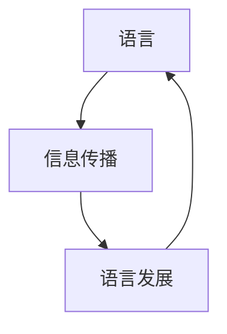

# 何为语言？信息又如何传播？

## 1.背景介绍

语言是人类进行交流和传递信息的重要工具。自古以来,人类就一直在探索语言的本质和信息传播的奥秘。语言不仅体现了人类独特的思维能力,也是文化传承和知识积累的载体。随着科技的发展,信息传播的方式也在不断演进,从口语、文字到现代的数字通信,信息的表达和传播方式变得更加丰富多彩。

### 1.1 语言的起源与演化

语言是人类区别于其他生物的独特能力之一。关于语言的起源,有多种理论,如声音模仿说、手势说、社会契约说等。不同的学者从不同的角度探讨了语言的产生和发展过程。语言的演化与人类的认知能力、社会结构和文化传统密切相关。

### 1.2 信息传播的重要性

信息传播是人类社会运转的基础。有效的信息传播可以促进知识的传递和交流,推动科技进步和文化发展。在当代社会,信息技术的飞速发展使得信息传播的方式更加多元化,信息的获取和传播也变得更加便捷。

### 1.3 语言与信息传播的关系

语言是信息传播的主要载体。通过语言,人们可以表达思想、交换信息、记录知识。语言的发展也推动了信息传播方式的变革,从口语到文字,再到现代的数字通信技术。同时,信息传播的需求也促进了语言的不断发展和完善。

## 2.核心概念与联系

### 2.1 语言的本质

语言是一种符号系统,由有意义的语音、文字或手势等符号组成。它具有系统性、任意性、社会性和历史性等特点。语言不仅是人类交流的工具,也是思维和认知的载体。

#### 2.1.1 语言的构成要素

语言通常由语音、词汇、语法和语义等要素构成。这些要素相互关联,共同构建了语言的整体结构。

#### 2.1.2 语言的功能

语言的主要功能包括交际功能、表达功能、记录功能和认知功能等。它不仅是人们交流思想的工具,也是传递文化和知识的载体。

### 2.2 信息的概念

信息是指对事物状态的描述或表达,是人类认识世界和进行交流的基础。信息可以采用多种形式,如文字、图像、声音等。

#### 2.2.1 信息的特性

信息具有客观性、真实性、新颖性、价值性和可传递性等特性。高质量的信息应该具备准确性、完整性和及时性。

#### 2.2.2 信息的分类

根据信息的形式和内容,可将信息分为文字信息、图像信息、声音信息、数字信息等。不同类型的信息需要采用不同的传播方式。

### 2.3 语言与信息传播的关系

语言是信息传播的主要载体,而信息传播也推动了语言的发展和演化。二者相互影响、相互促进。



语言和信息传播之间存在着密切的联系。语言为信息传播提供了载体,而信息传播的需求也推动了语言的不断发展和完善。二者相互影响、相互促进,构成了一个动态的循环系统。

## 3.核心算法原理具体操作步骤

### 3.1 语言编码原理

为了实现语言信息的存储和传输,需要将语言符号转换为计算机可识别的编码形式。常见的语言编码方式包括ASCII码、Unicode码等。

#### 3.1.1 ASCII码

ASCII码(American Standard Code for Information Interchange)是一种使用7位二进制数来表示128个英文字符的编码方式。它是最早的字符编码标准之一,但只能表示英文字符,无法表示其他语言的字符。

#### 3.1.2 Unicode码

Unicode码是一种国际通用的字符编码标准,它为世界上所有的文字系统分配了唯一的编码,可以表示包括中文、日文、韩文等在内的各种语言的字符。Unicode码通常使用16位或更多位来表示一个字符。

### 3.2 语言编码算法

语言编码算法是将语言符号转换为计算机可识别的编码形式的过程。常见的语言编码算法包括:

#### 3.2.1 前缀编码

前缀编码是一种变长编码方式,它要求任何一个字符的编码都不能是另一个字符编码的前缀。著名的前缀编码算法包括霍夫曼编码和算术编码等。

#### 3.2.2 字典编码

字典编码是一种基于字典的编码方式,它将待编码的字符串分解为字典中的单词或短语,然后使用这些单词或短语的索引来表示原始字符串。常见的字典编码算法包括LZW编码、PPM编码等。

#### 3.2.3 转换编码

转换编码是一种基于统计模型的编码方式,它利用上下文信息来预测下一个字符,从而实现更高效的编码。常见的转换编码算法包括算术编码、范围编码等。

### 3.3 语言模型

语言模型是自然语言处理中的一个重要概念,它描述了语言符号出现的概率分布。语言模型可以用于语音识别、机器翻译、文本生成等任务。

#### 3.3.1 N-gram语言模型

N-gram语言模型是一种基于统计的语言模型,它根据前面N-1个符号来预测下一个符号的概率。常见的N-gram语言模型包括一元模型(Unigram)、二元模型(Bigram)和三元模型(Trigram)等。

#### 3.3.2 神经网络语言模型

神经网络语言模型是一种基于深度学习的语言模型,它利用神经网络来学习语言的概率分布。常见的神经网络语言模型包括循环神经网络语言模型(RNN LM)、transformer语言模型等。

### 3.4 信息编码原理

为了实现信息的有效传输,需要将信息转换为适合传输介质的编码形式。常见的信息编码方式包括脉冲编码、调制编码等。

#### 3.4.1 脉冲编码

脉冲编码是将连续的模拟信号转换为离散的数字信号的过程。常见的脉冲编码方式包括脉冲编码调制(PCM)、差分脉冲编码调制(DPCM)等。

#### 3.4.2 调制编码

调制编码是将数字信号转换为模拟信号的过程,以便在模拟信道上传输。常见的调制编码方式包括调幅(AM)、调频(FM)、调相(PM)等。

### 3.5 信道编码原理

为了提高信息传输的可靠性,需要在信息编码的基础上进行信道编码。信道编码通过引入冗余信息,可以检测和纠正传输过程中的错误。

#### 3.5.1 循环冗余校验码(CRC)

循环冗余校验码(Cyclic Redundancy Check)是一种检错编码方式,它通过对数据进行特定的除法运算,生成一个固定长度的校验码,并将其附加在数据后面。接收方可以通过相同的运算来检测数据是否发生了错误。

#### 3.5.2 海明码

海明码(Hamming Code)是一种纠错编码方式,它通过增加额外的校验位,可以检测和纠正一定数量的错误位。海明码的编码和解码过程都涉及到特定的矩阵运算。

## 4.数学模型和公式详细讲解举例说明

### 4.1 信息熵

信息熵是信息论中的一个重要概念,它用于衡量信息的不确定性或随机性。信息熵的数学定义如下:

$$H(X) = -\sum_{i=1}^{n}P(x_i)\log_2P(x_i)$$

其中,X是一个离散随机变量,取值为$x_1,x_2,...,x_n$,P(x_i)是x_i出现的概率。

信息熵的单位是比特(bit)或纳特(nat),取决于对数的底数是2或e。信息熵越大,表示信息的不确定性越高,反之则不确定性越低。

例如,考虑一个均匀分布的二元随机变量X,取值为0或1,概率均为0.5,则信息熵为:

$$H(X) = -0.5\log_2(0.5) - 0.5\log_2(0.5) = 1$$

这表示每次观测到X的取值时,获得的信息量为1比特。

### 4.2 互信息

互信息(Mutual Information)是衡量两个随机变量之间相关性的一种度量,它反映了已知一个随机变量的条件下,另一个随机变量的不确定性的减少程度。互信息的数学定义如下:

$$I(X;Y) = \sum_{x\in X}\sum_{y\in Y}P(x,y)\log\frac{P(x,y)}{P(x)P(y)}$$

其中,X和Y是两个离散随机变量,P(x,y)是X和Y的联合概率分布,P(x)和P(y)分别是X和Y的边缘概率分布。

互信息的取值范围为[0,+∞),当X和Y相互独立时,互信息为0;当X和Y之间的相关性越强时,互信息越大。

互信息在自然语言处理中有广泛应用,例如在特征选择、主题模型等任务中,可以使用互信息来衡量词与主题之间的相关性。

### 4.3 语言模型评估指标

语言模型的性能通常使用以下几个指标来评估:

#### 4.3.1 困惑度(Perplexity)

困惑度是衡量语言模型质量的一个重要指标,它反映了模型对语料库的拟合程度。困惑度的数学定义如下:

$$PP(W) = \sqrt[N]{\prod_{i=1}^{N}\frac{1}{P(w_i|w_1,...,w_{i-1})}}$$

其中,W是长度为N的词序列,P(w_i|w_1,...,w_{i-1})是模型预测第i个词w_i的概率。

困惑度的取值范围为(0,+∞),值越小表示模型质量越好。当模型完全拟合语料库时,困惑度为1。

#### 4.3.2 交叉熵(Cross Entropy)

交叉熵是衡量模型预测概率分布与真实概率分布之间差异的一种度量。对于语言模型,交叉熵的数学定义如下:

$$H(p,q) = -\sum_{x}p(x)\log q(x)$$

其中,p(x)是真实概率分布,q(x)是模型预测的概率分布。

交叉熵的取值范围为[0,+∞),值越小表示模型质量越好。当模型完全拟合真实分布时,交叉熵为0。

#### 4.3.3 BLEU分数

BLEU(Bilingual Evaluation Understudy)分数是机器翻译领域中常用的一种评估指标,它通过计算机器翻译结果与参考翻译之间的n-gram重叠程度来衡量翻译质量。BLEU分数的计算公式较为复杂,涉及到多个部分,包括精确度(Precision)、简洁度(Brevity Penalty)等。

BLEU分数的取值范围为[0,1],值越大表示翻译质量越好。一般认为,BLEU分数在0.3以上时,翻译质量已经达到可接受的水平。

## 5.项目实践:代码实例和详细解释说明

在自然语言处理领域,有许多开源工具和库可以用于语言建模和信息传播相关任务。以下是一些常用的Python库和示例代码:

### 5.1 NLTK

NLTK(Natural Language Toolkit)是一个用于构建Python程序以处理人类语言数据的领先平台。它提供了广泛的语料库和处理任务,包括标记化、词性标注、句法分析等。

```python
import nltk

# 标记化
text = "Hello, world!"
tokens = nltk.word_tokenize(text)
print(tokens)  # Output: ['Hello', ',', 'world', '!']

# 词性标注
tagged = nltk.pos_tag(tokens)
print(tagged)  # Output: [('Hello', 'NNP'), (',', ','), ('world', 'NN'), ('!', '.')]

# 句法分析
grammar = nltk.CFG.fromstring("""
    S