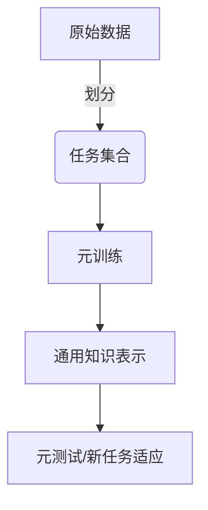
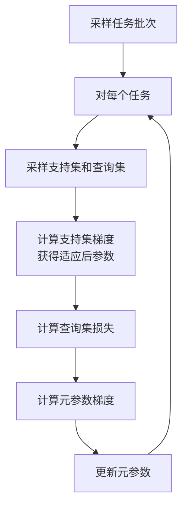

# 元学习(Meta-Learning)原理与代码实战案例讲解

## 1.背景介绍

### 1.1 什么是元学习

元学习(Meta-Learning)是机器学习领域的一个新兴研究方向,旨在设计可以快速学习新任务的学习算法。传统的机器学习算法需要大量标注数据进行训练,并且每个新任务都需要从头开始训练,效率低下。而元学习算法则试图从多个相关任务中学习一种通用的知识表示,以便能够快速适应新任务,减少对大量标注数据的需求。

### 1.2 元学习的重要性

随着人工智能系统被应用于越来越多的领域,我们希望这些系统能够具备快速学习和适应新环境的能力,而不是每次遇到新问题都需要从头训练一个全新的模型。元学习为实现这一目标提供了一种有前景的解决方案。此外,元学习也有助于解决小样本学习(Few-Shot Learning)和零样本学习(Zero-Shot Learning)等问题,扩展机器学习算法的应用范围。

## 2.核心概念与联系

### 2.1 元学习的核心思想

元学习的核心思想是在多个相关任务上学习一种通用的知识表示,使得在面临新任务时,算法能够基于已学习的知识快速适应。这种通用知识表示可以是一个好的模型初始化、一种优化策略或者一个度量函数等。

### 2.2 任务与元任务

在元学习中,我们将原始的学习问题称为任务(Task),而学习这些任务之间的共性知识的过程称为元任务(Meta-Task)。元学习算法在元训练阶段学习元任务,以获取通用知识表示;在元测试阶段快速适应新任务。



### 2.3 元学习算法分类

根据采用的具体方法,元学习算法可分为以下几类:

1. **基于模型的元学习**: 在元训练阶段学习一个可以快速适应新任务的模型初始化或更新策略。代表算法有MAML、Reptile等。

2. **基于优化的元学习**: 在元训练阶段学习一种高效的优化策略,用于快速适应新任务。代表算法有LSTM优化器等。

3. **基于度量的元学习**: 在元训练阶段学习一个好的相似性度量函数,用于在新任务中快速识别相似的数据。代表算法有Siamese网络等。

4. **生成模型元学习**: 使用生成模型(如VAE、GAN)生成合成数据,以缓解小样本学习问题。

## 3.核心算法原理具体操作步骤

接下来,我们重点介绍基于模型的元学习算法MAML(Model-Agnostic Meta-Learning),它是元学习领域的经典算法之一。

### 3.1 MAML算法原理

MAML算法的核心思想是:在元训练阶段,通过多任务训练,学习一个在新任务上的好的模型初始化,使得在新任务上只需少量梯度更新步骤,就能获得良好的性能。

具体来说,MAML将模型参数θ分为两部分:

- 可被快速适应的参数θ  
- 元参数φ,用于生成好的初始化参数θ

在每个任务上,MAML先用θ在该任务的支持集(Support Set)上进行几步梯度更新,得到θ'。然后,以θ'在该任务的查询集(Query Set)上的损失作为目标函数,对φ进行梯度下降更新。通过这种方式,MAML可以学习到一个好的初始化θ,使得在新任务上只需少量梯度更新步骤,就能获得良好性能。

### 3.2 MAML算法步骤

MAML算法的具体步骤如下:

1. 采样一批任务 $\mathcal{T}_i \sim p(\mathcal{T})$
2. 对每个任务 $\mathcal{T}_i$:
    - 采样支持集 $\mathcal{D}_i^{sup}$ 和查询集 $\mathcal{D}_i^{qry}$
    - 计算支持集上的梯度:
      $$
      \theta_i' = \theta - \alpha \nabla_\theta \sum_{(x,y) \in \mathcal{D}_i^{sup}} \mathcal{L}_{\mathcal{T}_i}(f_\theta(x), y)
      $$
    - 计算查询集上的损失:
      $$
      \mathcal{L}_i^{qry}(\phi) = \sum_{(x,y) \in \mathcal{D}_i^{qry}} \mathcal{L}_{\mathcal{T}_i}(f_{\theta_i'}(x), y)
      $$
3. 更新元参数:
   $$
   \phi \leftarrow \phi - \beta \nabla_\phi \sum_{\mathcal{T}_i \sim p(\mathcal{T})} \mathcal{L}_i^{qry}(\phi)
   $$

其中 $\alpha$ 和 $\beta$ 分别是内循环和外循环的学习率。通过这种方式,MAML可以学习到一个好的初始化 $\theta=g_\phi$,使得在新任务上只需少量梯度更新步骤,就能获得良好性能。



## 4.数学模型和公式详细讲解举例说明

### 4.1 MAML的数学模型

我们用 $f_\theta$ 表示机器学习模型,其中 $\theta$ 为模型参数。在 MAML 算法中,我们将 $\theta$ 分为两部分:

- $\phi$: 元参数(Meta Parameters),用于生成好的初始化参数 $\theta=g_\phi$
- $\theta$: 可被快速适应的参数

对于一个新任务 $\mathcal{T}$,我们首先用 $\phi$ 生成初始化参数 $\theta=g_\phi$。然后,在该任务的支持集 $\mathcal{D}^{sup}$ 上进行少量梯度更新,得到适应后的参数 $\theta'$:

$$
\theta' = \theta - \alpha \nabla_\theta \sum_{(x,y) \in \mathcal{D}^{sup}} \mathcal{L}_{\mathcal{T}}(f_\theta(x), y)
$$

其中 $\alpha$ 是内循环的学习率。

接下来,我们以 $\theta'$ 在该任务的查询集 $\mathcal{D}^{qry}$ 上的损失作为目标函数,对元参数 $\phi$ 进行梯度下降更新:

$$
\mathcal{L}^{qry}(\phi) = \sum_{(x,y) \in \mathcal{D}^{qry}} \mathcal{L}_{\mathcal{T}}(f_{\theta'}(x), y)
$$
$$
\phi \leftarrow \phi - \beta \nabla_\phi \mathcal{L}^{qry}(\phi)
$$

其中 $\beta$ 是外循环的学习率。

通过这种方式,MAML 可以学习到一个好的初始化 $\theta=g_\phi$,使得在新任务上只需少量梯度更新步骤,就能获得良好性能。

### 4.2 MAML算法举例说明

假设我们有一个五类分类问题,每个类别只有 5 个训练样本。我们希望用 MAML 算法快速适应这个新任务。

1. 首先,我们从已有的数据集中采样一批相关任务,如二类分类、三类分类等,作为元训练集。

2. 对于每个元训练任务,我们:
    - 采样一个支持集和查询集
    - 用 $\theta=g_\phi$ 在支持集上进行少量梯度更新,得到 $\theta'$
    - 计算 $\theta'$ 在查询集上的损失 $\mathcal{L}^{qry}(\phi)$
    - 对元参数 $\phi$ 进行梯度下降: $\phi \leftarrow \phi - \beta \nabla_\phi \mathcal{L}^{qry}(\phi)$

3. 重复上述步骤,直到 $\phi$ 收敛。此时我们得到了一个好的初始化 $\theta=g_\phi$。

4. 在新的五类分类任务上,我们:
    - 用 $\theta=g_\phi$ 作为初始化
    - 在该任务的 5 个训练样本(支持集)上进行少量梯度更新,得到 $\theta'$
    - 用 $\theta'$ 对测试样本进行分类

通过这种方式,MAML 算法能够快速适应新的五类分类任务,而无需从头开始训练模型。

## 5.项目实践:代码实例和详细解释说明

接下来,我们通过一个基于 PyTorch 的代码示例,演示如何使用 MAML 算法实现 Omniglot 数据集上的小样本分类任务。

### 5.1 导入所需库

```python
import torch
import torch.nn as nn
import numpy as np
```

### 5.2 定义神经网络模型

我们使用一个简单的四层卷积神经网络作为分类模型:

```python
class Omniglot(nn.Module):
    def __init__(self, in_channels, out_channels):
        super(Omniglot, self).__init__()
        self.conv1 = nn.Conv2d(in_channels, 64, kernel_size=3, padding=1)
        self.bn1 = nn.BatchNorm2d(64)
        self.conv2 = nn.Conv2d(64, 64, kernel_size=3, padding=1)
        self.bn2 = nn.BatchNorm2d(64)
        self.conv3 = nn.Conv2d(64, 64, kernel_size=3, padding=1)
        self.bn3 = nn.BatchNorm2d(64)
        self.conv4 = nn.Conv2d(64, 64, kernel_size=3, padding=1)
        self.bn4 = nn.BatchNorm2d(64)
        self.fc = nn.Linear(64, out_channels)

    def forward(self, x):
        x = F.max_pool2d(F.relu(self.bn1(self.conv1(x))), 2)
        x = F.max_pool2d(F.relu(self.bn2(self.conv2(x))), 2)
        x = F.max_pool2d(F.relu(self.bn3(self.conv3(x))), 2)
        x = F.max_pool2d(F.relu(self.bn4(self.conv4(x))), 2)
        x = x.view(x.size(0), -1)
        x = self.fc(x)
        return x
```

### 5.3 实现 MAML 算法

下面是 MAML 算法的核心部分实现:

```python
def maml(model, optimizer, x_spt, y_spt, x_qry, y_qry, loss_fn, inner_train_step=1, inner_lr=0.4, meta_lr=0.1):
    qry_losses = []
    for batch_idx, (x_spt_batch, y_spt_batch, x_qry_batch, y_qry_batch) in enumerate(zip(x_spt, y_spt, x_qry, y_qry)):
        
        # 计算支持集梯度,获得适应后参数
        model.train()
        optimizer.zero_grad()
        loss = loss_fn(model(x_spt_batch), y_spt_batch)
        loss.backward()
        optimizer.step()
        
        # 计算查询集损失
        qry_loss = loss_fn(model(x_qry_batch), y_qry_batch)
        qry_losses.append(qry_loss.item())
        
        # 对元参数进行梯度更新
        model.zero_grad()
        qry_loss.backward()
        optimizer.step()
        
    return np.mean(qry_losses)
```

这段代码实现了 MAML 算法的一个迭代步骤。具体来说:

1. 对每个任务批次,我们首先在支持集上进行梯度更新,获得适应后的参数。
2. 计算适应后参数在查询集上的损失。
3. 对元参数进行梯度下降更新,使查询集损失最小化。

通过多次迭代,我们可以学习到一个好的初始化,使得在新任务上只需少量梯度更新步骤,就能获得良好性能。

### 5.4 训练和测试

最后,我们可以使用上述代码进行 MAML 算法的训练和测试:

```python
# 初始化模型和优化器
model = Omniglot(1, args.way)