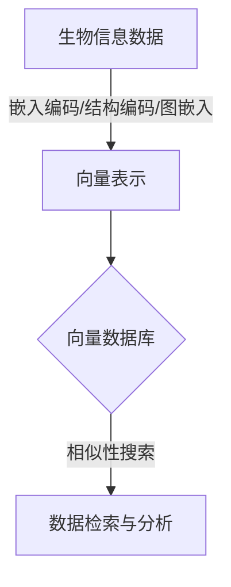

# 利用向量数据库加速生物信息数据分析

## 1.背景介绍

### 1.1 生物信息数据的爆炸式增长

随着高通量测序技术的不断发展和基因组学、蛋白质组学等生物学领域的快速进步,生物信息数据呈现出爆炸式增长的趋势。以人类基因组为例,人类基因组约包含30亿个碱基对,每个人的基因组数据大约占据200GB的存储空间。此外,随着单细胞测序、蛋白质组学等新兴技术的出现,生物信息数据的种类和数量都在快速增加。

传统的关系型数据库在存储和查询这些海量的非结构化数据时,效率低下,难以满足现代生物信息学研究的需求。因此,迫切需要一种新的数据存储和检索方式来应对这一挑战。

### 1.2 生物信息数据分析的重要性

生物信息数据分析在医学、农业、环境等多个领域具有重要应用价值。例如,通过分析患者的基因组数据,可以发现与疾病相关的基因变异,为个性化医疗提供依据;通过分析作物基因组数据,可以发现与产量、抗性等性状相关的基因,为作物育种提供指导;通过分析环境微生物基因组数据,可以了解微生物在生态系统中的作用,为环境保护提供参考。

然而,由于生物信息数据的复杂性和多样性,对数据进行高效的存储、检索和分析是一个巨大的挑战。传统的数据处理方法难以满足现代生物信息学研究的需求,迫切需要新的解决方案。

## 2.核心概念与联系

### 2.1 向量数据库

向量数据库(Vector Database)是一种新兴的数据库技术,它将非结构化数据(如文本、图像、音频等)编码为高维向量,并基于向量相似性进行数据存储和检索。与传统的关系型数据库和NoSQL数据库不同,向量数据库专门为处理非结构化数据而设计,具有以下优势:

1. **高效相似性搜索**:向量数据库可以快速找到与查询向量最相似的数据,这在处理非结构化数据时非常有用。
2. **语义理解**:向量编码可以捕捉数据的语义信息,使得相似的数据具有相近的向量表示。
3. **可扩展性**:向量数据库通常采用分布式架构,可以轻松扩展以存储和处理大规模数据。

常见的向量数据库有Pinecone、Weaviate、Zilliz等。它们在机器学习、自然语言处理、计算机视觉等领域有广泛的应用。

### 2.2 生物信息数据的向量化表示

为了利用向量数据库的优势,需要将生物信息数据(如基因序列、蛋白质序列、结构数据等)转换为向量表示。常见的方法包括:

1. **嵌入编码(Embedding Encoding)**:使用自然语言处理模型(如BERT、GPT等)将生物序列编码为向量。
2. **结构编码(Structure Encoding)**:利用蛋白质或RNA的二级、三级结构信息,将其编码为向量。
3. **图嵌入(Graph Embedding)**:将生物网络(如蛋白质互作网络、代谢网络等)表示为图,并使用图嵌入算法将其编码为向量。

通过上述方法,生物信息数据可以转换为高维向量,从而可以存储在向量数据库中,并利用向量相似性进行高效检索和分析。



## 3.核心算法原理具体操作步骤

### 3.1 向量编码算法

将生物信息数据转换为向量表示是利用向量数据库的关键步骤。常见的向量编码算法包括:

#### 3.1.1 序列嵌入编码

序列嵌入编码是将生物序列(如DNA序列、蛋白质序列等)转换为向量表示的方法。常见的算法包括:

1. **BERT编码**:使用预训练的BERT模型对序列进行编码,得到每个位置的向量表示,然后对这些向量进行汇总(如取平均值或最大值),得到整个序列的向量表示。
2. **Transformer编码**:类似于BERT编码,使用预训练的Transformer模型对序列进行编码。
3. **k-mer编码**:将序列分割为固定长度的k-mer,然后使用one-hot编码或其他方法将每个k-mer编码为向量,最后将所有k-mer向量求和或取平均值,得到整个序列的向量表示。

#### 3.1.2 结构编码

结构编码是将生物分子的三维结构信息转换为向量表示的方法。常见的算法包括:

1. **卷积神经网络编码**:将蛋白质或RNA的三维结构数据输入到预训练的卷积神经网络中,得到结构的向量表示。
2. **图卷积网络编码**:将分子结构表示为图,然后使用图卷积网络对图进行编码,得到结构的向量表示。

#### 3.1.3 图嵌入编码

图嵌入编码是将生物网络(如蛋白质互作网络、代谢网络等)转换为向量表示的方法。常见的算法包括:

1. **Node2Vec**:基于随机游走的无监督图嵌入算法,可以将网络中的节点编码为向量。
2. **GraphSAGE**:基于图卷积的无监督图嵌入算法,可以将网络中的节点编码为向量。
3. **TransE**:基于知识图谱的图嵌入算法,可以将知识图谱中的实体和关系编码为向量。

上述算法都可以将生物信息数据转换为向量表示,从而可以存储在向量数据库中,并利用向量相似性进行高效检索和分析。

### 3.2 向量相似性计算

在向量数据库中,相似性搜索是一项核心功能。常见的向量相似性计算方法包括:

1. **余弦相似度**:计算两个向量之间的夹角余弦值,值越接近1表示越相似。
2. **欧几里得距离**:计算两个向量之间的欧几里得距离,距离越小表示越相似。
3. **内积**:计算两个向量的内积,内积越大表示越相似。

在实际应用中,可以根据具体场景选择合适的相似性计算方法。

### 3.3 向量索引

为了提高向量相似性搜索的效率,向量数据库通常会建立索引。常见的向量索引算法包括:

1. **HNSW(Hierarchical Navigable Small World)**:基于导航小世界的层次化索引算法,可以快速查找最近邻向量。
2. **IVF(Inverted File for Vector)**:基于倒排索引的向量索引算法,可以快速检索相似向量。
3. **NSG(Navigating Spreading-out Graph)**:基于图遍历的向量索引算法,可以高效地查找最近邻向量。

通过建立合适的向量索引,可以大幅提高向量数据库的查询效率,从而加速生物信息数据的分析过程。

## 4.数学模型和公式详细讲解举例说明

### 4.1 序列嵌入编码

在序列嵌入编码中,常用的数学模型是自然语言处理中的Transformer模型。Transformer模型的核心是自注意力机制(Self-Attention Mechanism),它可以捕捉序列中不同位置之间的依赖关系。

自注意力机制的计算过程如下:

1. 计算查询(Query)、键(Key)和值(Value)矩阵:

$$Q = XW^Q$$
$$K = XW^K$$
$$V = XW^V$$

其中,X是输入序列的嵌入矩阵,W^Q、W^K和W^V是可学习的权重矩阵。

2. 计算注意力分数:

$$\text{Attention}(Q, K, V) = \text{softmax}\left(\frac{QK^T}{\sqrt{d_k}}\right)V$$

其中,d_k是键的维度。注意力分数表示了每个位置对其他位置的注意力权重。

3. 多头注意力机制:

$$\text{MultiHead}(Q, K, V) = \text{Concat}(head_1, \dots, head_h)W^O$$
$$\text{where } head_i = \text{Attention}(QW_i^Q, KW_i^K, VW_i^V)$$

多头注意力机制可以从不同的子空间捕捉序列的不同特征。

4. 残差连接和层归一化:

$$\text{output} = \text{LayerNorm}(X + \text{MultiHead}(Q, K, V))$$

残差连接和层归一化可以提高模型的稳定性和收敛速度。

通过上述计算过程,Transformer模型可以将序列编码为向量表示,并捕捉序列中的长程依赖关系。在生物信息数据的向量化表示中,Transformer模型被广泛应用于序列嵌入编码。

### 4.2 结构编码

在结构编码中,常用的数学模型是卷积神经网络(Convolutional Neural Network, CNN)。CNN可以有效地捕捉生物分子三维结构中的局部模式和空间特征。

CNN的基本计算单元是卷积操作,它可以用下式表示:

$$y_j = \sum_i x_i \cdot w_{ij} + b_j$$

其中,x_i是输入特征图上的像素值,w_ij是卷积核的权重,b_j是偏置项,y_j是输出特征图上的像素值。

卷积操作可以提取输入数据的局部特征,并通过池化操作对特征进行下采样和不变性处理。多个卷积层和池化层的堆叠可以捕捉不同尺度的特征,最终将生物分子的三维结构编码为向量表示。

在实际应用中,还可以将CNN与其他模型(如递归神经网络、图卷积网络等)结合,以更好地捕捉生物分子结构的特征。

### 4.3 图嵌入编码

在图嵌入编码中,常用的数学模型是图神经网络(Graph Neural Network, GNN)。GNN可以有效地捕捉生物网络中节点之间的拓扑结构和属性信息。

GNN的基本计算单元是信息传播层(Message Passing Layer),它可以用下式表示:

$$m_i^{(t+1)} = \sum_{j \in \mathcal{N}(i)} M_t(h_i^{(t)}, h_j^{(t)}, e_{ij})$$
$$h_i^{(t+1)} = U_t(h_i^{(t)}, m_i^{(t+1)})$$

其中,m_i^{(t+1)}是节点i在第t+1层接收到的消息,M_t是消息函数,h_i^{(t)}和h_j^{(t)}分别是节点i和j在第t层的隐藏状态,e_ij是节点i和j之间的边的属性。U_t是更新函数,用于更新节点i在第t+1层的隐藏状态h_i^{(t+1)}。

通过多层的信息传播,GNN可以捕捉节点及其邻居节点的特征,并将生物网络中的节点编码为向量表示。

常见的GNN模型包括GraphSAGE、Graph Attention Network(GAT)等。在生物信息数据的向量化表示中,GNN被广泛应用于图嵌入编码。

## 5.项目实践:代码实例和详细解释说明

在本节中,我们将提供一个基于Python的代码示例,展示如何将生物信息数据(以蛋白质序列为例)编码为向量表示,并存储在向量数据库Pinecone中进行相似性搜索。

### 5.1 安装依赖库

首先,我们需要安装所需的Python库:

```bash
pip install biopython pinecone-client sentence-transformers
```

- `biopython`用于处理生物序列数据。
- `pinecone-client`用于与Pinecone向量数据库进行交互。
- `sentence-transformers`用于将序列编码为向量表示。

### 5.2 导入所需模块

```python
from Bio import SeqIO
import pinecone
from sentence_transformers import SentenceTransformer
```

### 5.3 加载蛋白质序列数据

我们使用`biopython`库从FASTA文件中加载蛋白