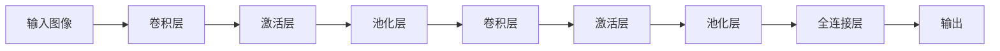

# 卷积神经网络(Convolutional Neural Network)原理与代码实战案例讲解

## 1. 背景介绍
### 1.1 人工智能与深度学习的发展
近年来,人工智能(Artificial Intelligence, AI)技术得到了飞速的发展,尤其是以深度学习(Deep Learning, DL)为代表的AI技术,在计算机视觉、语音识别、自然语言处理等领域取得了突破性的进展。深度学习通过构建多层神经网络,模拟人脑的信息处理机制,从海量数据中自动学习特征,大大提升了AI系统的性能。

### 1.2 卷积神经网络的兴起
在深度学习的众多模型中,卷积神经网络(Convolutional Neural Network, CNN)脱颖而出,成为图像识别、目标检测等视觉任务的主流模型。CNN通过卷积、池化等操作,能够自动提取图像的层次化特征,对图像有很强的理解和表达能力。从2012年 AlexNet 在 ImageNet 竞赛中大放异彩,到如今 CNN 在各类视觉任务上不断刷新记录,CNN 已经成为计算机视觉领域的核心技术。

### 1.3 CNN 的广泛应用
CNN 不仅在学术界备受瞩目,在工业界也得到了广泛应用。无人驾驶、人脸识别、医学影像分析、工业缺陷检测等众多领域都离不开 CNN 技术的支持。可以说,CNN 已经成为 AI 时代的一项关键技术,深刻影响和改变着我们的生活。

## 2. 核心概念与联系
### 2.1 人工神经网络
人工神经网络(Artificial Neural Network, ANN)是一种模仿生物神经网络(动物的中枢神经系统,特别是大脑)的结构和功能的数学模型。ANN 由大量的人工神经元相互连接构成,每个神经元可以接收其他神经元的信号,并产生输出信号。通过调整神经元之间的连接权重,ANN 可以对输入数据进行非线性变换,从而实现分类、回归等功能。

### 2.2 卷积
卷积是 CNN 的核心操作之一。卷积操作使用一组可学习的卷积核(也称为过滤器)在输入特征图上滑动,通过计算卷积核与局部区域的内积,得到输出特征图。卷积具有局部连接、权重共享的特点,使得 CNN 能够高效地提取图像的局部特征,同时大大减少了模型的参数量。

### 2.3 池化
池化是 CNN 中常用的一种下采样操作,用于减小特征图的尺寸,提高特征的鲁棒性。常见的池化操作包括最大池化(Max Pooling)和平均池化(Average Pooling)。最大池化取局部区域内的最大值作为输出,平均池化取局部区域内的平均值作为输出。池化操作使得 CNN 具有一定的平移不变性,能够应对图像中的微小偏移和变形。

### 2.4 全连接层
全连接层通常位于 CNN 的末端,用于将提取到的特征映射到最终的输出。全连接层中,每个神经元与上一层的所有神经元相连,通过非线性变换(如 ReLU、Sigmoid 等)得到输出。全连接层起到"分类器"的作用,将学习到的特征转化为具体的类别预测。

### 2.5 反向传播与梯度下降
反向传播(Backpropagation)是训练神经网络的关键算法。在前向传播过程中,输入数据经过神经网络的层层变换得到输出;在反向传播过程中,根据输出与真实标签的误差,通过链式法则计算每个参数的梯度,并使用梯度下降法更新参数,使得模型的预测结果不断逼近真实标签。反复迭代前向传播和反向传播的过程,就可以得到一个性能优异的神经网络模型。

### 2.6 CNN 的层次结构
CNN 通常由多个卷积层、池化层和全连接层组成,形成一个层次化的结构。底层的卷积层负责提取图像的低级特征(如边缘、纹理),高层的卷积层负责提取更加抽象的高级特征(如物体的部件)。池化层起到降维和特征不变性的作用。全连接层将学习到的特征映射到具体的类别。这种层次化的结构使得 CNN 能够自动学习图像的层次化表示,从而对图像有更加全面和深入的理解。

下图展示了 CNN 的基本架构:

## 3. 核心算法原理具体操作步骤
### 3.1 卷积操作
卷积操作是 CNN 的核心,其目的是提取输入特征图中的局部特征。具体步骤如下:
1. 准备一组卷积核(过滤器),卷积核是一个小的二维矩阵,其元素为可学习的参数。
2. 将卷积核在输入特征图上按照一定的步长(stride)滑动,在每个位置上,计算卷积核与当前局部区域的内积,得到一个输出值。
3. 将卷积核在整个输入特征图上滑动,得到一张输出特征图。
4. 使用多个不同的卷积核,可以得到多张输出特征图,它们刻画了输入在不同方面的特征。

卷积操作的数学表达为:

$$
\mathbf{O}[i,j] = \sum_{m=0}^{M-1} \sum_{n=0}^{N-1} \mathbf{I}[i+m, j+n] \cdot \mathbf{K}[m,n]
$$

其中,$\mathbf{I}$为输入特征图,$\mathbf{K}$为卷积核,$\mathbf{O}$为输出特征图。

### 3.2 激活函数
卷积操作的输出通过一个非线性激活函数,引入非线性因素,提高模型的表达能力。常见的激活函数包括:

- Sigmoid 函数:
$$
f(x) = \frac{1}{1 + e^{-x}}
$$

- Tanh 函数:  
$$
f(x) = \frac{e^x - e^{-x}}{e^x + e^{-x}}
$$

- ReLU(Rectified Linear Unit)函数:
$$
f(x) = max(0, x)
$$

ReLU 函数因其简单高效而被广泛使用。

### 3.3 池化操作
池化操作用于减小特征图的尺寸,提高特征的鲁棒性。以最大池化为例,具体步骤如下:
1. 设置池化窗口的大小和步长,池化窗口在输入特征图上滑动。
2. 在每个窗口内,取该区域内的最大值作为输出特征图上的对应值。
3. 池化窗口在整个输入特征图上滑动,得到输出特征图。

平均池化的操作类似,只是取窗口内的平均值而不是最大值。

### 3.4 全连接层
全连接层将提取到的特征映射到输出。设$\mathbf{x}$为上一层的输出向量,$\mathbf{W}$为权重矩阵,$\mathbf{b}$为偏置向量,则全连接层的输出$\mathbf{y}$为:

$$
\mathbf{y} = \mathbf{W} \cdot \mathbf{x} + \mathbf{b}
$$

输出再通过一个激活函数(如 Softmax 函数),得到最终的类别预测概率。

### 3.5 反向传播算法
反向传播算法用于训练 CNN 模型,更新模型参数,使得预测结果不断逼近真实标签。以均方误差损失函数为例,反向传播的具体步骤如下:
1. 前向传播:输入数据通过 CNN 的层层变换,得到输出。
2. 计算损失:比较输出与真实标签,计算均方误差损失。
3. 反向传播:按照链式法则,计算损失对每一层输入的梯度,进而计算损失对每个参数的梯度。
4. 更新参数:使用梯度下降法,根据梯度下降的方向,以一定的学习率更新每个参数,使损失函数下降。
5. 重复以上步骤,直到模型收敛或达到预设的迭代次数。

反向传播算法的数学推导涉及矩阵求导的链式法则,需要对神经网络的前向传播过程进行逐层求导,过程较为复杂。但深度学习框架(如 TensorFlow、PyTorch)已经封装了自动求导的功能,使得我们可以方便地实现反向传播算法。

## 4. 数学模型和公式详细讲解举例说明
### 4.1 卷积的数学模型
卷积操作可以表示为:

$$
\mathbf{O}[i,j] = \sum_{m=0}^{M-1} \sum_{n=0}^{N-1} \mathbf{I}[i+m, j+n] \cdot \mathbf{K}[m,n]
$$

其中,$\mathbf{I}$为输入特征图,$\mathbf{K}$为卷积核,$\mathbf{O}$为输出特征图。$M$和$N$分别为卷积核的高度和宽度。

举例说明:假设我们有一个 3x3 的输入特征图 $\mathbf{I}$:

$$
\mathbf{I} = \begin{bmatrix}
1 & 2 & 3 \\
4 & 5 & 6 \\
7 & 8 & 9
\end{bmatrix}
$$

和一个 2x2 的卷积核 $\mathbf{K}$:

$$
\mathbf{K} = \begin{bmatrix}
1 & 0 \\
0 & 1
\end{bmatrix}
$$

则卷积操作的结果为:

$$
\mathbf{O}[0,0] = 1 \times 1 + 2 \times 0 + 4 \times 0 + 5 \times 1 = 6 \\
\mathbf{O}[0,1] = 2 \times 1 + 3 \times 0 + 5 \times 0 + 6 \times 1 = 8 \\
\mathbf{O}[1,0] = 4 \times 1 + 5 \times 0 + 7 \times 0 + 8 \times 1 = 12 \\
\mathbf{O}[1,1] = 5 \times 1 + 6 \times 0 + 8 \times 0 + 9 \times 1 = 14
$$

输出特征图 $\mathbf{O}$为:

$$
\mathbf{O} = \begin{bmatrix}
6 & 8 \\
12 & 14
\end{bmatrix}
$$

### 4.2 池化的数学模型
以最大池化为例,假设池化窗口的大小为 $m \times n$,则最大池化可以表示为:

$$
\mathbf{O}[i,j] = \max_{0 \leq k < m, 0 \leq l < n} \mathbf{I}[i \times s + k, j \times s + l]
$$

其中,$\mathbf{I}$为输入特征图,$\mathbf{O}$为输出特征图,$s$为池化的步长。

举例说明:假设我们有一个 4x4 的输入特征图 $\mathbf{I}$:

$$
\mathbf{I} = \begin{bmatrix}
1 & 2 & 3 & 4\\
5 & 6 & 7 & 8\\
9 & 10 & 11 & 12\\
13 & 14 & 15 & 16
\end{bmatrix}
$$

使用 2x2 的最大池化,步长为 2,则输出特征图 $\mathbf{O}$为:

$$
\mathbf{O}[0,0] = \max(1, 2, 5, 6) = 6 \\
\mathbf{O}[0,1] = \max(3, 4, 7, 8) = 8 \\
\mathbf{O}[1,0] = \max(9, 10, 13, 14) = 14 \\
\mathbf{O}[1,1] = \max(11, 12, 15, 16) = 16
$$

$$
\mathbf{O} = \begin{bmatrix}
6 & 8 \\
14 & 16
\end{bmatrix}
$$

### 4.3 Softmax 函数
Softmax 函数常用于全连接层之后,将输出转